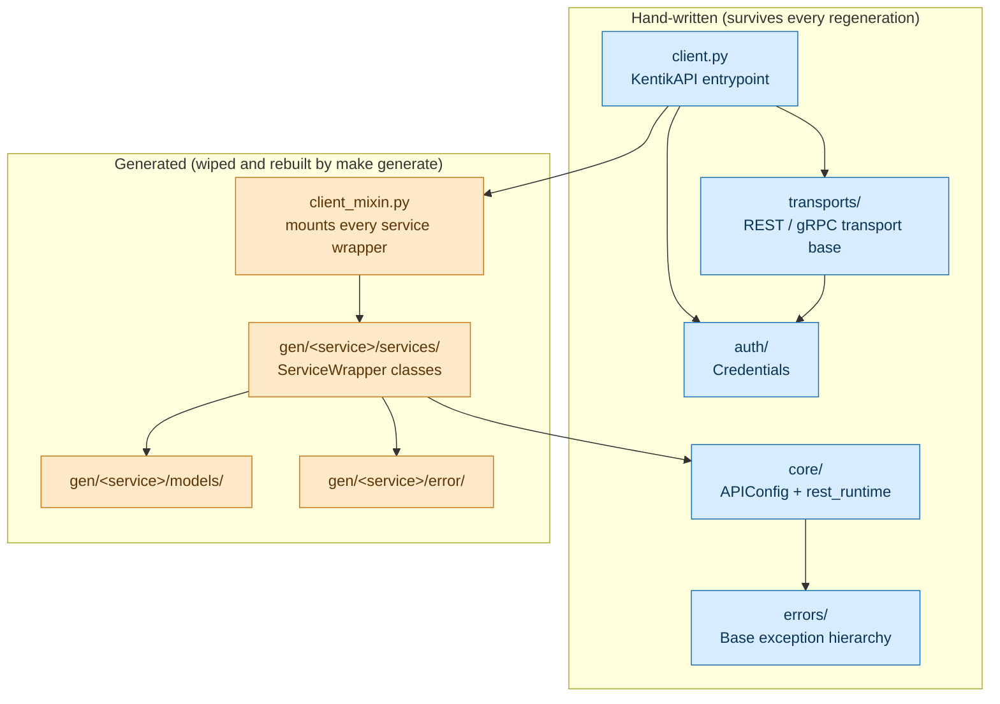

# Kentik Community Python SDK

A Python client for the Kentik API.
`scripts/generate_sdk.py` generates the SDK from OpenAPI schemas.
The SDK uses `uv`, Pydantic v2, and HTTPX.

## Overview

This SDK is generated, not hand-written.
The generation pipeline builds it from the
[Kentik API Public Schema](https://github.com/kentik/api-schema-public).
The pipeline fixes common OpenAPI generator bugs.
It removes schema-version prefixes from class names.
It also generates architecture diagrams.

The diagram below shows the split that matters most in this
repository: hand-written code that survives every regeneration,
next to generated code that `make generate` wipes and rebuilds.
See [CLAUDE.md](CLAUDE.md) for the full explanation of each piece.



## Prerequisites

* **Python**: 3.12 or later.
* **[uv](https://github.com/astral-sh/uv)**: The Python package
  manager.

Diagrams render as Mermaid, which needs no local toolchain. GitHub
draws them natively, and the Sphinx build renders them in the
browser.

## Development Setup

1. Clone the repository:

    ```bash
    git clone https://github.com/kentik/community_sdk_python.git
    cd community_sdk_python
    ```

2. Sync the environment:

    ```bash
    make install
    ```

## Authentication via .env

The SDK can load credentials automatically from a `.env` file at
your project root.

Create `.env` in the repository root:

```bash
KENTIK_EMAIL=you@example.com
KENTIK_API_TOKEN=your_api_token
```

If you create `KentikAPI(...)` without `email` and `api_token`,
the SDK does the following:

1. Loads the nearest `.env` file from the current working directory.
2. Reads `KENTIK_EMAIL` and `KENTIK_API_TOKEN`.

You can still pass `email` and `api_token` explicitly.
Explicit values take precedence over the `.env` file.

## Generating the SDK

The SDK generation script performs the following tasks:

1. Clones or updates the Kentik API schemas.
2. Scrubs version prefixes (e.g., v2023...) from model names.
3. Fixes generator bugs (Ghost variables, Pydantic v2 compatibility,
   Path sanitization).
4. Generates Mermaid architecture diagrams.
5. Formats the output with Ruff.

**To generate from the remote GitHub repo:**

```bash
make generate
```

**To generate from a local schema folder (for testing):**

```bash
make generate local
```

**To generate from a custom local schema path:**

```bash
make generate LOCAL_REPO=/path/to/api-schema-public
```

**To run the full pipeline (services + docs + tests):**

```bash
make
```

**To run stages independently:**

```bash
make services
make docs
make tests
```

## Documentation

The `make docs` command builds documentation with Sphinx and MyST
(Markdown). The output includes generated service diagrams and
code references.

1. **Generate the SDK and docs source:**
   The `generate_sdk.py` script prepares the documentation source
   as part of SDK generation.

2. **Build the HTML site:**

    ```bash
    make docs
    ```

3. **View the docs:**
   Open `docs/build/html/index.html` in your browser.

## Testing

This project uses `pytest` for testing.
Run the generator before you run the tests.
This step keeps the generated models up to date.

```bash
make tests
```

## Code Quality

This project uses Ruff for linting and formatting.
The generation script runs Ruff automatically.
You can also run it manually at any time:

```bash
make lint
```

## Generation Pipeline Logic (Internal)

If you modify `scripts/generate_sdk.py`, review the following
patches:

* **Flattened Structure**: The generator removes version
  subdirectories and keeps only the latest version of each service.
* **Wildcard Patching**: The generator replaces
  `from .models import *` with explicit re-exports
  (`import X as X`) to satisfy Pylance and Ruff.
* **Ghost Data Fix**: Removes `json=data.dict()` calls in functions
  where the generator failed to provide a payload argument.
* **Pydantic v2**: Injects `.model_construct()` for empty API
  responses to prevent validation crashes.
