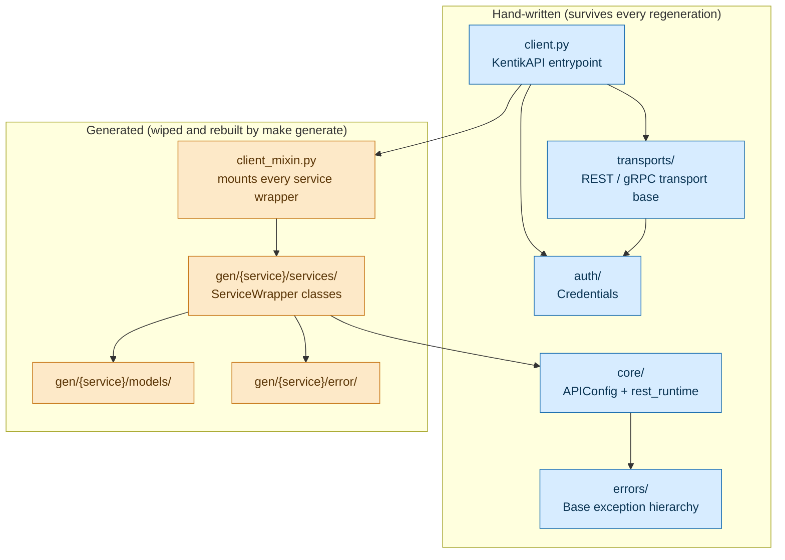

<!-- HAND-WRITTEN: not modified by [`make generate`](Makefile). Edit directly. -->

# Kentik Community Python SDK

A type-safe Python client for the Kentik API v6, generated from
Kentik's public OpenAPI v3 schema.

## What this is

The SDK is generated, not hand-written.
[`scripts/generate_sdk.py`](scripts/generate_sdk.py) builds it from the
[Kentik API Public Schema](https://github.com/kentik/api-schema-public).
The pipeline fixes common OpenAPI generator bugs, removes schema-version
prefixes from class names, and generates architecture diagrams.

The diagram below shows the key split: hand-written code that survives
every regeneration, and generated code that [`make generate`](Makefile) wipes and rebuilds.



## Installation

```bash
pip install kentik-api
```

Requires Python 3.12 or later.

## Authentication

Create `.env` in your project root:

```bash
KENTIK_EMAIL=you@example.com
KENTIK_API_TOKEN=your_api_token
```

`KentikAPI()` loads these automatically. See
[`docs/guides/quickstart.md`](docs/guides/quickstart.md) for all credential options.

## Transport selection

The SDK supports both REST and gRPC transports.

```python
from kentik_api.client import KentikAPI

client = KentikAPI(protocol="rest")  # REST transport (default)
client = KentikAPI(protocol="grpc")  # gRPC transport
```

Both transports return the same Pydantic response models. REST routes calls
through [`src/kentik_api/core/rest_runtime.py`](src/kentik_api/core/rest_runtime.py).
gRPC routes calls through the compiled proto stubs in `gen/<service>/pb/` and
[`src/kentik_api/core/grpc_runtime.py`](src/kentik_api/core/grpc_runtime.py).
See [`docs/guides/grpc.md`](docs/guides/grpc.md) for the full gRPC guide.

## Documentation

All documentation is in [`docs/`](docs/README.md):

| Guide | Content |
| --- | --- |
| [`docs/guides/quickstart.md`](docs/guides/quickstart.md) | First call in 5 minutes |
| [`docs/guides/rest.md`](docs/guides/rest.md) | REST transport deep-dive |
| [`docs/guides/grpc.md`](docs/guides/grpc.md) | gRPC transport and sequence diagrams |
| [`docs/guides/error_handling.md`](docs/guides/error_handling.md) | Exception hierarchy |
| [`docs/guides/generation.md`](docs/guides/generation.md) | SDK regeneration workflow |

Run [`make docs`](Makefile) to build the full Sphinx HTML reference from
[`docs/sphinx/`](docs/sphinx/README.md).

## Examples

Runnable scripts are in [`examples/`](examples/README.md). Each service has
a `rest.py` and a `grpc.py` side by side.

```bash
uv run python -m examples.device.rest   # REST
uv run python -m examples.device.grpc   # gRPC
```

## Contributing

### Prerequisites

- **Python** 3.12 or later
- **[uv](https://github.com/astral-sh/uv)** package manager

### Development setup

```bash
git clone https://github.com/kentik/community_sdk_python.git
cd community_sdk_python
make install
```

### Generating the SDK

```bash
make generate local   # from local ../api-schema-public/ checkout
make generate         # fetch latest schema from GitHub
make                  # generate + test (default)
```

See [`scripts/README.md`](scripts/README.md) for generator internals and
[`docs/guides/generation.md`](docs/guides/generation.md) for the full workflow.

### Testing

```bash
make test          # full mocked suite
make test-e2e      # opt-in live tests (needs .env)
```

See [`tests/README.md`](tests/README.md) for the full test-layer breakdown.

### Code quality

```bash
make lint          # ruff check + format
```

## Open-source libraries

This SDK is built on the following open-source libraries:

| Library | License | Author / Maintainer |
| --- | --- | --- |
| [python-dotenv](https://github.com/theskumar/python-dotenv) | BSD-3-Clause | Saurabh Kumar, Bertrand Bonnefoy-Claudet |
| [googleapis-common-protos](https://github.com/googleapis/google-cloud-python) | Apache 2.0 | Google LLC |
| [grpcio](https://grpc.io) | Apache 2.0 | The gRPC Authors |
| [httpx](https://www.python-httpx.org) | BSD-3-Clause | Tom Christie / encode |
| [pydantic](https://docs.pydantic.dev) | MIT | Samuel Colvin et al. |

The generated code in `src/kentik_api/gen/` is produced by:

| Tool | License | Author |
| --- | --- | --- |
| [openapi-python-generator](https://github.com/MarcoMuellner/openapi-python-generator) | MIT | Marco Müllner |
| [grpcio-tools](https://grpc.io) | Apache 2.0 | The gRPC Authors |

## Acknowledgements

This project is a ground-up rewrite of the original
[kentik-api v1.x SDK](https://github.com/kentik/community_sdk_python/tree/v1.0.7),
which was created and maintained by [Martin Machacek](https://github.com/mmac-m3a)
at Kentik.
