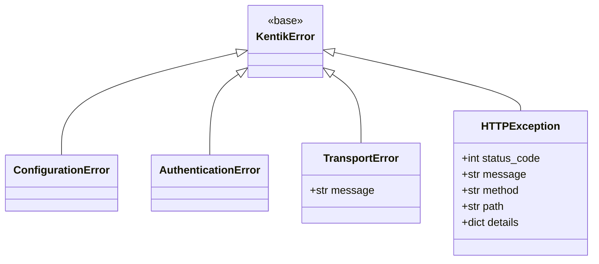

<!-- HAND-WRITTEN: not modified by `make generate`. Edit directly. -->

# Error Handling Guide

The SDK uses a single exception hierarchy for both REST and gRPC transports.
Catch the base class `KentikError` to handle any SDK failure, or catch
specific subclasses for finer control.

## Exception hierarchy



| Exception | When raised |
| --- | --- |
| `ConfigurationError` | Invalid `APIConfig` value (missing credentials, bad region) |
| `AuthenticationError` | 401 from the API — credentials rejected |
| `TransportError` | Network failure before any response arrives |
| `HTTPException` | Any non-success HTTP or gRPC status code |

All classes are in [`src/kentik_api/errors/__init__.py`](../../src/kentik_api/errors/__init__.py).

## Catching errors

```python
from kentik_api.client import KentikAPI
from kentik_api.errors import (
    AuthenticationError,
    HTTPException,
    KentikError,
    TransportError,
)

client = KentikAPI(protocol="rest")  # or protocol="grpc" — same exceptions

try:
    response = client.device.list_devices()
except AuthenticationError as exc:
    print(f"Bad credentials: {exc}")
except HTTPException as exc:
    print(f"HTTP {exc.status_code} on {exc.method} {exc.path}: {exc.message}")
    print(f"Details: {exc.details}")
except TransportError as exc:
    print(f"Network error: {exc}")
except KentikError as exc:
    print(f"Other SDK error: {exc}")
```

## gRPC status codes

gRPC errors are normalized to `HTTPException` by
[`call_grpc()`](../../src/kentik_api/core/grpc_runtime.py) before they
reach the caller. The mapping is:

| gRPC status | HTTP status | Exception |
| --- | --- | --- |
| `UNAUTHENTICATED` | 401 | `AuthenticationError` |
| `PERMISSION_DENIED` | 403 | `HTTPException(403)` |
| `NOT_FOUND` | 404 | `HTTPException(404)` |
| `INVALID_ARGUMENT` | 400 | `HTTPException(400)` |
| `RESOURCE_EXHAUSTED` | 429 | `HTTPException(429)` |
| `UNAVAILABLE` | 503 | `HTTPException(503)` |
| Network failure | — | `TransportError` |

## Runnable example

See [`examples/common/error_handling.py`](../../examples/common/error_handling.py)
for a complete error handling demo that works with both transports:

```bash
uv run python examples/common/error_handling.py        # REST
uv run python examples/common/error_handling.py grpc   # gRPC
```
