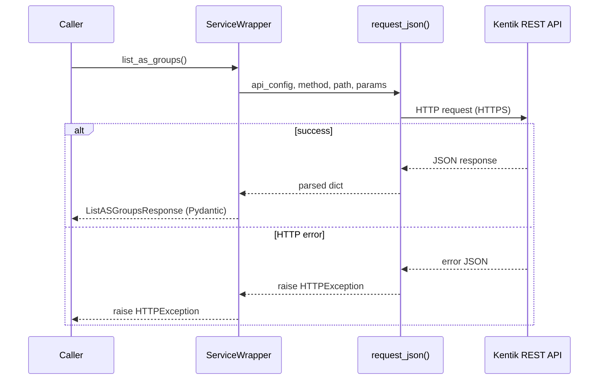
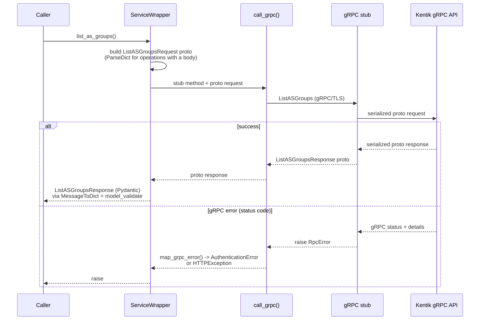

<!-- HAND-WRITTEN prose, except the `kentik-gen` marker blocks, which [`make generate`](../../Makefile) rewrites. Fix those in scripts/generation/docs_rendering.py. -->

# gRPC Transport Guide

The SDK supports both REST and gRPC transports. Both return the same Pydantic
response models. This guide explains the gRPC transport: how it works, how it
differs from REST, and how to use it.

## Instantiate the client

Pass `protocol="grpc"` to use gRPC:

```python
from kentik_api.client import KentikAPI

client = KentikAPI(protocol="grpc")
```

Every service method call works the same as REST:

<!-- kentik-gen:grpc-usage-example -->
```python
from kentik_api.client import KentikAPI

client = KentikAPI(protocol="grpc")
response = client.as_group.list_as_groups()
print(response)  # ListASGroupsResponse
```
<!-- /kentik-gen:grpc-usage-example -->

## REST vs gRPC: call flow comparison

### REST call flow

<!-- kentik-gen:rest-callflow-diagram -->

<!-- /kentik-gen:rest-callflow-diagram -->

The REST path routes every call through
[`request_json()`](../../src/kentik_api/core/rest_runtime.py) in
[`core/rest_runtime.py`](../../src/kentik_api/core/rest_runtime.py).

### gRPC call flow

<!-- kentik-gen:grpc-callflow-diagram -->

<!-- /kentik-gen:grpc-callflow-diagram -->

The gRPC path uses:

1. [`ParseDict`](https://googleapis.dev/python/protobuf/latest/) from
   `google.protobuf.json_format` to convert Pydantic model params to a proto
   request message.
2. A compiled gRPC stub (in `gen/<service>/pb/`) to make the call.
3. [`MessageToDict`](https://googleapis.dev/python/protobuf/latest/) to convert
   the proto response back to a dict.
4. `model_validate` to build the Pydantic response model.
5. [`call_grpc()`](../../src/kentik_api/core/grpc_runtime.py) in
   [`core/grpc_runtime.py`](../../src/kentik_api/core/grpc_runtime.py) to
   normalize gRPC errors to the SDK exception hierarchy.

## Why the two transports return identical models

Kentik keeps the REST and gRPC schemas in sync. Both use the same field names
(camelCase in JSON, snake_case in proto fields). `MessageToDict` by default
produces camelCase keys, which match the `validation_alias` on every Pydantic
model field. No remapping is needed.

## Error handling

The same exception types are raised for both transports. See
[error_handling.md](error_handling.md) for the full hierarchy. gRPC status
codes are mapped to HTTP-equivalent status codes inside
[`map_grpc_error()`](../../src/kentik_api/core/grpc_runtime.py), a pure
function isolated from the gRPC call itself. This means the mapping table
can be tested without a live gRPC channel. [`call_grpc()`](../../src/kentik_api/core/grpc_runtime.py)
is the thin wrapper that invokes the stub and delegates all error mapping
to `map_grpc_error()`.

| gRPC status | HTTP equivalent | SDK exception |
| --- | --- | --- |
| `UNAUTHENTICATED` | 401 | `AuthenticationError` |
| `PERMISSION_DENIED` | 403 | `HTTPException(403)` |
| `NOT_FOUND` | 404 | `HTTPException(404)` |
| `INVALID_ARGUMENT` | 400 | `HTTPException(400)` |
| `ALREADY_EXISTS` | 409 | `HTTPException(409)` |
| `RESOURCE_EXHAUSTED` | 429 | `HTTPException(429)` |
| `UNIMPLEMENTED` | 501 | `HTTPException(501)` |
| `UNAVAILABLE` | 503 | `HTTPException(503)` |
| Network failure | — | `TransportError` |

## Runnable gRPC examples

Each service in [examples/](../../examples/README.md) has a `grpc.py` file:

- [`examples/device/grpc.py`](../../examples/device/grpc.py) — list devices
- [`examples/user/grpc.py`](../../examples/user/grpc.py) — list users
- [`examples/label/grpc.py`](../../examples/label/grpc.py) — list labels
- [`examples/site/grpc.py`](../../examples/site/grpc.py) — list sites
- [`examples/alerting/grpc.py`](../../examples/alerting/grpc.py) — list alerts
- [`examples/synthetics/grpc.py`](../../examples/synthetics/grpc.py) — list tests
