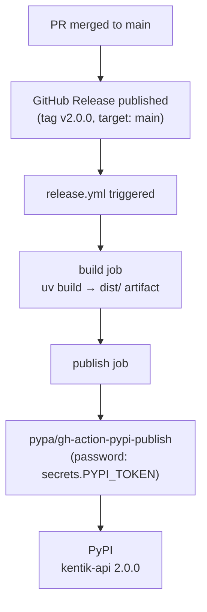

# PyPI Automated Release Setup

This document specifies every step required to enable automated publishing of
`kentik-api` to PyPI when a GitHub Release is created on
`kentik/community_sdk_python`. Steps are ordered by dependency: complete each
phase before moving to the next.

---

## How the automation works (summary)

The workflow in `.github/workflows/release.yml` fires when a GitHub Release is
**published** on `kentik/community_sdk_python`. It builds the wheel and sdist,
then uploads them to PyPI using the `PYPI_TOKEN` secret already stored in the
repository (carried over from the v1.x release workflow).



---

## Phase 0: Prerequisites — who needs to act

| Action | Who | Blocking? |
| --- | --- | --- |
| Confirm `PYPI_TOKEN` secret is still valid in the repo | `kentik/community_sdk_python` admin | **Yes** — the workflow uses this secret |
| Admin access to `kentik/community_sdk_python` GitHub repo | Kentik org admin | Yes — to check the secret and merge the PR |
| Access to open a PR from the fork | Alex DeAraujo | Already available |

### Background: why no new setup is needed

The upstream `kentik/community_sdk_python` repo already publishes `kentik-api`
to PyPI. The v1.x release workflow stored a `PYPI_TOKEN` secret in the repo's
Actions secrets. The new `release.yml` reuses that same secret — it only
replaces the build tooling (`uv build` instead of `setup.py`) and the upload
mechanism (`pypa/gh-action-pypi-publish` instead of `twine`). No new PyPI
credentials or GitHub Environments are required.

If the `PYPI_TOKEN` secret has expired or been rotated:

1. Log in to pypi.org as `kentik-builds`.
2. Account settings → API tokens → Add API token scoped to `kentik-api`.
3. In `kentik/community_sdk_python` → **Settings → Secrets and variables →
   Actions**: update the `PYPI_TOKEN` secret value.

---

## Phase 1: Open and merge the PR

**Who:** Alex DeAraujo (author) + reviewers from the Kentik team.

1. Ensure the fork branch `FA-2-Update-the-python-SDK-from-V5-to-V6` on
   `alexdearaujo/community_sdk_python` is up to date with `kentik:main`:

   ```bash
   git fetch upstream
   git rebase upstream/main
   git push fork FA-2-Update-the-python-SDK-from-V5-to-V6 --force-with-lease
   ```

2. Open a pull request:
   - **base:** `kentik/community_sdk_python:main`
   - **head:** `alexdearaujo/community_sdk_python:FA-2-Update-the-python-SDK-from-V5-to-V6`
3. Confirm that both CI checks pass on the PR:
   - `tests` — 3-Python-version matrix (3.12, 3.13, 3.14)
   - `build` — wheel + sdist build and import verification
4. Get at least one approval from a Kentik maintainer.
5. Merge the PR. Squash merge is recommended.

> **Note:** Merging to `main` does **not** trigger a PyPI publish. The
> `release.yml` workflow only fires on `release: types: [published]`.

---

## Phase 2: Set the version for a release

The version is **tag-driven**: `hatch-vcs` reads the Git tag at build time and
sets the package version automatically. There is nothing to update in
`pyproject.toml`.

For the initial `v2.0.0` release: create tag `v2.0.0` as part of Phase 3 below.

For future releases: create tag `v2.1.0` (or whatever the next version is) when
publishing the GitHub Release in Phase 3. The built wheel will be named
`kentik_api-2.1.0-py3-none-any.whl` automatically.

---

## Phase 3: Publish the GitHub Release (triggers PyPI upload)

**Who:** Any Kentik maintainer with write access to `kentik/community_sdk_python`.

**When:** After Phase 0 is confirmed and `main` contains the changes to release.

1. Go to `github.com/kentik/community_sdk_python/releases/new`.
2. Under **Choose a tag**, type `v2.0.0` and select **Create new tag: v2.0.0 on
   publish**.
3. Set **Target** to `main`.
4. Set **Release title** to `v2.0.0`.
5. Write release notes (see the suggested outline below).
6. Leave **Set as a pre-release** unchecked for a production release.
7. Click **Publish release**.

The `release.yml` workflow starts immediately. Monitor it at:
`github.com/kentik/community_sdk_python/actions`.

---

## Phase 4: Verify the release

```text
## v2.0.0

Complete rewrite of the Kentik Community Python SDK.

### Breaking changes from v1.x

- New package structure: `from kentik_api.client import KentikAPI`
- Requires Python 3.12+
- Dependencies replaced: pydantic v2, httpx (replaces requests), grpcio
- Authentication via .env file (KENTIK_EMAIL / KENTIK_API_TOKEN)
- License changed from Apache 2.0 to Apache 2.0 (unchanged, pyproject.toml
  corrected to match the LICENSE file)

### What's new

- Full coverage of Kentik API v6 (38 services, auto-generated from the public
  OpenAPI schema)
- gRPC transport support alongside REST — both return the same Pydantic models
- Type-safe Pydantic v2 models for every request and response
- Shared runtime (single HTTP connection path for all services)
- Sphinx documentation and per-service API reference

### Migration guide

See [docs/guides/quickstart.md] for the updated getting-started guide.
```

---

### Suggested release notes outline for v2.0.0

After the workflow completes:

1. Check the workflow run for a green tick on both `build` and `publish` jobs.
2. Confirm the package appears on PyPI:
   `https://pypi.org/project/kentik-api/2.0.0/`
3. Install and smoke-test in a fresh virtual environment:

   ```bash
   python -m venv /tmp/test-kentik
   source /tmp/test-kentik/bin/activate
   pip install kentik-api==2.0.0
   python -c "from kentik_api.client import KentikAPI; print('ok')"
   ```

---

## Checklist summary

| # | Action | Owner | Done? |
| --- | --- | --- | --- |
| 0 | Confirm `PYPI_TOKEN` secret exists and is valid in the repo | `kentik/community_sdk_python` admin | ☐ |
| 1 | Open PR and get CI green | Alex DeAraujo | ☐ |
| 2 | Get PR approved and merge to `main` | Kentik reviewer | ☐ |
| 3 | Create and publish GitHub Release tagged `v2.0.0` | Kentik maintainer | ☐ |
| 4 | Verify package appears on PyPI and installs cleanly | Any | ☐ |

---

## For future releases

Once the PR is merged, every subsequent release follows only Phases 1, 3, and 4:

1. Open, review, and merge a PR with the changes for the new release.
2. Publish a GitHub Release tagged `vX.Y.Z` — the tag becomes the version automatically.

No `pyproject.toml` changes are needed. The tag is the sole source of version truth.
