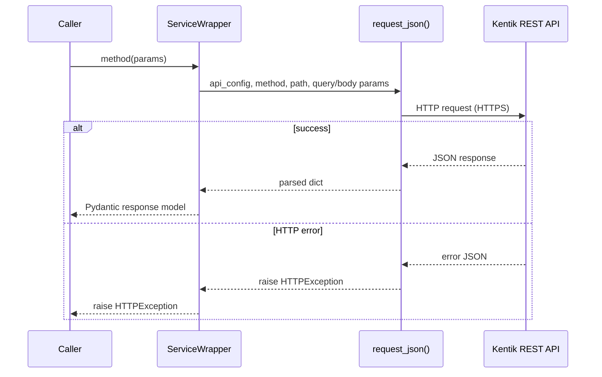

<!-- HAND-WRITTEN prose, except the `kentik-gen` marker blocks, which [`make generate`](../../Makefile) rewrites. Fix those in scripts/generation/docs_rendering.py. -->

# REST Transport Guide

The REST transport is the default and fully supported transport.

## Instantiate the client

```python
from kentik_api.client import KentikAPI

client = KentikAPI(protocol="rest")  # loads credentials from .env
```

See [quickstart.md](quickstart.md) for credential setup.

## Call any service method

Every generated service is available as an attribute on the client:

<!-- kentik-gen:list-methods-example -->
```python
response = client.as_group.list_as_groups()
response = client.asset_tags.list_tag_keys()
response = client.audit.list_audit_events()
```
<!-- /kentik-gen:list-methods-example -->

All methods return Pydantic v2 models. Optional list fields use
`Optional[List[Optional[Model]]]` to reflect the OpenAPI schema; filter
out `None` items before iterating:

```python
devices = [d for d in (response.devices or []) if d is not None]
```

## Passing request bodies

Methods that take a request body expect a Pydantic model:

<!-- kentik-gen:request-body-example -->
```python
from kentik_api.gen.alerting.models import AlertAutoAckServiceListRequest

response = client.alerting.list(data=AlertAutoAckServiceListRequest())
```
<!-- /kentik-gen:request-body-example -->

## Regions

Pass `region` to target a non-default Kentik region:

```python
client = KentikAPI(protocol="rest", region="eu")
```

## Request flow



See [`core/rest_runtime.py`](../../src/kentik_api/core/rest_runtime.py) for
the implementation. Every REST operation routes through the single
`request_json()` function.

## Runnable examples

- [`examples/device/rest.py`](../../examples/device/rest.py)
- [`examples/user/rest.py`](../../examples/user/rest.py)
- [`examples/label/rest.py`](../../examples/label/rest.py)
- [`examples/site/rest.py`](../../examples/site/rest.py)
- [`examples/alerting/rest.py`](../../examples/alerting/rest.py)
- [`examples/synthetics/rest.py`](../../examples/synthetics/rest.py)
