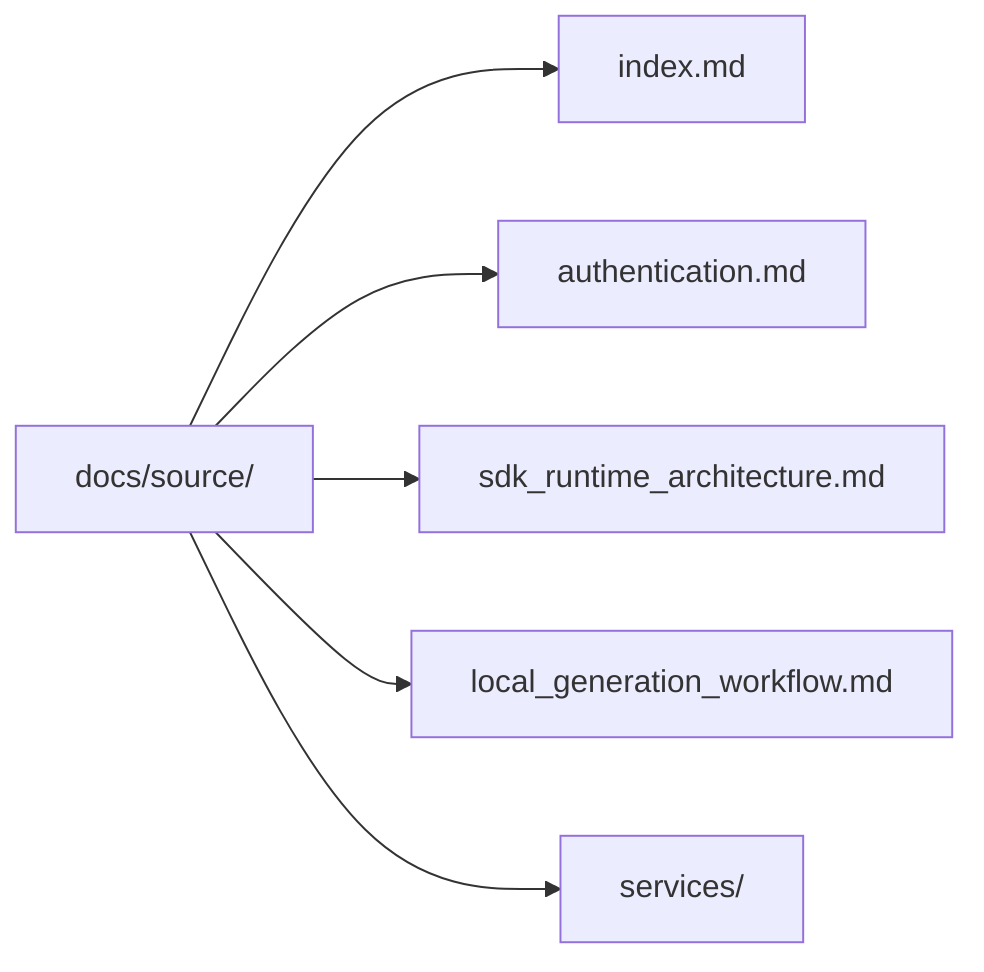

# Documentation Source

Sphinx source for the Kentik Community Python SDK. Build with `make docs`;
output lands in `docs/build/html/`.

## Structure



## Pages

| File | Description |
| --- | --- |
| [index.md](index.md) | Sphinx root toctree |
| [authentication.md](authentication.md) | Credential setup via `.env` or constructor args |
| [sdk_runtime_architecture.md](sdk_runtime_architecture.md) | Module dependency graph and runtime flow |
| [local_generation_workflow.md](local_generation_workflow.md) | How to regenerate the SDK from the OpenAPI schema |
| [services/](services/README.md) | One page per Kentik API service (37 total) |

## Building

```bash
make docs          # build Sphinx HTML → docs/build/html/
make generate      # regenerate service .md pages from the OpenAPI schema
make generate local  # use the local ../api-schema-public/ checkout
```
