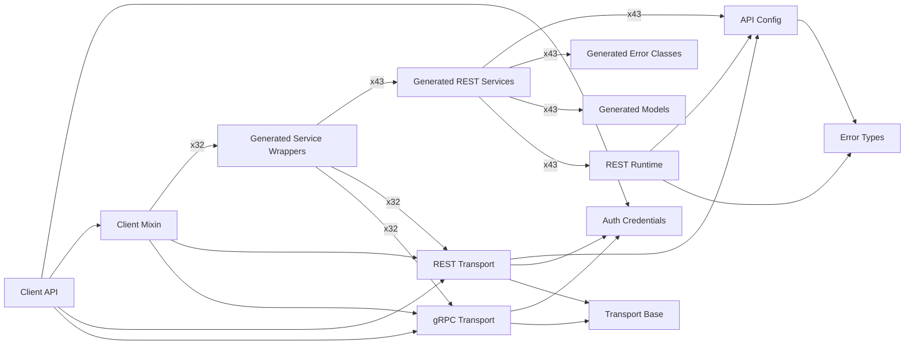

# SDK Runtime Architecture

This page explains how core runtime modules and generated services connect at runtime.

## Runtime Flow

1. `kentik_api.client.KentikAPI` reads credentials and selects transport.
2. `kentik_api.client_mixin.KentikClientMixin` mounts generated service wrappers.
3. Wrapper classes in `kentik_api.gen.<service>.services.<service>` delegate
   to generated REST functions.
4. Generated REST services use `kentik_api.core.api_config` and `kentik_api.core.rest_runtime`.
5. Runtime failures are normalized into `kentik_api.errors` and generated
   service-local error classes.

## Module Dependency Graph

## Reading The Graph

- `Client API` and `Client Mixin` are the orchestration entrypoints.
- `Generated Service Wrappers` are transport-aware facades exposed as `client.<service>`.
- `Generated REST Services` host operation functions generated from OpenAPI schemas.
- `API Config`, `REST Runtime`, and `Error Types` form the shared runtime foundation.
