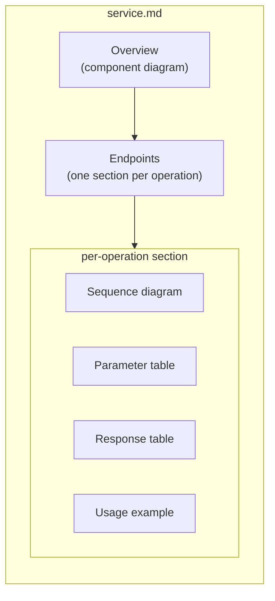

# API Service Pages

One Markdown page per Kentik API service, generated by
`scripts/generation/endpoint_docs.py`. **Do not hand-edit these files**;
they are overwritten on every `make generate` run.

## What each page contains

## Services

| Service | Page | Description |
| --- | --- | --- |
| AI Advisor | [ai_advisor.md](ai_advisor.md) | AI-powered advisory and recommendations |
| Alerting | [alerting.md](alerting.md) | Alert management, suppression, and notifications |
| AS Group | [as_group.md](as_group.md) | Autonomous System group management |
| Asset Tags | [asset_tags.md](asset_tags.md) | Asset tagging and classification |
| Audit | [audit.md](audit.md) | Audit log access |
| BGP Monitoring | [bgp_monitoring.md](bgp_monitoring.md) | BGP route monitoring |
| Capacity Plan | [capacity_plan.md](capacity_plan.md) | Network capacity planning |
| Cloud Export | [cloud_export.md](cloud_export.md) | Cloud flow export configuration |
| Connectivity Checker | [connectivity_checker.md](connectivity_checker.md) | Connectivity path verification |
| Cost | [cost.md](cost.md) | Cost analysis and attribution |
| Credential | [credential.md](credential.md) | Credential management |
| Custom Application | [custom_application.md](custom_application.md) | Custom application definitions |
| Custom Dimension | [custom_dimension.md](custom_dimension.md) | Custom dimension management |
| Device | [device.md](device.md) | Network device management |
| Device Config | [deviceconf.md](deviceconf.md) | Device configuration templates |
| Diagnostic | [diagnostic.md](diagnostic.md) | Diagnostic and troubleshooting tools |
| Dictionary | [dictionary.md](dictionary.md) | Reference data dictionaries |
| Enrichments | [enrichments.md](enrichments.md) | Data enrichment configuration |
| Flow Tag | [flow_tag.md](flow_tag.md) | Flow tagging rules |
| Interface | [interface.md](interface.md) | Network interface management |
| Journeys | [journeys.md](journeys.md) | Network journey analysis |
| KMI | [kmi.md](kmi.md) | Kentik Market Intelligence |
| KPTR | [kptr.md](kptr.md) | Kentik PTR (reverse DNS lookup) |
| KT BGP | [ktbgp.md](ktbgp.md) | Kentik BGP analytics |
| Label | [label.md](label.md) | Device label management |
| MKP | [mkp.md](mkp.md) | My Kentik Portal (multi-tenant) |
| Net | [net.md](net.md) | Network analytics |
| Network Class | [network_class.md](network_class.md) | Network classification |
| Notification Channel | [notification_channel.md](notification_channel.md) | Notification channel configuration |
| Pathfinder | [pathfinder.md](pathfinder.md) | Network path analysis |
| Plan | [plan.md](plan.md) | Billing plan management |
| Saved Filter | [saved_filter.md](saved_filter.md) | Saved filter management |
| Site | [site.md](site.md) | Site and site market management |
| Synthetics | [synthetics.md](synthetics.md) | Synthetic network tests and agents |
| User | [user.md](user.md) | User account management |
| Vault | [vault.md](vault.md) | Secrets vault |
