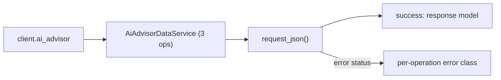
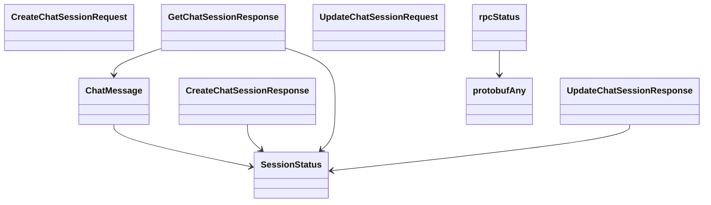

# Ai Advisor Service

## Overview



## Endpoints

### `POST` `/ai_advisor/v202511/chat`

Create AI Advisor Chat Session

Create a new AI Advisor Chat session with a prompt

#### Parameters

| Name | In | Type | Required |
| --- | --- | --- | --- |
| `data` | body | `CreateChatSessionRequest` | Yes |

#### Responses

| Status | Description | Model |
| --- | --- | --- |
| 200 | A successful response. | `CreateChatSessionResponse` |
| default | An unexpected error response. | `rpcStatus` |

#### Example

```python
from kentik_api.client import KentikAPI

client = KentikAPI()  # loads KENTIK_EMAIL/KENTIK_API_TOKEN from .env
response = client.ai_advisor.create_chat_session(
    data=CreateChatSessionRequest(...),
)
```

---

### `PUT` `/ai_advisor/v202511/chat`

Update AI Advisor Chat Session

Update AI Advisor Chat session with a prompt

#### Parameters

| Name | In | Type | Required |
| --- | --- | --- | --- |
| `data` | body | `UpdateChatSessionRequest` | Yes |

#### Responses

| Status | Description | Model |
| --- | --- | --- |
| 200 | A successful response. | `UpdateChatSessionResponse` |
| default | An unexpected error response. | `rpcStatus` |

#### Example

```python
from kentik_api.client import KentikAPI

client = KentikAPI()  # loads KENTIK_EMAIL/KENTIK_API_TOKEN from .env
response = client.ai_advisor.update_chat_session(
    data=UpdateChatSessionRequest(...),
)
```

---

### `GET` `/ai_advisor/v202511/chat/{id}`

Get AI Advisor Chat Session

Retrieve the status and results of an AI Advisor chat session

#### Parameters

| Name | In | Type | Required |
| --- | --- | --- | --- |
| `id` | path | `string` | Yes |

#### Responses

| Status | Description | Model |
| --- | --- | --- |
| 200 | A successful response. | `GetChatSessionResponse` |
| default | An unexpected error response. | `rpcStatus` |

#### Example

```python
from kentik_api.client import KentikAPI

client = KentikAPI()  # loads KENTIK_EMAIL/KENTIK_API_TOKEN from .env
response = client.ai_advisor.get_chat_session(
    id="id-example",
)
```

## Data Models

<details>
<summary>Model relationships (9 of 9 models)</summary>



</details>

```{eval-rst}
.. autopydantic_model:: kentik_api.gen.ai_advisor.models.ChatMessage
```

```{eval-rst}
.. autopydantic_model:: kentik_api.gen.ai_advisor.models.CreateChatSessionRequest
```

```{eval-rst}
.. autopydantic_model:: kentik_api.gen.ai_advisor.models.CreateChatSessionResponse
```

```{eval-rst}
.. autopydantic_model:: kentik_api.gen.ai_advisor.models.GetChatSessionResponse
```

```{eval-rst}
.. autoclass:: kentik_api.gen.ai_advisor.models.SessionStatus
   :members:
```

```{eval-rst}
.. autopydantic_model:: kentik_api.gen.ai_advisor.models.UpdateChatSessionRequest
```

```{eval-rst}
.. autopydantic_model:: kentik_api.gen.ai_advisor.models.UpdateChatSessionResponse
```

```{eval-rst}
.. autopydantic_model:: kentik_api.gen.ai_advisor.models.protobufAny
```

```{eval-rst}
.. autopydantic_model:: kentik_api.gen.ai_advisor.models.rpcStatus
```
