# Asset Tags Service

## Overview

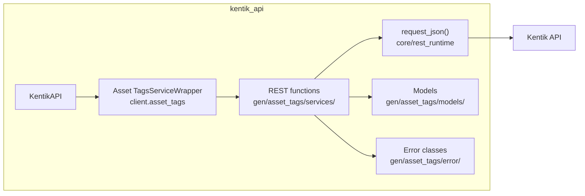

## Endpoints

### `GET` `/asset_tags/v20260515beta1/assets/{assetType}/{assetId}/values`

Gets tag values by asset id and type.

Returns a list of tag values.

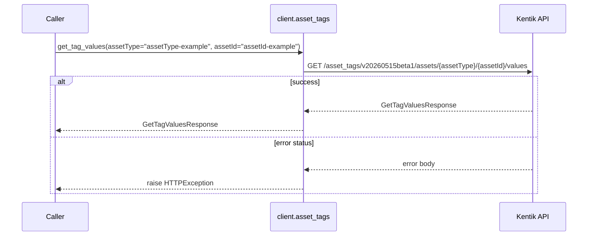

#### Parameters

| Name | In | Type | Required |
| --- | --- | --- | --- |
| `assetType` | path | `string` | Yes |
| `assetId` | path | `string` | Yes |

#### Responses

| Status | Description | Model |
| --- | --- | --- |
| 200 | A successful response. | `GetTagValuesResponse` |
| default | An unexpected error response. | `rpcStatus` |

#### Example

```python
from kentik_api.client import KentikAPI

# Both transports work: protocol="rest" (default) or protocol="grpc".
client = KentikAPI(protocol="rest")  # loads KENTIK_EMAIL/KENTIK_API_TOKEN from .env
response = client.asset_tags.get_tag_values(
    assetType="assetType-example",
    assetId="assetId-example",
)
```

---

### `GET` `/asset_tags/v20260515beta1/keys`

Lists all tag keys.

Returns a list of tag keys.

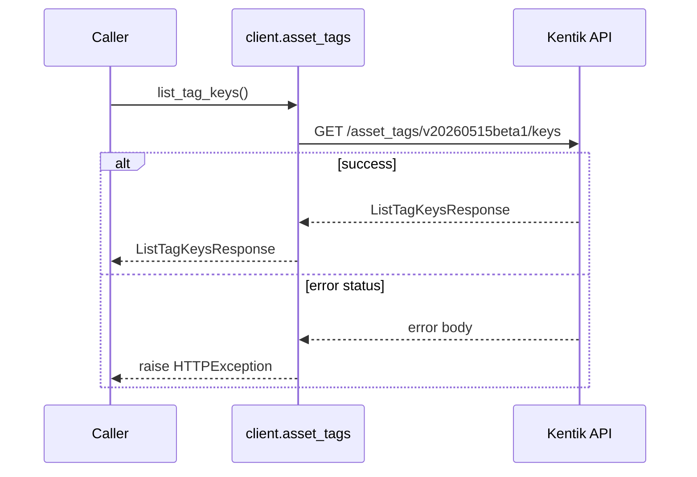

#### Responses

| Status | Description | Model |
| --- | --- | --- |
| 200 | A successful response. | `ListTagKeysResponse` |
| default | An unexpected error response. | `rpcStatus` |

#### Example

```python
from kentik_api.client import KentikAPI

# Both transports work: protocol="rest" (default) or protocol="grpc".
client = KentikAPI(protocol="rest")  # loads KENTIK_EMAIL/KENTIK_API_TOKEN from .env
response = client.asset_tags.list_tag_keys()
```

---

### `POST` `/asset_tags/v20260515beta1/keys`

Creates a new tag key.

Returns the created tag key.

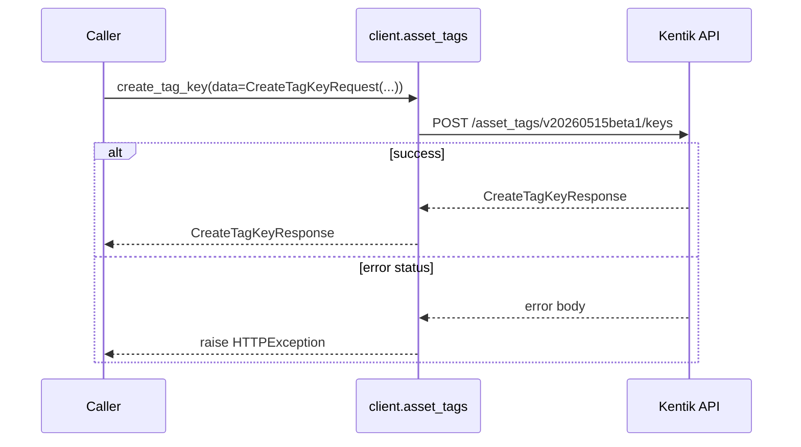

#### Parameters

| Name | In | Type | Required |
| --- | --- | --- | --- |
| `data` | body | `CreateTagKeyRequest` | Yes |

#### Responses

| Status | Description | Model |
| --- | --- | --- |
| 200 | A successful response. | `CreateTagKeyResponse` |
| default | An unexpected error response. | `rpcStatus` |

#### Example

```python
from kentik_api.client import KentikAPI

# Both transports work: protocol="rest" (default) or protocol="grpc".
client = KentikAPI(protocol="rest")  # loads KENTIK_EMAIL/KENTIK_API_TOKEN from .env
response = client.asset_tags.create_tag_key(
    data=CreateTagKeyRequest(...),
)
```

---

### `GET` `/asset_tags/v20260515beta1/keys/{id}`

Get a single tag key by id.

Returns a single tag key.

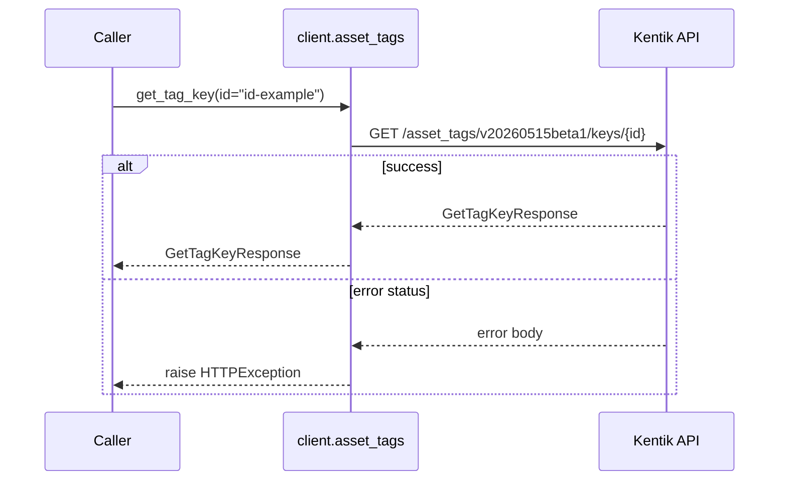

#### Parameters

| Name | In | Type | Required |
| --- | --- | --- | --- |
| `id` | path | `string` | Yes |

#### Responses

| Status | Description | Model |
| --- | --- | --- |
| 200 | A successful response. | `GetTagKeyResponse` |
| default | An unexpected error response. | `rpcStatus` |

#### Example

```python
from kentik_api.client import KentikAPI

# Both transports work: protocol="rest" (default) or protocol="grpc".
client = KentikAPI(protocol="rest")  # loads KENTIK_EMAIL/KENTIK_API_TOKEN from .env
response = client.asset_tags.get_tag_key(
    id="id-example",
)
```

---

### `PUT` `/asset_tags/v20260515beta1/keys/{id}`

Updates the display name of a tag key.

Returns the updated tag key.

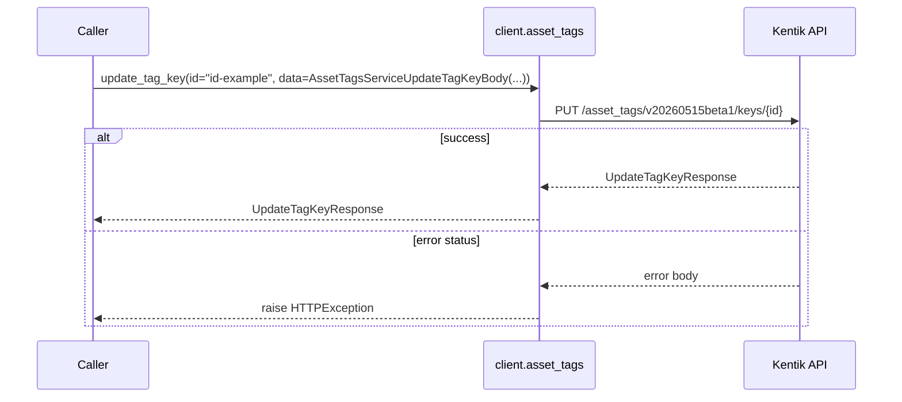

#### Parameters

| Name | In | Type | Required |
| --- | --- | --- | --- |
| `id` | path | `string` | Yes |
| `data` | body | `AssetTagsServiceUpdateTagKeyBody` | Yes |

#### Responses

| Status | Description | Model |
| --- | --- | --- |
| 200 | A successful response. | `UpdateTagKeyResponse` |
| default | An unexpected error response. | `rpcStatus` |

#### Example

```python
from kentik_api.client import KentikAPI

# Both transports work: protocol="rest" (default) or protocol="grpc".
client = KentikAPI(protocol="rest")  # loads KENTIK_EMAIL/KENTIK_API_TOKEN from .env
response = client.asset_tags.update_tag_key(
    id="id-example",
    data=AssetTagsServiceUpdateTagKeyBody(...),
)
```

---

### `DELETE` `/asset_tags/v20260515beta1/keys/{id}`

Deletes a tag key by id.

Returns an empty response

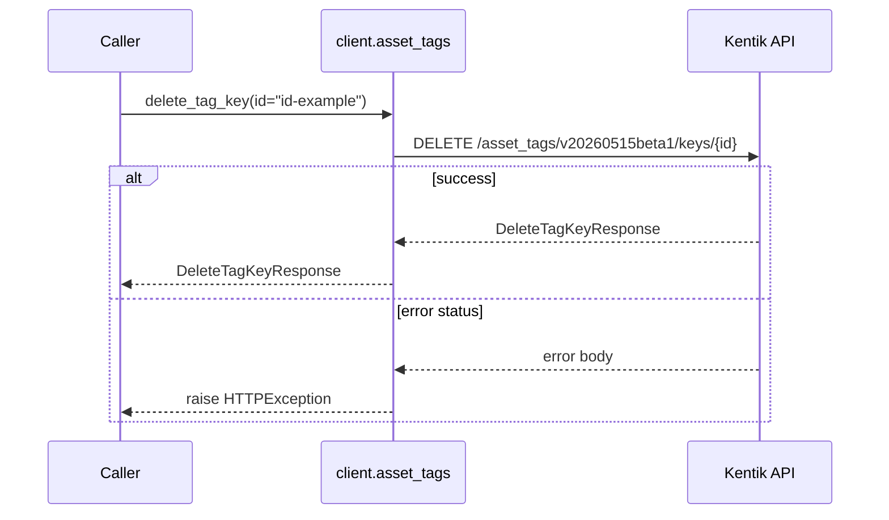

#### Parameters

| Name | In | Type | Required |
| --- | --- | --- | --- |
| `id` | path | `string` | Yes |

#### Responses

| Status | Description | Model |
| --- | --- | --- |
| 200 | A successful response. | `DeleteTagKeyResponse` |
| default | An unexpected error response. | `rpcStatus` |

#### Example

```python
from kentik_api.client import KentikAPI

# Both transports work: protocol="rest" (default) or protocol="grpc".
client = KentikAPI(protocol="rest")  # loads KENTIK_EMAIL/KENTIK_API_TOKEN from .env
response = client.asset_tags.delete_tag_key(
    id="id-example",
)
```

---

### `GET` `/asset_tags/v20260515beta1/keys/{tagId}/{assetType}/values`

Lists all tag values by id, optionally filtered by asset type.

Returns a list of tag values.

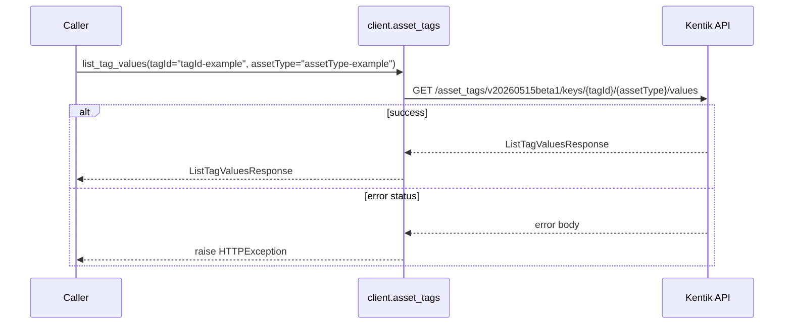

#### Parameters

| Name | In | Type | Required |
| --- | --- | --- | --- |
| `tagId` | path | `string` | Yes |
| `assetType` | path | `string` | Yes |

#### Responses

| Status | Description | Model |
| --- | --- | --- |
| 200 | A successful response. | `ListTagValuesResponse` |
| default | An unexpected error response. | `rpcStatus` |

#### Example

```python
from kentik_api.client import KentikAPI

# Both transports work: protocol="rest" (default) or protocol="grpc".
client = KentikAPI(protocol="rest")  # loads KENTIK_EMAIL/KENTIK_API_TOKEN from .env
response = client.asset_tags.list_tag_values(
    tagId="tagId-example",
    assetType="assetType-example",
)
```

---

### `PUT` `/asset_tags/v20260515beta1/values`

Bulk upserts a tag value for a list of asset ids of a given type.

Returns a list of tag values.

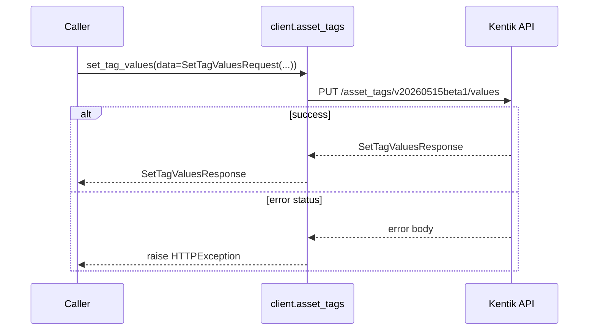

#### Parameters

| Name | In | Type | Required |
| --- | --- | --- | --- |
| `data` | body | `SetTagValuesRequest` | Yes |

#### Responses

| Status | Description | Model |
| --- | --- | --- |
| 200 | A successful response. | `SetTagValuesResponse` |
| default | An unexpected error response. | `rpcStatus` |

#### Example

```python
from kentik_api.client import KentikAPI

# Both transports work: protocol="rest" (default) or protocol="grpc".
client = KentikAPI(protocol="rest")  # loads KENTIK_EMAIL/KENTIK_API_TOKEN from .env
response = client.asset_tags.set_tag_values(
    data=SetTagValuesRequest(...),
)
```

---

### `POST` `/asset_tags/v20260515beta1/values/delete`

Bulk deletes a tag values for a list of asset ids of a given type.

Returns an empty response.

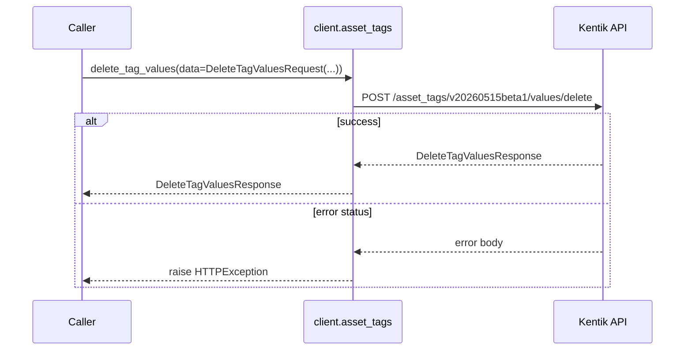

#### Parameters

| Name | In | Type | Required |
| --- | --- | --- | --- |
| `data` | body | `DeleteTagValuesRequest` | Yes |

#### Responses

| Status | Description | Model |
| --- | --- | --- |
| 200 | A successful response. | `DeleteTagValuesResponse` |
| default | An unexpected error response. | `rpcStatus` |

#### Example

```python
from kentik_api.client import KentikAPI

# Both transports work: protocol="rest" (default) or protocol="grpc".
client = KentikAPI(protocol="rest")  # loads KENTIK_EMAIL/KENTIK_API_TOKEN from .env
response = client.asset_tags.delete_tag_values(
    data=DeleteTagValuesRequest(...),
)
```

## Data Models

<details>
<summary>Model relationships (18 of 18 models)</summary>

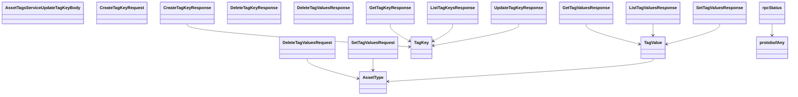

</details>

```{eval-rst}
.. autopydantic_model:: kentik_api.gen.asset_tags.models.AssetTagsServiceUpdateTagKeyBody
```

```{eval-rst}
.. autoclass:: kentik_api.gen.asset_tags.models.AssetType
   :members:
```

```{eval-rst}
.. autopydantic_model:: kentik_api.gen.asset_tags.models.CreateTagKeyRequest
```

```{eval-rst}
.. autopydantic_model:: kentik_api.gen.asset_tags.models.CreateTagKeyResponse
```

```{eval-rst}
.. autopydantic_model:: kentik_api.gen.asset_tags.models.DeleteTagKeyResponse
```

```{eval-rst}
.. autopydantic_model:: kentik_api.gen.asset_tags.models.DeleteTagValuesRequest
```

```{eval-rst}
.. autopydantic_model:: kentik_api.gen.asset_tags.models.DeleteTagValuesResponse
```

```{eval-rst}
.. autopydantic_model:: kentik_api.gen.asset_tags.models.GetTagKeyResponse
```

```{eval-rst}
.. autopydantic_model:: kentik_api.gen.asset_tags.models.GetTagValuesResponse
```

```{eval-rst}
.. autopydantic_model:: kentik_api.gen.asset_tags.models.ListTagKeysResponse
```

```{eval-rst}
.. autopydantic_model:: kentik_api.gen.asset_tags.models.ListTagValuesResponse
```

```{eval-rst}
.. autopydantic_model:: kentik_api.gen.asset_tags.models.SetTagValuesRequest
```

```{eval-rst}
.. autopydantic_model:: kentik_api.gen.asset_tags.models.SetTagValuesResponse
```

```{eval-rst}
.. autopydantic_model:: kentik_api.gen.asset_tags.models.TagKey
```

```{eval-rst}
.. autopydantic_model:: kentik_api.gen.asset_tags.models.TagValue
```

```{eval-rst}
.. autopydantic_model:: kentik_api.gen.asset_tags.models.UpdateTagKeyResponse
```

```{eval-rst}
.. autopydantic_model:: kentik_api.gen.asset_tags.models.protobufAny
```

```{eval-rst}
.. autopydantic_model:: kentik_api.gen.asset_tags.models.rpcStatus
```
