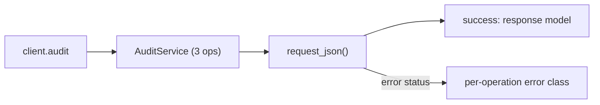
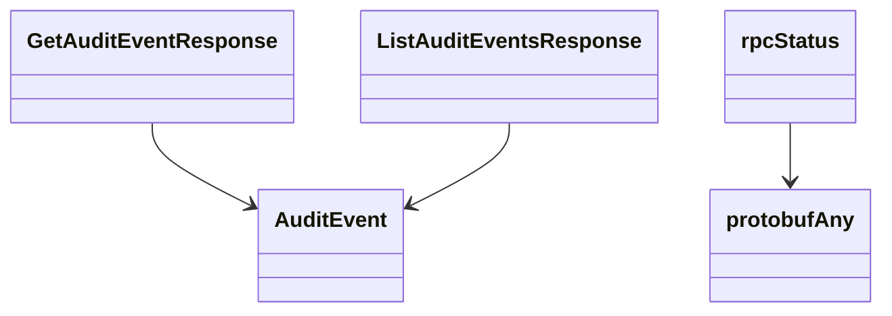

# Audit Service

## Overview



## Endpoints

### `GET` `/audit/v202601/events`

List Audit Events.

Returns a list of audit events.

#### Parameters

| Name | In | Type | Required |
| --- | --- | --- | --- |
| `startTime` | query | `string` | No |
| `endTime` | query | `string` | No |
| `offset` | query | `string (uint64)` | No |
| `limit` | query | `string (uint64)` | No |

#### Responses

| Status | Description | Model |
| --- | --- | --- |
| 200 | A successful response. | `ListAuditEventsResponse` |
| default | An unexpected error response. | `rpcStatus` |

#### Example

```python
from kentik_api.client import KentikAPI

client = KentikAPI()  # loads KENTIK_EMAIL/KENTIK_API_TOKEN from .env
response = client.audit.list_audit_events()
```

---

### `GET` `/audit/v202601/events/{id}`

Get an Audit Event

Return a specific audit event.

#### Parameters

| Name | In | Type | Required |
| --- | --- | --- | --- |
| `id` | path | `string (int64)` | Yes |
| `ctime` | query | `string (date-time)` | No |

#### Responses

| Status | Description | Model |
| --- | --- | --- |
| 200 | A successful response. | `GetAuditEventResponse` |
| default | An unexpected error response. | `rpcStatus` |

#### Example

```python
from kentik_api.client import KentikAPI

client = KentikAPI()  # loads KENTIK_EMAIL/KENTIK_API_TOKEN from .env
response = client.audit.get_audit_event(
    id="id-example",
)
```

---

### `GET` `/audit/v202601/events/{id}/{ctime}`

Get an Audit Event

Return a specific audit event.

#### Parameters

| Name | In | Type | Required |
| --- | --- | --- | --- |
| `id` | path | `string (int64)` | Yes |
| `ctime` | path | `string (date-time)` | Yes |

#### Responses

| Status | Description | Model |
| --- | --- | --- |
| 200 | A successful response. | `GetAuditEventResponse` |
| default | An unexpected error response. | `rpcStatus` |

#### Example

```python
from kentik_api.client import KentikAPI

client = KentikAPI()  # loads KENTIK_EMAIL/KENTIK_API_TOKEN from .env
response = client.audit.get_audit_event_2(
    id="id-example",
    ctime="ctime-example",
)
```

## Data Models

<details>
<summary>Model relationships (5 of 6 models)</summary>



</details>

```{eval-rst}
.. autopydantic_model:: kentik_api.gen.audit.models.AuditEvent
```

```{eval-rst}
.. autopydantic_model:: kentik_api.gen.audit.models.GenericEvent
```

```{eval-rst}
.. autopydantic_model:: kentik_api.gen.audit.models.GetAuditEventResponse
```

```{eval-rst}
.. autopydantic_model:: kentik_api.gen.audit.models.ListAuditEventsResponse
```

```{eval-rst}
.. autopydantic_model:: kentik_api.gen.audit.models.protobufAny
```

```{eval-rst}
.. autopydantic_model:: kentik_api.gen.audit.models.rpcStatus
```
