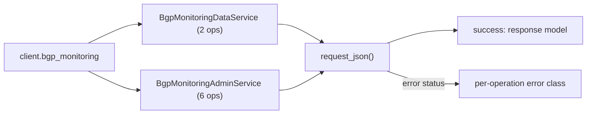

# Bgp Monitoring Service

## Overview



## Endpoints

### BgpMonitoringDataService

#### `POST` `/bgp_monitoring/v202210/metrics`

Get metrics for a BGP prefix.

Retrieve metric data for single BGP prefix and time interval.

##### Parameters

| Name | In | Type | Required |
| --- | --- | --- | --- |
| `data` | body | `GetMetricsForTargetRequest` | Yes |

##### Responses

| Status | Description | Model |
| --- | --- | --- |
| 200 | A successful response. | `GetMetricsForTargetResponse` |
| default | An unexpected error response. | `rpcStatus` |

##### Example

```python
from kentik_api.client import KentikAPI

client = KentikAPI()  # loads KENTIK_EMAIL/KENTIK_API_TOKEN from .env
response = client.bgp_monitoring.get_metrics_for_target(
    data=GetMetricsForTargetRequest(...),
)
```

---

#### `POST` `/bgp_monitoring/v202210/routes`

Get routes for a BGP prefix.

Retrieve snapshot of route information for single BGP prefix at specific time.

##### Parameters

| Name | In | Type | Required |
| --- | --- | --- | --- |
| `data` | body | `GetRoutesForTargetRequest` | Yes |

##### Responses

| Status | Description | Model |
| --- | --- | --- |
| 200 | A successful response. | `GetRoutesForTargetResponse` |
| default | An unexpected error response. | `rpcStatus` |

##### Example

```python
from kentik_api.client import KentikAPI

client = KentikAPI()  # loads KENTIK_EMAIL/KENTIK_API_TOKEN from .env
response = client.bgp_monitoring.get_routes_for_target(
    data=GetRoutesForTargetRequest(...),
)
```

### BgpMonitoringAdminService

#### `GET` `/bgp_monitoring/v202210/monitors`

List BGP Monitors.

Returns list of all BGP monitors present in the account.

##### Responses

| Status | Description | Model |
| --- | --- | --- |
| 200 | A successful response. | `ListMonitorsResponse` |
| default | An unexpected error response. | `rpcStatus` |

##### Example

```python
from kentik_api.client import KentikAPI

client = KentikAPI()  # loads KENTIK_EMAIL/KENTIK_API_TOKEN from .env
response = client.bgp_monitoring.list_monitors()
```

---

#### `POST` `/bgp_monitoring/v202210/monitors`

Create new BGP Monitor instance.

Creates new BGP Monitor and if successful returns its configuration.

##### Parameters

| Name | In | Type | Required |
| --- | --- | --- | --- |
| `data` | body | `CreateMonitorRequest` | Yes |

##### Responses

| Status | Description | Model |
| --- | --- | --- |
| 200 | A successful response. | `CreateMonitorResponse` |
| default | An unexpected error response. | `rpcStatus` |

##### Example

```python
from kentik_api.client import KentikAPI

client = KentikAPI()  # loads KENTIK_EMAIL/KENTIK_API_TOKEN from .env
response = client.bgp_monitoring.create_monitor(
    data=CreateMonitorRequest(...),
)
```

---

#### `GET` `/bgp_monitoring/v202210/monitors/{id}`

Get BGP Monitor configuration.

Returns configuration of existing BGP monitor with specific ID.

##### Parameters

| Name | In | Type | Required |
| --- | --- | --- | --- |
| `id` | path | `string` | Yes |

##### Responses

| Status | Description | Model |
| --- | --- | --- |
| 200 | A successful response. | `GetMonitorResponse` |
| default | An unexpected error response. | `rpcStatus` |

##### Example

```python
from kentik_api.client import KentikAPI

client = KentikAPI()  # loads KENTIK_EMAIL/KENTIK_API_TOKEN from .env
response = client.bgp_monitoring.get_monitor(
    id="id-example",
)
```

---

#### `PUT` `/bgp_monitoring/v202210/monitors/{id}`

Update configuration of a BGP monitor.

Updates configuration of BGP monitor with specific ID and returns updated  configuration.

##### Parameters

| Name | In | Type | Required |
| --- | --- | --- | --- |
| `id` | path | `string` | Yes |
| `data` | body | `BgpMonitoringAdminServiceUpdateMonitorBody` | Yes |

##### Responses

| Status | Description | Model |
| --- | --- | --- |
| 200 | A successful response. | `UpdateMonitorResponse` |
| default | An unexpected error response. | `rpcStatus` |

##### Example

```python
from kentik_api.client import KentikAPI

client = KentikAPI()  # loads KENTIK_EMAIL/KENTIK_API_TOKEN from .env
response = client.bgp_monitoring.update_monitor(
    id="id-example",
    data=BgpMonitoringAdminServiceUpdateMonitorBody(...),
)
```

---

#### `DELETE` `/bgp_monitoring/v202210/monitors/{id}`

Delete existing BGP Monitor.

Delete BGP monitor with with specific ID.

##### Parameters

| Name | In | Type | Required |
| --- | --- | --- | --- |
| `id` | path | `string` | Yes |

##### Responses

| Status | Description | Model |
| --- | --- | --- |
| 200 | A successful response. | `DeleteMonitorResponse` |
| default | An unexpected error response. | `rpcStatus` |

##### Example

```python
from kentik_api.client import KentikAPI

client = KentikAPI()  # loads KENTIK_EMAIL/KENTIK_API_TOKEN from .env
response = client.bgp_monitoring.delete_monitor(
    id="id-example",
)
```

---

#### `PUT` `/bgp_monitoring/v202210/monitors/{id}/status`

Sets administrative status of a BGP monitor.

Sets administrative status of BGP monitor with specific ID.

##### Parameters

| Name | In | Type | Required |
| --- | --- | --- | --- |
| `id` | path | `string` | Yes |
| `data` | body | `BgpMonitoringAdminServiceSetMonitorStatusBody` | Yes |

##### Responses

| Status | Description | Model |
| --- | --- | --- |
| 200 | A successful response. | `SetMonitorStatusResponse` |
| default | An unexpected error response. | `rpcStatus` |

##### Example

```python
from kentik_api.client import KentikAPI

client = KentikAPI()  # loads KENTIK_EMAIL/KENTIK_API_TOKEN from .env
response = client.bgp_monitoring.set_monitor_status(
    id="id-example",
    data=BgpMonitoringAdminServiceSetMonitorStatusBody(...),
)
```

## Data Models

```mermaid
classDiagram
    class BgpMetric
    class BgpMetricType
    class BgpMonitor
    class BgpMonitorStatus
    class BgpMonitoringAdminServiceSetMonitorStatusBody
    class BgpMonitoringAdminServiceUpdateMonitorBody
    class CreateMonitorRequest
    class CreateMonitorResponse
    class DeleteMonitorResponse
    class GetMetricsForTargetRequest
    class GetMetricsForTargetResponse
    class GetMonitorResponse
    class GetRoutesForTargetRequest
    class GetRoutesForTargetResponse
    class ListMonitorsResponse
    class Nlri
    class RouteInfo
    class SetMonitorStatusResponse
    class UpdateMonitorResponse
    class protobufAny
    class rpcStatus
    BgpMetric --> Nlri
    BgpMonitor --> BgpMonitorStatus
    BgpMonitoringAdminServiceSetMonitorStatusBody --> BgpMonitorStatus
    CreateMonitorRequest --> BgpMonitor
    CreateMonitorResponse --> BgpMonitor
    GetMetricsForTargetRequest --> BgpMetricType
    GetMetricsForTargetRequest --> Nlri
    GetMetricsForTargetResponse --> BgpMetric
    GetMonitorResponse --> BgpMonitor
    GetRoutesForTargetRequest --> Nlri
    GetRoutesForTargetResponse --> RouteInfo
    ListMonitorsResponse --> BgpMonitor
    RouteInfo --> Nlri
    UpdateMonitorResponse --> BgpMonitor
    rpcStatus --> protobufAny
```

<details>
<summary>Model relationships (21 of 28 models)</summary>



</details>

```{eval-rst}
.. autopydantic_model:: kentik_api.gen.bgp_monitoring.models.BgpHealthSettings
```

```{eval-rst}
.. autopydantic_model:: kentik_api.gen.bgp_monitoring.models.BgpMetric
```

```{eval-rst}
.. autoclass:: kentik_api.gen.bgp_monitoring.models.BgpMetricType
   :members:
```

```{eval-rst}
.. autopydantic_model:: kentik_api.gen.bgp_monitoring.models.BgpMonitor
```

```{eval-rst}
.. autopydantic_model:: kentik_api.gen.bgp_monitoring.models.BgpMonitorSettings
```

```{eval-rst}
.. autoclass:: kentik_api.gen.bgp_monitoring.models.BgpMonitorStatus
   :members:
```

```{eval-rst}
.. autopydantic_model:: kentik_api.gen.bgp_monitoring.models.BgpMonitoringAdminServiceSetMonitorStatusBody
```

```{eval-rst}
.. autopydantic_model:: kentik_api.gen.bgp_monitoring.models.BgpMonitoringAdminServiceUpdateMonitorBody
```

```{eval-rst}
.. autopydantic_model:: kentik_api.gen.bgp_monitoring.models.CreateMonitorRequest
```

```{eval-rst}
.. autopydantic_model:: kentik_api.gen.bgp_monitoring.models.CreateMonitorResponse
```

```{eval-rst}
.. autopydantic_model:: kentik_api.gen.bgp_monitoring.models.DeleteMonitorResponse
```

```{eval-rst}
.. autopydantic_model:: kentik_api.gen.bgp_monitoring.models.GetMetricsForTargetRequest
```

```{eval-rst}
.. autopydantic_model:: kentik_api.gen.bgp_monitoring.models.GetMetricsForTargetResponse
```

```{eval-rst}
.. autopydantic_model:: kentik_api.gen.bgp_monitoring.models.GetMonitorResponse
```

```{eval-rst}
.. autopydantic_model:: kentik_api.gen.bgp_monitoring.models.GetRoutesForTargetRequest
```

```{eval-rst}
.. autopydantic_model:: kentik_api.gen.bgp_monitoring.models.GetRoutesForTargetResponse
```

```{eval-rst}
.. autopydantic_model:: kentik_api.gen.bgp_monitoring.models.ListMonitorsResponse
```

```{eval-rst}
.. autopydantic_model:: kentik_api.gen.bgp_monitoring.models.Nlri
```

```{eval-rst}
.. autopydantic_model:: kentik_api.gen.bgp_monitoring.models.RouteInfo
```

```{eval-rst}
.. autopydantic_model:: kentik_api.gen.bgp_monitoring.models.SetMonitorStatusResponse
```

```{eval-rst}
.. autopydantic_model:: kentik_api.gen.bgp_monitoring.models.UpdateMonitorResponse
```

```{eval-rst}
.. autopydantic_model:: kentik_api.gen.bgp_monitoring.models.protobufAny
```

```{eval-rst}
.. autopydantic_model:: kentik_api.gen.bgp_monitoring.models.rpcStatus
```

```{eval-rst}
.. autoclass:: kentik_api.gen.bgp_monitoring.models.v202303Afi
   :members:
```

```{eval-rst}
.. autoclass:: kentik_api.gen.bgp_monitoring.models.v202303RpkiStatus
   :members:
```

```{eval-rst}
.. autoclass:: kentik_api.gen.bgp_monitoring.models.v202303Safi
   :members:
```

```{eval-rst}
.. autopydantic_model:: kentik_api.gen.bgp_monitoring.models.v202303UserInfo
```

```{eval-rst}
.. autopydantic_model:: kentik_api.gen.bgp_monitoring.models.v202303VantagePoint
```
