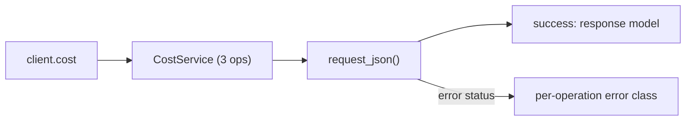
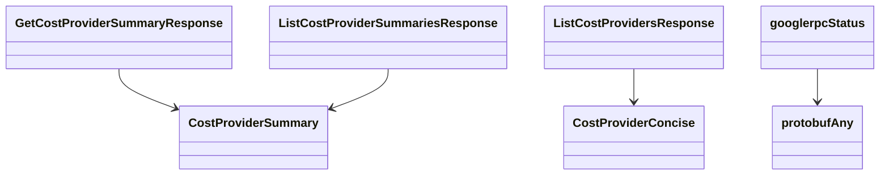

# Cost Service

## Overview



## Endpoints

### `GET` `/cost/v202308/cost/providers`

List all cost providers.

Returns list of configured cost providers.

#### Responses

| Status | Description | Model |
| --- | --- | --- |
| 200 | A successful response. | `ListCostProvidersResponse` |
| default | An unexpected error response. | `googlerpcStatus` |

#### Example

```python
from kentik_api.client import KentikAPI

client = KentikAPI()  # loads KENTIK_EMAIL/KENTIK_API_TOKEN from .env
response = client.cost.list_cost_providers()
```

---

### `GET` `/cost/v202308/cost/summary`

List all cost provider summaries.

Returns list of summaries of configured cost providers.

#### Parameters

| Name | In | Type | Required |
| --- | --- | --- | --- |
| `date` | query | `string` | No |

#### Responses

| Status | Description | Model |
| --- | --- | --- |
| 200 | A successful response. | `ListCostProviderSummariesResponse` |
| default | An unexpected error response. | `googlerpcStatus` |

#### Example

```python
from kentik_api.client import KentikAPI

client = KentikAPI()  # loads KENTIK_EMAIL/KENTIK_API_TOKEN from .env
response = client.cost.list_cost_provider_summaries()
```

---

### `GET` `/cost/v202308/cost/summary/{id}`

Get cost provider summary.

Returns summary of configured cost provider.

#### Parameters

| Name | In | Type | Required |
| --- | --- | --- | --- |
| `id` | path | `string` | Yes |
| `date` | query | `string` | No |

#### Responses

| Status | Description | Model |
| --- | --- | --- |
| 200 | A successful response. | `GetCostProviderSummaryResponse` |
| default | An unexpected error response. | `googlerpcStatus` |

#### Example

```python
from kentik_api.client import KentikAPI

client = KentikAPI()  # loads KENTIK_EMAIL/KENTIK_API_TOKEN from .env
response = client.cost.get_cost_provider_summary(
    id="id-example",
)
```

## Data Models

<details>
<summary>Model relationships (7 of 8 models)</summary>



</details>

```{eval-rst}
.. autopydantic_model:: kentik_api.gen.cost.models.CostProviderConcise
```

```{eval-rst}
.. autopydantic_model:: kentik_api.gen.cost.models.CostProviderSummary
```

```{eval-rst}
.. autopydantic_model:: kentik_api.gen.cost.models.GetCostProviderSummaryResponse
```

```{eval-rst}
.. autopydantic_model:: kentik_api.gen.cost.models.ListCostProviderSummariesResponse
```

```{eval-rst}
.. autopydantic_model:: kentik_api.gen.cost.models.ListCostProvidersResponse
```

```{eval-rst}
.. autoclass:: kentik_api.gen.cost.models.costv202308Status
   :members:
```

```{eval-rst}
.. autopydantic_model:: kentik_api.gen.cost.models.googlerpcStatus
```

```{eval-rst}
.. autopydantic_model:: kentik_api.gen.cost.models.protobufAny
```
