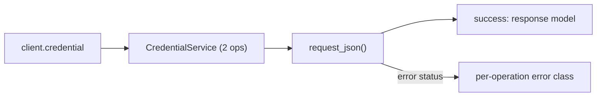
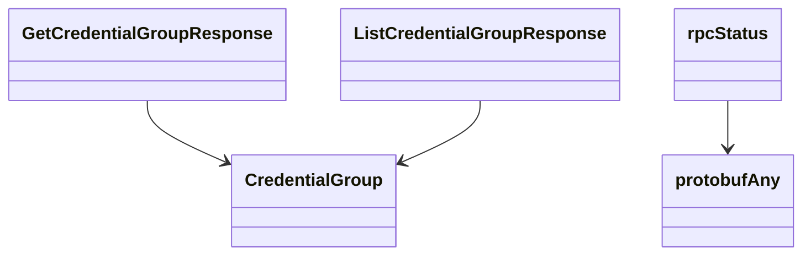

# Credential Service

## Overview



## Endpoints

### `GET` `/credential/v202407alpha1/group`

List credential groups.

Returns list of credential group information in Kentik vault.

#### Responses

| Status | Description | Model |
| --- | --- | --- |
| 200 | A successful response. | `ListCredentialGroupResponse` |
| default | An unexpected error response. | `rpcStatus` |

#### Example

```python
from kentik_api.client import KentikAPI

client = KentikAPI()  # loads KENTIK_EMAIL/KENTIK_API_TOKEN from .env
response = client.credential.list_credential_group()
```

---

### `GET` `/credential/v202407alpha1/group/{id}`

Get a credential group by id.

Returns specific credential group information in Kentik vault.

#### Parameters

| Name | In | Type | Required |
| --- | --- | --- | --- |
| `id` | path | `string` | Yes |

#### Responses

| Status | Description | Model |
| --- | --- | --- |
| 200 | A successful response. | `GetCredentialGroupResponse` |
| default | An unexpected error response. | `rpcStatus` |

#### Example

```python
from kentik_api.client import KentikAPI

client = KentikAPI()  # loads KENTIK_EMAIL/KENTIK_API_TOKEN from .env
response = client.credential.get_credential_group(
    id="id-example",
)
```

## Data Models

<details>
<summary>Model relationships (5 of 11 models)</summary>



</details>

```{eval-rst}
.. autopydantic_model:: kentik_api.gen.credential.models.CredentialGroup
```

```{eval-rst}
.. autopydantic_model:: kentik_api.gen.credential.models.GetCredentialGroupResponse
```

```{eval-rst}
.. autopydantic_model:: kentik_api.gen.credential.models.ListCredentialGroupResponse
```

```{eval-rst}
.. autopydantic_model:: kentik_api.gen.credential.models.protobufAny
```

```{eval-rst}
.. autopydantic_model:: kentik_api.gen.credential.models.rpcStatus
```

```{eval-rst}
.. autoclass:: kentik_api.gen.credential.models.v202211LandingType
   :members:
```

```{eval-rst}
.. autopydantic_model:: kentik_api.gen.credential.models.v202211PermissionEntry
```

```{eval-rst}
.. autoclass:: kentik_api.gen.credential.models.v202211Role
   :members:
```

```{eval-rst}
.. autopydantic_model:: kentik_api.gen.credential.models.v202211User
```

```{eval-rst}
.. autopydantic_model:: kentik_api.gen.credential.models.v202312alpha1Secret
```

```{eval-rst}
.. autoclass:: kentik_api.gen.credential.models.v202312alpha1SecretType
   :members:
```
