# Custom Dimension Service

## Overview

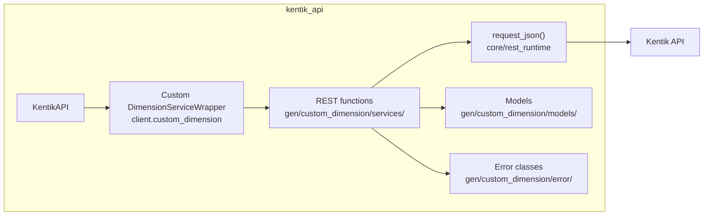

## Endpoints

### `GET` `/custom_dimensions/v202411alpha1`

List Custom Dimensions

Returns an array of custom dimension objects that each contain information about an individual custom dimension.

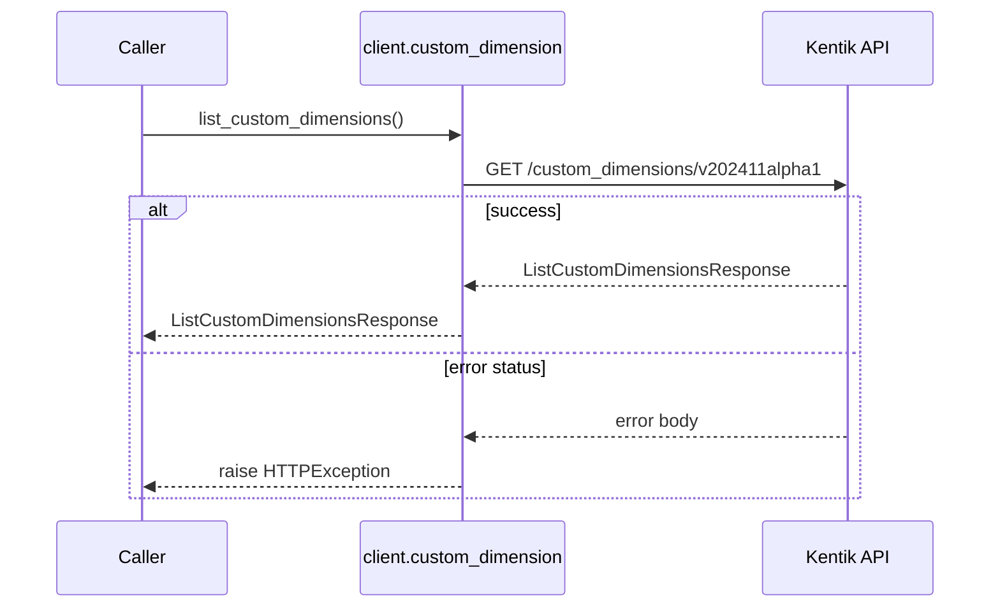

#### Responses

| Status | Description | Model |
| --- | --- | --- |
| 200 | A successful response. | `ListCustomDimensionsResponse` |
| default | An unexpected error response. | `rpcStatus` |

#### Example

```python
from kentik_api.client import KentikAPI

client = KentikAPI(protocol="rest")  # loads KENTIK_EMAIL/KENTIK_API_TOKEN from .env
response = client.custom_dimension.list_custom_dimensions()
```

---

### `GET` `/custom_dimensions/v202411alpha1/{customDimensionId}`

Custom Dimension Info

Returns a custom dimension object containing information about an individual custom dimension.

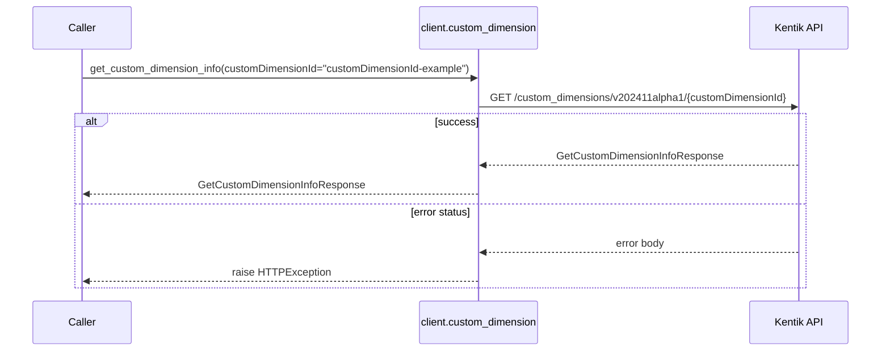

#### Parameters

| Name | In | Type | Required |
| --- | --- | --- | --- |
| `customDimensionId` | path | `string` | Yes |

#### Responses

| Status | Description | Model |
| --- | --- | --- |
| 200 | A successful response. | `GetCustomDimensionInfoResponse` |
| default | An unexpected error response. | `rpcStatus` |

#### Example

```python
from kentik_api.client import KentikAPI

client = KentikAPI(protocol="rest")  # loads KENTIK_EMAIL/KENTIK_API_TOKEN from .env
response = client.custom_dimension.get_custom_dimension_info(
    customDimensionId="customDimensionId-example",
)
```

---

### `PUT` `/custom_dimensions/v202411alpha1/{customDimensionId}`

Update Custom Dimension

Updates and returns a custom dimension object containing information about an individual custom dimension (see About Custom Dimensions). Populators are not sent back in the response body. To get them use 'Custom Dimension info' API instead.

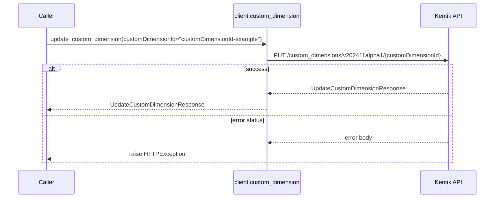

#### Parameters

| Name | In | Type | Required |
| --- | --- | --- | --- |
| `customDimensionId` | path | `string` | Yes |
| `data` | body | `-` | No |

#### Responses

| Status | Description | Model |
| --- | --- | --- |
| 200 | A successful response. | `UpdateCustomDimensionResponse` |
| default | An unexpected error response. | `rpcStatus` |

#### Example

```python
from kentik_api.client import KentikAPI

client = KentikAPI(protocol="rest")  # loads KENTIK_EMAIL/KENTIK_API_TOKEN from .env
response = client.custom_dimension.update_custom_dimension(
    customDimensionId="customDimensionId-example",
)
```

---

### `DELETE` `/custom_dimensions/v202411alpha1/{customDimensionId}`

Delete Custom Dimension

Deletes a custom dimension.

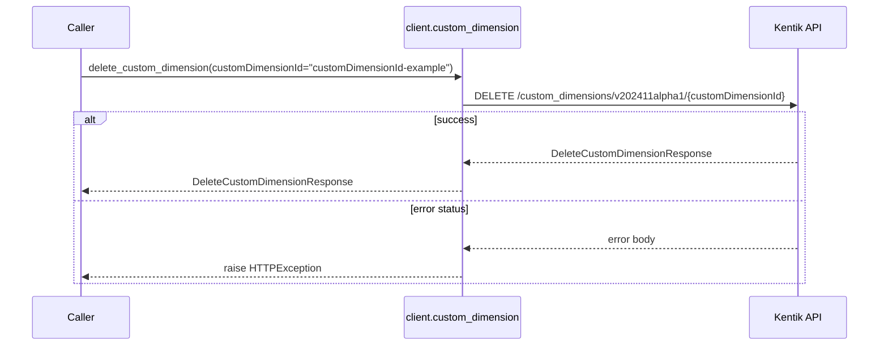

#### Parameters

| Name | In | Type | Required |
| --- | --- | --- | --- |
| `customDimensionId` | path | `string` | Yes |

#### Responses

| Status | Description | Model |
| --- | --- | --- |
| 200 | A successful response. | `DeleteCustomDimensionResponse` |
| default | An unexpected error response. | `rpcStatus` |

#### Example

```python
from kentik_api.client import KentikAPI

client = KentikAPI(protocol="rest")  # loads KENTIK_EMAIL/KENTIK_API_TOKEN from .env
response = client.custom_dimension.delete_custom_dimension(
    customDimensionId="customDimensionId-example",
)
```

---

### `POST` `/custom_dimensions/v202411alpha1/{customDimensionId}/populator`

Create Populator

Creates and returns a populator object containing information about an individual populator.

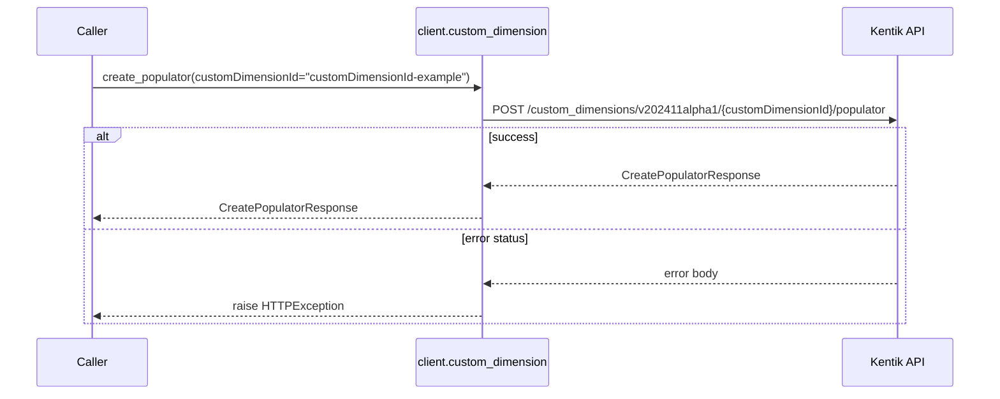

#### Parameters

| Name | In | Type | Required |
| --- | --- | --- | --- |
| `customDimensionId` | path | `string` | Yes |
| `data` | body | `-` | No |

#### Responses

| Status | Description | Model |
| --- | --- | --- |
| 200 | A successful response. | `CreatePopulatorResponse` |
| default | An unexpected error response. | `rpcStatus` |

#### Example

```python
from kentik_api.client import KentikAPI

client = KentikAPI(protocol="rest")  # loads KENTIK_EMAIL/KENTIK_API_TOKEN from .env
response = client.custom_dimension.create_populator(
    customDimensionId="customDimensionId-example",
)
```

---

### `GET` `/custom_dimensions/v202411alpha1/{customDimensionId}/populator/{populatorId}`

Get Populator

Get Populator by Dimension and Populator ID.

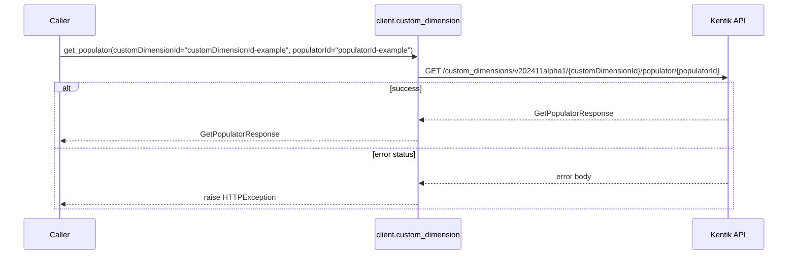

#### Parameters

| Name | In | Type | Required |
| --- | --- | --- | --- |
| `customDimensionId` | path | `string` | Yes |
| `populatorId` | path | `string` | Yes |
| `fieldLimit` | query | `integer (int64)` | No |

#### Responses

| Status | Description | Model |
| --- | --- | --- |
| 200 | A successful response. | `GetPopulatorResponse` |
| default | An unexpected error response. | `rpcStatus` |

#### Example

```python
from kentik_api.client import KentikAPI

client = KentikAPI(protocol="rest")  # loads KENTIK_EMAIL/KENTIK_API_TOKEN from .env
response = client.custom_dimension.get_populator(
    customDimensionId="customDimensionId-example",
    populatorId="populatorId-example",
)
```

---

### `PUT` `/custom_dimensions/v202411alpha1/{customDimensionId}/populator/{populatorId}`

Update Populator

Updates and returns a populator object containing information about an individual populator.

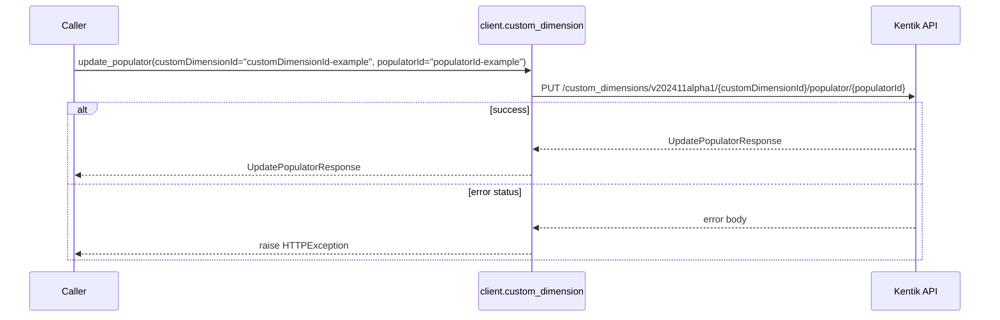

#### Parameters

| Name | In | Type | Required |
| --- | --- | --- | --- |
| `customDimensionId` | path | `string` | Yes |
| `populatorId` | path | `string` | Yes |
| `data` | body | `-` | No |

#### Responses

| Status | Description | Model |
| --- | --- | --- |
| 200 | A successful response. | `UpdatePopulatorResponse` |
| default | An unexpected error response. | `rpcStatus` |

#### Example

```python
from kentik_api.client import KentikAPI

client = KentikAPI(protocol="rest")  # loads KENTIK_EMAIL/KENTIK_API_TOKEN from .env
response = client.custom_dimension.update_populator(
    customDimensionId="customDimensionId-example",
    populatorId="populatorId-example",
)
```

---

### `DELETE` `/custom_dimensions/v202411alpha1/{customDimensionId}/populator/{populatorId}`

Delete Populator

Deletes a populator.

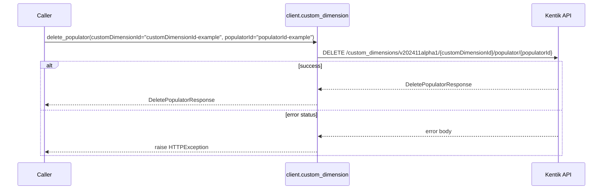

#### Parameters

| Name | In | Type | Required |
| --- | --- | --- | --- |
| `customDimensionId` | path | `string` | Yes |
| `populatorId` | path | `string` | Yes |

#### Responses

| Status | Description | Model |
| --- | --- | --- |
| 200 | A successful response. | `DeletePopulatorResponse` |
| default | An unexpected error response. | `rpcStatus` |

#### Example

```python
from kentik_api.client import KentikAPI

client = KentikAPI(protocol="rest")  # loads KENTIK_EMAIL/KENTIK_API_TOKEN from .env
response = client.custom_dimension.delete_populator(
    customDimensionId="customDimensionId-example",
    populatorId="populatorId-example",
)
```

---

### `GET` `/custom_dimensions/v202411alpha1/{customDimensionId}/populator/{populatorId}/field/{fieldName}`

Get Populator Field

Get Populator field by Dimension, Populator ID, and field name.

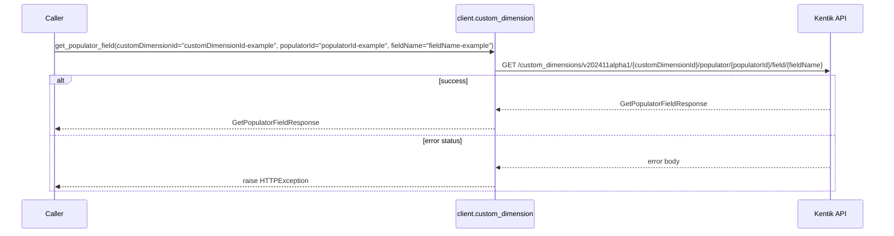

#### Parameters

| Name | In | Type | Required |
| --- | --- | --- | --- |
| `customDimensionId` | path | `string` | Yes |
| `populatorId` | path | `string` | Yes |
| `fieldName` | path | `string` | Yes |
| `offset` | query | `integer (int32)` | No |
| `limit` | query | `integer (int32)` | No |

#### Responses

| Status | Description | Model |
| --- | --- | --- |
| 200 | A successful response. | `GetPopulatorFieldResponse` |
| default | An unexpected error response. | `rpcStatus` |

#### Example

```python
from kentik_api.client import KentikAPI

client = KentikAPI(protocol="rest")  # loads KENTIK_EMAIL/KENTIK_API_TOKEN from .env
response = client.custom_dimension.get_populator_field(
    customDimensionId="customDimensionId-example",
    populatorId="populatorId-example",
    fieldName="fieldName-example",
)
```

---

### `POST` `/v1/customdimension`

Create Custom Dimension

Creates and returns a custom dimension object containing information about an individual custom dimension

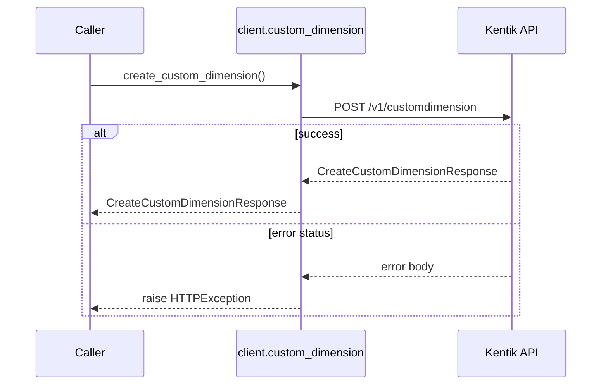

#### Parameters

| Name | In | Type | Required |
| --- | --- | --- | --- |
| `data` | body | `-` | No |

#### Responses

| Status | Description | Model |
| --- | --- | --- |
| 200 | A successful response. | `CreateCustomDimensionResponse` |
| default | An unexpected error response. | `rpcStatus` |

#### Example

```python
from kentik_api.client import KentikAPI

client = KentikAPI(protocol="rest")  # loads KENTIK_EMAIL/KENTIK_API_TOKEN from .env
response = client.custom_dimension.create_custom_dimension()
```

## Data Models

<details>
<summary>Model relationships (14 of 15 models)</summary>

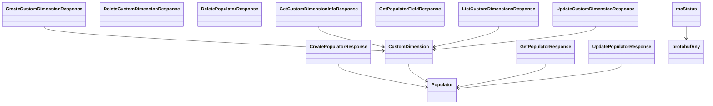

</details>

```{eval-rst}
.. autopydantic_model:: kentik_api.gen.custom_dimension.models.CreateCustomDimensionResponse
```

```{eval-rst}
.. autopydantic_model:: kentik_api.gen.custom_dimension.models.CreatePopulatorResponse
```

```{eval-rst}
.. autopydantic_model:: kentik_api.gen.custom_dimension.models.CustomDimension
```

```{eval-rst}
.. autopydantic_model:: kentik_api.gen.custom_dimension.models.DeleteCustomDimensionResponse
```

```{eval-rst}
.. autopydantic_model:: kentik_api.gen.custom_dimension.models.DeletePopulatorResponse
```

```{eval-rst}
.. autopydantic_model:: kentik_api.gen.custom_dimension.models.ExtendedField
```

```{eval-rst}
.. autopydantic_model:: kentik_api.gen.custom_dimension.models.GetCustomDimensionInfoResponse
```

```{eval-rst}
.. autopydantic_model:: kentik_api.gen.custom_dimension.models.GetPopulatorFieldResponse
```

```{eval-rst}
.. autopydantic_model:: kentik_api.gen.custom_dimension.models.GetPopulatorResponse
```

```{eval-rst}
.. autopydantic_model:: kentik_api.gen.custom_dimension.models.ListCustomDimensionsResponse
```

```{eval-rst}
.. autopydantic_model:: kentik_api.gen.custom_dimension.models.Populator
```

```{eval-rst}
.. autopydantic_model:: kentik_api.gen.custom_dimension.models.UpdateCustomDimensionResponse
```

```{eval-rst}
.. autopydantic_model:: kentik_api.gen.custom_dimension.models.UpdatePopulatorResponse
```

```{eval-rst}
.. autopydantic_model:: kentik_api.gen.custom_dimension.models.protobufAny
```

```{eval-rst}
.. autopydantic_model:: kentik_api.gen.custom_dimension.models.rpcStatus
```
