# Device Service

## Overview

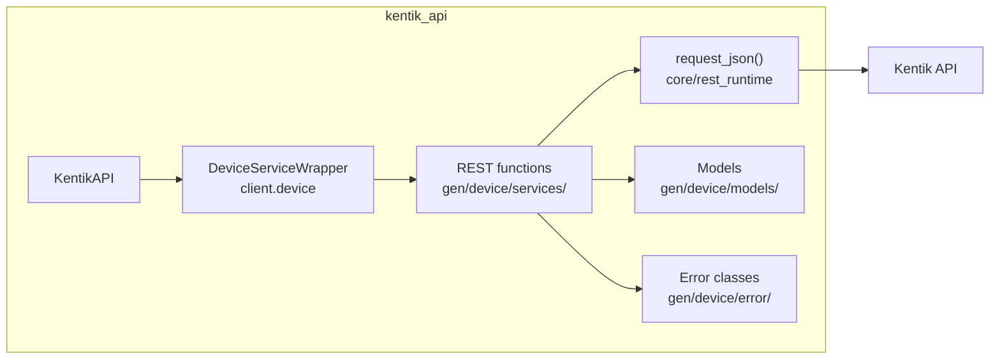

## Endpoints

### `GET` `/device/v202504beta2/device`

List all devices.

Returns list of configured devices. Use the 'view' parameter to control response detail: FULL (default), BASIC (id, name, status), or ID_ONLY (id only). See [About Devices](https://kb.kentik.com/v4/Cb01.htm).

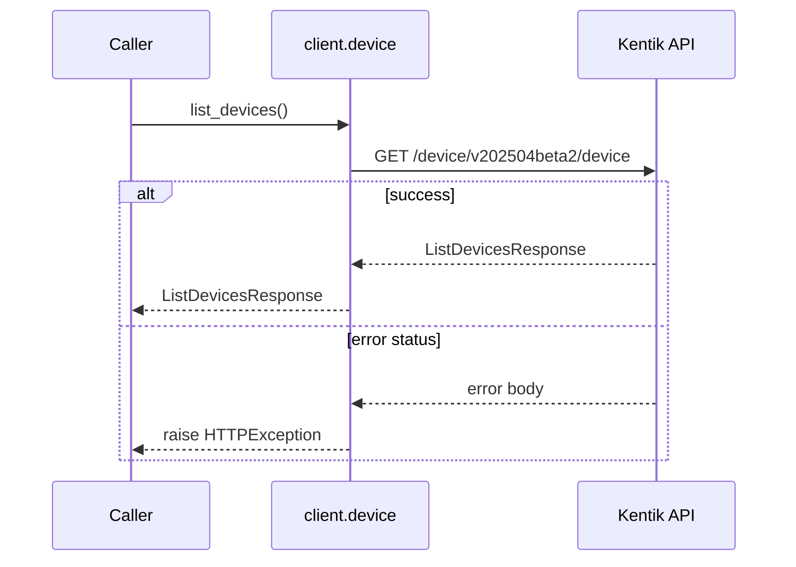

#### Parameters

| Name | In | Type | Required |
| --- | --- | --- | --- |
| `querynoCustomColumns` | query | `boolean` | No |
| `view` | query | `string` | No |

#### Responses

| Status | Description | Model |
| --- | --- | --- |
| 200 | A successful response. | `ListDevicesResponse` |
| default | An unexpected error response. | `rpcStatus` |

#### Example

```python
from kentik_api.client import KentikAPI

# Use protocol="grpc" to route through gRPC instead of REST.
# See docs/source/grpc_implementation_spec.md for current gRPC status.
client = KentikAPI(protocol="rest")  # loads KENTIK_EMAIL/KENTIK_API_TOKEN from .env
response = client.device.list_devices()
```

---

### `POST` `/device/v202504beta2/device`

Configure a new device.

Create configuration for a new device. Returns the newly created configuration (see [About Devices](https://kb.kentik.com/v4/Cb01.htm)).

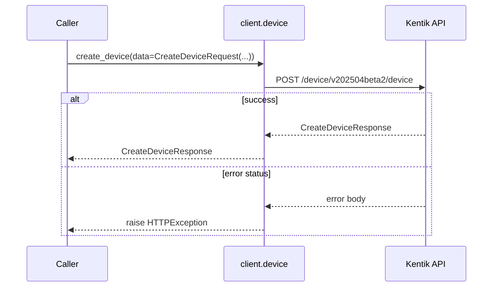

#### Parameters

| Name | In | Type | Required |
| --- | --- | --- | --- |
| `data` | body | `CreateDeviceRequest` | Yes |

#### Responses

| Status | Description | Model |
| --- | --- | --- |
| 200 | A successful response. | `CreateDeviceResponse` |
| default | An unexpected error response. | `rpcStatus` |

#### Example

```python
from kentik_api.client import KentikAPI

# Use protocol="grpc" to route through gRPC instead of REST.
# See docs/source/grpc_implementation_spec.md for current gRPC status.
client = KentikAPI(protocol="rest")  # loads KENTIK_EMAIL/KENTIK_API_TOKEN from .env
response = client.device.create_device(
    data=CreateDeviceRequest(...),
)
```

---

### `POST` `/device/v202504beta2/device/batch_create`

Configure multiple devices (max 100).

Create configuration for multiple devices. Returns the newly created configurations (see [About Devices](https://kb.kentik.com/v4/Cb01.htm)).

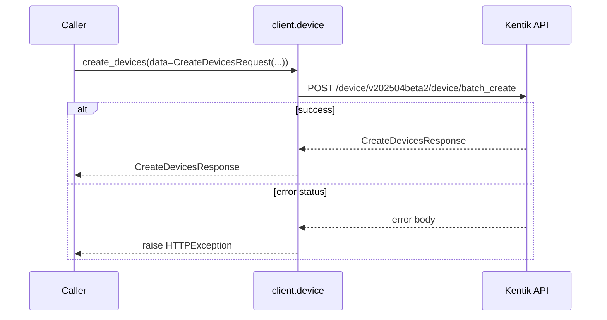

#### Parameters

| Name | In | Type | Required |
| --- | --- | --- | --- |
| `data` | body | `CreateDevicesRequest` | Yes |

#### Responses

| Status | Description | Model |
| --- | --- | --- |
| 200 | A successful response. | `CreateDevicesResponse` |
| default | An unexpected error response. | `rpcStatus` |

#### Example

```python
from kentik_api.client import KentikAPI

# Use protocol="grpc" to route through gRPC instead of REST.
# See docs/source/grpc_implementation_spec.md for current gRPC status.
client = KentikAPI(protocol="rest")  # loads KENTIK_EMAIL/KENTIK_API_TOKEN from .env
response = client.device.create_devices(
    data=CreateDevicesRequest(...),
)
```

---

### `POST` `/device/v202504beta2/device/batch_delete`

Delete configuration of multiple devices.

Deletes configuration of multiple devices with specific IDs (see [About Devices](https://kb.kentik.com/v4/Cb01.htm)).

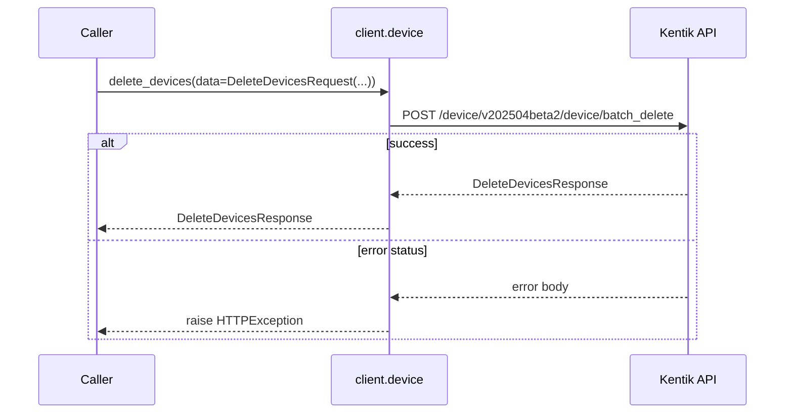

#### Parameters

| Name | In | Type | Required |
| --- | --- | --- | --- |
| `data` | body | `DeleteDevicesRequest` | Yes |

#### Responses

| Status | Description | Model |
| --- | --- | --- |
| 200 | A successful response. | `DeleteDevicesResponse` |
| default | An unexpected error response. | `rpcStatus` |

#### Example

```python
from kentik_api.client import KentikAPI

# Use protocol="grpc" to route through gRPC instead of REST.
# See docs/source/grpc_implementation_spec.md for current gRPC status.
client = KentikAPI(protocol="rest")  # loads KENTIK_EMAIL/KENTIK_API_TOKEN from .env
response = client.device.delete_devices(
    data=DeleteDevicesRequest(...),
)
```

---

### `PUT` `/device/v202504beta2/device/batch_update`

Updates configuration of multiple devices (max 100).

Replaces configuration of multiple devices with attributes in the request. Returns the updated configurations (see [About Devices](https://kb.kentik.com/v4/Cb01.htm)).

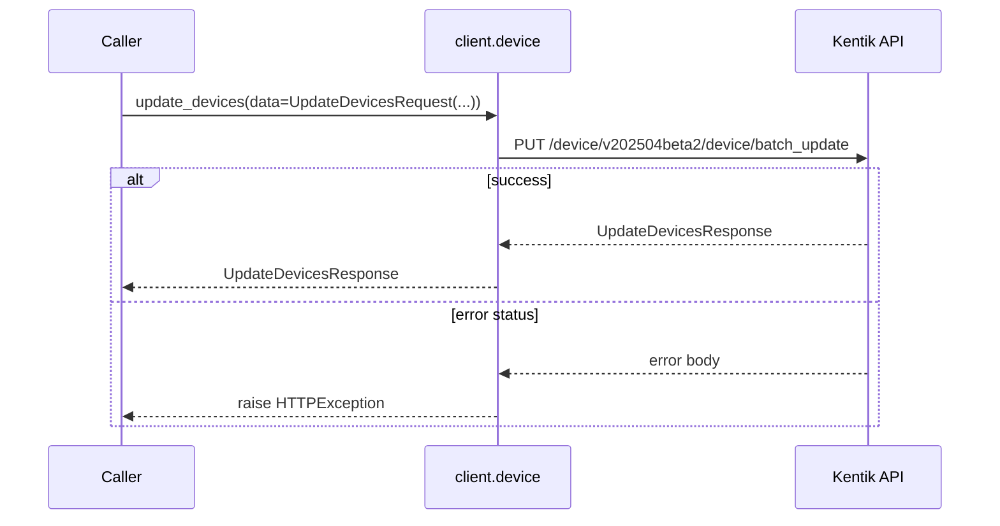

#### Parameters

| Name | In | Type | Required |
| --- | --- | --- | --- |
| `data` | body | `UpdateDevicesRequest` | Yes |

#### Responses

| Status | Description | Model |
| --- | --- | --- |
| 200 | A successful response. | `UpdateDevicesResponse` |
| default | An unexpected error response. | `rpcStatus` |

#### Example

```python
from kentik_api.client import KentikAPI

# Use protocol="grpc" to route through gRPC instead of REST.
# See docs/source/grpc_implementation_spec.md for current gRPC status.
client = KentikAPI(protocol="rest")  # loads KENTIK_EMAIL/KENTIK_API_TOKEN from .env
response = client.device.update_devices(
    data=UpdateDevicesRequest(...),
)
```

---

### `GET` `/device/v202504beta2/device/name/{deviceName}`

Retrieve configuration of a device by name.

Returns configuration of a device specified by name (see [About Devices](https://kb.kentik.com/v4/Cb01.htm)).

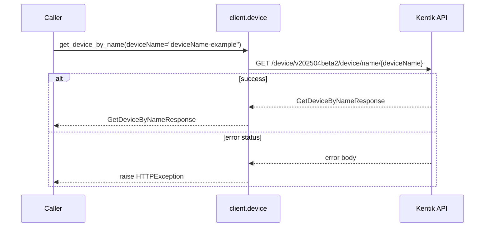

#### Parameters

| Name | In | Type | Required |
| --- | --- | --- | --- |
| `deviceName` | path | `string` | Yes |
| `querynoCustomColumns` | query | `boolean` | No |

#### Responses

| Status | Description | Model |
| --- | --- | --- |
| 200 | A successful response. | `GetDeviceByNameResponse` |
| default | An unexpected error response. | `rpcStatus` |

#### Example

```python
from kentik_api.client import KentikAPI

# Use protocol="grpc" to route through gRPC instead of REST.
# See docs/source/grpc_implementation_spec.md for current gRPC status.
client = KentikAPI(protocol="rest")  # loads KENTIK_EMAIL/KENTIK_API_TOKEN from .env
response = client.device.get_device_by_name(
    deviceName="deviceName-example",
)
```

---

### `GET` `/device/v202504beta2/device/{device.id}`

Retrieve configuration of a device.

Returns configuration of a device specified by ID (see [About Devices](https://kb.kentik.com/v4/Cb01.htm)).

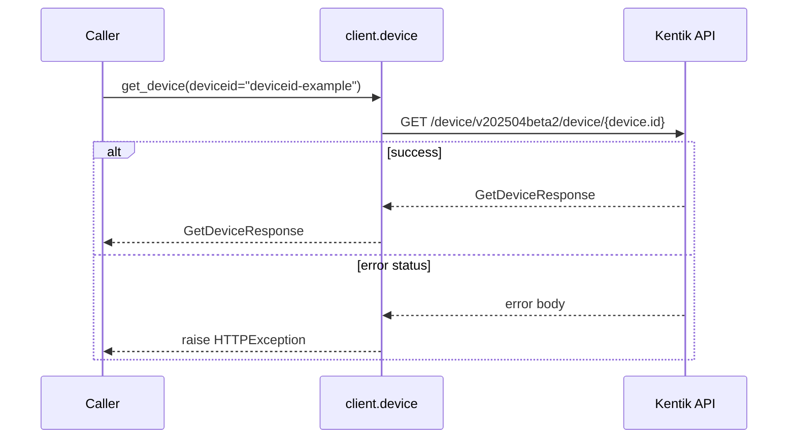

#### Parameters

| Name | In | Type | Required |
| --- | --- | --- | --- |
| `deviceid` | path | `string` | Yes |
| `querynoCustomColumns` | query | `boolean` | No |

#### Responses

| Status | Description | Model |
| --- | --- | --- |
| 200 | A successful response. | `GetDeviceResponse` |
| default | An unexpected error response. | `rpcStatus` |

#### Example

```python
from kentik_api.client import KentikAPI

# Use protocol="grpc" to route through gRPC instead of REST.
# See docs/source/grpc_implementation_spec.md for current gRPC status.
client = KentikAPI(protocol="rest")  # loads KENTIK_EMAIL/KENTIK_API_TOKEN from .env
response = client.device.get_device(
    deviceid="deviceid-example",
)
```

---

### `PUT` `/device/v202504beta2/device/{device.id}`

Updates configuration of a device.

Replaces configuration of a device with attributes in the request. Returns the updated configuration (see [About Devices](https://kb.kentik.com/v4/Cb01.htm)).

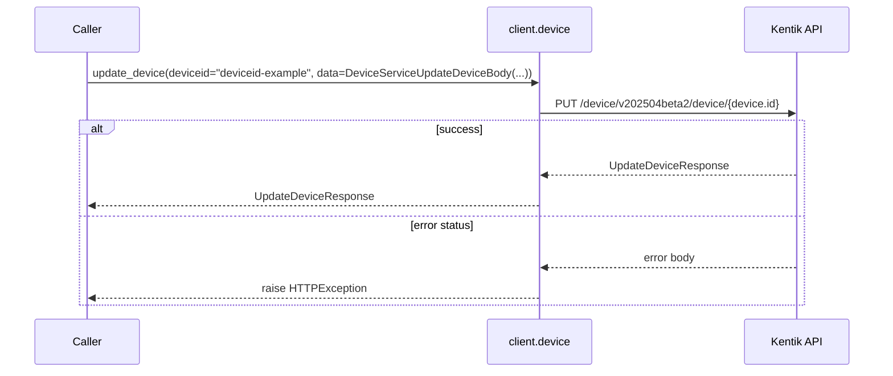

#### Parameters

| Name | In | Type | Required |
| --- | --- | --- | --- |
| `deviceid` | path | `string` | Yes |
| `data` | body | `DeviceServiceUpdateDeviceBody` | Yes |

#### Responses

| Status | Description | Model |
| --- | --- | --- |
| 200 | A successful response. | `UpdateDeviceResponse` |
| default | An unexpected error response. | `rpcStatus` |

#### Example

```python
from kentik_api.client import KentikAPI

# Use protocol="grpc" to route through gRPC instead of REST.
# See docs/source/grpc_implementation_spec.md for current gRPC status.
client = KentikAPI(protocol="rest")  # loads KENTIK_EMAIL/KENTIK_API_TOKEN from .env
response = client.device.update_device(
    deviceid="deviceid-example",
    data=DeviceServiceUpdateDeviceBody(...),
)
```

---

### `DELETE` `/device/v202504beta2/device/{device.id}`

Delete configuration of a device.

Deletes configuration of a device with specific ID (see [About Devices](https://kb.kentik.com/v4/Cb01.htm)).

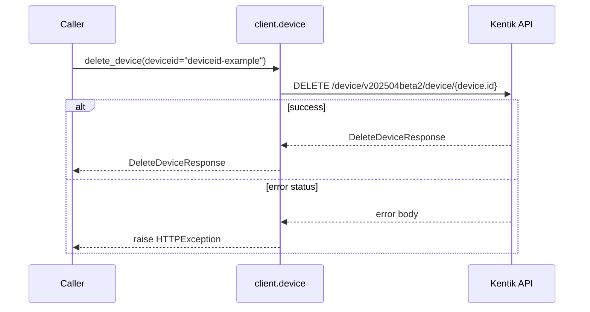

#### Parameters

| Name | In | Type | Required |
| --- | --- | --- | --- |
| `deviceid` | path | `string` | Yes |

#### Responses

| Status | Description | Model |
| --- | --- | --- |
| 200 | A successful response. | `DeleteDeviceResponse` |
| default | An unexpected error response. | `rpcStatus` |

#### Example

```python
from kentik_api.client import KentikAPI

# Use protocol="grpc" to route through gRPC instead of REST.
# See docs/source/grpc_implementation_spec.md for current gRPC status.
client = KentikAPI(protocol="rest")  # loads KENTIK_EMAIL/KENTIK_API_TOKEN from .env
response = client.device.delete_device(
    deviceid="deviceid-example",
)
```

---

### `PUT` `/device/v202504beta2/device/{id}/labels`

Updates labels of a device.

Removes all existing labels from the device and applies the device labels (see [About Device Labels](https://kb.kentik.com/v4/Cb16.htm)) specified by id. Returns the updated configuration.


#### Parameters

| Name | In | Type | Required |
| --- | --- | --- | --- |
| `id` | path | `string` | Yes |
| `data` | body | `DeviceServiceUpdateDeviceLabelsBody` | Yes |

#### Responses

| Status | Description | Model |
| --- | --- | --- |
| 200 | A successful response. | `UpdateDeviceLabelsResponse` |
| default | An unexpected error response. | `rpcStatus` |

#### Example

```python
from kentik_api.client import KentikAPI

# Use protocol="grpc" to route through gRPC instead of REST.
# See docs/source/grpc_implementation_spec.md for current gRPC status.
client = KentikAPI(protocol="rest")  # loads KENTIK_EMAIL/KENTIK_API_TOKEN from .env
response = client.device.update_device_labels(
    id="id-example",
    data=DeviceServiceUpdateDeviceLabelsBody(...),
)
```

## Data Models

<details>
<summary>Model relationships (21 of 33 models)</summary>

```mermaid
classDiagram
    class CreateDeviceRequest
    class CreateDeviceResponse
    class CreateDevicesRequest
    class CreateDevicesResponse
    class DeleteDeviceResponse
    class DeleteDevicesRequest
    class DeleteDevicesResponse
    class DeviceConcise
    class DeviceDetailed
    class DeviceServiceUpdateDeviceBody
    class DeviceServiceUpdateDeviceLabelsBody
    class GetDeviceByNameResponse
    class GetDeviceResponse
    class LabelConcise
    class ListDevicesResponse
    class UpdateDeviceLabelsResponse
    class UpdateDeviceResponse
    class UpdateDevicesRequest
    class UpdateDevicesResponse
    class protobufAny
    class rpcStatus
    CreateDeviceRequest --> DeviceConcise
    CreateDeviceResponse --> DeviceDetailed
    CreateDevicesRequest --> DeviceConcise
    CreateDevicesResponse --> DeviceDetailed
    DeviceServiceUpdateDeviceLabelsBody --> LabelConcise
    GetDeviceByNameResponse --> DeviceDetailed
    GetDeviceResponse --> DeviceDetailed
    ListDevicesResponse --> DeviceDetailed
    UpdateDeviceLabelsResponse --> DeviceDetailed
    UpdateDeviceResponse --> DeviceDetailed
    UpdateDevicesRequest --> DeviceConcise
    UpdateDevicesResponse --> DeviceDetailed
    rpcStatus --> protobufAny
```

</details>

```{eval-rst}
.. autopydantic_model:: kentik_api.gen.device.models.CreateDeviceRequest
```

```{eval-rst}
.. autopydantic_model:: kentik_api.gen.device.models.CreateDeviceResponse
```

```{eval-rst}
.. autopydantic_model:: kentik_api.gen.device.models.CreateDevicesRequest
```

```{eval-rst}
.. autopydantic_model:: kentik_api.gen.device.models.CreateDevicesResponse
```

```{eval-rst}
.. autopydantic_model:: kentik_api.gen.device.models.CustomColumnData
```

```{eval-rst}
.. autopydantic_model:: kentik_api.gen.device.models.DeleteDeviceResponse
```

```{eval-rst}
.. autopydantic_model:: kentik_api.gen.device.models.DeleteDevicesRequest
```

```{eval-rst}
.. autopydantic_model:: kentik_api.gen.device.models.DeleteDevicesResponse
```

```{eval-rst}
.. autopydantic_model:: kentik_api.gen.device.models.DeviceConcise
```

```{eval-rst}
.. autopydantic_model:: kentik_api.gen.device.models.DeviceDetailed
```

```{eval-rst}
.. autopydantic_model:: kentik_api.gen.device.models.DeviceNmsConfig
```

```{eval-rst}
.. autopydantic_model:: kentik_api.gen.device.models.DeviceNmsSnmpConfig
```

```{eval-rst}
.. autopydantic_model:: kentik_api.gen.device.models.DeviceNmsStConfig
```

```{eval-rst}
.. autopydantic_model:: kentik_api.gen.device.models.DeviceQuery
```

```{eval-rst}
.. autopydantic_model:: kentik_api.gen.device.models.DeviceServiceUpdateDeviceBody
```

```{eval-rst}
.. autopydantic_model:: kentik_api.gen.device.models.DeviceServiceUpdateDeviceLabelsBody
```

```{eval-rst}
.. autopydantic_model:: kentik_api.gen.device.models.DeviceSnmpV3Conf
```

```{eval-rst}
.. autoclass:: kentik_api.gen.device.models.DeviceView
   :members:
```

```{eval-rst}
.. autopydantic_model:: kentik_api.gen.device.models.GetDeviceByNameResponse
```

```{eval-rst}
.. autopydantic_model:: kentik_api.gen.device.models.GetDeviceResponse
```

```{eval-rst}
.. autopydantic_model:: kentik_api.gen.device.models.GnmiV1Conf
```

```{eval-rst}
.. autopydantic_model:: kentik_api.gen.device.models.Interface
```

```{eval-rst}
.. autopydantic_model:: kentik_api.gen.device.models.LabelConcise
```

```{eval-rst}
.. autopydantic_model:: kentik_api.gen.device.models.ListDevicesResponse
```

```{eval-rst}
.. autopydantic_model:: kentik_api.gen.device.models.Plan
```

```{eval-rst}
.. autopydantic_model:: kentik_api.gen.device.models.Site
```

```{eval-rst}
.. autopydantic_model:: kentik_api.gen.device.models.UpdateDeviceLabelsResponse
```

```{eval-rst}
.. autopydantic_model:: kentik_api.gen.device.models.UpdateDeviceResponse
```

```{eval-rst}
.. autopydantic_model:: kentik_api.gen.device.models.UpdateDevicesRequest
```

```{eval-rst}
.. autopydantic_model:: kentik_api.gen.device.models.UpdateDevicesResponse
```

```{eval-rst}
.. autopydantic_model:: kentik_api.gen.device.models.devicev202504beta2Label
```

```{eval-rst}
.. autopydantic_model:: kentik_api.gen.device.models.protobufAny
```

```{eval-rst}
.. autopydantic_model:: kentik_api.gen.device.models.rpcStatus
```
