# Deviceconf Service

## Endpoints

This service's schema defines shared types only -- no REST endpoints.

## Data Models

```mermaid
classDiagram
    class AclAction
    class AclMode
    class CommandAcl
    class CommandResult
    class CommitDetails
    class ConfigEncoding
    class DeleteDeviceConfigurationResponse
    class Device
    class DeviceCommand
    class DevicePlatform
    class DeviceSSHCreds
    class ExecuteCommandResponse
    class FetchParameters
    class GetCommandAclsResponse
    class GetDeviceAssignmentsResponse
    class GetDeviceConfigurationResponse
    class GetLatestDeviceConfigurationsResponse
    class ListDeviceConfigurationRevisionsResponse
    class MessageSignature
    class RequestDeviceConfigurationFetchResponse
    class Revision
    class SignatureAlgorithm
    class Snapshot
    class UpdateCommandAclsResponse
    class UpdateDeviceConfigurationResponse
    class protobufAny
    class rpcStatus
    CommandAcl --> AclAction
    CommandAcl --> AclMode
    Device --> DevicePlatform
    Device --> DeviceSSHCreds
    Device --> FetchParameters
    ExecuteCommandResponse --> CommandResult
    GetCommandAclsResponse --> CommandAcl
    GetDeviceAssignmentsResponse --> Device
    GetDeviceConfigurationResponse --> Snapshot
    ListDeviceConfigurationRevisionsResponse --> Revision
    MessageSignature --> SignatureAlgorithm
    Snapshot --> CommitDetails
    Snapshot --> ConfigEncoding
    Snapshot --> DevicePlatform
    Snapshot --> Revision
    rpcStatus --> protobufAny
```

<details>
<summary>Model relationships (27 of 27 models)</summary>



</details>

```{eval-rst}
.. autoclass:: kentik_api.gen.deviceconf.models.AclAction
   :members:
```

```{eval-rst}
.. autoclass:: kentik_api.gen.deviceconf.models.AclMode
   :members:
```

```{eval-rst}
.. autopydantic_model:: kentik_api.gen.deviceconf.models.CommandAcl
```

```{eval-rst}
.. autopydantic_model:: kentik_api.gen.deviceconf.models.CommandResult
```

```{eval-rst}
.. autopydantic_model:: kentik_api.gen.deviceconf.models.CommitDetails
```

```{eval-rst}
.. autoclass:: kentik_api.gen.deviceconf.models.ConfigEncoding
   :members:
```

```{eval-rst}
.. autopydantic_model:: kentik_api.gen.deviceconf.models.DeleteDeviceConfigurationResponse
```

```{eval-rst}
.. autopydantic_model:: kentik_api.gen.deviceconf.models.Device
```

```{eval-rst}
.. autopydantic_model:: kentik_api.gen.deviceconf.models.DeviceCommand
```

```{eval-rst}
.. autoclass:: kentik_api.gen.deviceconf.models.DevicePlatform
   :members:
```

```{eval-rst}
.. autopydantic_model:: kentik_api.gen.deviceconf.models.DeviceSSHCreds
```

```{eval-rst}
.. autopydantic_model:: kentik_api.gen.deviceconf.models.ExecuteCommandResponse
```

```{eval-rst}
.. autopydantic_model:: kentik_api.gen.deviceconf.models.FetchParameters
```

```{eval-rst}
.. autopydantic_model:: kentik_api.gen.deviceconf.models.GetCommandAclsResponse
```

```{eval-rst}
.. autopydantic_model:: kentik_api.gen.deviceconf.models.GetDeviceAssignmentsResponse
```

```{eval-rst}
.. autopydantic_model:: kentik_api.gen.deviceconf.models.GetDeviceConfigurationResponse
```

```{eval-rst}
.. autopydantic_model:: kentik_api.gen.deviceconf.models.GetLatestDeviceConfigurationsResponse
```

```{eval-rst}
.. autopydantic_model:: kentik_api.gen.deviceconf.models.ListDeviceConfigurationRevisionsResponse
```

```{eval-rst}
.. autopydantic_model:: kentik_api.gen.deviceconf.models.MessageSignature
```

```{eval-rst}
.. autopydantic_model:: kentik_api.gen.deviceconf.models.RequestDeviceConfigurationFetchResponse
```

```{eval-rst}
.. autopydantic_model:: kentik_api.gen.deviceconf.models.Revision
```

```{eval-rst}
.. autoclass:: kentik_api.gen.deviceconf.models.SignatureAlgorithm
   :members:
```

```{eval-rst}
.. autopydantic_model:: kentik_api.gen.deviceconf.models.Snapshot
```

```{eval-rst}
.. autopydantic_model:: kentik_api.gen.deviceconf.models.UpdateCommandAclsResponse
```

```{eval-rst}
.. autopydantic_model:: kentik_api.gen.deviceconf.models.UpdateDeviceConfigurationResponse
```

```{eval-rst}
.. autopydantic_model:: kentik_api.gen.deviceconf.models.protobufAny
```

```{eval-rst}
.. autopydantic_model:: kentik_api.gen.deviceconf.models.rpcStatus
```
