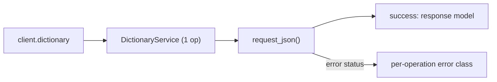
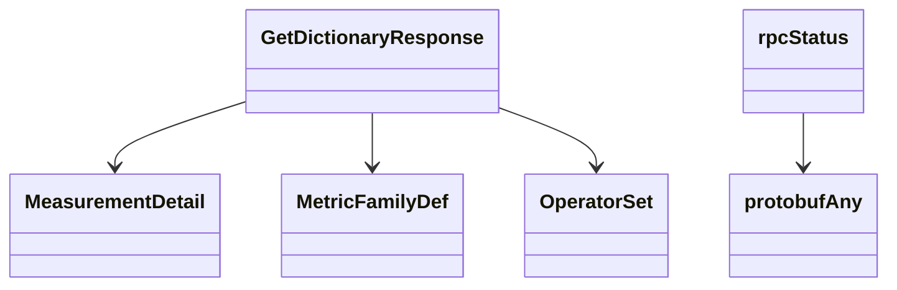

# Dictionary Service

## Overview



## Endpoints

### `GET` `/dictionary/v20260604alpha1`

Get Dictionary

Returns the full UDE dictionary for the authenticated company, including all measurements with their dimension and metric fields, operator sets, and metric family definitions.

#### Responses

| Status | Description | Model |
| --- | --- | --- |
| 200 | A successful response. | `GetDictionaryResponse` |
| default | An unexpected error response. | `rpcStatus` |

#### Example

```python
from kentik_api.client import KentikAPI

client = KentikAPI()  # loads KENTIK_EMAIL/KENTIK_API_TOKEN from .env
response = client.dictionary.get_dictionary()
```

## Data Models

<details>
<summary>Model relationships (6 of 15 models)</summary>



</details>

```{eval-rst}
.. autoclass:: kentik_api.gen.dictionary.models.BaseUnit
   :members:
```

```{eval-rst}
.. autopydantic_model:: kentik_api.gen.dictionary.models.DimensionField
```

```{eval-rst}
.. autoclass:: kentik_api.gen.dictionary.models.FieldDataType
   :members:
```

```{eval-rst}
.. autoclass:: kentik_api.gen.dictionary.models.FieldDirection
   :members:
```

```{eval-rst}
.. autopydantic_model:: kentik_api.gen.dictionary.models.GetDictionaryResponse
```

```{eval-rst}
.. autopydantic_model:: kentik_api.gen.dictionary.models.MeasurementDetail
```

```{eval-rst}
.. autoclass:: kentik_api.gen.dictionary.models.MeasurementFamily
   :members:
```

```{eval-rst}
.. autopydantic_model:: kentik_api.gen.dictionary.models.MetricFamilyDef
```

```{eval-rst}
.. autopydantic_model:: kentik_api.gen.dictionary.models.MetricField
```

```{eval-rst}
.. autoclass:: kentik_api.gen.dictionary.models.MetricQuantity
   :members:
```

```{eval-rst}
.. autopydantic_model:: kentik_api.gen.dictionary.models.Operator
```

```{eval-rst}
.. autopydantic_model:: kentik_api.gen.dictionary.models.OperatorSet
```

```{eval-rst}
.. autoclass:: kentik_api.gen.dictionary.models.OperatorSetKey
   :members:
```

```{eval-rst}
.. autopydantic_model:: kentik_api.gen.dictionary.models.protobufAny
```

```{eval-rst}
.. autopydantic_model:: kentik_api.gen.dictionary.models.rpcStatus
```
