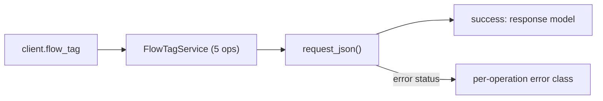
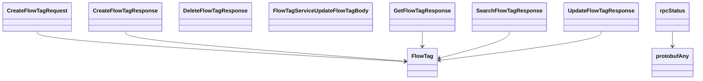

# Flow Tag Service

## Overview



## Endpoints

### `GET` `/flow_tag/v202404alpha1/tag`

Search flow tag configuration.

Returns configuration of flow tag with search parameters.

#### Parameters

| Name | In | Type | Required |
| --- | --- | --- | --- |
| `searchlimit` | query | `integer (int32)` | No |
| `searchoffset` | query | `integer (int32)` | No |
| `searchlookupFields` | query | `string[]` | No |
| `searchlookupValues` | query | `string[]` | No |
| `searchfieldLimit` | query | `integer (int32)` | No |

#### Responses

| Status | Description | Model |
| --- | --- | --- |
| 200 | A successful response. | `SearchFlowTagResponse` |
| default | An unexpected error response. | `rpcStatus` |

#### Example

```python
from kentik_api.client import KentikAPI

client = KentikAPI()  # loads KENTIK_EMAIL/KENTIK_API_TOKEN from .env
response = client.flow_tag.search_flow_tag()
```

---

### `POST` `/flow_tag/v202404alpha1/tag`

Create flow tag configuration.

Create a flow tag configuration.

#### Parameters

| Name | In | Type | Required |
| --- | --- | --- | --- |
| `data` | body | `CreateFlowTagRequest` | Yes |

#### Responses

| Status | Description | Model |
| --- | --- | --- |
| 200 | A successful response. | `CreateFlowTagResponse` |
| default | An unexpected error response. | `rpcStatus` |

#### Example

```python
from kentik_api.client import KentikAPI

client = KentikAPI()  # loads KENTIK_EMAIL/KENTIK_API_TOKEN from .env
response = client.flow_tag.create_flow_tag(
    data=CreateFlowTagRequest(...),
)
```

---

### `GET` `/flow_tag/v202404alpha1/tag/{flowTag.id}`

Get flow tag configuration.

Returns configuration of flow tag with specified ID.

#### Parameters

| Name | In | Type | Required |
| --- | --- | --- | --- |
| `flowTagid` | path | `string` | Yes |

#### Responses

| Status | Description | Model |
| --- | --- | --- |
| 200 | A successful response. | `GetFlowTagResponse` |
| default | An unexpected error response. | `rpcStatus` |

#### Example

```python
from kentik_api.client import KentikAPI

client = KentikAPI()  # loads KENTIK_EMAIL/KENTIK_API_TOKEN from .env
response = client.flow_tag.get_flow_tag(
    flowTagid="flowTagid-example",
)
```

---

### `PUT` `/flow_tag/v202404alpha1/tag/{flowTag.id}`

Update flow tag configuration.

Update a flow tag configuration.

#### Parameters

| Name | In | Type | Required |
| --- | --- | --- | --- |
| `flowTagid` | path | `string` | Yes |
| `data` | body | `FlowTagServiceUpdateFlowTagBody` | Yes |

#### Responses

| Status | Description | Model |
| --- | --- | --- |
| 200 | A successful response. | `UpdateFlowTagResponse` |
| default | An unexpected error response. | `rpcStatus` |

#### Example

```python
from kentik_api.client import KentikAPI

client = KentikAPI()  # loads KENTIK_EMAIL/KENTIK_API_TOKEN from .env
response = client.flow_tag.update_flow_tag(
    flowTagid="flowTagid-example",
    data=FlowTagServiceUpdateFlowTagBody(...),
)
```

---

### `DELETE` `/flow_tag/v202404alpha1/tag/{flowTag.id}`

Delete flow tag configuration.

Delete a flow tag configuration with id.

#### Parameters

| Name | In | Type | Required |
| --- | --- | --- | --- |
| `flowTagid` | path | `string` | Yes |

#### Responses

| Status | Description | Model |
| --- | --- | --- |
| 200 | A successful response. | `DeleteFlowTagResponse` |
| default | An unexpected error response. | `rpcStatus` |

#### Example

```python
from kentik_api.client import KentikAPI

client = KentikAPI()  # loads KENTIK_EMAIL/KENTIK_API_TOKEN from .env
response = client.flow_tag.delete_flow_tag(
    flowTagid="flowTagid-example",
)
```

## Data Models

<details>
<summary>Model relationships (10 of 15 models)</summary>



</details>

```{eval-rst}
.. autopydantic_model:: kentik_api.gen.flow_tag.models.AddressInfo
```

```{eval-rst}
.. autopydantic_model:: kentik_api.gen.flow_tag.models.CreateFlowTagRequest
```

```{eval-rst}
.. autopydantic_model:: kentik_api.gen.flow_tag.models.CreateFlowTagResponse
```

```{eval-rst}
.. autopydantic_model:: kentik_api.gen.flow_tag.models.DeleteFlowTagResponse
```

```{eval-rst}
.. autopydantic_model:: kentik_api.gen.flow_tag.models.FlowTag
```

```{eval-rst}
.. autopydantic_model:: kentik_api.gen.flow_tag.models.FlowTagSearch
```

```{eval-rst}
.. autopydantic_model:: kentik_api.gen.flow_tag.models.FlowTagServiceUpdateFlowTagBody
```

```{eval-rst}
.. autopydantic_model:: kentik_api.gen.flow_tag.models.GetFlowTagResponse
```

```{eval-rst}
.. autoclass:: kentik_api.gen.flow_tag.models.LookupField
   :members:
```

```{eval-rst}
.. autoclass:: kentik_api.gen.flow_tag.models.OrderDirection
   :members:
```

```{eval-rst}
.. autopydantic_model:: kentik_api.gen.flow_tag.models.OrderField
```

```{eval-rst}
.. autopydantic_model:: kentik_api.gen.flow_tag.models.SearchFlowTagResponse
```

```{eval-rst}
.. autopydantic_model:: kentik_api.gen.flow_tag.models.UpdateFlowTagResponse
```

```{eval-rst}
.. autopydantic_model:: kentik_api.gen.flow_tag.models.protobufAny
```

```{eval-rst}
.. autopydantic_model:: kentik_api.gen.flow_tag.models.rpcStatus
```
