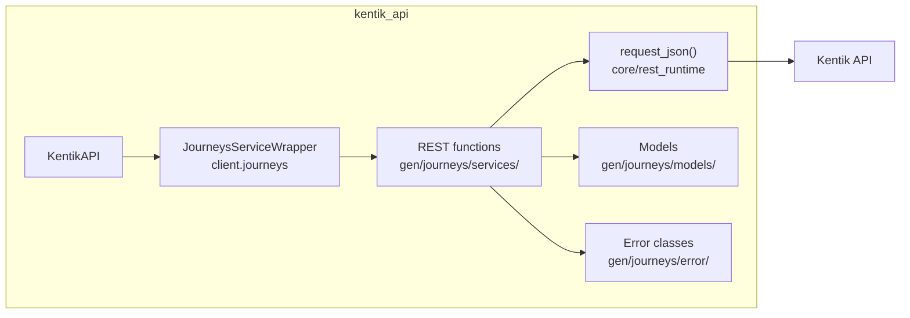
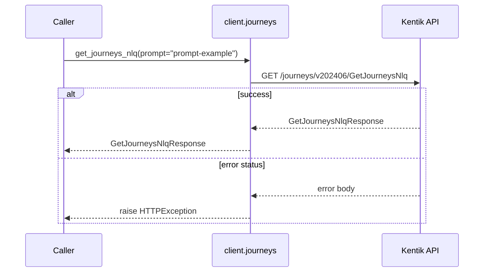
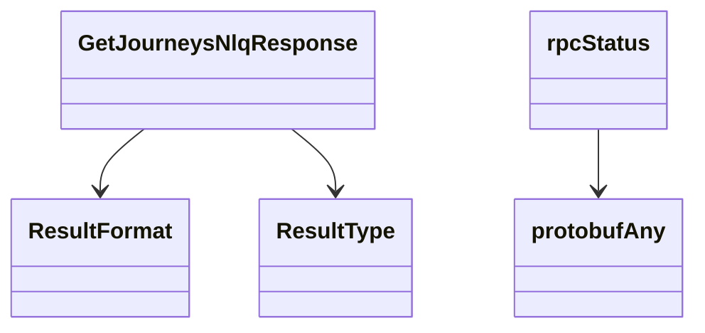

# Journeys Service

## Overview



## Endpoints

### `GET` `/journeys/v202406/GetJourneysNlq`

Journeys AI NLQ Service

Perform Natural Language (NLQ) to query object translation



#### Parameters

| Name | In | Type | Required |
| --- | --- | --- | --- |
| `prompt` | query | `string` | Yes |

#### Responses

| Status | Description | Model |
| --- | --- | --- |
| 200 | A successful response. | `GetJourneysNlqResponse` |
| default | An unexpected error response. | `rpcStatus` |

#### Example

```python
from kentik_api.client import KentikAPI

client = KentikAPI()  # loads KENTIK_EMAIL/KENTIK_API_TOKEN from .env
response = client.journeys.get_journeys_nlq(
    prompt="prompt-example",
)
```

## Data Models

<details>
<summary>Model relationships (5 of 5 models)</summary>



</details>

```{eval-rst}
.. autopydantic_model:: kentik_api.gen.journeys.models.GetJourneysNlqResponse
```

```{eval-rst}
.. autoclass:: kentik_api.gen.journeys.models.ResultFormat
   :members:
```

```{eval-rst}
.. autoclass:: kentik_api.gen.journeys.models.ResultType
   :members:
```

```{eval-rst}
.. autopydantic_model:: kentik_api.gen.journeys.models.protobufAny
```

```{eval-rst}
.. autopydantic_model:: kentik_api.gen.journeys.models.rpcStatus
```
