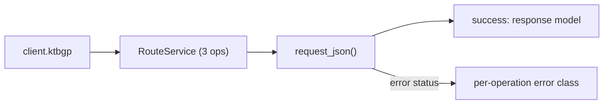
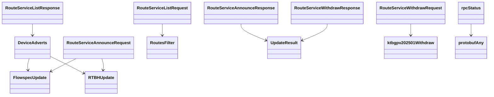

# Ktbgp Service

## Overview



## Endpoints

### `POST` `/routes/announce`

Announce a BGP route to a specified set of devices

#### Parameters

| Name | In | Type | Required |
| --- | --- | --- | --- |
| `data` | body | `RouteServiceAnnounceRequest` | Yes |

#### Responses

| Status | Description | Model |
| --- | --- | --- |
| 200 | A successful response. | `RouteServiceAnnounceResponse` |
| default | An unexpected error response. | `rpcStatus` |

#### Example

```python
from kentik_api.client import KentikAPI

client = KentikAPI()  # loads KENTIK_EMAIL/KENTIK_API_TOKEN from .env
response = client.ktbgp.route_service__announce(
    data=RouteServiceAnnounceRequest(...),
)
```

---

### `POST` `/routes/list`

List active BGP updates for a specified set of devices

#### Parameters

| Name | In | Type | Required |
| --- | --- | --- | --- |
| `data` | body | `RouteServiceListRequest` | Yes |

#### Responses

| Status | Description | Model |
| --- | --- | --- |
| 200 | A successful response. | `RouteServiceListResponse` |
| default | An unexpected error response. | `rpcStatus` |

#### Example

```python
from kentik_api.client import KentikAPI

client = KentikAPI()  # loads KENTIK_EMAIL/KENTIK_API_TOKEN from .env
response = client.ktbgp.route_service__list(
    data=RouteServiceListRequest(...),
)
```

---

### `POST` `/routes/withdraw`

Withdraw active BGP updates from devices

#### Parameters

| Name | In | Type | Required |
| --- | --- | --- | --- |
| `data` | body | `RouteServiceWithdrawRequest` | Yes |

#### Responses

| Status | Description | Model |
| --- | --- | --- |
| 200 | A successful response. | `RouteServiceWithdrawResponse` |
| default | An unexpected error response. | `rpcStatus` |

#### Example

```python
from kentik_api.client import KentikAPI

client = KentikAPI()  # loads KENTIK_EMAIL/KENTIK_API_TOKEN from .env
response = client.ktbgp.route_service__withdraw(
    data=RouteServiceWithdrawRequest(...),
)
```

## Data Models

<details>
<summary>Model relationships (14 of 45 models)</summary>



</details>

```{eval-rst}
.. autoclass:: kentik_api.gen.ktbgp.models.AdvertStatus
   :members:
```

```{eval-rst}
.. autoclass:: kentik_api.gen.ktbgp.models.BitwiseOp
   :members:
```

```{eval-rst}
.. autopydantic_model:: kentik_api.gen.ktbgp.models.DeviceAdverts
```

```{eval-rst}
.. autoclass:: kentik_api.gen.ktbgp.models.ExtendedCommunityRouteType
   :members:
```

```{eval-rst}
.. autopydantic_model:: kentik_api.gen.ktbgp.models.FlowspecAction
```

```{eval-rst}
.. autopydantic_model:: kentik_api.gen.ktbgp.models.FlowspecActionAccept
```

```{eval-rst}
.. autopydantic_model:: kentik_api.gen.ktbgp.models.FlowspecActionDiscard
```

```{eval-rst}
.. autopydantic_model:: kentik_api.gen.ktbgp.models.FlowspecActionExtendedCommunity
```

```{eval-rst}
.. autopydantic_model:: kentik_api.gen.ktbgp.models.FlowspecActionIPNextHopCopy
```

```{eval-rst}
.. autopydantic_model:: kentik_api.gen.ktbgp.models.FlowspecActionIPNextHopRedirect
```

```{eval-rst}
.. autopydantic_model:: kentik_api.gen.ktbgp.models.FlowspecActionLargeCommunity
```

```{eval-rst}
.. autopydantic_model:: kentik_api.gen.ktbgp.models.FlowspecActionMarkDSCP
```

```{eval-rst}
.. autopydantic_model:: kentik_api.gen.ktbgp.models.FlowspecActionRegularCommunity
```

```{eval-rst}
.. autopydantic_model:: kentik_api.gen.ktbgp.models.FlowspecActionRouteTargetRedirect
```

```{eval-rst}
.. autopydantic_model:: kentik_api.gen.ktbgp.models.FlowspecActionTerminalSample
```

```{eval-rst}
.. autopydantic_model:: kentik_api.gen.ktbgp.models.FlowspecActionTrafficRateBytes
```

```{eval-rst}
.. autopydantic_model:: kentik_api.gen.ktbgp.models.FlowspecMatch
```

```{eval-rst}
.. autopydantic_model:: kentik_api.gen.ktbgp.models.FlowspecUpdate
```

```{eval-rst}
.. autoclass:: kentik_api.gen.ktbgp.models.Fragment
   :members:
```

```{eval-rst}
.. autopydantic_model:: kentik_api.gen.ktbgp.models.FragmentFormula
```

```{eval-rst}
.. autopydantic_model:: kentik_api.gen.ktbgp.models.FragmentPredicate
```

```{eval-rst}
.. autopydantic_model:: kentik_api.gen.ktbgp.models.FragmentPredicateGroup
```

```{eval-rst}
.. autoclass:: kentik_api.gen.ktbgp.models.InetType
   :members:
```

```{eval-rst}
.. autopydantic_model:: kentik_api.gen.ktbgp.models.NumericFormula
```

```{eval-rst}
.. autoclass:: kentik_api.gen.ktbgp.models.NumericOp
   :members:
```

```{eval-rst}
.. autopydantic_model:: kentik_api.gen.ktbgp.models.NumericPredicate
```

```{eval-rst}
.. autopydantic_model:: kentik_api.gen.ktbgp.models.NumericPredicateGroup
```

```{eval-rst}
.. autopydantic_model:: kentik_api.gen.ktbgp.models.RTBHAction
```

```{eval-rst}
.. autopydantic_model:: kentik_api.gen.ktbgp.models.RTBHMatch
```

```{eval-rst}
.. autopydantic_model:: kentik_api.gen.ktbgp.models.RTBHUpdate
```

```{eval-rst}
.. autopydantic_model:: kentik_api.gen.ktbgp.models.RouteServiceAnnounceRequest
```

```{eval-rst}
.. autopydantic_model:: kentik_api.gen.ktbgp.models.RouteServiceAnnounceResponse
```

```{eval-rst}
.. autopydantic_model:: kentik_api.gen.ktbgp.models.RouteServiceListRequest
```

```{eval-rst}
.. autopydantic_model:: kentik_api.gen.ktbgp.models.RouteServiceListResponse
```

```{eval-rst}
.. autopydantic_model:: kentik_api.gen.ktbgp.models.RouteServiceWithdrawRequest
```

```{eval-rst}
.. autopydantic_model:: kentik_api.gen.ktbgp.models.RouteServiceWithdrawResponse
```

```{eval-rst}
.. autopydantic_model:: kentik_api.gen.ktbgp.models.RoutesFilter
```

```{eval-rst}
.. autoclass:: kentik_api.gen.ktbgp.models.TCPFlag
   :members:
```

```{eval-rst}
.. autopydantic_model:: kentik_api.gen.ktbgp.models.TCPFlagsFormula
```

```{eval-rst}
.. autopydantic_model:: kentik_api.gen.ktbgp.models.TCPFlagsPredicate
```

```{eval-rst}
.. autopydantic_model:: kentik_api.gen.ktbgp.models.TCPFlagsPredicateGroup
```

```{eval-rst}
.. autopydantic_model:: kentik_api.gen.ktbgp.models.UpdateResult
```

```{eval-rst}
.. autopydantic_model:: kentik_api.gen.ktbgp.models.ktbgpv202501Withdraw
```

```{eval-rst}
.. autopydantic_model:: kentik_api.gen.ktbgp.models.protobufAny
```

```{eval-rst}
.. autopydantic_model:: kentik_api.gen.ktbgp.models.rpcStatus
```
