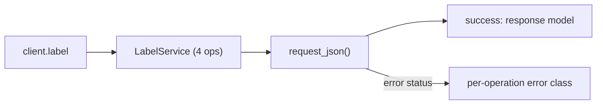
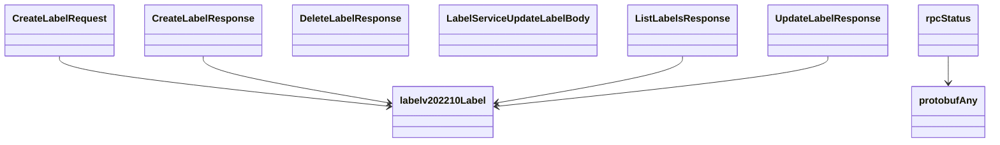

# Label Service

## Overview



## Endpoints

### `GET` `/label/v202210/labels`

List all configured labels

Returns list of all labels configured in the account.

#### Responses

| Status | Description | Model |
| --- | --- | --- |
| 200 | A successful response. | `ListLabelsResponse` |
| default | An unexpected error response. | `rpcStatus` |

#### Example

```python
from kentik_api.client import KentikAPI

client = KentikAPI()  # loads KENTIK_EMAIL/KENTIK_API_TOKEN from .env
response = client.label.list_labels()
```

---

### `POST` `/label/v202210/labels`

Create a new label.

Creates a new label based on data in the request.

#### Parameters

| Name | In | Type | Required |
| --- | --- | --- | --- |
| `data` | body | `CreateLabelRequest` | Yes |

#### Responses

| Status | Description | Model |
| --- | --- | --- |
| 200 | A successful response. | `CreateLabelResponse` |
| default | An unexpected error response. | `rpcStatus` |

#### Example

```python
from kentik_api.client import KentikAPI

client = KentikAPI()  # loads KENTIK_EMAIL/KENTIK_API_TOKEN from .env
response = client.label.create_label(
    data=CreateLabelRequest(...),
)
```

---

### `POST` `/label/v202210/labels/{id}`

Update an existing label.

Updates configuration of a label.

#### Parameters

| Name | In | Type | Required |
| --- | --- | --- | --- |
| `id` | path | `string` | Yes |
| `data` | body | `LabelServiceUpdateLabelBody` | Yes |

#### Responses

| Status | Description | Model |
| --- | --- | --- |
| 200 | A successful response. | `UpdateLabelResponse` |
| default | An unexpected error response. | `rpcStatus` |

#### Example

```python
from kentik_api.client import KentikAPI

client = KentikAPI()  # loads KENTIK_EMAIL/KENTIK_API_TOKEN from .env
response = client.label.update_label(
    id="id-example",
    data=LabelServiceUpdateLabelBody(...),
)
```

---

### `DELETE` `/label/v202210/labels/{id}`

Delete a label.

Deletes label with specified with id.

#### Parameters

| Name | In | Type | Required |
| --- | --- | --- | --- |
| `id` | path | `string` | Yes |

#### Responses

| Status | Description | Model |
| --- | --- | --- |
| 200 | A successful response. | `DeleteLabelResponse` |
| default | An unexpected error response. | `rpcStatus` |

#### Example

```python
from kentik_api.client import KentikAPI

client = KentikAPI()  # loads KENTIK_EMAIL/KENTIK_API_TOKEN from .env
response = client.label.delete_label(
    id="id-example",
)
```

## Data Models

<details>
<summary>Model relationships (9 of 9 models)</summary>



</details>

```{eval-rst}
.. autopydantic_model:: kentik_api.gen.label.models.CreateLabelRequest
```

```{eval-rst}
.. autopydantic_model:: kentik_api.gen.label.models.CreateLabelResponse
```

```{eval-rst}
.. autopydantic_model:: kentik_api.gen.label.models.DeleteLabelResponse
```

```{eval-rst}
.. autopydantic_model:: kentik_api.gen.label.models.LabelServiceUpdateLabelBody
```

```{eval-rst}
.. autopydantic_model:: kentik_api.gen.label.models.ListLabelsResponse
```

```{eval-rst}
.. autopydantic_model:: kentik_api.gen.label.models.UpdateLabelResponse
```

```{eval-rst}
.. autopydantic_model:: kentik_api.gen.label.models.labelv202210Label
```

```{eval-rst}
.. autopydantic_model:: kentik_api.gen.label.models.protobufAny
```

```{eval-rst}
.. autopydantic_model:: kentik_api.gen.label.models.rpcStatus
```
