# Mkp Service

## Overview

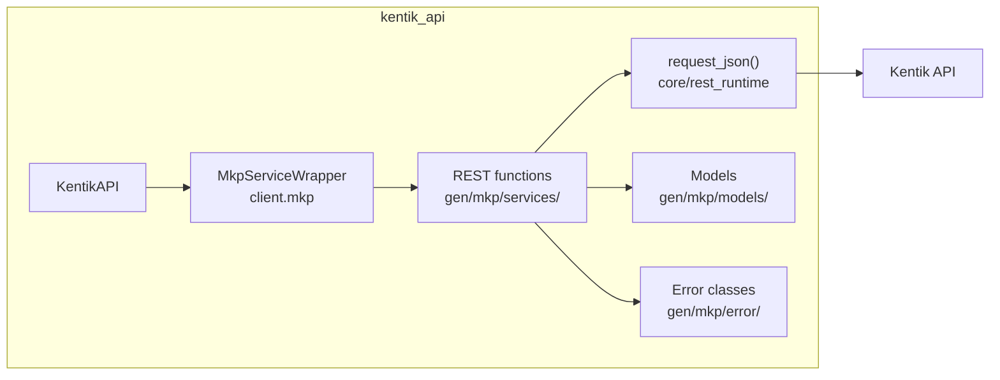

## Endpoints

### PackageService

#### `GET` `/mkp/v202407/packages`

List MKP packages.

Returns a list of MKP packages.

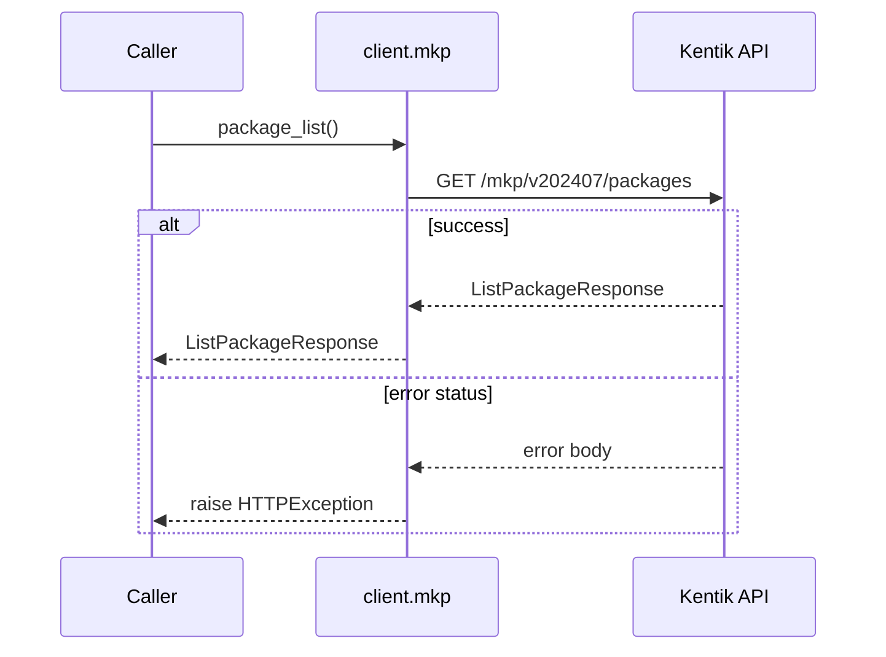

##### Responses

| Status | Description | Model |
| --- | --- | --- |
| 200 | A successful response. | `ListPackageResponse` |
| default | An unexpected error response. | `rpcStatus` |

##### Example

```python
from kentik_api.client import KentikAPI

# Both transports work: protocol="rest" (default) or protocol="grpc".
client = KentikAPI(protocol="rest")  # loads KENTIK_EMAIL/KENTIK_API_TOKEN from .env
response = client.mkp.package_list()
```

---

#### `POST` `/mkp/v202407/packages`

Create a package template.

Create package from request. returns created package.

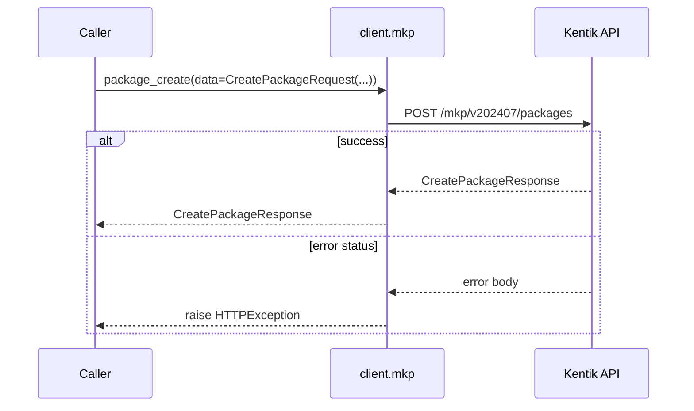

##### Parameters

| Name | In | Type | Required |
| --- | --- | --- | --- |
| `data` | body | `CreatePackageRequest` | Yes |

##### Responses

| Status | Description | Model |
| --- | --- | --- |
| 200 | A successful response. | `CreatePackageResponse` |
| default | An unexpected error response. | `rpcStatus` |

##### Example

```python
from kentik_api.client import KentikAPI

# Both transports work: protocol="rest" (default) or protocol="grpc".
client = KentikAPI(protocol="rest")  # loads KENTIK_EMAIL/KENTIK_API_TOKEN from .env
response = client.mkp.package_create(
    data=CreatePackageRequest(...),
)
```

---

#### `GET` `/mkp/v202407/packages/{id}`

Get information aboout a package.

Returns information about package specified with ID.

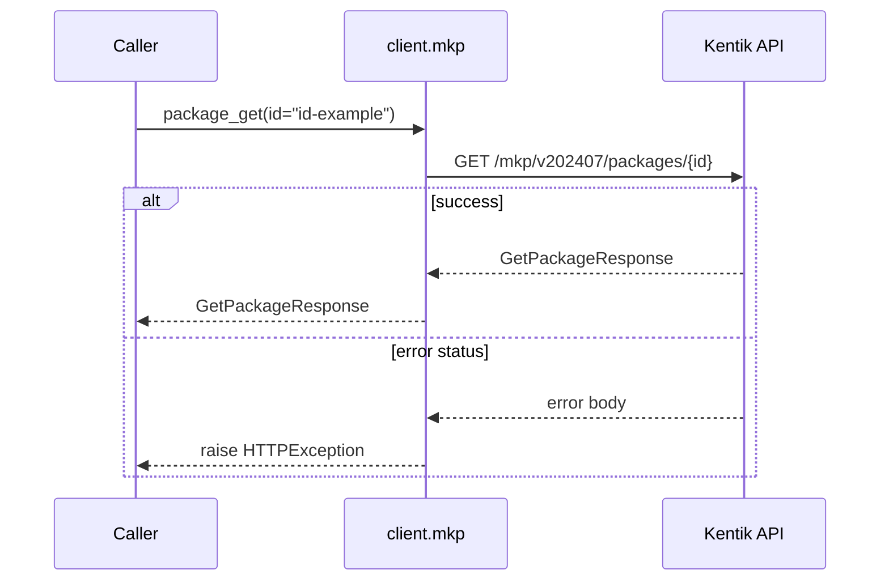

##### Parameters

| Name | In | Type | Required |
| --- | --- | --- | --- |
| `id` | path | `string` | Yes |

##### Responses

| Status | Description | Model |
| --- | --- | --- |
| 200 | A successful response. | `GetPackageResponse` |
| default | An unexpected error response. | `rpcStatus` |

##### Example

```python
from kentik_api.client import KentikAPI

# Both transports work: protocol="rest" (default) or protocol="grpc".
client = KentikAPI(protocol="rest")  # loads KENTIK_EMAIL/KENTIK_API_TOKEN from .env
response = client.mkp.package_get(
    id="id-example",
)
```

---

#### `PUT` `/mkp/v202407/packages/{id}`

Update a package.

Update package attributes specified with id.

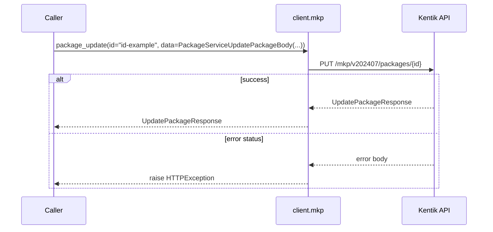

##### Parameters

| Name | In | Type | Required |
| --- | --- | --- | --- |
| `id` | path | `string` | Yes |
| `data` | body | `PackageServiceUpdatePackageBody` | Yes |

##### Responses

| Status | Description | Model |
| --- | --- | --- |
| 200 | A successful response. | `UpdatePackageResponse` |
| default | An unexpected error response. | `rpcStatus` |

##### Example

```python
from kentik_api.client import KentikAPI

# Both transports work: protocol="rest" (default) or protocol="grpc".
client = KentikAPI(protocol="rest")  # loads KENTIK_EMAIL/KENTIK_API_TOKEN from .env
response = client.mkp.package_update(
    id="id-example",
    data=PackageServiceUpdatePackageBody(...),
)
```

---

#### `DELETE` `/mkp/v202407/packages/{id}`

Delete a package.

Deletes the package specified with id.

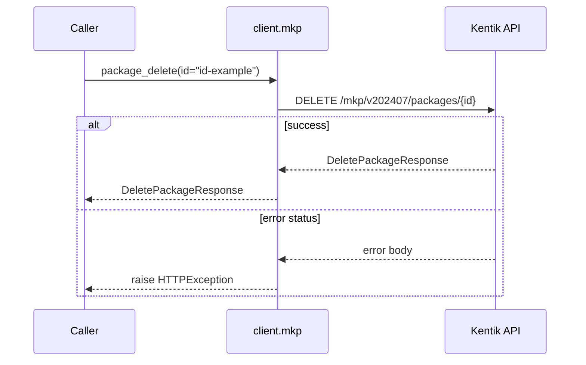

##### Parameters

| Name | In | Type | Required |
| --- | --- | --- | --- |
| `id` | path | `string` | Yes |

##### Responses

| Status | Description | Model |
| --- | --- | --- |
| 200 | A successful response. | `DeletePackageResponse` |
| default | An unexpected error response. | `rpcStatus` |

##### Example

```python
from kentik_api.client import KentikAPI

# Both transports work: protocol="rest" (default) or protocol="grpc".
client = KentikAPI(protocol="rest")  # loads KENTIK_EMAIL/KENTIK_API_TOKEN from .env
response = client.mkp.package_delete(
    id="id-example",
)
```

### TenantService

#### `GET` `/mkp/v202407/tenants`

List MKP tenants.

Returns a list of MKP tenants.

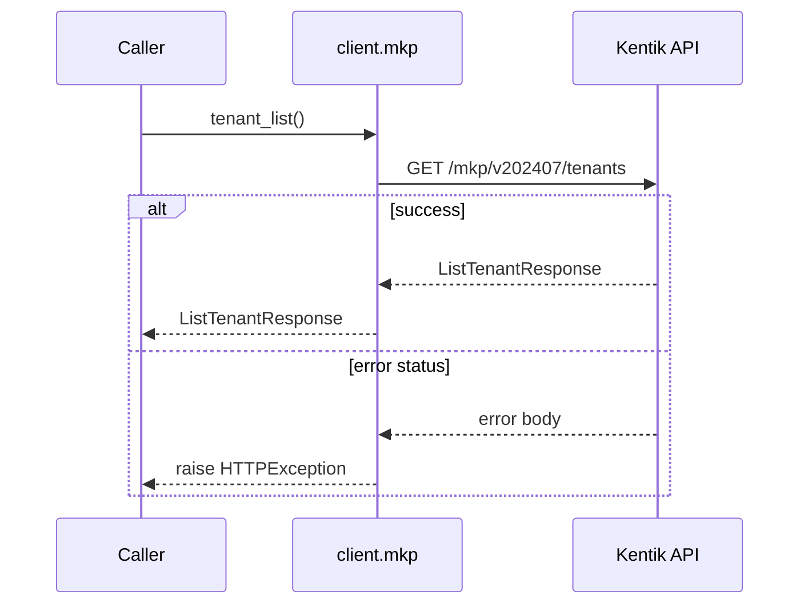

##### Responses

| Status | Description | Model |
| --- | --- | --- |
| 200 | A successful response. | `ListTenantResponse` |
| default | An unexpected error response. | `rpcStatus` |

##### Example

```python
from kentik_api.client import KentikAPI

# Both transports work: protocol="rest" (default) or protocol="grpc".
client = KentikAPI(protocol="rest")  # loads KENTIK_EMAIL/KENTIK_API_TOKEN from .env
response = client.mkp.tenant_list()
```

---

#### `POST` `/mkp/v202407/tenants`

Create a tenant.

Create tenant from request. returns created tenant.

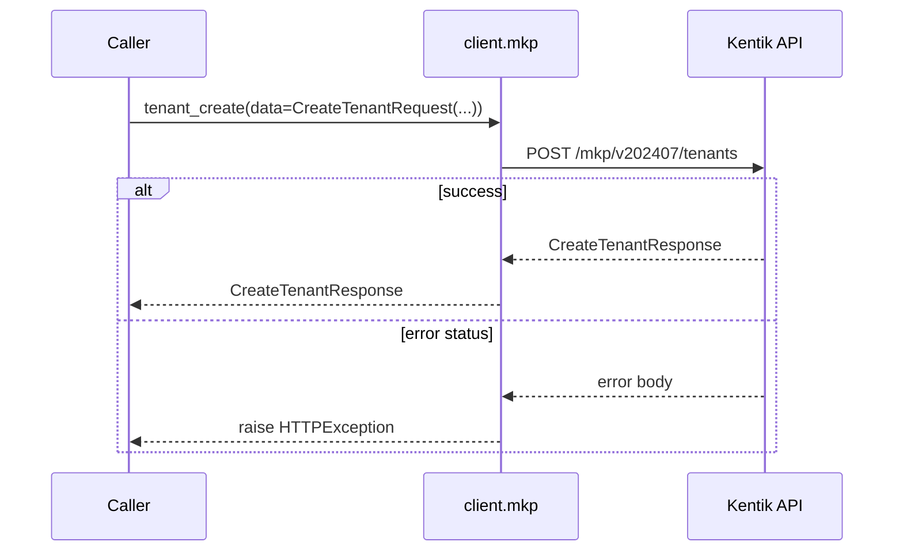

##### Parameters

| Name | In | Type | Required |
| --- | --- | --- | --- |
| `data` | body | `CreateTenantRequest` | Yes |

##### Responses

| Status | Description | Model |
| --- | --- | --- |
| 200 | A successful response. | `CreateTenantResponse` |
| default | An unexpected error response. | `rpcStatus` |

##### Example

```python
from kentik_api.client import KentikAPI

# Both transports work: protocol="rest" (default) or protocol="grpc".
client = KentikAPI(protocol="rest")  # loads KENTIK_EMAIL/KENTIK_API_TOKEN from .env
response = client.mkp.tenant_create(
    data=CreateTenantRequest(...),
)
```

---

#### `GET` `/mkp/v202407/tenants/{id}`

Get information aboout a tenant.

Returns information about package specified with ID.

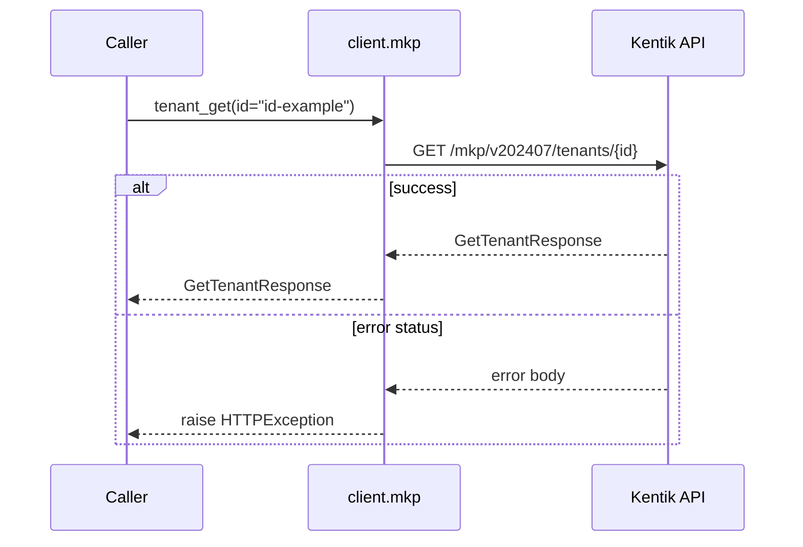

##### Parameters

| Name | In | Type | Required |
| --- | --- | --- | --- |
| `id` | path | `string` | Yes |

##### Responses

| Status | Description | Model |
| --- | --- | --- |
| 200 | A successful response. | `GetTenantResponse` |
| default | An unexpected error response. | `rpcStatus` |

##### Example

```python
from kentik_api.client import KentikAPI

# Both transports work: protocol="rest" (default) or protocol="grpc".
client = KentikAPI(protocol="rest")  # loads KENTIK_EMAIL/KENTIK_API_TOKEN from .env
response = client.mkp.tenant_get(
    id="id-example",
)
```

---

#### `PUT` `/mkp/v202407/tenants/{id}`

Update a tenant.

Update tenant attributes specified with id.

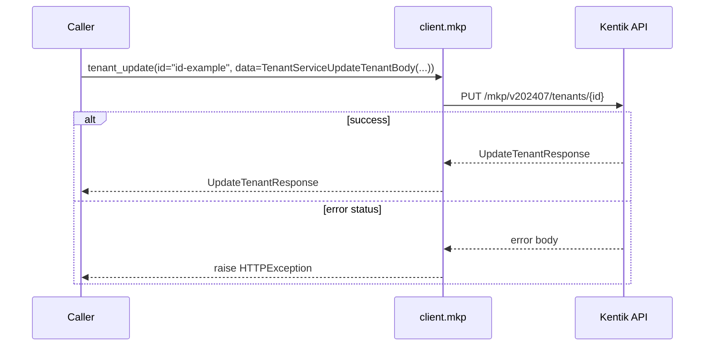

##### Parameters

| Name | In | Type | Required |
| --- | --- | --- | --- |
| `id` | path | `string` | Yes |
| `data` | body | `TenantServiceUpdateTenantBody` | Yes |

##### Responses

| Status | Description | Model |
| --- | --- | --- |
| 200 | A successful response. | `UpdateTenantResponse` |
| default | An unexpected error response. | `rpcStatus` |

##### Example

```python
from kentik_api.client import KentikAPI

# Both transports work: protocol="rest" (default) or protocol="grpc".
client = KentikAPI(protocol="rest")  # loads KENTIK_EMAIL/KENTIK_API_TOKEN from .env
response = client.mkp.tenant_update(
    id="id-example",
    data=TenantServiceUpdateTenantBody(...),
)
```

---

#### `DELETE` `/mkp/v202407/tenants/{id}`

Delete a tenant.

Deletes the tenant specified with id.

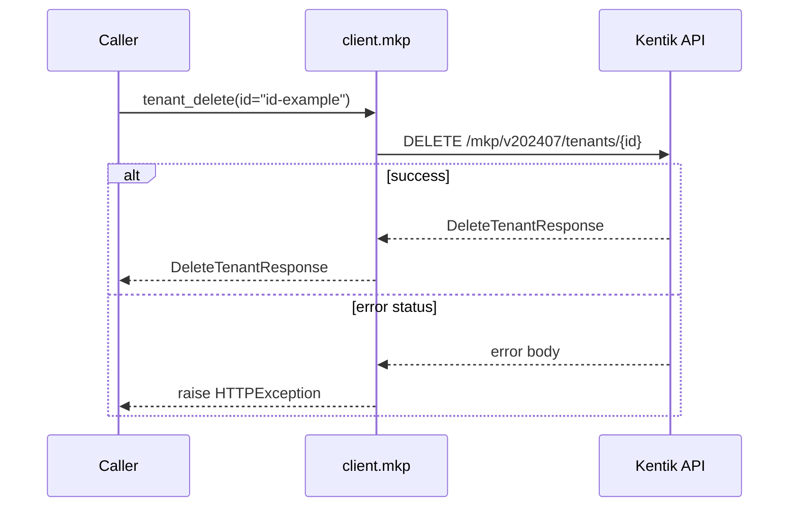

##### Parameters

| Name | In | Type | Required |
| --- | --- | --- | --- |
| `id` | path | `string` | Yes |

##### Responses

| Status | Description | Model |
| --- | --- | --- |
| 200 | A successful response. | `DeleteTenantResponse` |
| default | An unexpected error response. | `rpcStatus` |

##### Example

```python
from kentik_api.client import KentikAPI

# Both transports work: protocol="rest" (default) or protocol="grpc".
client = KentikAPI(protocol="rest")  # loads KENTIK_EMAIL/KENTIK_API_TOKEN from .env
response = client.mkp.tenant_delete(
    id="id-example",
)
```

### TenantUserService

#### `GET` `/mkp/v202407/tenants/{tenantId}/users`

List users for a tenant.

Returns a list of users associated with the specified tenant.

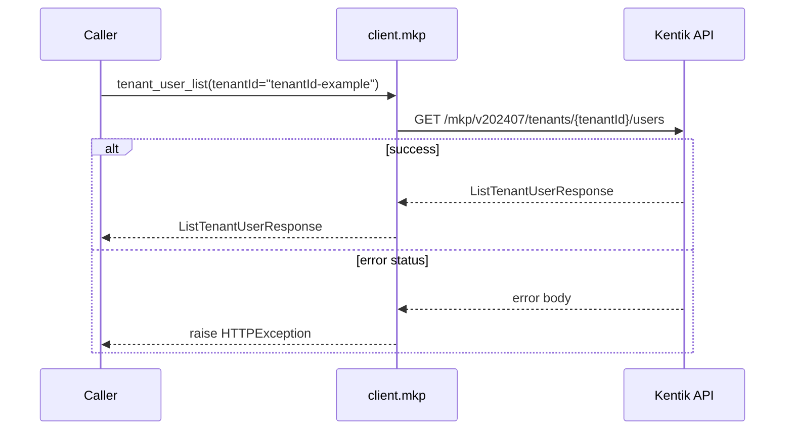

##### Parameters

| Name | In | Type | Required |
| --- | --- | --- | --- |
| `tenantId` | path | `string` | Yes |

##### Responses

| Status | Description | Model |
| --- | --- | --- |
| 200 | A successful response. | `ListTenantUserResponse` |
| default | An unexpected error response. | `rpcStatus` |

##### Example

```python
from kentik_api.client import KentikAPI

# Both transports work: protocol="rest" (default) or protocol="grpc".
client = KentikAPI(protocol="rest")  # loads KENTIK_EMAIL/KENTIK_API_TOKEN from .env
response = client.mkp.tenant_user_list(
    tenantId="tenantId-example",
)
```

---

#### `POST` `/mkp/v202407/tenants/{tenantId}/users`

Add a user to a tenant.

Creates a user association with the specified tenant.

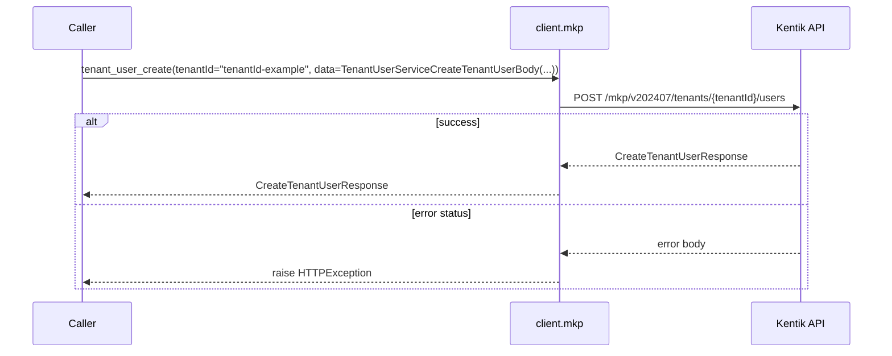

##### Parameters

| Name | In | Type | Required |
| --- | --- | --- | --- |
| `tenantId` | path | `string` | Yes |
| `data` | body | `TenantUserServiceCreateTenantUserBody` | Yes |

##### Responses

| Status | Description | Model |
| --- | --- | --- |
| 200 | A successful response. | `CreateTenantUserResponse` |
| default | An unexpected error response. | `rpcStatus` |

##### Example

```python
from kentik_api.client import KentikAPI

# Both transports work: protocol="rest" (default) or protocol="grpc".
client = KentikAPI(protocol="rest")  # loads KENTIK_EMAIL/KENTIK_API_TOKEN from .env
response = client.mkp.tenant_user_create(
    tenantId="tenantId-example",
    data=TenantUserServiceCreateTenantUserBody(...),
)
```

---

#### `PUT` `/mkp/v202407/tenants/{tenantId}/users/{id}`

Update a tenant user.

Updates the user associated with the specified tenant and user ID.

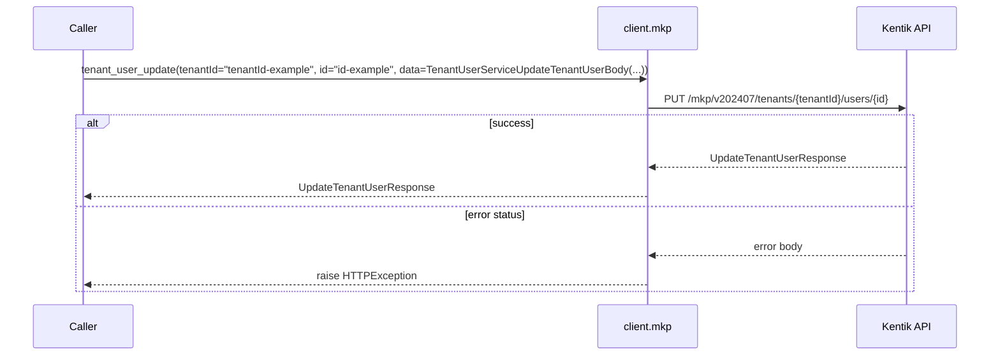

##### Parameters

| Name | In | Type | Required |
| --- | --- | --- | --- |
| `tenantId` | path | `string` | Yes |
| `id` | path | `string` | Yes |
| `data` | body | `TenantUserServiceUpdateTenantUserBody` | Yes |

##### Responses

| Status | Description | Model |
| --- | --- | --- |
| 200 | A successful response. | `UpdateTenantUserResponse` |
| default | An unexpected error response. | `rpcStatus` |

##### Example

```python
from kentik_api.client import KentikAPI

# Both transports work: protocol="rest" (default) or protocol="grpc".
client = KentikAPI(protocol="rest")  # loads KENTIK_EMAIL/KENTIK_API_TOKEN from .env
response = client.mkp.tenant_user_update(
    tenantId="tenantId-example",
    id="id-example",
    data=TenantUserServiceUpdateTenantUserBody(...),
)
```

---

#### `DELETE` `/mkp/v202407/tenants/{tenantId}/users/{id}`

Remove a user from a tenant.

Deletes the user association with the specified tenant.

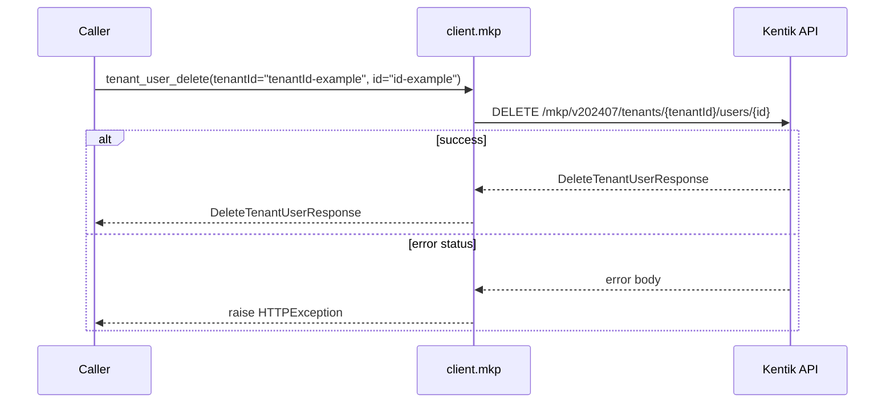

##### Parameters

| Name | In | Type | Required |
| --- | --- | --- | --- |
| `tenantId` | path | `string` | Yes |
| `id` | path | `string` | Yes |

##### Responses

| Status | Description | Model |
| --- | --- | --- |
| 200 | A successful response. | `DeleteTenantUserResponse` |
| default | An unexpected error response. | `rpcStatus` |

##### Example

```python
from kentik_api.client import KentikAPI

# Both transports work: protocol="rest" (default) or protocol="grpc".
client = KentikAPI(protocol="rest")  # loads KENTIK_EMAIL/KENTIK_API_TOKEN from .env
response = client.mkp.tenant_user_delete(
    tenantId="tenantId-example",
    id="id-example",
)
```

## Data Models

<details>
<summary>Model relationships (25 of 42 models)</summary>

```mermaid
classDiagram
    class CreatePackageRequest
    class CreatePackageResponse
    class CreateTenantRequest
    class CreateTenantResponse
    class CreateTenantUserResponse
    class DeletePackageResponse
    class DeleteTenantResponse
    class DeleteTenantUserResponse
    class GetPackageResponse
    class GetTenantResponse
    class ListPackageResponse
    class ListTenantResponse
    class ListTenantUserResponse
    class Package
    class PackageServiceUpdatePackageBody
    class Tenant
    class TenantServiceUpdateTenantBody
    class TenantUser
    class TenantUserServiceCreateTenantUserBody
    class TenantUserServiceUpdateTenantUserBody
    class UpdatePackageResponse
    class UpdateTenantResponse
    class UpdateTenantUserResponse
    class protobufAny
    class rpcStatus
    CreatePackageRequest --> Package
    CreatePackageResponse --> Package
    CreateTenantRequest --> Tenant
    CreateTenantResponse --> Tenant
    CreateTenantUserResponse --> TenantUser
    GetPackageResponse --> Package
    GetTenantResponse --> Tenant
    ListPackageResponse --> Package
    ListTenantResponse --> Tenant
    ListTenantUserResponse --> TenantUser
    Tenant --> Package
    UpdatePackageResponse --> Package
    UpdateTenantResponse --> Tenant
    UpdateTenantUserResponse --> TenantUser
    rpcStatus --> protobufAny
```

</details>

```{eval-rst}
.. autopydantic_model:: kentik_api.gen.mkp.models.Activate
```

```{eval-rst}
.. autopydantic_model:: kentik_api.gen.mkp.models.Alert
```

```{eval-rst}
.. autopydantic_model:: kentik_api.gen.mkp.models.Asset
```

```{eval-rst}
.. autopydantic_model:: kentik_api.gen.mkp.models.AssetReport
```

```{eval-rst}
.. autopydantic_model:: kentik_api.gen.mkp.models.Condition
```

```{eval-rst}
.. autopydantic_model:: kentik_api.gen.mkp.models.CreatePackageRequest
```

```{eval-rst}
.. autopydantic_model:: kentik_api.gen.mkp.models.CreatePackageResponse
```

```{eval-rst}
.. autopydantic_model:: kentik_api.gen.mkp.models.CreateTenantRequest
```

```{eval-rst}
.. autopydantic_model:: kentik_api.gen.mkp.models.CreateTenantResponse
```

```{eval-rst}
.. autopydantic_model:: kentik_api.gen.mkp.models.CreateTenantUserResponse
```

```{eval-rst}
.. autopydantic_model:: kentik_api.gen.mkp.models.CustomDimension
```

```{eval-rst}
.. autopydantic_model:: kentik_api.gen.mkp.models.DeletePackageResponse
```

```{eval-rst}
.. autopydantic_model:: kentik_api.gen.mkp.models.DeleteTenantResponse
```

```{eval-rst}
.. autopydantic_model:: kentik_api.gen.mkp.models.DeleteTenantUserResponse
```

```{eval-rst}
.. autopydantic_model:: kentik_api.gen.mkp.models.Devices
```

```{eval-rst}
.. autopydantic_model:: kentik_api.gen.mkp.models.Filter
```

```{eval-rst}
.. autopydantic_model:: kentik_api.gen.mkp.models.FilterField
```

```{eval-rst}
.. autopydantic_model:: kentik_api.gen.mkp.models.GetPackageResponse
```

```{eval-rst}
.. autopydantic_model:: kentik_api.gen.mkp.models.GetTenantResponse
```

```{eval-rst}
.. autopydantic_model:: kentik_api.gen.mkp.models.ListPackageResponse
```

```{eval-rst}
.. autopydantic_model:: kentik_api.gen.mkp.models.ListTenantResponse
```

```{eval-rst}
.. autopydantic_model:: kentik_api.gen.mkp.models.ListTenantUserResponse
```

```{eval-rst}
.. autopydantic_model:: kentik_api.gen.mkp.models.Mitigation
```

```{eval-rst}
.. autopydantic_model:: kentik_api.gen.mkp.models.NotificationChannel
```

```{eval-rst}
.. autopydantic_model:: kentik_api.gen.mkp.models.Package
```

```{eval-rst}
.. autopydantic_model:: kentik_api.gen.mkp.models.PackageServiceUpdatePackageBody
```

```{eval-rst}
.. autopydantic_model:: kentik_api.gen.mkp.models.Tenant
```

```{eval-rst}
.. autopydantic_model:: kentik_api.gen.mkp.models.TenantLink
```

```{eval-rst}
.. autopydantic_model:: kentik_api.gen.mkp.models.TenantServiceUpdateTenantBody
```

```{eval-rst}
.. autopydantic_model:: kentik_api.gen.mkp.models.TenantUser
```

```{eval-rst}
.. autopydantic_model:: kentik_api.gen.mkp.models.TenantUserServiceCreateTenantUserBody
```

```{eval-rst}
.. autopydantic_model:: kentik_api.gen.mkp.models.TenantUserServiceUpdateTenantUserBody
```

```{eval-rst}
.. autopydantic_model:: kentik_api.gen.mkp.models.Threshold
```

```{eval-rst}
.. autopydantic_model:: kentik_api.gen.mkp.models.UpdatePackageResponse
```

```{eval-rst}
.. autopydantic_model:: kentik_api.gen.mkp.models.UpdateTenantResponse
```

```{eval-rst}
.. autopydantic_model:: kentik_api.gen.mkp.models.UpdateTenantUserResponse
```

```{eval-rst}
.. autopydantic_model:: kentik_api.gen.mkp.models.protobufAny
```

```{eval-rst}
.. autopydantic_model:: kentik_api.gen.mkp.models.rpcStatus
```

```{eval-rst}
.. autoclass:: kentik_api.gen.mkp.models.v202211LandingType
   :members:
```

```{eval-rst}
.. autopydantic_model:: kentik_api.gen.mkp.models.v202211PermissionEntry
```

```{eval-rst}
.. autoclass:: kentik_api.gen.mkp.models.v202211Role
   :members:
```

```{eval-rst}
.. autopydantic_model:: kentik_api.gen.mkp.models.v202211User
```
