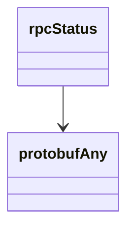

# Net Service

## Endpoints

This service's schema defines shared types only -- no REST endpoints.

## Data Models

<details>
<summary>Model relationships (2 of 2 models)</summary>



</details>

```{eval-rst}
.. autopydantic_model:: kentik_api.gen.net.models.protobufAny
```

```{eval-rst}
.. autopydantic_model:: kentik_api.gen.net.models.rpcStatus
```
