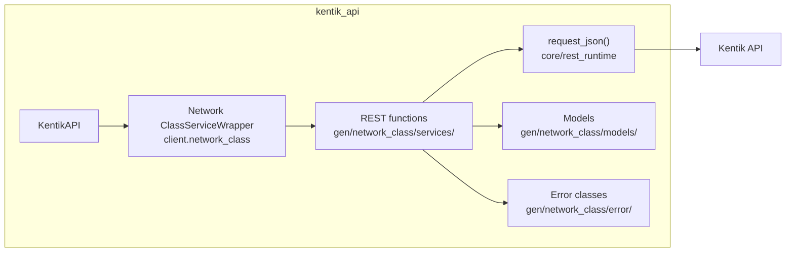
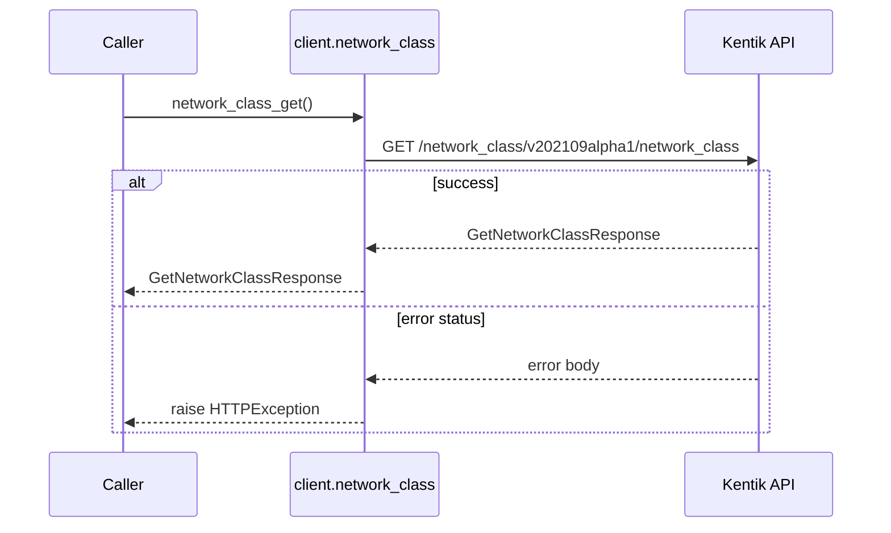
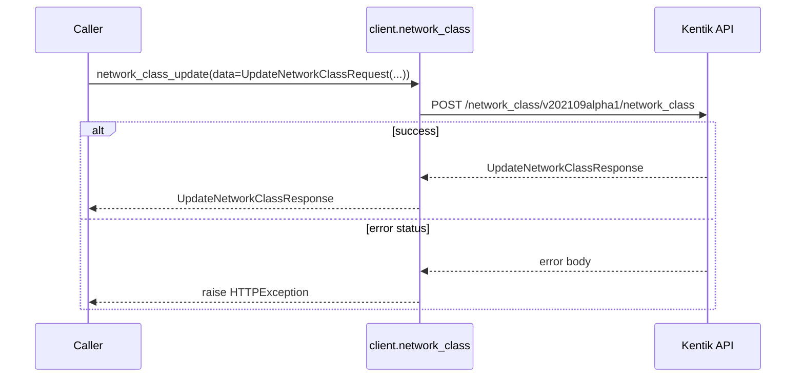
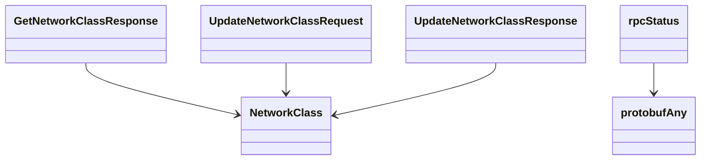

# Network Class Service

## Overview



## Endpoints

### `GET` `/network_class/v202109alpha1/network_class`

Get a network classification.

Returns information about a network classification for the company.



#### Responses

| Status | Description | Model |
| --- | --- | --- |
| 200 | A successful response. | `GetNetworkClassResponse` |
| default | An unexpected error response. | `rpcStatus` |

#### Example

```python
from kentik_api.client import KentikAPI

client = KentikAPI()  # loads KENTIK_EMAIL/KENTIK_API_TOKEN from .env
response = client.network_class.network_class_get()
```

---

### `POST` `/network_class/v202109alpha1/network_class`

Update a network classification.

Replaces the entire network classification attributes for the company.



#### Parameters

| Name | In | Type | Required |
| --- | --- | --- | --- |
| `data` | body | `UpdateNetworkClassRequest` | Yes |

#### Responses

| Status | Description | Model |
| --- | --- | --- |
| 200 | A successful response. | `UpdateNetworkClassResponse` |
| default | An unexpected error response. | `rpcStatus` |

#### Example

```python
from kentik_api.client import KentikAPI

client = KentikAPI()  # loads KENTIK_EMAIL/KENTIK_API_TOKEN from .env
response = client.network_class.network_class_update(
    data=UpdateNetworkClassRequest(...),
)
```

## Data Models

<details>
<summary>Model relationships (6 of 8 models)</summary>



</details>

```{eval-rst}
.. autopydantic_model:: kentik_api.gen.network_class.models.CloudSubnet
```

```{eval-rst}
.. autoclass:: kentik_api.gen.network_class.models.CloudType
   :members:
```

```{eval-rst}
.. autopydantic_model:: kentik_api.gen.network_class.models.GetNetworkClassResponse
```

```{eval-rst}
.. autopydantic_model:: kentik_api.gen.network_class.models.NetworkClass
```

```{eval-rst}
.. autopydantic_model:: kentik_api.gen.network_class.models.UpdateNetworkClassRequest
```

```{eval-rst}
.. autopydantic_model:: kentik_api.gen.network_class.models.UpdateNetworkClassResponse
```

```{eval-rst}
.. autopydantic_model:: kentik_api.gen.network_class.models.protobufAny
```

```{eval-rst}
.. autopydantic_model:: kentik_api.gen.network_class.models.rpcStatus
```
