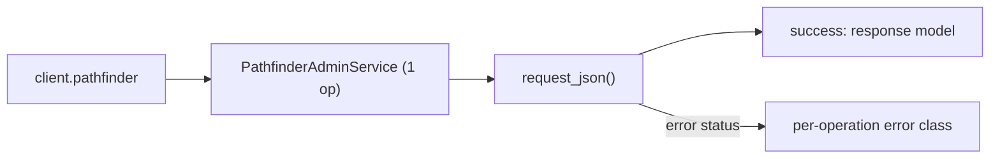
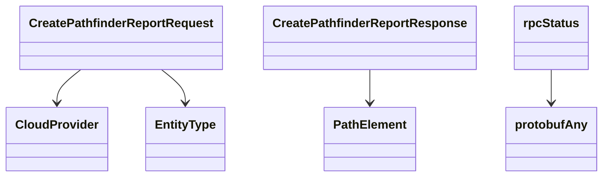

# Pathfinder Service

## Overview



## Endpoints

### `POST` `/pathfinder/v202505beta1/create`

Create a Pathfinder Report.

Create a pathfinder report based on configuration provided in the request.

#### Parameters

| Name | In | Type | Required |
| --- | --- | --- | --- |
| `data` | body | `CreatePathfinderReportRequest` | Yes |

#### Responses

| Status | Description | Model |
| --- | --- | --- |
| 200 | A successful response. | `CreatePathfinderReportResponse` |
| default | An unexpected error response. | `rpcStatus` |

#### Example

```python
from kentik_api.client import KentikAPI

client = KentikAPI()  # loads KENTIK_EMAIL/KENTIK_API_TOKEN from .env
response = client.pathfinder.create_pathfinder_report(
    data=CreatePathfinderReportRequest(...),
)
```

## Data Models

<details>
<summary>Model relationships (7 of 7 models)</summary>



</details>

```{eval-rst}
.. autoclass:: kentik_api.gen.pathfinder.models.CloudProvider
   :members:
```

```{eval-rst}
.. autopydantic_model:: kentik_api.gen.pathfinder.models.CreatePathfinderReportRequest
```

```{eval-rst}
.. autopydantic_model:: kentik_api.gen.pathfinder.models.CreatePathfinderReportResponse
```

```{eval-rst}
.. autoclass:: kentik_api.gen.pathfinder.models.EntityType
   :members:
```

```{eval-rst}
.. autopydantic_model:: kentik_api.gen.pathfinder.models.PathElement
```

```{eval-rst}
.. autopydantic_model:: kentik_api.gen.pathfinder.models.protobufAny
```

```{eval-rst}
.. autopydantic_model:: kentik_api.gen.pathfinder.models.rpcStatus
```
