# Site Service

## Overview

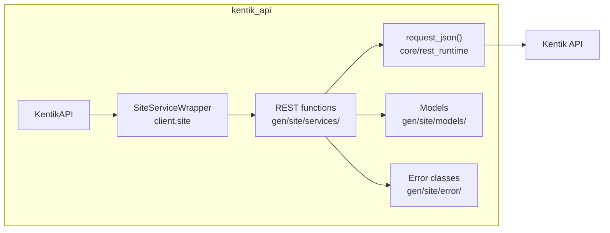

## Endpoints

### `GET` `/site/v202509/site_markets`

List all site markets.

Returns list of configured site markets.

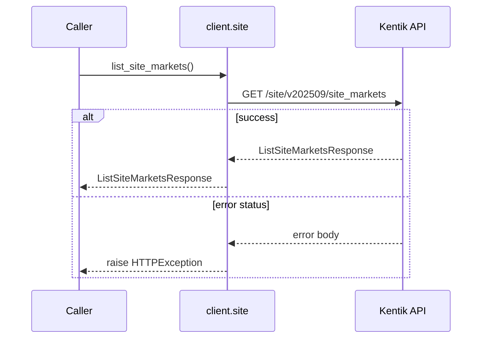

#### Responses

| Status | Description | Model |
| --- | --- | --- |
| 200 | A successful response. | `ListSiteMarketsResponse` |
| default | An unexpected error response. | `rpcStatus` |

#### Example

```python
from kentik_api.client import KentikAPI

client = KentikAPI()  # loads KENTIK_EMAIL/KENTIK_API_TOKEN from .env
response = client.site.list_site_markets()
```

---

### `POST` `/site/v202509/site_markets`

Configure a new site market.

Create configuration for a new site market. Returns the newly created configuration.

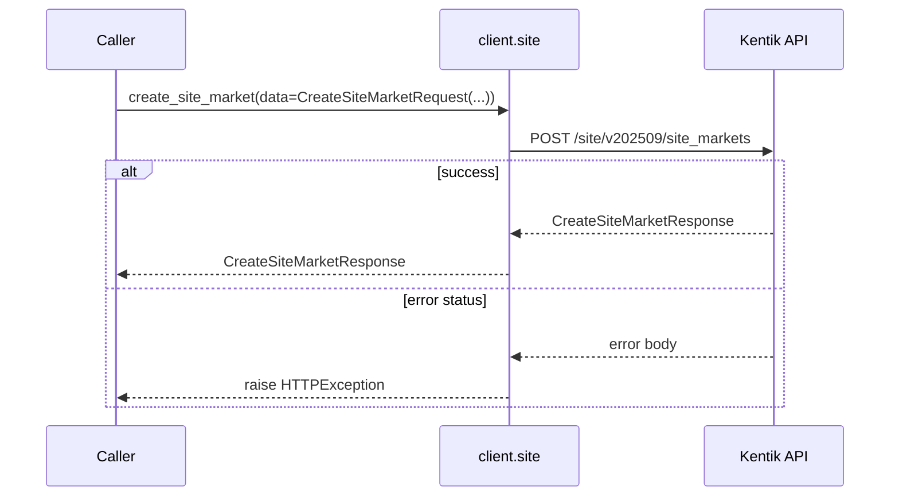

#### Parameters

| Name | In | Type | Required |
| --- | --- | --- | --- |
| `data` | body | `CreateSiteMarketRequest` | Yes |

#### Responses

| Status | Description | Model |
| --- | --- | --- |
| 200 | A successful response. | `CreateSiteMarketResponse` |
| default | An unexpected error response. | `rpcStatus` |

#### Example

```python
from kentik_api.client import KentikAPI

client = KentikAPI()  # loads KENTIK_EMAIL/KENTIK_API_TOKEN from .env
response = client.site.create_site_market(
    data=CreateSiteMarketRequest(...),
)
```

---

### `GET` `/site/v202509/site_markets/{id}`

Retrieve configuration of a site market.

Returns configuration of a site market specified by ID.

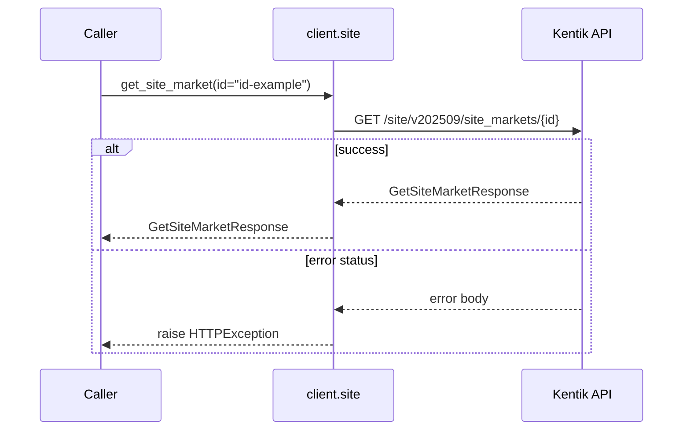

#### Parameters

| Name | In | Type | Required |
| --- | --- | --- | --- |
| `id` | path | `string` | Yes |

#### Responses

| Status | Description | Model |
| --- | --- | --- |
| 200 | A successful response. | `GetSiteMarketResponse` |
| default | An unexpected error response. | `rpcStatus` |

#### Example

```python
from kentik_api.client import KentikAPI

client = KentikAPI()  # loads KENTIK_EMAIL/KENTIK_API_TOKEN from .env
response = client.site.get_site_market(
    id="id-example",
)
```

---

### `PUT` `/site/v202509/site_markets/{id}`

Updates configuration of a site market.

Replaces configuration of a site market with attributes in the request. Returns the updated configuration.

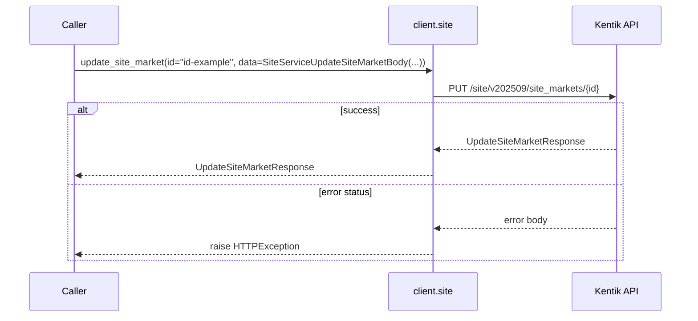

#### Parameters

| Name | In | Type | Required |
| --- | --- | --- | --- |
| `id` | path | `string` | Yes |
| `data` | body | `SiteServiceUpdateSiteMarketBody` | Yes |

#### Responses

| Status | Description | Model |
| --- | --- | --- |
| 200 | A successful response. | `UpdateSiteMarketResponse` |
| default | An unexpected error response. | `rpcStatus` |

#### Example

```python
from kentik_api.client import KentikAPI

client = KentikAPI()  # loads KENTIK_EMAIL/KENTIK_API_TOKEN from .env
response = client.site.update_site_market(
    id="id-example",
    data=SiteServiceUpdateSiteMarketBody(...),
)
```

---

### `DELETE` `/site/v202509/site_markets/{id}`

Delete configuration of a site market.

Deletes configuration of a site market with specific ID.

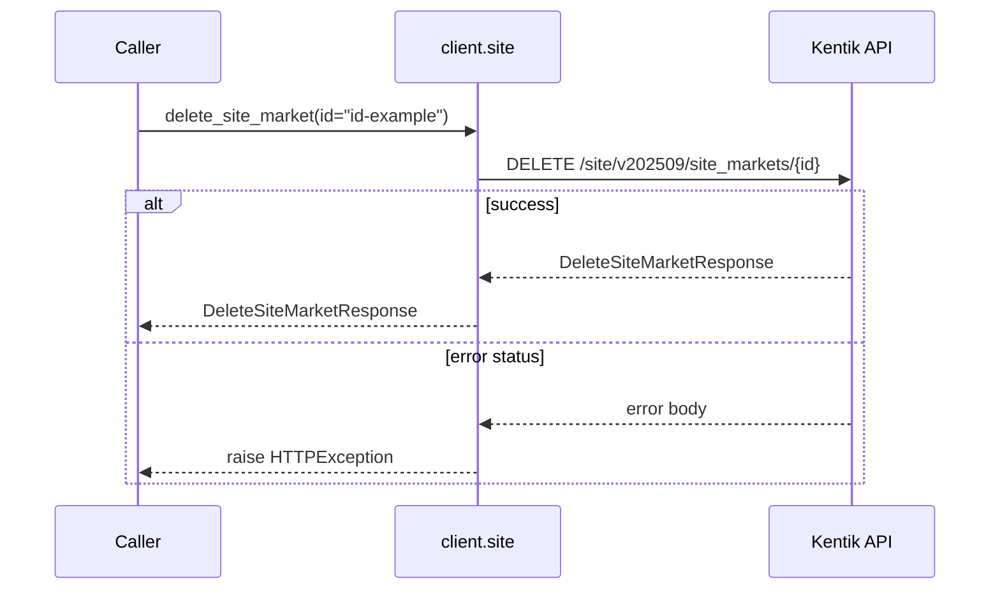

#### Parameters

| Name | In | Type | Required |
| --- | --- | --- | --- |
| `id` | path | `string` | Yes |

#### Responses

| Status | Description | Model |
| --- | --- | --- |
| 200 | A successful response. | `DeleteSiteMarketResponse` |
| default | An unexpected error response. | `rpcStatus` |

#### Example

```python
from kentik_api.client import KentikAPI

client = KentikAPI()  # loads KENTIK_EMAIL/KENTIK_API_TOKEN from .env
response = client.site.delete_site_market(
    id="id-example",
)
```

---

### `GET` `/site/v202509/sites`

List all sites.

Returns list of configured sites.

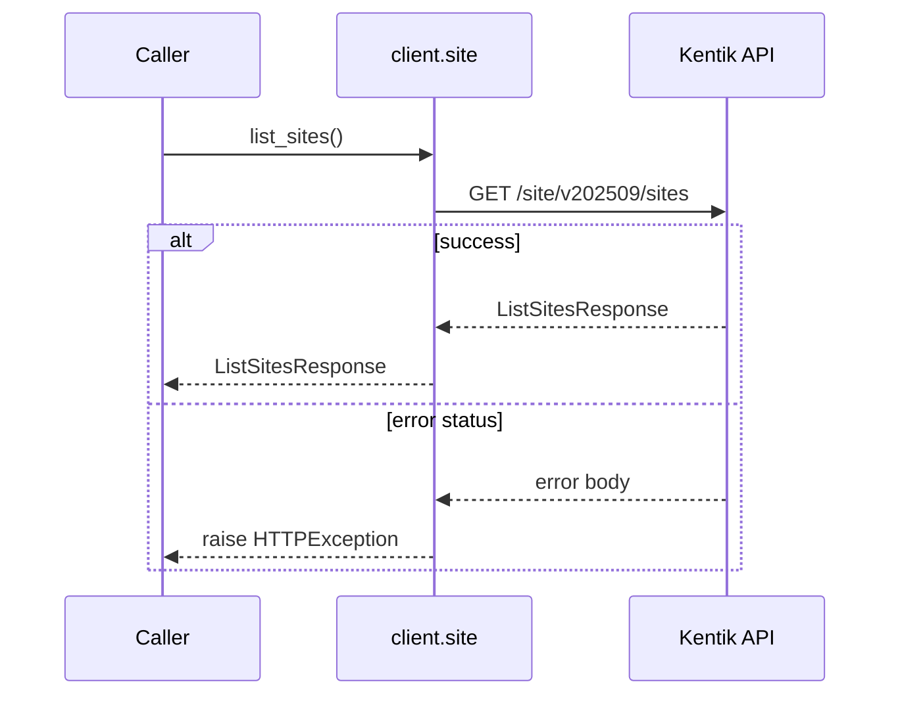

#### Responses

| Status | Description | Model |
| --- | --- | --- |
| 200 | A successful response. | `ListSitesResponse` |
| default | An unexpected error response. | `rpcStatus` |

#### Example

```python
from kentik_api.client import KentikAPI

client = KentikAPI()  # loads KENTIK_EMAIL/KENTIK_API_TOKEN from .env
response = client.site.list_sites()
```

---

### `POST` `/site/v202509/sites`

Configure a new site.

Create configuration for a new site. Returns the newly created configuration.

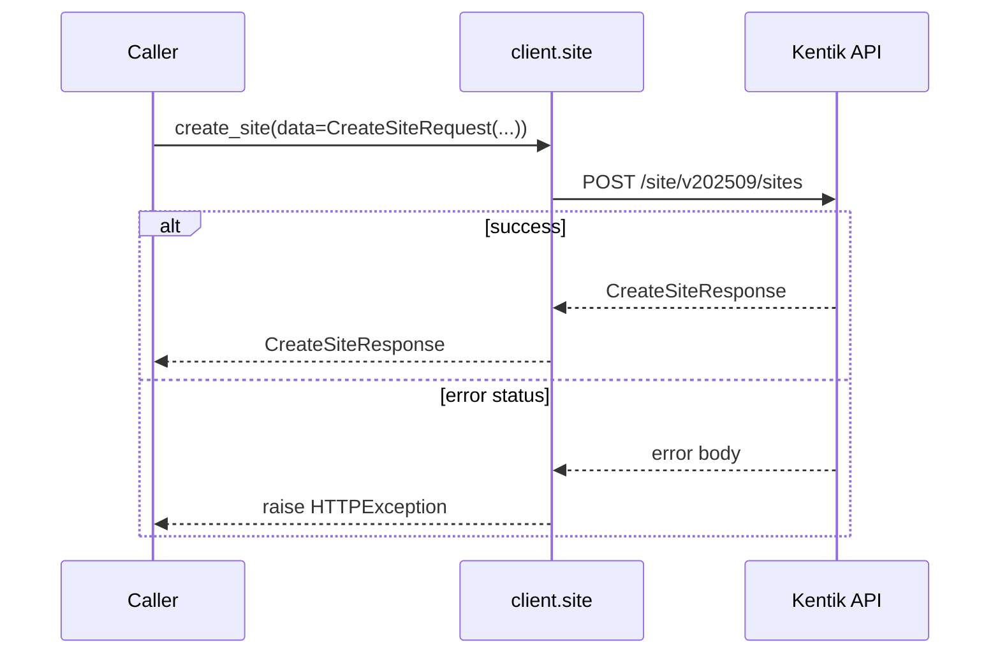

#### Parameters

| Name | In | Type | Required |
| --- | --- | --- | --- |
| `data` | body | `CreateSiteRequest` | Yes |

#### Responses

| Status | Description | Model |
| --- | --- | --- |
| 200 | A successful response. | `CreateSiteResponse` |
| default | An unexpected error response. | `rpcStatus` |

#### Example

```python
from kentik_api.client import KentikAPI

client = KentikAPI()  # loads KENTIK_EMAIL/KENTIK_API_TOKEN from .env
response = client.site.create_site(
    data=CreateSiteRequest(...),
)
```

---

### `GET` `/site/v202509/sites/{id}`

Retrieve configuration of a site.

Returns configuration of a site specified by ID.

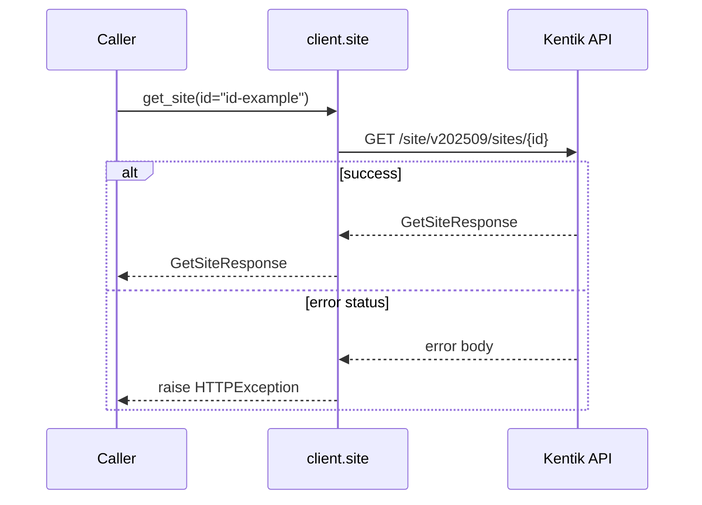

#### Parameters

| Name | In | Type | Required |
| --- | --- | --- | --- |
| `id` | path | `string` | Yes |

#### Responses

| Status | Description | Model |
| --- | --- | --- |
| 200 | A successful response. | `GetSiteResponse` |
| default | An unexpected error response. | `rpcStatus` |

#### Example

```python
from kentik_api.client import KentikAPI

client = KentikAPI()  # loads KENTIK_EMAIL/KENTIK_API_TOKEN from .env
response = client.site.get_site(
    id="id-example",
)
```

---

### `PUT` `/site/v202509/sites/{id}`

Updates configuration of a site.

Replaces configuration of a site with attributes in the request. Returns the updated configuration.

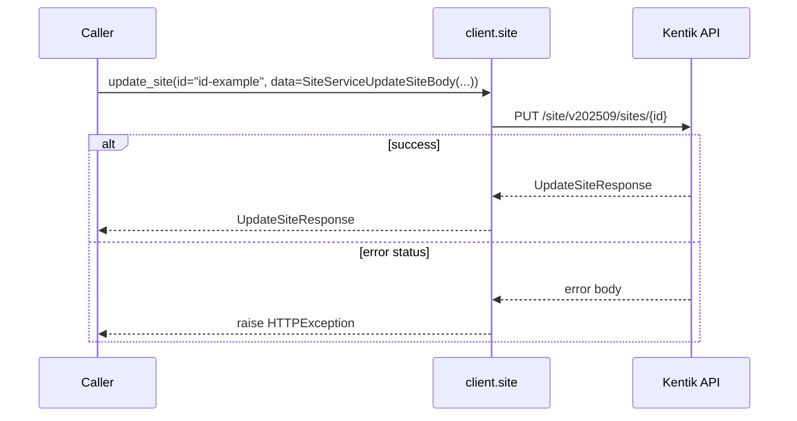

#### Parameters

| Name | In | Type | Required |
| --- | --- | --- | --- |
| `id` | path | `string` | Yes |
| `data` | body | `SiteServiceUpdateSiteBody` | Yes |

#### Responses

| Status | Description | Model |
| --- | --- | --- |
| 200 | A successful response. | `UpdateSiteResponse` |
| default | An unexpected error response. | `rpcStatus` |

#### Example

```python
from kentik_api.client import KentikAPI

client = KentikAPI()  # loads KENTIK_EMAIL/KENTIK_API_TOKEN from .env
response = client.site.update_site(
    id="id-example",
    data=SiteServiceUpdateSiteBody(...),
)
```

---

### `DELETE` `/site/v202509/sites/{id}`

Delete configuration of a site.

Deletes configuration of a site with specific ID.

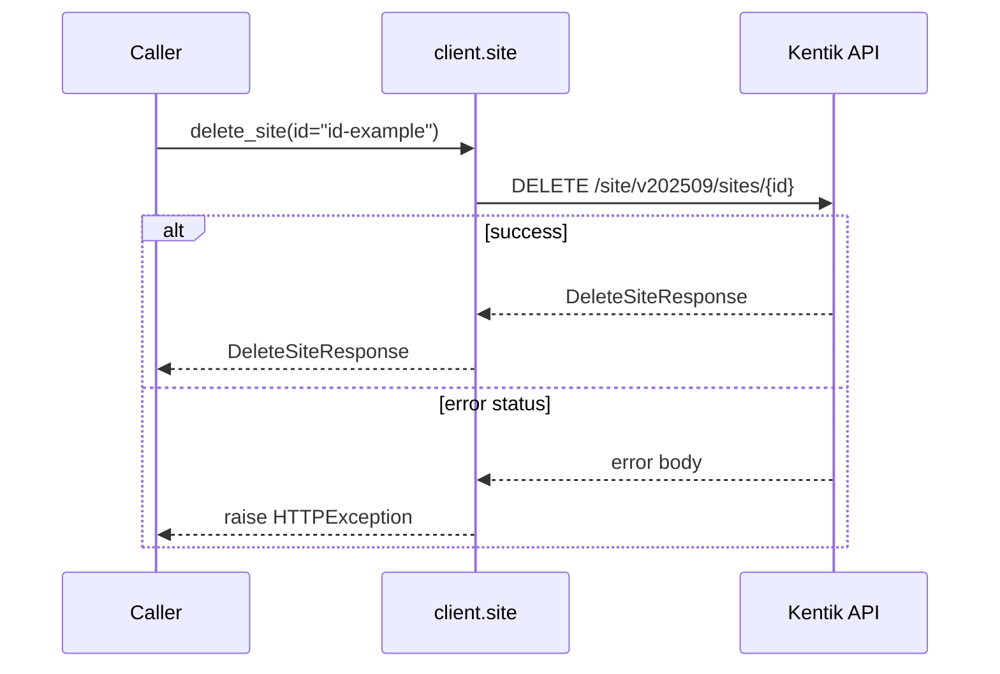

#### Parameters

| Name | In | Type | Required |
| --- | --- | --- | --- |
| `id` | path | `string` | Yes |

#### Responses

| Status | Description | Model |
| --- | --- | --- |
| 200 | A successful response. | `DeleteSiteResponse` |
| default | An unexpected error response. | `rpcStatus` |

#### Example

```python
from kentik_api.client import KentikAPI

client = KentikAPI()  # loads KENTIK_EMAIL/KENTIK_API_TOKEN from .env
response = client.site.delete_site(
    id="id-example",
)
```

## Data Models

<details>
<summary>Model relationships (18 of 24 models)</summary>

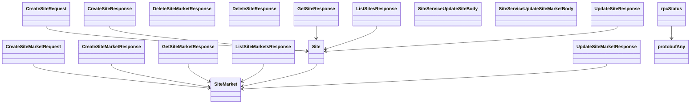

</details>

```{eval-rst}
.. autopydantic_model:: kentik_api.gen.site.models.CreateSiteMarketRequest
```

```{eval-rst}
.. autopydantic_model:: kentik_api.gen.site.models.CreateSiteMarketResponse
```

```{eval-rst}
.. autopydantic_model:: kentik_api.gen.site.models.CreateSiteRequest
```

```{eval-rst}
.. autopydantic_model:: kentik_api.gen.site.models.CreateSiteResponse
```

```{eval-rst}
.. autopydantic_model:: kentik_api.gen.site.models.DeleteSiteMarketResponse
```

```{eval-rst}
.. autopydantic_model:: kentik_api.gen.site.models.DeleteSiteResponse
```

```{eval-rst}
.. autopydantic_model:: kentik_api.gen.site.models.GetSiteMarketResponse
```

```{eval-rst}
.. autopydantic_model:: kentik_api.gen.site.models.GetSiteResponse
```

```{eval-rst}
.. autopydantic_model:: kentik_api.gen.site.models.Layer
```

```{eval-rst}
.. autopydantic_model:: kentik_api.gen.site.models.LayerSet
```

```{eval-rst}
.. autopydantic_model:: kentik_api.gen.site.models.ListSiteMarketsResponse
```

```{eval-rst}
.. autopydantic_model:: kentik_api.gen.site.models.ListSitesResponse
```

```{eval-rst}
.. autopydantic_model:: kentik_api.gen.site.models.PeeringDBSiteMapping
```

```{eval-rst}
.. autopydantic_model:: kentik_api.gen.site.models.PostalAddress
```

```{eval-rst}
.. autopydantic_model:: kentik_api.gen.site.models.Site
```

```{eval-rst}
.. autopydantic_model:: kentik_api.gen.site.models.SiteIpAddressClassification
```

```{eval-rst}
.. autopydantic_model:: kentik_api.gen.site.models.SiteMarket
```

```{eval-rst}
.. autopydantic_model:: kentik_api.gen.site.models.SiteServiceUpdateSiteBody
```

```{eval-rst}
.. autopydantic_model:: kentik_api.gen.site.models.SiteServiceUpdateSiteMarketBody
```

```{eval-rst}
.. autoclass:: kentik_api.gen.site.models.SiteType
   :members:
```

```{eval-rst}
.. autopydantic_model:: kentik_api.gen.site.models.UpdateSiteMarketResponse
```

```{eval-rst}
.. autopydantic_model:: kentik_api.gen.site.models.UpdateSiteResponse
```

```{eval-rst}
.. autopydantic_model:: kentik_api.gen.site.models.protobufAny
```

```{eval-rst}
.. autopydantic_model:: kentik_api.gen.site.models.rpcStatus
```
