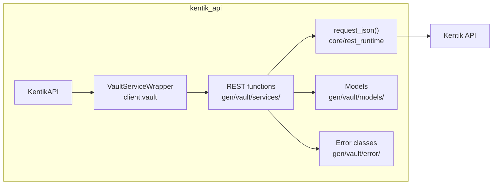
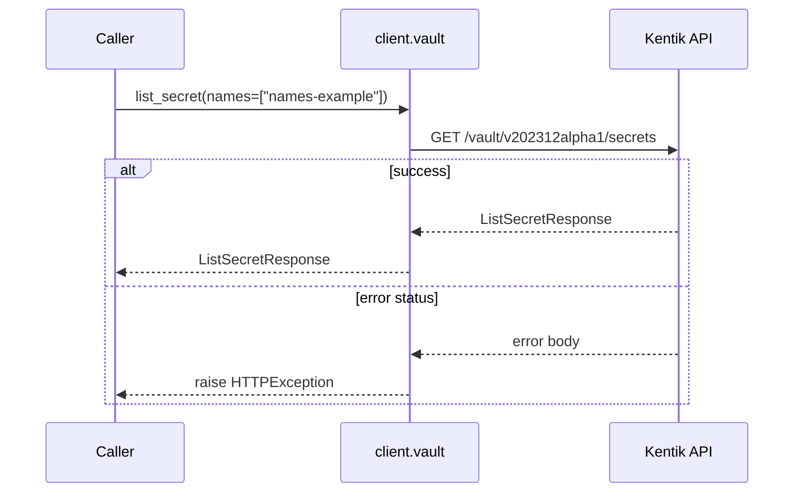
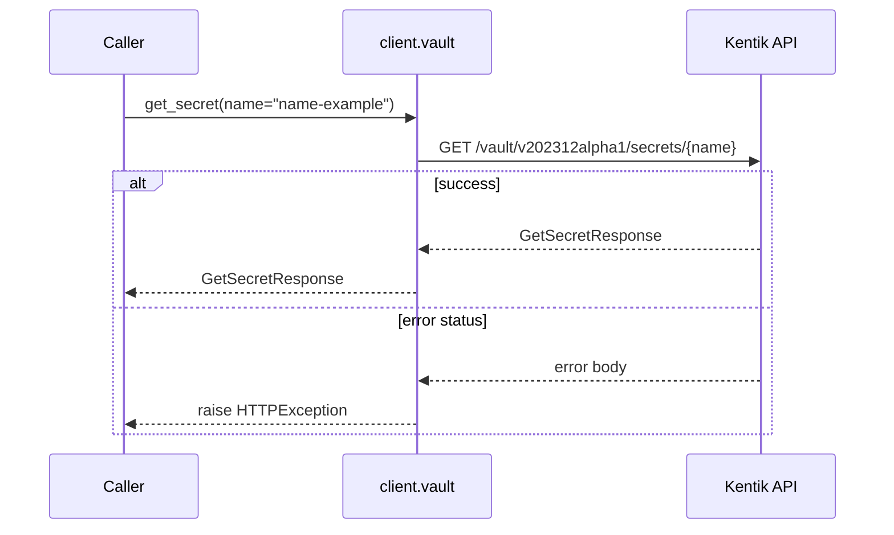
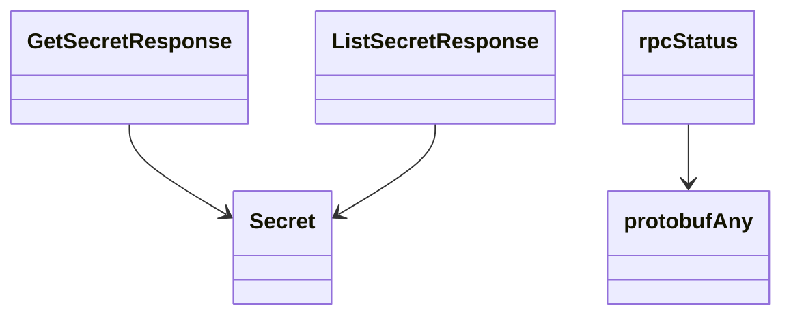

# Vault Service

## Overview



## Endpoints

### `GET` `/vault/v202312alpha1/secrets`

List secrets.

Returns list of secret values stored in Kentik vault.



#### Parameters

| Name | In | Type | Required |
| --- | --- | --- | --- |
| `names` | query | `string[]` | Yes |

#### Responses

| Status | Description | Model |
| --- | --- | --- |
| 200 | A successful response. | `ListSecretResponse` |
| default | An unexpected error response. | `rpcStatus` |

#### Example

```python
from kentik_api.client import KentikAPI

# Use protocol="grpc" to route through gRPC instead of REST.
# See docs/source/grpc_implementation_spec.md for current gRPC status.
client = KentikAPI(protocol="rest")  # loads KENTIK_EMAIL/KENTIK_API_TOKEN from .env
response = client.vault.list_secret(
    names=["names-example"],
)
```

---

### `GET` `/vault/v202312alpha1/secrets/{name}`

Get a secret by name.

Returns a secret value stored in Kentik vault.



#### Parameters

| Name | In | Type | Required |
| --- | --- | --- | --- |
| `name` | path | `string` | Yes |

#### Responses

| Status | Description | Model |
| --- | --- | --- |
| 200 | A successful response. | `GetSecretResponse` |
| default | An unexpected error response. | `rpcStatus` |

#### Example

```python
from kentik_api.client import KentikAPI

# Use protocol="grpc" to route through gRPC instead of REST.
# See docs/source/grpc_implementation_spec.md for current gRPC status.
client = KentikAPI(protocol="rest")  # loads KENTIK_EMAIL/KENTIK_API_TOKEN from .env
response = client.vault.get_secret(
    name="name-example",
)
```

## Data Models

<details>
<summary>Model relationships (5 of 6 models)</summary>



</details>

```{eval-rst}
.. autopydantic_model:: kentik_api.gen.vault.models.GetSecretResponse
```

```{eval-rst}
.. autopydantic_model:: kentik_api.gen.vault.models.ListSecretResponse
```

```{eval-rst}
.. autopydantic_model:: kentik_api.gen.vault.models.Secret
```

```{eval-rst}
.. autoclass:: kentik_api.gen.vault.models.SecretType
   :members:
```

```{eval-rst}
.. autopydantic_model:: kentik_api.gen.vault.models.protobufAny
```

```{eval-rst}
.. autopydantic_model:: kentik_api.gen.vault.models.rpcStatus
```
