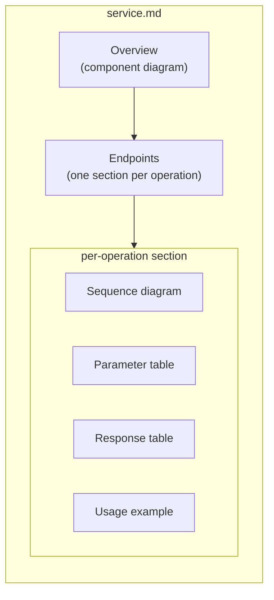

<!-- AUTO-GENERATED: scripts/generation/endpoint_docs.py, render_endpoint_docs() -->
<!-- Rebuilt on every `make generate`. Do not edit by hand. -->

# API Service Pages

One Markdown page per Kentik API service, generated by
[`scripts/generation/endpoint_docs.py`](../../scripts/generation/endpoint_docs.py). **Do not hand-edit these files**;
they are overwritten on every `make generate` run.

## What each page contains

## Services

| Service | Page | Description |
| --- | --- | --- |
| Ai Advisor | [ai_advisor.md](ai_advisor.md) | Create AI Advisor Chat Session |
| Alerting | [alerting.md](alerting.md) | List Alerts |
| As Group | [as_group.md](as_group.md) | List all AS groups. |
| Asset Tags | [asset_tags.md](asset_tags.md) | Gets tag values by asset id and type. |
| Audit | [audit.md](audit.md) | List Audit Events. |
| Bgp Monitoring | [bgp_monitoring.md](bgp_monitoring.md) | Get metrics for a BGP prefix. |
| Capacity Plan | [capacity_plan.md](capacity_plan.md) | List all capacity plans. |
| Cloud Export | [cloud_export.md](cloud_export.md) | List cloud exports. |
| Connectivity Checker | [connectivity_checker.md](connectivity_checker.md) | Create a Connectivity Checker Report. |
| Core | [core.md](core.md) | |
| Cost | [cost.md](cost.md) | List all cost providers. |
| Credential | [credential.md](credential.md) | List credential groups. |
| Custom Application | [custom_application.md](custom_application.md) | List Custom Applications |
| Custom Dimension | [custom_dimension.md](custom_dimension.md) | List Custom Dimensions |
| Device | [device.md](device.md) | List all devices. |
| Deviceconf | [deviceconf.md](deviceconf.md) | |
| Diagnostic | [diagnostic.md](diagnostic.md) | |
| Dictionary | [dictionary.md](dictionary.md) | Get Dictionary |
| Enrichments | [enrichments.md](enrichments.md) | Resolve enumeration IDs to values. |
| Flow Tag | [flow_tag.md](flow_tag.md) | Search flow tag configuration. |
| Interface | [interface.md](interface.md) | Fetch Search Interfaces |
| Journeys | [journeys.md](journeys.md) | Journeys AI NLQ Service |
| Kagent | [kagent.md](kagent.md) | List agents. |
| Kmi | [kmi.md](kmi.md) | List global KMI insights. |
| Kptr | [kptr.md](kptr.md) | |
| Ktbgp | [ktbgp.md](ktbgp.md) | Announce a BGP route to a specified set of devices |
| Label | [label.md](label.md) | List all configured labels |
| Mkp | [mkp.md](mkp.md) | List MKP packages. |
| Monitoring | [monitoring.md](monitoring.md) | |
| Net | [net.md](net.md) | |
| Network Class | [network_class.md](network_class.md) | Get a network classification. |
| Notification Channel | [notification_channel.md](notification_channel.md) | List available notification channels |
| Pathfinder | [pathfinder.md](pathfinder.md) | Create a Pathfinder Report. |
| Plan | [plan.md](plan.md) | List Plans |
| Rbux | [rbux.md](rbux.md) | List Focus Scopes |
| Saved Filter | [saved_filter.md](saved_filter.md) | Create Saved Filter |
| Site | [site.md](site.md) | List all site markets. |
| Synthetics | [synthetics.md](synthetics.md) | List agent alert configurations |
| User | [user.md](user.md) | List all users. |
| Vault | [vault.md](vault.md) | List secrets. |
