<!-- AUTO-GENERATED: scripts/generation/endpoint_docs.py, render_endpoint_docs() -->
<!-- Rebuilt on every `make generate`. Do not edit by hand. -->

# Alerting Service

## Overview

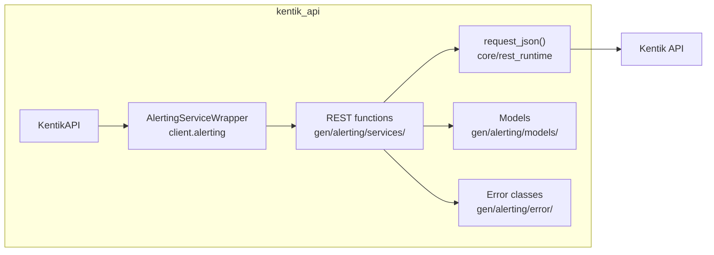

## Endpoints

### AlertService

#### `POST` `/v202505/alerts`

List Alerts

Returns an array of alert objects that contain information about individual alerts.

**REST transport**

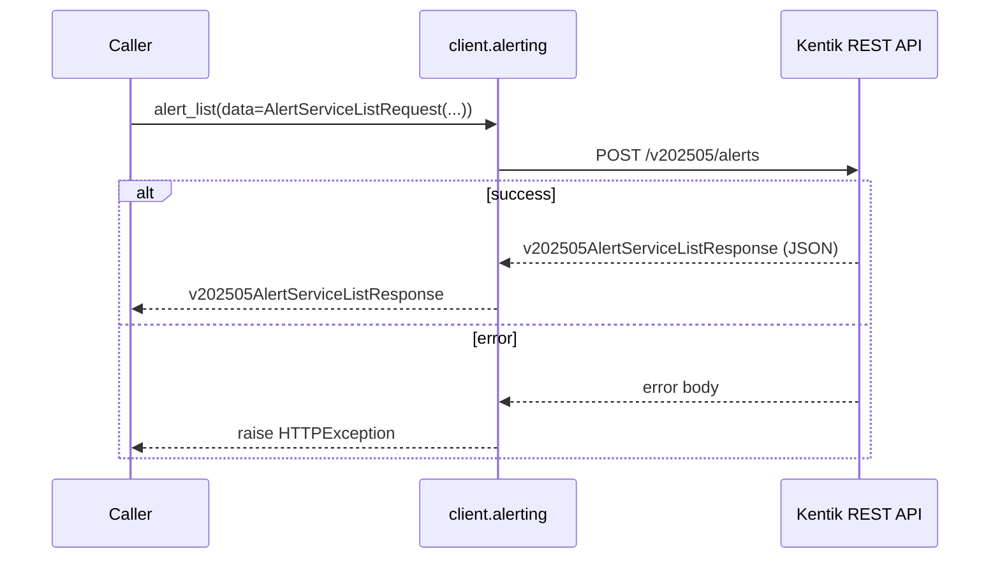

**gRPC transport**

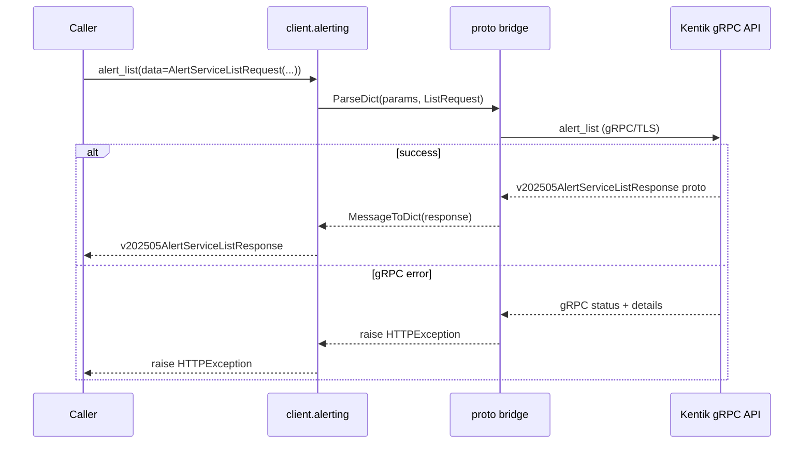

##### Parameters

| Name | In | Type | Required |
| --- | --- | --- | --- |
| `data` | body | `v202505AlertServiceListRequest` | Yes |

##### Responses

| Status | Description | Model |
| --- | --- | --- |
| 200 | A successful response. | `v202505AlertServiceListResponse` |
| default | An unexpected error response. | `rpcStatus` |

##### Example

```python
from kentik_api.client import KentikAPI

# Both transports work: protocol="rest" (default) or protocol="grpc".
client = KentikAPI(protocol="rest")  # loads KENTIK_EMAIL/KENTIK_API_TOKEN from .env
response = client.alerting.alert_list(
    data=AlertServiceListRequest(...),
)
```

---

#### `POST` `/v202505/alerts/clear`

Clear Alerts

Clears alerts.

**REST transport**

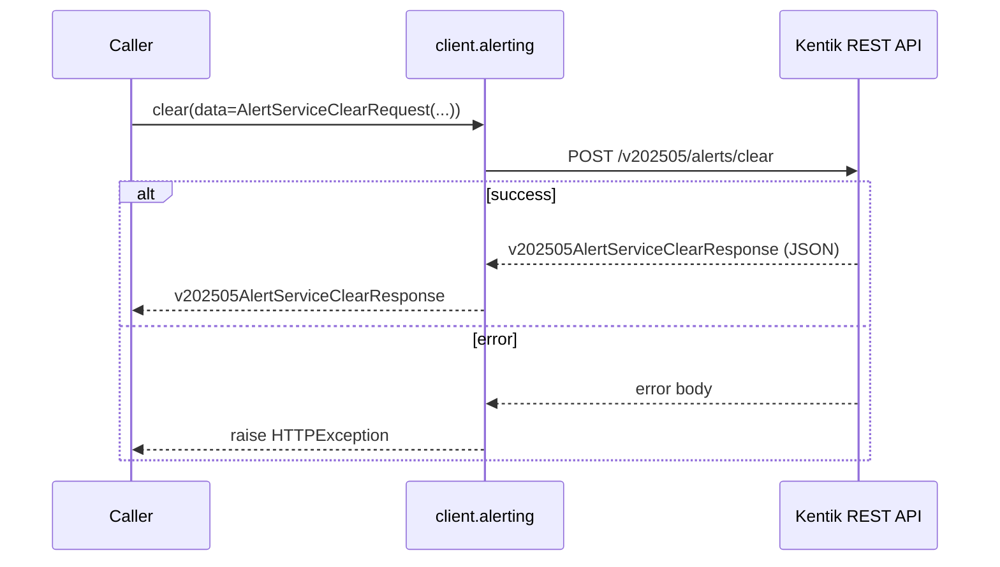

**gRPC transport**

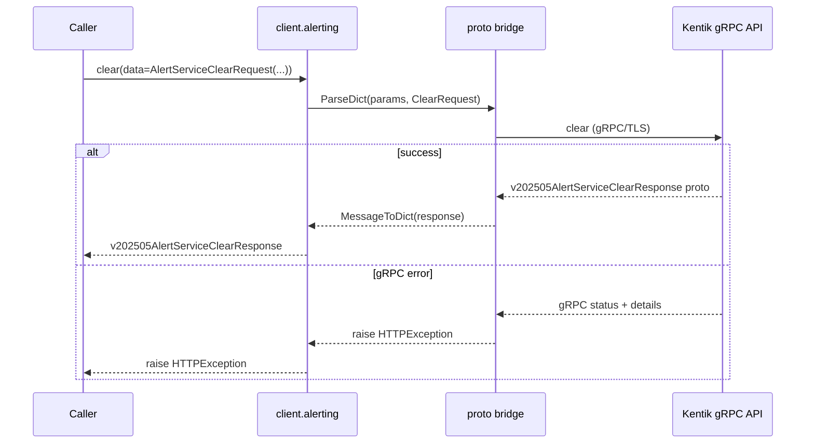

##### Parameters

| Name | In | Type | Required |
| --- | --- | --- | --- |
| `data` | body | `v202505AlertServiceClearRequest` | Yes |

##### Responses

| Status | Description | Model |
| --- | --- | --- |
| 200 | A successful response. | `v202505AlertServiceClearResponse` |
| default | An unexpected error response. | `rpcStatus` |

##### Example

```python
from kentik_api.client import KentikAPI

# Both transports work: protocol="rest" (default) or protocol="grpc".
client = KentikAPI(protocol="rest")  # loads KENTIK_EMAIL/KENTIK_API_TOKEN from .env
response = client.alerting.clear(
    data=AlertServiceClearRequest(...),
)
```

---

#### `GET` `/v202505/alerts/{alertId}/comments`

List Alert Comments

Returns all comments for an alert.

**REST transport**

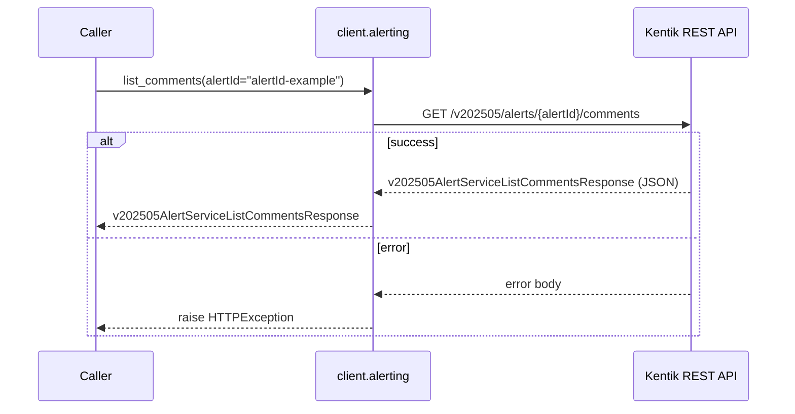

**gRPC transport**

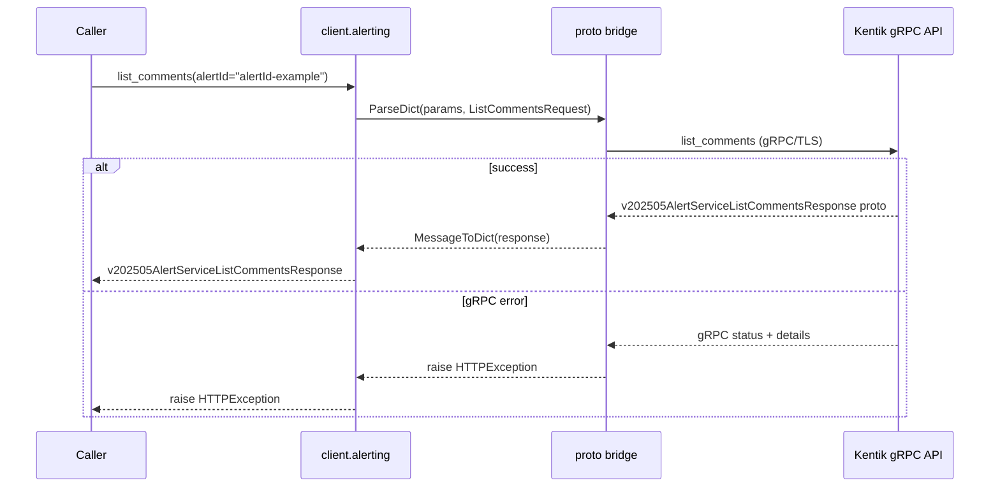

##### Parameters

| Name | In | Type | Required |
| --- | --- | --- | --- |
| `alertId` | path | `string` | Yes |

##### Responses

| Status | Description | Model |
| --- | --- | --- |
| 200 | A successful response. | `v202505AlertServiceListCommentsResponse` |
| default | An unexpected error response. | `rpcStatus` |

##### Example

```python
from kentik_api.client import KentikAPI

# Both transports work: protocol="rest" (default) or protocol="grpc".
client = KentikAPI(protocol="rest")  # loads KENTIK_EMAIL/KENTIK_API_TOKEN from .env
response = client.alerting.list_comments(
    alertId="alertId-example",
)
```

---

#### `POST` `/v202505/alerts/{alertId}/comments`

Add Alert Comment

Adds a comment to an alert.

**REST transport**

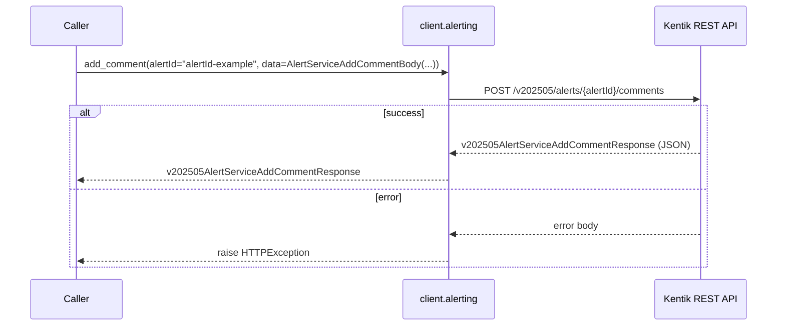

**gRPC transport**

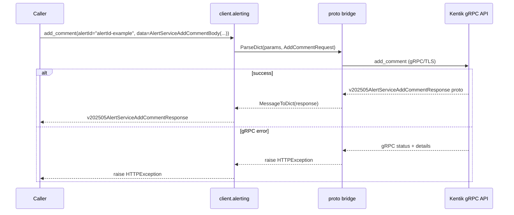

##### Parameters

| Name | In | Type | Required |
| --- | --- | --- | --- |
| `alertId` | path | `string` | Yes |
| `data` | body | `AlertServiceAddCommentBody` | Yes |

##### Responses

| Status | Description | Model |
| --- | --- | --- |
| 200 | A successful response. | `v202505AlertServiceAddCommentResponse` |
| default | An unexpected error response. | `rpcStatus` |

##### Example

```python
from kentik_api.client import KentikAPI

# Both transports work: protocol="rest" (default) or protocol="grpc".
client = KentikAPI(protocol="rest")  # loads KENTIK_EMAIL/KENTIK_API_TOKEN from .env
response = client.alerting.add_comment(
    alertId="alertId-example",
    data=AlertServiceAddCommentBody(...),
)
```

---

#### `PUT` `/v202505/alerts/{alertId}/external-context`

Set External Context for Alert

Add or replace external context

**REST transport**

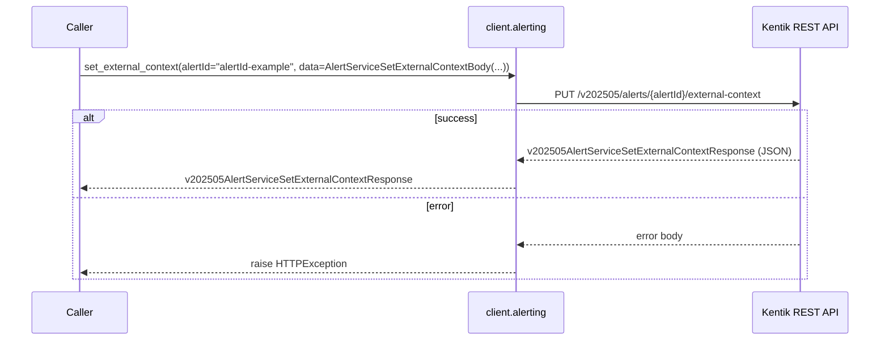

**gRPC transport**

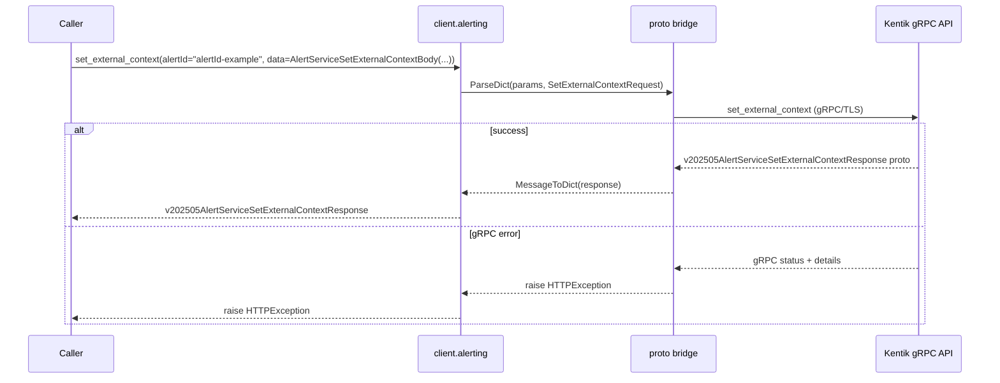

##### Parameters

| Name | In | Type | Required |
| --- | --- | --- | --- |
| `alertId` | path | `string` | Yes |
| `data` | body | `AlertServiceSetExternalContextBody` | Yes |

##### Responses

| Status | Description | Model |
| --- | --- | --- |
| 200 | A successful response. | `v202505AlertServiceSetExternalContextResponse` |
| default | An unexpected error response. | `rpcStatus` |

##### Example

```python
from kentik_api.client import KentikAPI

# Both transports work: protocol="rest" (default) or protocol="grpc".
client = KentikAPI(protocol="rest")  # loads KENTIK_EMAIL/KENTIK_API_TOKEN from .env
response = client.alerting.set_external_context(
    alertId="alertId-example",
    data=AlertServiceSetExternalContextBody(...),
)
```

---

#### `GET` `/v202505/alerts/{id}`

Get Alert

Returns an alert object that contains information about an individual alert.

**REST transport**

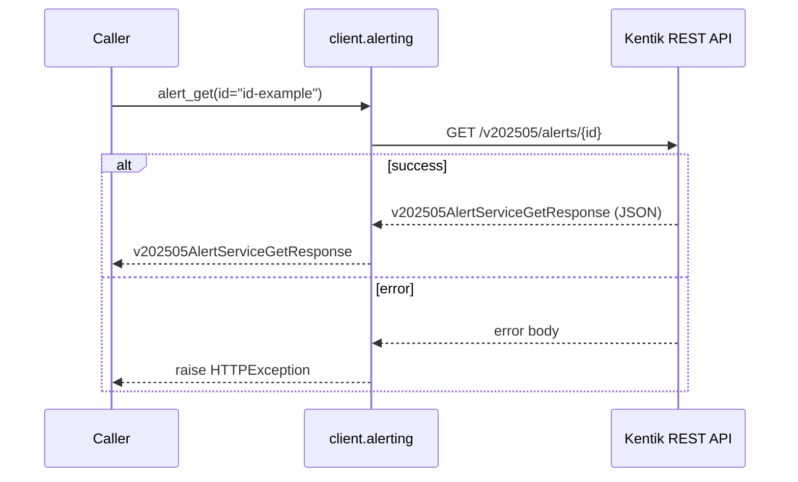

**gRPC transport**

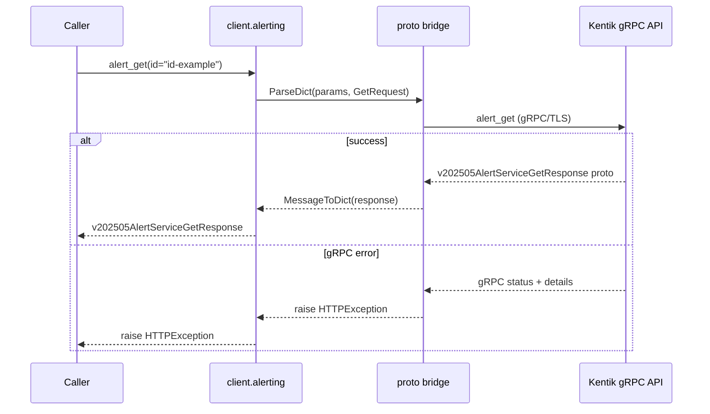

##### Parameters

| Name | In | Type | Required |
| --- | --- | --- | --- |
| `id` | path | `string` | Yes |

##### Responses

| Status | Description | Model |
| --- | --- | --- |
| 200 | A successful response. | `v202505AlertServiceGetResponse` |
| default | An unexpected error response. | `rpcStatus` |

##### Example

```python
from kentik_api.client import KentikAPI

# Both transports work: protocol="rest" (default) or protocol="grpc".
client = KentikAPI(protocol="rest")  # loads KENTIK_EMAIL/KENTIK_API_TOKEN from .env
response = client.alerting.alert_get(
    id="id-example",
)
```

---

#### `POST` `/v202505/alerts/{id}/ack`

Ack Alert

Acknowledges an alert.

**REST transport**

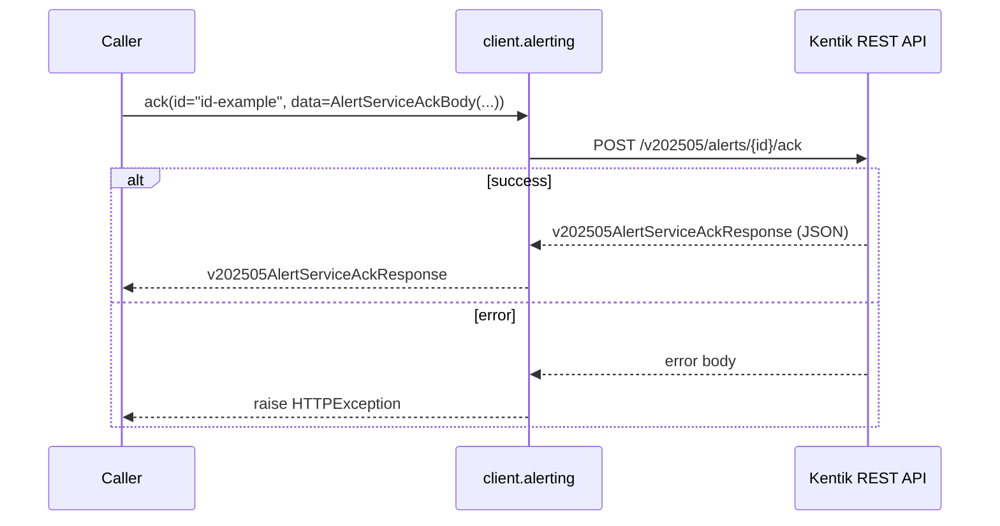

**gRPC transport**

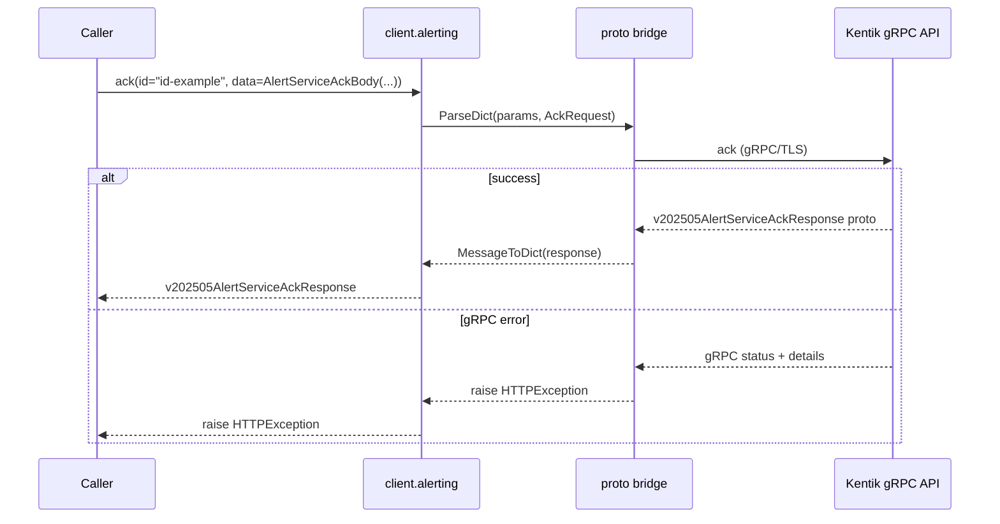

##### Parameters

| Name | In | Type | Required |
| --- | --- | --- | --- |
| `id` | path | `string` | Yes |
| `data` | body | `AlertServiceAckBody` | Yes |

##### Responses

| Status | Description | Model |
| --- | --- | --- |
| 200 | A successful response. | `v202505AlertServiceAckResponse` |
| default | An unexpected error response. | `rpcStatus` |

##### Example

```python
from kentik_api.client import KentikAPI

# Both transports work: protocol="rest" (default) or protocol="grpc".
client = KentikAPI(protocol="rest")  # loads KENTIK_EMAIL/KENTIK_API_TOKEN from .env
response = client.alerting.ack(
    id="id-example",
    data=AlertServiceAckBody(...),
)
```

---

#### `POST` `/v202505/alerts/{id}/unack`

UnAck Alert

Unacknowledges an alert (removes the acknowledgement).

**REST transport**

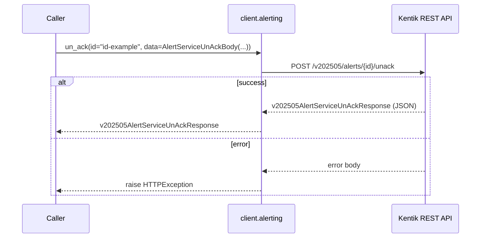

**gRPC transport**

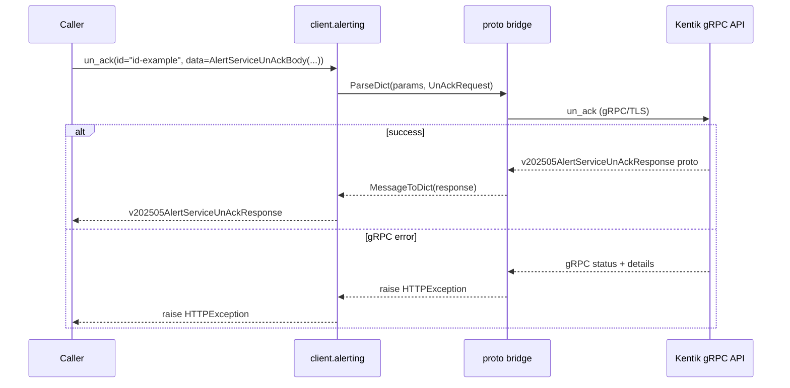

##### Parameters

| Name | In | Type | Required |
| --- | --- | --- | --- |
| `id` | path | `string` | Yes |
| `data` | body | `AlertServiceUnAckBody` | Yes |

##### Responses

| Status | Description | Model |
| --- | --- | --- |
| 200 | A successful response. | `v202505AlertServiceUnAckResponse` |
| default | An unexpected error response. | `rpcStatus` |

##### Example

```python
from kentik_api.client import KentikAPI

# Both transports work: protocol="rest" (default) or protocol="grpc".
client = KentikAPI(protocol="rest")  # loads KENTIK_EMAIL/KENTIK_API_TOKEN from .env
response = client.alerting.un_ack(
    id="id-example",
    data=AlertServiceUnAckBody(...),
)
```

### AlertAutoAckService

#### `POST` `/v202505/alerts/ack/auto`

Create Auto-Ack

Creates a new auto-ack configuration.

**REST transport**

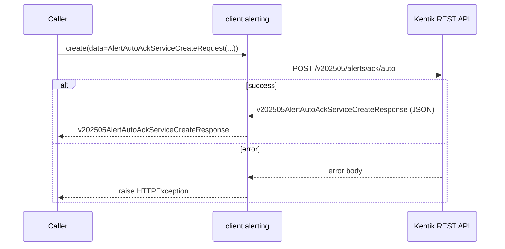

**gRPC transport**

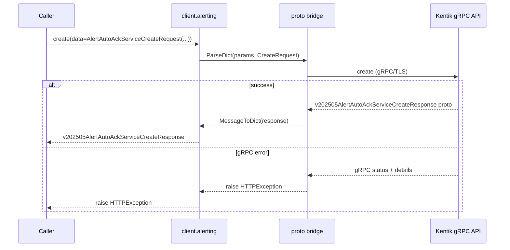

##### Parameters

| Name | In | Type | Required |
| --- | --- | --- | --- |
| `data` | body | `v202505AlertAutoAckServiceCreateRequest` | Yes |

##### Responses

| Status | Description | Model |
| --- | --- | --- |
| 200 | A successful response. | `v202505AlertAutoAckServiceCreateResponse` |
| default | An unexpected error response. | `rpcStatus` |

##### Example

```python
from kentik_api.client import KentikAPI

# Both transports work: protocol="rest" (default) or protocol="grpc".
client = KentikAPI(protocol="rest")  # loads KENTIK_EMAIL/KENTIK_API_TOKEN from .env
response = client.alerting.create(
    data=AlertAutoAckServiceCreateRequest(...),
)
```

---

#### `POST` `/v202505/alerts/ack/auto/list`

List Auto-Acks

Returns a list of auto-ack configurations.

**REST transport**

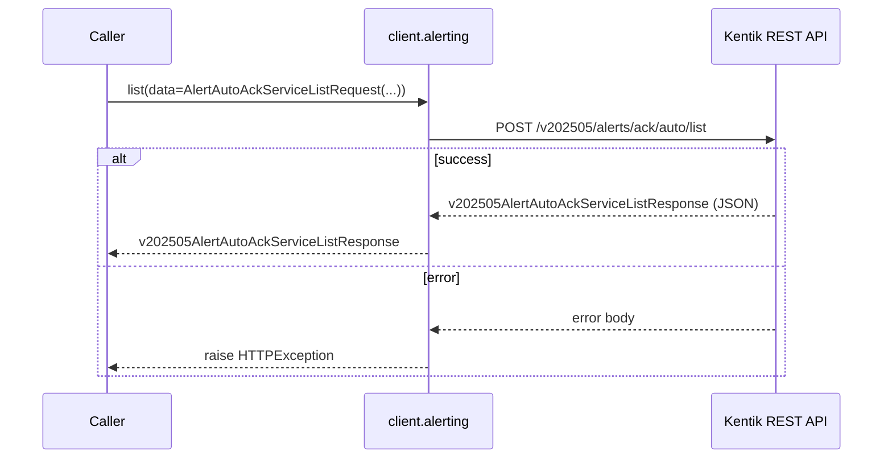

**gRPC transport**

```mermaid
sequenceDiagram
    participant C as Caller
    participant W as client.alerting
    participant B as proto bridge
    participant API as Kentik gRPC API

    C->>W: list(data=AlertAutoAckServiceListRequest(...))
    W->>B: ParseDict(params, ListRequest)
    B->>API: list (gRPC/TLS)
    alt success
        API-->>B: v202505AlertAutoAckServiceListResponse proto
        B-->>W: MessageToDict(response)
        W-->>C: v202505AlertAutoAckServiceListResponse
    else gRPC error
        API-->>B: gRPC status + details
        B-->>W: raise HTTPException
        W-->>C: raise HTTPException
    end
```

##### Parameters

| Name | In | Type | Required |
| --- | --- | --- | --- |
| `data` | body | `v202505AlertAutoAckServiceListRequest` | Yes |

##### Responses

| Status | Description | Model |
| --- | --- | --- |
| 200 | A successful response. | `v202505AlertAutoAckServiceListResponse` |
| default | An unexpected error response. | `rpcStatus` |

##### Example

```python
from kentik_api.client import KentikAPI

# Both transports work: protocol="rest" (default) or protocol="grpc".
client = KentikAPI(protocol="rest")  # loads KENTIK_EMAIL/KENTIK_API_TOKEN from .env
response = client.alerting.list(
    data=AlertAutoAckServiceListRequest(...),
)
```

---

#### `GET` `/v202505/alerts/ack/auto/{autoAck.id}`

Get Auto-Ack

Returns an auto-ack configuration.

**REST transport**

```mermaid
sequenceDiagram
    participant C as Caller
    participant W as client.alerting
    participant API as Kentik REST API

    C->>W: get(autoAckid="autoAckid-example")
    W->>API: GET /v202505/alerts/ack/auto/{autoAck.id}
    alt success
        API-->>W: v202505AlertAutoAckServiceGetResponse (JSON)
        W-->>C: v202505AlertAutoAckServiceGetResponse
    else error
        API-->>W: error body
        W-->>C: raise HTTPException
    end
```

**gRPC transport**

```mermaid
sequenceDiagram
    participant C as Caller
    participant W as client.alerting
    participant B as proto bridge
    participant API as Kentik gRPC API

    C->>W: get(autoAckid="autoAckid-example")
    W->>B: ParseDict(params, GetRequest)
    B->>API: get (gRPC/TLS)
    alt success
        API-->>B: v202505AlertAutoAckServiceGetResponse proto
        B-->>W: MessageToDict(response)
        W-->>C: v202505AlertAutoAckServiceGetResponse
    else gRPC error
        API-->>B: gRPC status + details
        B-->>W: raise HTTPException
        W-->>C: raise HTTPException
    end
```

##### Parameters

| Name | In | Type | Required |
| --- | --- | --- | --- |
| `autoAckid` | path | `string` | Yes |

##### Responses

| Status | Description | Model |
| --- | --- | --- |
| 200 | A successful response. | `v202505AlertAutoAckServiceGetResponse` |
| default | An unexpected error response. | `rpcStatus` |

##### Example

```python
from kentik_api.client import KentikAPI

# Both transports work: protocol="rest" (default) or protocol="grpc".
client = KentikAPI(protocol="rest")  # loads KENTIK_EMAIL/KENTIK_API_TOKEN from .env
response = client.alerting.get(
    autoAckid="autoAckid-example",
)
```

---

#### `PATCH` `/v202505/alerts/ack/auto/{autoAck.id}`

Replace Auto-Ack

Replaces an auto-ack configuration.

**REST transport**

```mermaid
sequenceDiagram
    participant C as Caller
    participant W as client.alerting
    participant API as Kentik REST API

    C->>W: replace(autoAckid="autoAckid-example", data=AlertAutoAckServiceReplaceBody(...))
    W->>API: PATCH /v202505/alerts/ack/auto/{autoAck.id}
    alt success
        API-->>W: v202505AlertAutoAckServiceReplaceResponse (JSON)
        W-->>C: v202505AlertAutoAckServiceReplaceResponse
    else error
        API-->>W: error body
        W-->>C: raise HTTPException
    end
```

**gRPC transport**

```mermaid
sequenceDiagram
    participant C as Caller
    participant W as client.alerting
    participant B as proto bridge
    participant API as Kentik gRPC API

    C->>W: replace(autoAckid="autoAckid-example", data=AlertAutoAckServiceReplaceBody(...))
    W->>B: ParseDict(params, ReplaceRequest)
    B->>API: replace (gRPC/TLS)
    alt success
        API-->>B: v202505AlertAutoAckServiceReplaceResponse proto
        B-->>W: MessageToDict(response)
        W-->>C: v202505AlertAutoAckServiceReplaceResponse
    else gRPC error
        API-->>B: gRPC status + details
        B-->>W: raise HTTPException
        W-->>C: raise HTTPException
    end
```

##### Parameters

| Name | In | Type | Required |
| --- | --- | --- | --- |
| `autoAckid` | path | `string` | Yes |
| `data` | body | `v202505AlertAutoAckServiceReplaceBody` | Yes |

##### Responses

| Status | Description | Model |
| --- | --- | --- |
| 200 | A successful response. | `v202505AlertAutoAckServiceReplaceResponse` |
| default | An unexpected error response. | `rpcStatus` |

##### Example

```python
from kentik_api.client import KentikAPI

# Both transports work: protocol="rest" (default) or protocol="grpc".
client = KentikAPI(protocol="rest")  # loads KENTIK_EMAIL/KENTIK_API_TOKEN from .env
response = client.alerting.replace(
    autoAckid="autoAckid-example",
    data=AlertAutoAckServiceReplaceBody(...),
)
```

---

#### `DELETE` `/v202505/alerts/ack/auto/{autoAck.id}`

Delete Auto-Ack

Deletes an auto-ack configuration.

**REST transport**

```mermaid
sequenceDiagram
    participant C as Caller
    participant W as client.alerting
    participant API as Kentik REST API

    C->>W: delete(autoAckid="autoAckid-example")
    W->>API: DELETE /v202505/alerts/ack/auto/{autoAck.id}
    alt success
        API-->>W: v202505AlertAutoAckServiceDeleteResponse (JSON)
        W-->>C: v202505AlertAutoAckServiceDeleteResponse
    else error
        API-->>W: error body
        W-->>C: raise HTTPException
    end
```

**gRPC transport**

```mermaid
sequenceDiagram
    participant C as Caller
    participant W as client.alerting
    participant B as proto bridge
    participant API as Kentik gRPC API

    C->>W: delete(autoAckid="autoAckid-example")
    W->>B: ParseDict(params, DeleteRequest)
    B->>API: delete (gRPC/TLS)
    alt success
        API-->>B: v202505AlertAutoAckServiceDeleteResponse proto
        B-->>W: MessageToDict(response)
        W-->>C: v202505AlertAutoAckServiceDeleteResponse
    else gRPC error
        API-->>B: gRPC status + details
        B-->>W: raise HTTPException
        W-->>C: raise HTTPException
    end
```

##### Parameters

| Name | In | Type | Required |
| --- | --- | --- | --- |
| `autoAckid` | path | `string` | Yes |

##### Responses

| Status | Description | Model |
| --- | --- | --- |
| 200 | A successful response. | `v202505AlertAutoAckServiceDeleteResponse` |
| default | An unexpected error response. | `rpcStatus` |

##### Example

```python
from kentik_api.client import KentikAPI

# Both transports work: protocol="rest" (default) or protocol="grpc".
client = KentikAPI(protocol="rest")  # loads KENTIK_EMAIL/KENTIK_API_TOKEN from .env
response = client.alerting.delete(
    autoAckid="autoAckid-example",
)
```

### MitigationsService

#### `GET` `/v202505/mitigations`

List Mitigations

Returns a list of mitigations.

**REST transport**

```mermaid
sequenceDiagram
    participant C as Caller
    participant W as client.alerting
    participant API as Kentik REST API

    C->>W: mitigations_list()
    W->>API: GET /v202505/mitigations
    alt success
        API-->>W: v202505MitigationsServiceListResponse (JSON)
        W-->>C: v202505MitigationsServiceListResponse
    else error
        API-->>W: error body
        W-->>C: raise HTTPException
    end
```

**gRPC transport**

```mermaid
sequenceDiagram
    participant C as Caller
    participant W as client.alerting
    participant B as proto bridge
    participant API as Kentik gRPC API

    C->>W: mitigations_list()
    W->>B: ParseDict(params, ListRequest)
    B->>API: mitigations_list (gRPC/TLS)
    alt success
        API-->>B: v202505MitigationsServiceListResponse proto
        B-->>W: MessageToDict(response)
        W-->>C: v202505MitigationsServiceListResponse
    else gRPC error
        API-->>B: gRPC status + details
        B-->>W: raise HTTPException
        W-->>C: raise HTTPException
    end
```

##### Parameters

| Name | In | Type | Required |
| --- | --- | --- | --- |
| `paginationlimit` | query | `string (uint64)` | No |
| `paginationoffset` | query | `string (uint64)` | No |
| `paginationincludeTotalCount` | query | `boolean` | No |
| `filterscreatedAtstart` | query | `string (date-time)` | No |
| `filterscreatedAtend` | query | `string (date-time)` | No |
| `filtersmitigationIds` | query | `string[]` | No |
| `filtersalarmIds` | query | `string[]` | No |
| `filtersstates` | query | `string[]` | No |
| `filtersplatformIds` | query | `string[]` | No |
| `filtersmethodIds` | query | `string[]` | No |
| `filtersipCidrs` | query | `string[]` | No |
| `filtersipCidrPattern` | query | `string` | No |
| `filterstypes` | query | `string[]` | No |

##### Responses

| Status | Description | Model |
| --- | --- | --- |
| 200 | A successful response. | `v202505MitigationsServiceListResponse` |
| default | An unexpected error response. | `rpcStatus` |

##### Example

```python
from kentik_api.client import KentikAPI

# Both transports work: protocol="rest" (default) or protocol="grpc".
client = KentikAPI(protocol="rest")  # loads KENTIK_EMAIL/KENTIK_API_TOKEN from .env
response = client.alerting.mitigations_list()
```

---

#### `POST` `/v202505/mitigations`

Create Mitigation

Creates a new manual mitigation.

**REST transport**

```mermaid
sequenceDiagram
    participant C as Caller
    participant W as client.alerting
    participant API as Kentik REST API

    C->>W: mitigations_create(data=MitigationsServiceCreateRequest(...))
    W->>API: POST /v202505/mitigations
    alt success
        API-->>W: v202505MitigationsServiceCreateResponse (JSON)
        W-->>C: v202505MitigationsServiceCreateResponse
    else error
        API-->>W: error body
        W-->>C: raise HTTPException
    end
```

**gRPC transport**

```mermaid
sequenceDiagram
    participant C as Caller
    participant W as client.alerting
    participant B as proto bridge
    participant API as Kentik gRPC API

    C->>W: mitigations_create(data=MitigationsServiceCreateRequest(...))
    W->>B: ParseDict(params, CreateRequest)
    B->>API: mitigations_create (gRPC/TLS)
    alt success
        API-->>B: v202505MitigationsServiceCreateResponse proto
        B-->>W: MessageToDict(response)
        W-->>C: v202505MitigationsServiceCreateResponse
    else gRPC error
        API-->>B: gRPC status + details
        B-->>W: raise HTTPException
        W-->>C: raise HTTPException
    end
```

##### Parameters

| Name | In | Type | Required |
| --- | --- | --- | --- |
| `data` | body | `v202505MitigationsServiceCreateRequest` | Yes |

##### Responses

| Status | Description | Model |
| --- | --- | --- |
| 200 | A successful response. | `v202505MitigationsServiceCreateResponse` |
| default | An unexpected error response. | `rpcStatus` |

##### Example

```python
from kentik_api.client import KentikAPI

# Both transports work: protocol="rest" (default) or protocol="grpc".
client = KentikAPI(protocol="rest")  # loads KENTIK_EMAIL/KENTIK_API_TOKEN from .env
response = client.alerting.mitigations_create(
    data=MitigationsServiceCreateRequest(...),
)
```

---

#### `GET` `/v202505/mitigations/actions`

Get Available Actions

Returns available actions for mitigations.

**REST transport**

```mermaid
sequenceDiagram
    participant C as Caller
    participant W as client.alerting
    participant API as Kentik REST API

    C->>W: available_actions()
    W->>API: GET /v202505/mitigations/actions
    alt success
        API-->>W: v202505MitigationsServiceAvailableActionsResponse (JSON)
        W-->>C: v202505MitigationsServiceAvailableActionsResponse
    else error
        API-->>W: error body
        W-->>C: raise HTTPException
    end
```

**gRPC transport**

```mermaid
sequenceDiagram
    participant C as Caller
    participant W as client.alerting
    participant B as proto bridge
    participant API as Kentik gRPC API

    C->>W: available_actions()
    W->>B: ParseDict(params, AvailableActionsRequest)
    B->>API: available_actions (gRPC/TLS)
    alt success
        API-->>B: v202505MitigationsServiceAvailableActionsResponse proto
        B-->>W: MessageToDict(response)
        W-->>C: v202505MitigationsServiceAvailableActionsResponse
    else gRPC error
        API-->>B: gRPC status + details
        B-->>W: raise HTTPException
        W-->>C: raise HTTPException
    end
```

##### Responses

| Status | Description | Model |
| --- | --- | --- |
| 200 | A successful response. | `v202505MitigationsServiceAvailableActionsResponse` |
| default | An unexpected error response. | `rpcStatus` |

##### Example

```python
from kentik_api.client import KentikAPI

# Both transports work: protocol="rest" (default) or protocol="grpc".
client = KentikAPI(protocol="rest")  # loads KENTIK_EMAIL/KENTIK_API_TOKEN from .env
response = client.alerting.available_actions()
```

---

#### `GET` `/v202505/mitigations/{action}`

Get Mitigation

Returns a mitigation.

**REST transport**

```mermaid
sequenceDiagram
    participant C as Caller
    participant W as client.alerting
    participant API as Kentik REST API

    C->>W: mitigations_get(action="action-example")
    W->>API: GET /v202505/mitigations/{action}
    alt success
        API-->>W: v202505MitigationsServiceGetResponse (JSON)
        W-->>C: v202505MitigationsServiceGetResponse
    else error
        API-->>W: error body
        W-->>C: raise HTTPException
    end
```

**gRPC transport**

```mermaid
sequenceDiagram
    participant C as Caller
    participant W as client.alerting
    participant B as proto bridge
    participant API as Kentik gRPC API

    C->>W: mitigations_get(action="action-example")
    W->>B: ParseDict(params, GetRequest)
    B->>API: mitigations_get (gRPC/TLS)
    alt success
        API-->>B: v202505MitigationsServiceGetResponse proto
        B-->>W: MessageToDict(response)
        W-->>C: v202505MitigationsServiceGetResponse
    else gRPC error
        API-->>B: gRPC status + details
        B-->>W: raise HTTPException
        W-->>C: raise HTTPException
    end
```

##### Parameters

| Name | In | Type | Required |
| --- | --- | --- | --- |
| `action` | path | `string` | Yes |

##### Responses

| Status | Description | Model |
| --- | --- | --- |
| 200 | A successful response. | `v202505MitigationsServiceGetResponse` |
| default | An unexpected error response. | `rpcStatus` |

##### Example

```python
from kentik_api.client import KentikAPI

# Both transports work: protocol="rest" (default) or protocol="grpc".
client = KentikAPI(protocol="rest")  # loads KENTIK_EMAIL/KENTIK_API_TOKEN from .env
response = client.alerting.mitigations_get(
    action="action-example",
)
```

---

#### `POST` `/v202505/mitigations/{action}`

Act on Mitigation

Performs an action on one or more mitigations.

**REST transport**

```mermaid
sequenceDiagram
    participant C as Caller
    participant W as client.alerting
    participant API as Kentik REST API

    C->>W: act(action="action-example", data=MitigationsServiceActBody(...))
    W->>API: POST /v202505/mitigations/{action}
    alt success
        API-->>W: v202505MitigationsServiceActResponse (JSON)
        W-->>C: v202505MitigationsServiceActResponse
    else error
        API-->>W: error body
        W-->>C: raise HTTPException
    end
```

**gRPC transport**

```mermaid
sequenceDiagram
    participant C as Caller
    participant W as client.alerting
    participant B as proto bridge
    participant API as Kentik gRPC API

    C->>W: act(action="action-example", data=MitigationsServiceActBody(...))
    W->>B: ParseDict(params, ActRequest)
    B->>API: act (gRPC/TLS)
    alt success
        API-->>B: v202505MitigationsServiceActResponse proto
        B-->>W: MessageToDict(response)
        W-->>C: v202505MitigationsServiceActResponse
    else gRPC error
        API-->>B: gRPC status + details
        B-->>W: raise HTTPException
        W-->>C: raise HTTPException
    end
```

##### Parameters

| Name | In | Type | Required |
| --- | --- | --- | --- |
| `action` | path | `string` | Yes |
| `data` | body | `MitigationsServiceActBody` | Yes |

##### Responses

| Status | Description | Model |
| --- | --- | --- |
| 200 | A successful response. | `v202505MitigationsServiceActResponse` |
| default | An unexpected error response. | `rpcStatus` |

##### Example

```python
from kentik_api.client import KentikAPI

# Both transports work: protocol="rest" (default) or protocol="grpc".
client = KentikAPI(protocol="rest")  # loads KENTIK_EMAIL/KENTIK_API_TOKEN from .env
response = client.alerting.act(
    action="action-example",
    data=MitigationsServiceActBody(...),
)
```

---

#### `GET` `/v202505/mitigations/{id}/actions`

Get Available Actions for Mitigation

Returns available actions for a specific mitigation.

**REST transport**

```mermaid
sequenceDiagram
    participant C as Caller
    participant W as client.alerting
    participant API as Kentik REST API

    C->>W: available_actions_for_mitigation(id="id-example")
    W->>API: GET /v202505/mitigations/{id}/actions
    alt success
        API-->>W: v202505MitigationsServiceAvailableActionsForMitigationResponse (JSON)
        W-->>C: v202505MitigationsServiceAvailableActionsForMitigationResponse
    else error
        API-->>W: error body
        W-->>C: raise HTTPException
    end
```

**gRPC transport**

```mermaid
sequenceDiagram
    participant C as Caller
    participant W as client.alerting
    participant B as proto bridge
    participant API as Kentik gRPC API

    C->>W: available_actions_for_mitigation(id="id-example")
    W->>B: ParseDict(params, AvailableActionsForMitigationRequest)
    B->>API: available_actions_for_mitigation (gRPC/TLS)
    alt success
        API-->>B: v202505MitigationsServiceAvailableActionsForMitigationResponse proto
        B-->>W: MessageToDict(response)
        W-->>C: v202505MitigationsServiceAvailableActionsForMitigationResponse
    else gRPC error
        API-->>B: gRPC status + details
        B-->>W: raise HTTPException
        W-->>C: raise HTTPException
    end
```

##### Parameters

| Name | In | Type | Required |
| --- | --- | --- | --- |
| `id` | path | `string (int64)` | Yes |

##### Responses

| Status | Description | Model |
| --- | --- | --- |
| 200 | A successful response. | `v202505MitigationsServiceAvailableActionsForMitigationResponse` |
| default | An unexpected error response. | `rpcStatus` |

##### Example

```python
from kentik_api.client import KentikAPI

# Both transports work: protocol="rest" (default) or protocol="grpc".
client = KentikAPI(protocol="rest")  # loads KENTIK_EMAIL/KENTIK_API_TOKEN from .env
response = client.alerting.available_actions_for_mitigation(
    id="id-example",
)
```

### MitigationMethodsService

#### `GET` `/v202505/mitigations/methods`

List Mitigation Methods

Returns a list of mitigation methods.

**REST transport**

```mermaid
sequenceDiagram
    participant C as Caller
    participant W as client.alerting
    participant API as Kentik REST API

    C->>W: mitigation_methods_list()
    W->>API: GET /v202505/mitigations/methods
    alt success
        API-->>W: v202505MitigationMethodsServiceListResponse (JSON)
        W-->>C: v202505MitigationMethodsServiceListResponse
    else error
        API-->>W: error body
        W-->>C: raise HTTPException
    end
```

**gRPC transport**

```mermaid
sequenceDiagram
    participant C as Caller
    participant W as client.alerting
    participant B as proto bridge
    participant API as Kentik gRPC API

    C->>W: mitigation_methods_list()
    W->>B: ParseDict(params, ListRequest)
    B->>API: mitigation_methods_list (gRPC/TLS)
    alt success
        API-->>B: v202505MitigationMethodsServiceListResponse proto
        B-->>W: MessageToDict(response)
        W-->>C: v202505MitigationMethodsServiceListResponse
    else gRPC error
        API-->>B: gRPC status + details
        B-->>W: raise HTTPException
        W-->>C: raise HTTPException
    end
```

##### Parameters

| Name | In | Type | Required |
| --- | --- | --- | --- |
| `paginationlimit` | query | `string (uint64)` | No |
| `paginationoffset` | query | `string (uint64)` | No |
| `paginationincludeTotalCount` | query | `boolean` | No |
| `filtersmethodIds` | query | `string[]` | No |
| `filtersplatformTypes` | query | `string[]` | No |
| `filterscreatedAtstart` | query | `string (date-time)` | No |
| `filterscreatedAtend` | query | `string (date-time)` | No |
| `filtersmodifiedAtstart` | query | `string (date-time)` | No |
| `filtersmodifiedAtend` | query | `string (date-time)` | No |

##### Responses

| Status | Description | Model |
| --- | --- | --- |
| 200 | A successful response. | `v202505MitigationMethodsServiceListResponse` |
| default | An unexpected error response. | `rpcStatus` |

##### Example

```python
from kentik_api.client import KentikAPI

# Both transports work: protocol="rest" (default) or protocol="grpc".
client = KentikAPI(protocol="rest")  # loads KENTIK_EMAIL/KENTIK_API_TOKEN from .env
response = client.alerting.mitigation_methods_list()
```

---

#### `GET` `/v202505/mitigations/methods/{id}`

Get Mitigation Method

Returns a mitigation method.

**REST transport**

```mermaid
sequenceDiagram
    participant C as Caller
    participant W as client.alerting
    participant API as Kentik REST API

    C->>W: mitigation_methods_get(id="id-example")
    W->>API: GET /v202505/mitigations/methods/{id}
    alt success
        API-->>W: v202505MitigationMethodsServiceGetResponse (JSON)
        W-->>C: v202505MitigationMethodsServiceGetResponse
    else error
        API-->>W: error body
        W-->>C: raise HTTPException
    end
```

**gRPC transport**

```mermaid
sequenceDiagram
    participant C as Caller
    participant W as client.alerting
    participant B as proto bridge
    participant API as Kentik gRPC API

    C->>W: mitigation_methods_get(id="id-example")
    W->>B: ParseDict(params, GetRequest)
    B->>API: mitigation_methods_get (gRPC/TLS)
    alt success
        API-->>B: v202505MitigationMethodsServiceGetResponse proto
        B-->>W: MessageToDict(response)
        W-->>C: v202505MitigationMethodsServiceGetResponse
    else gRPC error
        API-->>B: gRPC status + details
        B-->>W: raise HTTPException
        W-->>C: raise HTTPException
    end
```

##### Parameters

| Name | In | Type | Required |
| --- | --- | --- | --- |
| `id` | path | `string` | Yes |

##### Responses

| Status | Description | Model |
| --- | --- | --- |
| 200 | A successful response. | `v202505MitigationMethodsServiceGetResponse` |
| default | An unexpected error response. | `rpcStatus` |

##### Example

```python
from kentik_api.client import KentikAPI

# Both transports work: protocol="rest" (default) or protocol="grpc".
client = KentikAPI(protocol="rest")  # loads KENTIK_EMAIL/KENTIK_API_TOKEN from .env
response = client.alerting.mitigation_methods_get(
    id="id-example",
)
```

### MitigationPlatformsService

#### `GET` `/v202505/mitigations/platforms`

List Mitigation Platforms

Returns a list of mitigation platforms.

**REST transport**

```mermaid
sequenceDiagram
    participant C as Caller
    participant W as client.alerting
    participant API as Kentik REST API

    C->>W: mitigation_platforms_list()
    W->>API: GET /v202505/mitigations/platforms
    alt success
        API-->>W: v202505MitigationPlatformsServiceListResponse (JSON)
        W-->>C: v202505MitigationPlatformsServiceListResponse
    else error
        API-->>W: error body
        W-->>C: raise HTTPException
    end
```

**gRPC transport**

```mermaid
sequenceDiagram
    participant C as Caller
    participant W as client.alerting
    participant B as proto bridge
    participant API as Kentik gRPC API

    C->>W: mitigation_platforms_list()
    W->>B: ParseDict(params, ListRequest)
    B->>API: mitigation_platforms_list (gRPC/TLS)
    alt success
        API-->>B: v202505MitigationPlatformsServiceListResponse proto
        B-->>W: MessageToDict(response)
        W-->>C: v202505MitigationPlatformsServiceListResponse
    else gRPC error
        API-->>B: gRPC status + details
        B-->>W: raise HTTPException
        W-->>C: raise HTTPException
    end
```

##### Parameters

| Name | In | Type | Required |
| --- | --- | --- | --- |
| `paginationlimit` | query | `string (uint64)` | No |
| `paginationoffset` | query | `string (uint64)` | No |
| `paginationincludeTotalCount` | query | `boolean` | No |
| `filtersplatformIds` | query | `string[]` | No |
| `filtersplatformTypes` | query | `string[]` | No |
| `filterscreatedAtstart` | query | `string (date-time)` | No |
| `filterscreatedAtend` | query | `string (date-time)` | No |
| `filtersmodifiedAtstart` | query | `string (date-time)` | No |
| `filtersmodifiedAtend` | query | `string (date-time)` | No |

##### Responses

| Status | Description | Model |
| --- | --- | --- |
| 200 | A successful response. | `v202505MitigationPlatformsServiceListResponse` |
| default | An unexpected error response. | `rpcStatus` |

##### Example

```python
from kentik_api.client import KentikAPI

# Both transports work: protocol="rest" (default) or protocol="grpc".
client = KentikAPI(protocol="rest")  # loads KENTIK_EMAIL/KENTIK_API_TOKEN from .env
response = client.alerting.mitigation_platforms_list()
```

---

#### `GET` `/v202505/mitigations/platforms/{id}`

Get Mitigation Platform

Returns a mitigation platform.

**REST transport**

```mermaid
sequenceDiagram
    participant C as Caller
    participant W as client.alerting
    participant API as Kentik REST API

    C->>W: mitigation_platforms_get(id="id-example")
    W->>API: GET /v202505/mitigations/platforms/{id}
    alt success
        API-->>W: v202505MitigationPlatformsServiceGetResponse (JSON)
        W-->>C: v202505MitigationPlatformsServiceGetResponse
    else error
        API-->>W: error body
        W-->>C: raise HTTPException
    end
```

**gRPC transport**

```mermaid
sequenceDiagram
    participant C as Caller
    participant W as client.alerting
    participant B as proto bridge
    participant API as Kentik gRPC API

    C->>W: mitigation_platforms_get(id="id-example")
    W->>B: ParseDict(params, GetRequest)
    B->>API: mitigation_platforms_get (gRPC/TLS)
    alt success
        API-->>B: v202505MitigationPlatformsServiceGetResponse proto
        B-->>W: MessageToDict(response)
        W-->>C: v202505MitigationPlatformsServiceGetResponse
    else gRPC error
        API-->>B: gRPC status + details
        B-->>W: raise HTTPException
        W-->>C: raise HTTPException
    end
```

##### Parameters

| Name | In | Type | Required |
| --- | --- | --- | --- |
| `id` | path | `string` | Yes |

##### Responses

| Status | Description | Model |
| --- | --- | --- |
| 200 | A successful response. | `v202505MitigationPlatformsServiceGetResponse` |
| default | An unexpected error response. | `rpcStatus` |

##### Example

```python
from kentik_api.client import KentikAPI

# Both transports work: protocol="rest" (default) or protocol="grpc".
client = KentikAPI(protocol="rest")  # loads KENTIK_EMAIL/KENTIK_API_TOKEN from .env
response = client.alerting.mitigation_platforms_get(
    id="id-example",
)
```

### PolicyService

#### `POST` `/v202505/policies/list`

List Policies

Returns a list of alerting policies.

**REST transport**

```mermaid
sequenceDiagram
    participant C as Caller
    participant W as client.alerting
    participant API as Kentik REST API

    C->>W: policy_list(data=PolicyServiceListRequest(...))
    W->>API: POST /v202505/policies/list
    alt success
        API-->>W: v202505PolicyServiceListResponse (JSON)
        W-->>C: v202505PolicyServiceListResponse
    else error
        API-->>W: error body
        W-->>C: raise HTTPException
    end
```

**gRPC transport**

```mermaid
sequenceDiagram
    participant C as Caller
    participant W as client.alerting
    participant B as proto bridge
    participant API as Kentik gRPC API

    C->>W: policy_list(data=PolicyServiceListRequest(...))
    W->>B: ParseDict(params, ListRequest)
    B->>API: policy_list (gRPC/TLS)
    alt success
        API-->>B: v202505PolicyServiceListResponse proto
        B-->>W: MessageToDict(response)
        W-->>C: v202505PolicyServiceListResponse
    else gRPC error
        API-->>B: gRPC status + details
        B-->>W: raise HTTPException
        W-->>C: raise HTTPException
    end
```

##### Parameters

| Name | In | Type | Required |
| --- | --- | --- | --- |
| `data` | body | `v202505PolicyServiceListRequest` | Yes |

##### Responses

| Status | Description | Model |
| --- | --- | --- |
| 200 | A successful response. | `v202505PolicyServiceListResponse` |
| default | An unexpected error response. | `rpcStatus` |

##### Example

```python
from kentik_api.client import KentikAPI

# Both transports work: protocol="rest" (default) or protocol="grpc".
client = KentikAPI(protocol="rest")  # loads KENTIK_EMAIL/KENTIK_API_TOKEN from .env
response = client.alerting.policy_list(
    data=PolicyServiceListRequest(...),
)
```

---

#### `GET` `/v202505/policies/{policyType}/{id}`

Get Policy

Returns an alerting policy.

**REST transport**

```mermaid
sequenceDiagram
    participant C as Caller
    participant W as client.alerting
    participant API as Kentik REST API

    C->>W: policy_get(policyType="policyType-example", id="id-example")
    W->>API: GET /v202505/policies/{policyType}/{id}
    alt success
        API-->>W: v202505PolicyServiceGetResponse (JSON)
        W-->>C: v202505PolicyServiceGetResponse
    else error
        API-->>W: error body
        W-->>C: raise HTTPException
    end
```

**gRPC transport**

```mermaid
sequenceDiagram
    participant C as Caller
    participant W as client.alerting
    participant B as proto bridge
    participant API as Kentik gRPC API

    C->>W: policy_get(policyType="policyType-example", id="id-example")
    W->>B: ParseDict(params, GetRequest)
    B->>API: policy_get (gRPC/TLS)
    alt success
        API-->>B: v202505PolicyServiceGetResponse proto
        B-->>W: MessageToDict(response)
        W-->>C: v202505PolicyServiceGetResponse
    else gRPC error
        API-->>B: gRPC status + details
        B-->>W: raise HTTPException
        W-->>C: raise HTTPException
    end
```

##### Parameters

| Name | In | Type | Required |
| --- | --- | --- | --- |
| `policyType` | path | `string` | Yes |
| `id` | path | `string` | Yes |

##### Responses

| Status | Description | Model |
| --- | --- | --- |
| 200 | A successful response. | `v202505PolicyServiceGetResponse` |
| default | An unexpected error response. | `rpcStatus` |

##### Example

```python
from kentik_api.client import KentikAPI

# Both transports work: protocol="rest" (default) or protocol="grpc".
client = KentikAPI(protocol="rest")  # loads KENTIK_EMAIL/KENTIK_API_TOKEN from .env
response = client.alerting.policy_get(
    policyType="policyType-example",
    id="id-example",
)
```

---

#### `POST` `/v202505/policies/{policyType}/{id}/disable`

Disable Policy

Disables an alerting policy.

**REST transport**

```mermaid
sequenceDiagram
    participant C as Caller
    participant W as client.alerting
    participant API as Kentik REST API

    C->>W: disable(policyType="policyType-example", id="id-example", data=PolicyServiceDisableBody(...))
    W->>API: POST /v202505/policies/{policyType}/{id}/disable
    alt success
        API-->>W: v202505PolicyServiceDisableResponse (JSON)
        W-->>C: v202505PolicyServiceDisableResponse
    else error
        API-->>W: error body
        W-->>C: raise HTTPException
    end
```

**gRPC transport**

```mermaid
sequenceDiagram
    participant C as Caller
    participant W as client.alerting
    participant B as proto bridge
    participant API as Kentik gRPC API

    C->>W: disable(policyType="policyType-example", id="id-example", data=PolicyServiceDisableBody(...))
    W->>B: ParseDict(params, DisableRequest)
    B->>API: disable (gRPC/TLS)
    alt success
        API-->>B: v202505PolicyServiceDisableResponse proto
        B-->>W: MessageToDict(response)
        W-->>C: v202505PolicyServiceDisableResponse
    else gRPC error
        API-->>B: gRPC status + details
        B-->>W: raise HTTPException
        W-->>C: raise HTTPException
    end
```

##### Parameters

| Name | In | Type | Required |
| --- | --- | --- | --- |
| `policyType` | path | `string` | Yes |
| `id` | path | `string` | Yes |
| `data` | body | `PolicyServiceDisableBody` | Yes |

##### Responses

| Status | Description | Model |
| --- | --- | --- |
| 200 | A successful response. | `v202505PolicyServiceDisableResponse` |
| default | An unexpected error response. | `rpcStatus` |

##### Example

```python
from kentik_api.client import KentikAPI

# Both transports work: protocol="rest" (default) or protocol="grpc".
client = KentikAPI(protocol="rest")  # loads KENTIK_EMAIL/KENTIK_API_TOKEN from .env
response = client.alerting.disable(
    policyType="policyType-example",
    id="id-example",
    data=PolicyServiceDisableBody(...),
)
```

---

#### `POST` `/v202505/policies/{policyType}/{id}/enable`

Enable Policy

Enables an alerting policy.

**REST transport**

```mermaid
sequenceDiagram
    participant C as Caller
    participant W as client.alerting
    participant API as Kentik REST API

    C->>W: enable(policyType="policyType-example", id="id-example", data=PolicyServiceEnableBody(...))
    W->>API: POST /v202505/policies/{policyType}/{id}/enable
    alt success
        API-->>W: v202505PolicyServiceEnableResponse (JSON)
        W-->>C: v202505PolicyServiceEnableResponse
    else error
        API-->>W: error body
        W-->>C: raise HTTPException
    end
```

**gRPC transport**

```mermaid
sequenceDiagram
    participant C as Caller
    participant W as client.alerting
    participant B as proto bridge
    participant API as Kentik gRPC API

    C->>W: enable(policyType="policyType-example", id="id-example", data=PolicyServiceEnableBody(...))
    W->>B: ParseDict(params, EnableRequest)
    B->>API: enable (gRPC/TLS)
    alt success
        API-->>B: v202505PolicyServiceEnableResponse proto
        B-->>W: MessageToDict(response)
        W-->>C: v202505PolicyServiceEnableResponse
    else gRPC error
        API-->>B: gRPC status + details
        B-->>W: raise HTTPException
        W-->>C: raise HTTPException
    end
```

##### Parameters

| Name | In | Type | Required |
| --- | --- | --- | --- |
| `policyType` | path | `string` | Yes |
| `id` | path | `string` | Yes |
| `data` | body | `PolicyServiceEnableBody` | Yes |

##### Responses

| Status | Description | Model |
| --- | --- | --- |
| 200 | A successful response. | `v202505PolicyServiceEnableResponse` |
| default | An unexpected error response. | `rpcStatus` |

##### Example

```python
from kentik_api.client import KentikAPI

# Both transports work: protocol="rest" (default) or protocol="grpc".
client = KentikAPI(protocol="rest")  # loads KENTIK_EMAIL/KENTIK_API_TOKEN from .env
response = client.alerting.enable(
    policyType="policyType-example",
    id="id-example",
    data=PolicyServiceEnableBody(...),
)
```

### AlertSilenceNotificationsService

#### `POST` `/v202505/alerts/silence`

Create Alert Silence Notifications

Creates a new alert silence notifications configuration.

**REST transport**

```mermaid
sequenceDiagram
    participant C as Caller
    participant W as client.alerting
    participant API as Kentik REST API

    C->>W: alert_silence_notifications_create(data=AlertSilenceNotificationsServiceCreateRequest(...))
    W->>API: POST /v202505/alerts/silence
    alt success
        API-->>W: v202505AlertSilenceNotificationsServiceCreateResponse (JSON)
        W-->>C: v202505AlertSilenceNotificationsServiceCreateResponse
    else error
        API-->>W: error body
        W-->>C: raise HTTPException
    end
```

**gRPC transport**

```mermaid
sequenceDiagram
    participant C as Caller
    participant W as client.alerting
    participant B as proto bridge
    participant API as Kentik gRPC API

    C->>W: alert_silence_notifications_create(data=AlertSilenceNotificationsServiceCreateRequest(...))
    W->>B: ParseDict(params, CreateRequest)
    B->>API: alert_silence_notifications_create (gRPC/TLS)
    alt success
        API-->>B: v202505AlertSilenceNotificationsServiceCreateResponse proto
        B-->>W: MessageToDict(response)
        W-->>C: v202505AlertSilenceNotificationsServiceCreateResponse
    else gRPC error
        API-->>B: gRPC status + details
        B-->>W: raise HTTPException
        W-->>C: raise HTTPException
    end
```

##### Parameters

| Name | In | Type | Required |
| --- | --- | --- | --- |
| `data` | body | `v202505AlertSilenceNotificationsServiceCreateRequest` | Yes |

##### Responses

| Status | Description | Model |
| --- | --- | --- |
| 200 | A successful response. | `v202505AlertSilenceNotificationsServiceCreateResponse` |
| default | An unexpected error response. | `rpcStatus` |

##### Example

```python
from kentik_api.client import KentikAPI

# Both transports work: protocol="rest" (default) or protocol="grpc".
client = KentikAPI(protocol="rest")  # loads KENTIK_EMAIL/KENTIK_API_TOKEN from .env
response = client.alerting.alert_silence_notifications_create(
    data=AlertSilenceNotificationsServiceCreateRequest(...),
)
```

---

#### `POST` `/v202505/alerts/silence/list`

List Alert Notification Silences

Returns a list of alert silence notifications configurations.

**REST transport**

```mermaid
sequenceDiagram
    participant C as Caller
    participant W as client.alerting
    participant API as Kentik REST API

    C->>W: alert_silence_notifications_list(data=AlertSilenceNotificationsServiceListRequest(...))
    W->>API: POST /v202505/alerts/silence/list
    alt success
        API-->>W: v202505AlertSilenceNotificationsServiceListResponse (JSON)
        W-->>C: v202505AlertSilenceNotificationsServiceListResponse
    else error
        API-->>W: error body
        W-->>C: raise HTTPException
    end
```

**gRPC transport**

```mermaid
sequenceDiagram
    participant C as Caller
    participant W as client.alerting
    participant B as proto bridge
    participant API as Kentik gRPC API

    C->>W: alert_silence_notifications_list(data=AlertSilenceNotificationsServiceListRequest(...))
    W->>B: ParseDict(params, ListRequest)
    B->>API: alert_silence_notifications_list (gRPC/TLS)
    alt success
        API-->>B: v202505AlertSilenceNotificationsServiceListResponse proto
        B-->>W: MessageToDict(response)
        W-->>C: v202505AlertSilenceNotificationsServiceListResponse
    else gRPC error
        API-->>B: gRPC status + details
        B-->>W: raise HTTPException
        W-->>C: raise HTTPException
    end
```

##### Parameters

| Name | In | Type | Required |
| --- | --- | --- | --- |
| `data` | body | `v202505AlertSilenceNotificationsServiceListRequest` | Yes |

##### Responses

| Status | Description | Model |
| --- | --- | --- |
| 200 | A successful response. | `v202505AlertSilenceNotificationsServiceListResponse` |
| default | An unexpected error response. | `rpcStatus` |

##### Example

```python
from kentik_api.client import KentikAPI

# Both transports work: protocol="rest" (default) or protocol="grpc".
client = KentikAPI(protocol="rest")  # loads KENTIK_EMAIL/KENTIK_API_TOKEN from .env
response = client.alerting.alert_silence_notifications_list(
    data=AlertSilenceNotificationsServiceListRequest(...),
)
```

---

#### `GET` `/v202505/alerts/silence/{id}`

Get Alert Silence Notifications

Returns an alert silence notifications configuration.

**REST transport**

```mermaid
sequenceDiagram
    participant C as Caller
    participant W as client.alerting
    participant API as Kentik REST API

    C->>W: alert_silence_notifications_get(id="id-example")
    W->>API: GET /v202505/alerts/silence/{id}
    alt success
        API-->>W: v202505AlertSilenceNotificationsServiceGetResponse (JSON)
        W-->>C: v202505AlertSilenceNotificationsServiceGetResponse
    else error
        API-->>W: error body
        W-->>C: raise HTTPException
    end
```

**gRPC transport**

```mermaid
sequenceDiagram
    participant C as Caller
    participant W as client.alerting
    participant B as proto bridge
    participant API as Kentik gRPC API

    C->>W: alert_silence_notifications_get(id="id-example")
    W->>B: ParseDict(params, GetRequest)
    B->>API: alert_silence_notifications_get (gRPC/TLS)
    alt success
        API-->>B: v202505AlertSilenceNotificationsServiceGetResponse proto
        B-->>W: MessageToDict(response)
        W-->>C: v202505AlertSilenceNotificationsServiceGetResponse
    else gRPC error
        API-->>B: gRPC status + details
        B-->>W: raise HTTPException
        W-->>C: raise HTTPException
    end
```

##### Parameters

| Name | In | Type | Required |
| --- | --- | --- | --- |
| `id` | path | `string` | Yes |

##### Responses

| Status | Description | Model |
| --- | --- | --- |
| 200 | A successful response. | `v202505AlertSilenceNotificationsServiceGetResponse` |
| default | An unexpected error response. | `rpcStatus` |

##### Example

```python
from kentik_api.client import KentikAPI

# Both transports work: protocol="rest" (default) or protocol="grpc".
client = KentikAPI(protocol="rest")  # loads KENTIK_EMAIL/KENTIK_API_TOKEN from .env
response = client.alerting.alert_silence_notifications_get(
    id="id-example",
)
```

---

#### `PATCH` `/v202505/alerts/silence/{id}`

Replace Alert Notification Silence

Replaces an alert silence notifications configuration.

**REST transport**

```mermaid
sequenceDiagram
    participant C as Caller
    participant W as client.alerting
    participant API as Kentik REST API

    C->>W: alert_silence_notifications_replace(id="id-example", data=AlertSilenceNotificationsServiceReplaceBody(...))
    W->>API: PATCH /v202505/alerts/silence/{id}
    alt success
        API-->>W: v202505AlertSilenceNotificationsServiceReplaceResponse (JSON)
        W-->>C: v202505AlertSilenceNotificationsServiceReplaceResponse
    else error
        API-->>W: error body
        W-->>C: raise HTTPException
    end
```

**gRPC transport**

```mermaid
sequenceDiagram
    participant C as Caller
    participant W as client.alerting
    participant B as proto bridge
    participant API as Kentik gRPC API

    C->>W: alert_silence_notifications_replace(id="id-example", data=AlertSilenceNotificationsServiceReplaceBody(...))
    W->>B: ParseDict(params, ReplaceRequest)
    B->>API: alert_silence_notifications_replace (gRPC/TLS)
    alt success
        API-->>B: v202505AlertSilenceNotificationsServiceReplaceResponse proto
        B-->>W: MessageToDict(response)
        W-->>C: v202505AlertSilenceNotificationsServiceReplaceResponse
    else gRPC error
        API-->>B: gRPC status + details
        B-->>W: raise HTTPException
        W-->>C: raise HTTPException
    end
```

##### Parameters

| Name | In | Type | Required |
| --- | --- | --- | --- |
| `id` | path | `string` | Yes |
| `data` | body | `v202505AlertSilenceNotificationsServiceReplaceBody` | Yes |

##### Responses

| Status | Description | Model |
| --- | --- | --- |
| 200 | A successful response. | `v202505AlertSilenceNotificationsServiceReplaceResponse` |
| default | An unexpected error response. | `rpcStatus` |

##### Example

```python
from kentik_api.client import KentikAPI

# Both transports work: protocol="rest" (default) or protocol="grpc".
client = KentikAPI(protocol="rest")  # loads KENTIK_EMAIL/KENTIK_API_TOKEN from .env
response = client.alerting.alert_silence_notifications_replace(
    id="id-example",
    data=AlertSilenceNotificationsServiceReplaceBody(...),
)
```

---

#### `DELETE` `/v202505/alerts/silence/{id}`

Delete Alert Notification Silence

Deletes an alert silence notifications configuration.

**REST transport**

```mermaid
sequenceDiagram
    participant C as Caller
    participant W as client.alerting
    participant API as Kentik REST API

    C->>W: alert_silence_notifications_delete(id="id-example")
    W->>API: DELETE /v202505/alerts/silence/{id}
    alt success
        API-->>W: v202505AlertSilenceNotificationsServiceDeleteResponse (JSON)
        W-->>C: v202505AlertSilenceNotificationsServiceDeleteResponse
    else error
        API-->>W: error body
        W-->>C: raise HTTPException
    end
```

**gRPC transport**

```mermaid
sequenceDiagram
    participant C as Caller
    participant W as client.alerting
    participant B as proto bridge
    participant API as Kentik gRPC API

    C->>W: alert_silence_notifications_delete(id="id-example")
    W->>B: ParseDict(params, DeleteRequest)
    B->>API: alert_silence_notifications_delete (gRPC/TLS)
    alt success
        API-->>B: v202505AlertSilenceNotificationsServiceDeleteResponse proto
        B-->>W: MessageToDict(response)
        W-->>C: v202505AlertSilenceNotificationsServiceDeleteResponse
    else gRPC error
        API-->>B: gRPC status + details
        B-->>W: raise HTTPException
        W-->>C: raise HTTPException
    end
```

##### Parameters

| Name | In | Type | Required |
| --- | --- | --- | --- |
| `id` | path | `string` | Yes |

##### Responses

| Status | Description | Model |
| --- | --- | --- |
| 200 | A successful response. | `v202505AlertSilenceNotificationsServiceDeleteResponse` |
| default | An unexpected error response. | `rpcStatus` |

##### Example

```python
from kentik_api.client import KentikAPI

# Both transports work: protocol="rest" (default) or protocol="grpc".
client = KentikAPI(protocol="rest")  # loads KENTIK_EMAIL/KENTIK_API_TOKEN from .env
response = client.alerting.alert_silence_notifications_delete(
    id="id-example",
)
```

### SuppressionService

#### `POST` `/v202505/suppressions`

Create Suppression

Creates a new suppression configuration.

**REST transport**

```mermaid
sequenceDiagram
    participant C as Caller
    participant W as client.alerting
    participant API as Kentik REST API

    C->>W: suppression_create(data=SuppressionServiceCreateRequest(...))
    W->>API: POST /v202505/suppressions
    alt success
        API-->>W: v202505SuppressionServiceCreateResponse (JSON)
        W-->>C: v202505SuppressionServiceCreateResponse
    else error
        API-->>W: error body
        W-->>C: raise HTTPException
    end
```

**gRPC transport**

```mermaid
sequenceDiagram
    participant C as Caller
    participant W as client.alerting
    participant B as proto bridge
    participant API as Kentik gRPC API

    C->>W: suppression_create(data=SuppressionServiceCreateRequest(...))
    W->>B: ParseDict(params, CreateRequest)
    B->>API: suppression_create (gRPC/TLS)
    alt success
        API-->>B: v202505SuppressionServiceCreateResponse proto
        B-->>W: MessageToDict(response)
        W-->>C: v202505SuppressionServiceCreateResponse
    else gRPC error
        API-->>B: gRPC status + details
        B-->>W: raise HTTPException
        W-->>C: raise HTTPException
    end
```

##### Parameters

| Name | In | Type | Required |
| --- | --- | --- | --- |
| `data` | body | `v202505SuppressionServiceCreateRequest` | Yes |

##### Responses

| Status | Description | Model |
| --- | --- | --- |
| 200 | A successful response. | `v202505SuppressionServiceCreateResponse` |
| default | An unexpected error response. | `rpcStatus` |

##### Example

```python
from kentik_api.client import KentikAPI

# Both transports work: protocol="rest" (default) or protocol="grpc".
client = KentikAPI(protocol="rest")  # loads KENTIK_EMAIL/KENTIK_API_TOKEN from .env
response = client.alerting.suppression_create(
    data=SuppressionServiceCreateRequest(...),
)
```

---

#### `POST` `/v202505/suppressions/list`

List Suppressions

Returns a list of suppression configurations.

**REST transport**

```mermaid
sequenceDiagram
    participant C as Caller
    participant W as client.alerting
    participant API as Kentik REST API

    C->>W: suppression_list(data=SuppressionServiceListRequest(...))
    W->>API: POST /v202505/suppressions/list
    alt success
        API-->>W: v202505SuppressionServiceListResponse (JSON)
        W-->>C: v202505SuppressionServiceListResponse
    else error
        API-->>W: error body
        W-->>C: raise HTTPException
    end
```

**gRPC transport**

```mermaid
sequenceDiagram
    participant C as Caller
    participant W as client.alerting
    participant B as proto bridge
    participant API as Kentik gRPC API

    C->>W: suppression_list(data=SuppressionServiceListRequest(...))
    W->>B: ParseDict(params, ListRequest)
    B->>API: suppression_list (gRPC/TLS)
    alt success
        API-->>B: v202505SuppressionServiceListResponse proto
        B-->>W: MessageToDict(response)
        W-->>C: v202505SuppressionServiceListResponse
    else gRPC error
        API-->>B: gRPC status + details
        B-->>W: raise HTTPException
        W-->>C: raise HTTPException
    end
```

##### Parameters

| Name | In | Type | Required |
| --- | --- | --- | --- |
| `data` | body | `v202505SuppressionServiceListRequest` | Yes |

##### Responses

| Status | Description | Model |
| --- | --- | --- |
| 200 | A successful response. | `v202505SuppressionServiceListResponse` |
| default | An unexpected error response. | `rpcStatus` |

##### Example

```python
from kentik_api.client import KentikAPI

# Both transports work: protocol="rest" (default) or protocol="grpc".
client = KentikAPI(protocol="rest")  # loads KENTIK_EMAIL/KENTIK_API_TOKEN from .env
response = client.alerting.suppression_list(
    data=SuppressionServiceListRequest(...),
)
```

---

#### `GET` `/v202505/suppressions/{id}`

Get Suppression

Returns a suppression configuration.

**REST transport**

```mermaid
sequenceDiagram
    participant C as Caller
    participant W as client.alerting
    participant API as Kentik REST API

    C->>W: suppression_get(id="id-example")
    W->>API: GET /v202505/suppressions/{id}
    alt success
        API-->>W: v202505SuppressionServiceGetResponse (JSON)
        W-->>C: v202505SuppressionServiceGetResponse
    else error
        API-->>W: error body
        W-->>C: raise HTTPException
    end
```

**gRPC transport**

```mermaid
sequenceDiagram
    participant C as Caller
    participant W as client.alerting
    participant B as proto bridge
    participant API as Kentik gRPC API

    C->>W: suppression_get(id="id-example")
    W->>B: ParseDict(params, GetRequest)
    B->>API: suppression_get (gRPC/TLS)
    alt success
        API-->>B: v202505SuppressionServiceGetResponse proto
        B-->>W: MessageToDict(response)
        W-->>C: v202505SuppressionServiceGetResponse
    else gRPC error
        API-->>B: gRPC status + details
        B-->>W: raise HTTPException
        W-->>C: raise HTTPException
    end
```

##### Parameters

| Name | In | Type | Required |
| --- | --- | --- | --- |
| `id` | path | `string` | Yes |

##### Responses

| Status | Description | Model |
| --- | --- | --- |
| 200 | A successful response. | `v202505SuppressionServiceGetResponse` |
| default | An unexpected error response. | `rpcStatus` |

##### Example

```python
from kentik_api.client import KentikAPI

# Both transports work: protocol="rest" (default) or protocol="grpc".
client = KentikAPI(protocol="rest")  # loads KENTIK_EMAIL/KENTIK_API_TOKEN from .env
response = client.alerting.suppression_get(
    id="id-example",
)
```

---

#### `PATCH` `/v202505/suppressions/{id}`

Replace Suppression

Replaces a suppression configuration.

**REST transport**

```mermaid
sequenceDiagram
    participant C as Caller
    participant W as client.alerting
    participant API as Kentik REST API

    C->>W: suppression_replace(id="id-example", data=SuppressionServiceReplaceBody(...))
    W->>API: PATCH /v202505/suppressions/{id}
    alt success
        API-->>W: v202505SuppressionServiceReplaceResponse (JSON)
        W-->>C: v202505SuppressionServiceReplaceResponse
    else error
        API-->>W: error body
        W-->>C: raise HTTPException
    end
```

**gRPC transport**

```mermaid
sequenceDiagram
    participant C as Caller
    participant W as client.alerting
    participant B as proto bridge
    participant API as Kentik gRPC API

    C->>W: suppression_replace(id="id-example", data=SuppressionServiceReplaceBody(...))
    W->>B: ParseDict(params, ReplaceRequest)
    B->>API: suppression_replace (gRPC/TLS)
    alt success
        API-->>B: v202505SuppressionServiceReplaceResponse proto
        B-->>W: MessageToDict(response)
        W-->>C: v202505SuppressionServiceReplaceResponse
    else gRPC error
        API-->>B: gRPC status + details
        B-->>W: raise HTTPException
        W-->>C: raise HTTPException
    end
```

##### Parameters

| Name | In | Type | Required |
| --- | --- | --- | --- |
| `id` | path | `string` | Yes |
| `data` | body | `v202505SuppressionServiceReplaceBody` | Yes |

##### Responses

| Status | Description | Model |
| --- | --- | --- |
| 200 | A successful response. | `v202505SuppressionServiceReplaceResponse` |
| default | An unexpected error response. | `rpcStatus` |

##### Example

```python
from kentik_api.client import KentikAPI

# Both transports work: protocol="rest" (default) or protocol="grpc".
client = KentikAPI(protocol="rest")  # loads KENTIK_EMAIL/KENTIK_API_TOKEN from .env
response = client.alerting.suppression_replace(
    id="id-example",
    data=SuppressionServiceReplaceBody(...),
)
```

---

#### `DELETE` `/v202505/suppressions/{id}`

Delete Suppression

Deletes a suppression configuration.

**REST transport**

```mermaid
sequenceDiagram
    participant C as Caller
    participant W as client.alerting
    participant API as Kentik REST API

    C->>W: suppression_delete(id="id-example")
    W->>API: DELETE /v202505/suppressions/{id}
    alt success
        API-->>W: v202505SuppressionServiceDeleteResponse (JSON)
        W-->>C: v202505SuppressionServiceDeleteResponse
    else error
        API-->>W: error body
        W-->>C: raise HTTPException
    end
```

**gRPC transport**

```mermaid
sequenceDiagram
    participant C as Caller
    participant W as client.alerting
    participant B as proto bridge
    participant API as Kentik gRPC API

    C->>W: suppression_delete(id="id-example")
    W->>B: ParseDict(params, DeleteRequest)
    B->>API: suppression_delete (gRPC/TLS)
    alt success
        API-->>B: v202505SuppressionServiceDeleteResponse proto
        B-->>W: MessageToDict(response)
        W-->>C: v202505SuppressionServiceDeleteResponse
    else gRPC error
        API-->>B: gRPC status + details
        B-->>W: raise HTTPException
        W-->>C: raise HTTPException
    end
```

##### Parameters

| Name | In | Type | Required |
| --- | --- | --- | --- |
| `id` | path | `string` | Yes |

##### Responses

| Status | Description | Model |
| --- | --- | --- |
| 200 | A successful response. | `v202505SuppressionServiceDeleteResponse` |
| default | An unexpected error response. | `rpcStatus` |

##### Example

```python
from kentik_api.client import KentikAPI

# Both transports work: protocol="rest" (default) or protocol="grpc".
client = KentikAPI(protocol="rest")  # loads KENTIK_EMAIL/KENTIK_API_TOKEN from .env
response = client.alerting.suppression_delete(
    id="id-example",
)
```

## Data Models

<details>
<summary>Model relationships (10 of 185 models)</summary>

```mermaid
classDiagram
    class AlertServiceAckBody
    class AlertServiceAddCommentBody
    class AlertServiceSetExternalContextBody
    class AlertServiceUnAckBody
    class ExternalContext
    class MitigationsServiceActBody
    class PolicyServiceDisableBody
    class PolicyServiceEnableBody
    class protobufAny
    class rpcStatus
    AlertServiceSetExternalContextBody --> ExternalContext
    rpcStatus --> protobufAny
```

</details>

```{eval-rst}
.. autoclass:: kentik_api.gen.alerting.models.AggregationType
   :members:
```

```{eval-rst}
.. autopydantic_model:: kentik_api.gen.alerting.models.Alert
```

```{eval-rst}
.. autoclass:: kentik_api.gen.alerting.models.AlertAcknowledgement
   :members:
```

```{eval-rst}
.. autopydantic_model:: kentik_api.gen.alerting.models.AlertAutoAck
```

```{eval-rst}
.. autopydantic_model:: kentik_api.gen.alerting.models.AlertAutoAckFilters
```

```{eval-rst}
.. autopydantic_model:: kentik_api.gen.alerting.models.AlertAutoAckServiceCreateRequest
```

```{eval-rst}
.. autopydantic_model:: kentik_api.gen.alerting.models.AlertAutoAckServiceCreateResponse
```

```{eval-rst}
.. autopydantic_model:: kentik_api.gen.alerting.models.AlertAutoAckServiceDeleteResponse
```

```{eval-rst}
.. autopydantic_model:: kentik_api.gen.alerting.models.AlertAutoAckServiceGetResponse
```

```{eval-rst}
.. autopydantic_model:: kentik_api.gen.alerting.models.AlertAutoAckServiceListRequest
```

```{eval-rst}
.. autopydantic_model:: kentik_api.gen.alerting.models.AlertAutoAckServiceListResponse
```

```{eval-rst}
.. autopydantic_model:: kentik_api.gen.alerting.models.AlertAutoAckServiceReplaceBody
```

```{eval-rst}
.. autopydantic_model:: kentik_api.gen.alerting.models.AlertAutoAckServiceReplaceResponse
```

```{eval-rst}
.. autopydantic_model:: kentik_api.gen.alerting.models.AlertFilters
```

```{eval-rst}
.. autopydantic_model:: kentik_api.gen.alerting.models.AlertPhase
```

```{eval-rst}
.. autopydantic_model:: kentik_api.gen.alerting.models.AlertServiceAckBody
```

```{eval-rst}
.. autopydantic_model:: kentik_api.gen.alerting.models.AlertServiceAckResponse
```

```{eval-rst}
.. autopydantic_model:: kentik_api.gen.alerting.models.AlertServiceAddCommentBody
```

```{eval-rst}
.. autopydantic_model:: kentik_api.gen.alerting.models.AlertServiceAddCommentResponse
```

```{eval-rst}
.. autopydantic_model:: kentik_api.gen.alerting.models.AlertServiceClearRequest
```

```{eval-rst}
.. autopydantic_model:: kentik_api.gen.alerting.models.AlertServiceClearResponse
```

```{eval-rst}
.. autopydantic_model:: kentik_api.gen.alerting.models.AlertServiceGetResponse
```

```{eval-rst}
.. autopydantic_model:: kentik_api.gen.alerting.models.AlertServiceListCommentsResponse
```

```{eval-rst}
.. autopydantic_model:: kentik_api.gen.alerting.models.AlertServiceListRequest
```

```{eval-rst}
.. autopydantic_model:: kentik_api.gen.alerting.models.AlertServiceListResponse
```

```{eval-rst}
.. autopydantic_model:: kentik_api.gen.alerting.models.AlertServiceSetExternalContextBody
```

```{eval-rst}
.. autopydantic_model:: kentik_api.gen.alerting.models.AlertServiceSetExternalContextResponse
```

```{eval-rst}
.. autopydantic_model:: kentik_api.gen.alerting.models.AlertServiceUnAckBody
```

```{eval-rst}
.. autopydantic_model:: kentik_api.gen.alerting.models.AlertServiceUnAckResponse
```

```{eval-rst}
.. autopydantic_model:: kentik_api.gen.alerting.models.AlertSilenceNotificationFilters
```

```{eval-rst}
.. autopydantic_model:: kentik_api.gen.alerting.models.AlertSilenceNotificationsDefinition
```

```{eval-rst}
.. autopydantic_model:: kentik_api.gen.alerting.models.AlertSilenceNotificationsServiceCreateRequest
```

```{eval-rst}
.. autopydantic_model:: kentik_api.gen.alerting.models.AlertSilenceNotificationsServiceCreateResponse
```

```{eval-rst}
.. autopydantic_model:: kentik_api.gen.alerting.models.AlertSilenceNotificationsServiceDeleteResponse
```

```{eval-rst}
.. autopydantic_model:: kentik_api.gen.alerting.models.AlertSilenceNotificationsServiceGetResponse
```

```{eval-rst}
.. autopydantic_model:: kentik_api.gen.alerting.models.AlertSilenceNotificationsServiceListRequest
```

```{eval-rst}
.. autopydantic_model:: kentik_api.gen.alerting.models.AlertSilenceNotificationsServiceListResponse
```

```{eval-rst}
.. autopydantic_model:: kentik_api.gen.alerting.models.AlertSilenceNotificationsServiceReplaceBody
```

```{eval-rst}
.. autopydantic_model:: kentik_api.gen.alerting.models.AlertSilenceNotificationsServiceReplaceResponse
```

```{eval-rst}
.. autoclass:: kentik_api.gen.alerting.models.AlertState
   :members:
```

```{eval-rst}
.. autoclass:: kentik_api.gen.alerting.models.BaselineConditionDeltaType
   :members:
```

```{eval-rst}
.. autoclass:: kentik_api.gen.alerting.models.BaselineConfigCompareMode
   :members:
```

```{eval-rst}
.. autopydantic_model:: kentik_api.gen.alerting.models.Comment
```

```{eval-rst}
.. autopydantic_model:: kentik_api.gen.alerting.models.ConditionsBaselineCondition
```

```{eval-rst}
.. autopydantic_model:: kentik_api.gen.alerting.models.ConditionsForecastCondition
```

```{eval-rst}
.. autopydantic_model:: kentik_api.gen.alerting.models.ConditionsInterfaceCapacityCondition
```

```{eval-rst}
.. autopydantic_model:: kentik_api.gen.alerting.models.ConditionsRatioCondition
```

```{eval-rst}
.. autopydantic_model:: kentik_api.gen.alerting.models.ConditionsStaticCondition
```

```{eval-rst}
.. autopydantic_model:: kentik_api.gen.alerting.models.ConditionsTopKeysCondition
```

```{eval-rst}
.. autopydantic_model:: kentik_api.gen.alerting.models.EventPolicyLevelSettings
```

```{eval-rst}
.. autopydantic_model:: kentik_api.gen.alerting.models.EventPolicySettings
```

```{eval-rst}
.. autoclass:: kentik_api.gen.alerting.models.EventPolicySettingsEventType
   :members:
```

```{eval-rst}
.. autopydantic_model:: kentik_api.gen.alerting.models.ExternalContext
```

```{eval-rst}
.. autoclass:: kentik_api.gen.alerting.models.FieldBy
   :members:
```

```{eval-rst}
.. autopydantic_model:: kentik_api.gen.alerting.models.FlowContext
```

```{eval-rst}
.. autoclass:: kentik_api.gen.alerting.models.FlowContextActivationStatus
   :members:
```

```{eval-rst}
.. autopydantic_model:: kentik_api.gen.alerting.models.FlowContextAlertKeyDetails
```

```{eval-rst}
.. autopydantic_model:: kentik_api.gen.alerting.models.FlowContextDeviceDetails
```

```{eval-rst}
.. autopydantic_model:: kentik_api.gen.alerting.models.FlowContextInterfaceDetails
```

```{eval-rst}
.. autopydantic_model:: kentik_api.gen.alerting.models.FlowContextMetricValue
```

```{eval-rst}
.. autopydantic_model:: kentik_api.gen.alerting.models.FlowContextSiteDetails
```

```{eval-rst}
.. autopydantic_model:: kentik_api.gen.alerting.models.FlowPolicyLevelSettings
```

```{eval-rst}
.. autopydantic_model:: kentik_api.gen.alerting.models.FlowPolicyLevelSettingsActivationSettings
```

```{eval-rst}
.. autopydantic_model:: kentik_api.gen.alerting.models.FlowPolicyLevelSettingsConditions
```

```{eval-rst}
.. autoclass:: kentik_api.gen.alerting.models.FlowPolicyLevelSettingsConditionsOperator
   :members:
```

```{eval-rst}
.. autopydantic_model:: kentik_api.gen.alerting.models.FlowPolicyLevelSettingsMitigationAssociation
```

```{eval-rst}
.. autopydantic_model:: kentik_api.gen.alerting.models.FlowPolicySettings
```

```{eval-rst}
.. autopydantic_model:: kentik_api.gen.alerting.models.FlowPolicySettingsBaselineConfig
```

```{eval-rst}
.. autopydantic_model:: kentik_api.gen.alerting.models.FlowPolicySettingsDatasetConfig
```

```{eval-rst}
.. autopydantic_model:: kentik_api.gen.alerting.models.FlowPolicySettingsEvaluationConfig
```

```{eval-rst}
.. autopydantic_model:: kentik_api.gen.alerting.models.JiraCloudContext
```

```{eval-rst}
.. autopydantic_model:: kentik_api.gen.alerting.models.Mitigation
```

```{eval-rst}
.. autopydantic_model:: kentik_api.gen.alerting.models.MitigationActionDetail
```

```{eval-rst}
.. autoclass:: kentik_api.gen.alerting.models.MitigationEvent
   :members:
```

```{eval-rst}
.. autopydantic_model:: kentik_api.gen.alerting.models.MitigationFilters
```

```{eval-rst}
.. autopydantic_model:: kentik_api.gen.alerting.models.MitigationMethod
```

```{eval-rst}
.. autopydantic_model:: kentik_api.gen.alerting.models.MitigationMethodsFilters
```

```{eval-rst}
.. autopydantic_model:: kentik_api.gen.alerting.models.MitigationMethodsServiceGetResponse
```

```{eval-rst}
.. autopydantic_model:: kentik_api.gen.alerting.models.MitigationMethodsServiceListResponse
```

```{eval-rst}
.. autopydantic_model:: kentik_api.gen.alerting.models.MitigationPlatform
```

```{eval-rst}
.. autoclass:: kentik_api.gen.alerting.models.MitigationPlatformType
   :members:
```

```{eval-rst}
.. autopydantic_model:: kentik_api.gen.alerting.models.MitigationPlatformsFilters
```

```{eval-rst}
.. autopydantic_model:: kentik_api.gen.alerting.models.MitigationPlatformsServiceGetResponse
```

```{eval-rst}
.. autopydantic_model:: kentik_api.gen.alerting.models.MitigationPlatformsServiceListResponse
```

```{eval-rst}
.. autoclass:: kentik_api.gen.alerting.models.MitigationState
   :members:
```

```{eval-rst}
.. autopydantic_model:: kentik_api.gen.alerting.models.MitigationStateEntry
```

```{eval-rst}
.. autoclass:: kentik_api.gen.alerting.models.MitigationType
   :members:
```

```{eval-rst}
.. autoclass:: kentik_api.gen.alerting.models.MitigationUserAction
   :members:
```

```{eval-rst}
.. autopydantic_model:: kentik_api.gen.alerting.models.MitigationsActResult
```

```{eval-rst}
.. autopydantic_model:: kentik_api.gen.alerting.models.MitigationsServiceActBody
```

```{eval-rst}
.. autopydantic_model:: kentik_api.gen.alerting.models.MitigationsServiceActResponse
```

```{eval-rst}
.. autopydantic_model:: kentik_api.gen.alerting.models.MitigationsServiceAvailableActionsForMitigationResponse
```

```{eval-rst}
.. autopydantic_model:: kentik_api.gen.alerting.models.MitigationsServiceAvailableActionsResponse
```

```{eval-rst}
.. autopydantic_model:: kentik_api.gen.alerting.models.MitigationsServiceAvailableActionsResponseMitigationAvailableTransitions
```

```{eval-rst}
.. autopydantic_model:: kentik_api.gen.alerting.models.MitigationsServiceCreateRequest
```

```{eval-rst}
.. autopydantic_model:: kentik_api.gen.alerting.models.MitigationsServiceCreateResponse
```

```{eval-rst}
.. autopydantic_model:: kentik_api.gen.alerting.models.MitigationsServiceGetResponse
```

```{eval-rst}
.. autopydantic_model:: kentik_api.gen.alerting.models.MitigationsServiceListResponse
```

```{eval-rst}
.. autopydantic_model:: kentik_api.gen.alerting.models.NmsActivateOrClearConditions
```

```{eval-rst}
.. autopydantic_model:: kentik_api.gen.alerting.models.NmsCondition
```

```{eval-rst}
.. autoclass:: kentik_api.gen.alerting.models.NmsConditionConnector
   :members:
```

```{eval-rst}
.. autopydantic_model:: kentik_api.gen.alerting.models.NmsConditionGroup
```

```{eval-rst}
.. autoclass:: kentik_api.gen.alerting.models.NmsConditionOperator
   :members:
```

```{eval-rst}
.. autopydantic_model:: kentik_api.gen.alerting.models.NmsContext
```

```{eval-rst}
.. autopydantic_model:: kentik_api.gen.alerting.models.NmsContextActivationInfo
```

```{eval-rst}
.. autopydantic_model:: kentik_api.gen.alerting.models.NmsContextAlarmMetricMap
```

```{eval-rst}
.. autopydantic_model:: kentik_api.gen.alerting.models.NmsContextAlarmTarget
```

```{eval-rst}
.. autopydantic_model:: kentik_api.gen.alerting.models.NmsContextDatasetInfo
```

```{eval-rst}
.. autopydantic_model:: kentik_api.gen.alerting.models.NmsPolicyLevelSettings
```

```{eval-rst}
.. autoclass:: kentik_api.gen.alerting.models.NmsPolicyLevelSettingsClearType
   :members:
```

```{eval-rst}
.. autopydantic_model:: kentik_api.gen.alerting.models.NmsPolicySettings
```

```{eval-rst}
.. autopydantic_model:: kentik_api.gen.alerting.models.NmsPolicySettingsDatasetConfig
```

```{eval-rst}
.. autopydantic_model:: kentik_api.gen.alerting.models.NmsPolicySettingsEvaluationConfig
```

```{eval-rst}
.. autopydantic_model:: kentik_api.gen.alerting.models.NmsStateChangeCondition
```

```{eval-rst}
.. autopydantic_model:: kentik_api.gen.alerting.models.NmsStateSet
```

```{eval-rst}
.. autopydantic_model:: kentik_api.gen.alerting.models.NmsThresholdCondition
```

```{eval-rst}
.. autopydantic_model:: kentik_api.gen.alerting.models.NotificationChannelAssociation
```

```{eval-rst}
.. autopydantic_model:: kentik_api.gen.alerting.models.Policy
```

```{eval-rst}
.. autopydantic_model:: kentik_api.gen.alerting.models.PolicyDataSources
```

```{eval-rst}
.. autopydantic_model:: kentik_api.gen.alerting.models.PolicyDataSourcesDeviceTag
```

```{eval-rst}
.. autopydantic_model:: kentik_api.gen.alerting.models.PolicyDimensionFilters
```

```{eval-rst}
.. autopydantic_model:: kentik_api.gen.alerting.models.PolicyDimensionFiltersConjunction
```

```{eval-rst}
.. autopydantic_model:: kentik_api.gen.alerting.models.PolicyDimensionFiltersEntry
```

```{eval-rst}
.. autopydantic_model:: kentik_api.gen.alerting.models.PolicyDimensionFiltersEntryStringArray
```

```{eval-rst}
.. autopydantic_model:: kentik_api.gen.alerting.models.PolicyFilters
```

```{eval-rst}
.. autopydantic_model:: kentik_api.gen.alerting.models.PolicyFiltersFieldFilter
```

```{eval-rst}
.. autoclass:: kentik_api.gen.alerting.models.PolicyFiltersFilterConnector
   :members:
```

```{eval-rst}
.. autoclass:: kentik_api.gen.alerting.models.PolicyFiltersOperator
   :members:
```

```{eval-rst}
.. autopydantic_model:: kentik_api.gen.alerting.models.PolicyFiltersSavedFilter
```

```{eval-rst}
.. autopydantic_model:: kentik_api.gen.alerting.models.PolicyListFilters
```

```{eval-rst}
.. autopydantic_model:: kentik_api.gen.alerting.models.PolicyPolicyErrorInfo
```

```{eval-rst}
.. autopydantic_model:: kentik_api.gen.alerting.models.PolicyPolicyLevel
```

```{eval-rst}
.. autopydantic_model:: kentik_api.gen.alerting.models.PolicyServiceDisableBody
```

```{eval-rst}
.. autopydantic_model:: kentik_api.gen.alerting.models.PolicyServiceDisableResponse
```

```{eval-rst}
.. autopydantic_model:: kentik_api.gen.alerting.models.PolicyServiceEnableBody
```

```{eval-rst}
.. autopydantic_model:: kentik_api.gen.alerting.models.PolicyServiceEnableResponse
```

```{eval-rst}
.. autopydantic_model:: kentik_api.gen.alerting.models.PolicyServiceGetResponse
```

```{eval-rst}
.. autopydantic_model:: kentik_api.gen.alerting.models.PolicyServiceListRequest
```

```{eval-rst}
.. autopydantic_model:: kentik_api.gen.alerting.models.PolicyServiceListResponse
```

```{eval-rst}
.. autoclass:: kentik_api.gen.alerting.models.PolicyType
   :members:
```

```{eval-rst}
.. autoclass:: kentik_api.gen.alerting.models.RatioConditionDirection
   :members:
```

```{eval-rst}
.. autopydantic_model:: kentik_api.gen.alerting.models.ServiceNowContext
```

```{eval-rst}
.. autopydantic_model:: kentik_api.gen.alerting.models.SortingConfigField
```

```{eval-rst}
.. autoclass:: kentik_api.gen.alerting.models.SortingConfigOrder
   :members:
```

```{eval-rst}
.. autopydantic_model:: kentik_api.gen.alerting.models.Source
```

```{eval-rst}
.. autopydantic_model:: kentik_api.gen.alerting.models.Suppression
```

```{eval-rst}
.. autopydantic_model:: kentik_api.gen.alerting.models.SuppressionFilters
```

```{eval-rst}
.. autopydantic_model:: kentik_api.gen.alerting.models.SuppressionServiceCreateRequest
```

```{eval-rst}
.. autopydantic_model:: kentik_api.gen.alerting.models.SuppressionServiceCreateResponse
```

```{eval-rst}
.. autopydantic_model:: kentik_api.gen.alerting.models.SuppressionServiceDeleteResponse
```

```{eval-rst}
.. autopydantic_model:: kentik_api.gen.alerting.models.SuppressionServiceGetResponse
```

```{eval-rst}
.. autopydantic_model:: kentik_api.gen.alerting.models.SuppressionServiceListRequest
```

```{eval-rst}
.. autopydantic_model:: kentik_api.gen.alerting.models.SuppressionServiceListResponse
```

```{eval-rst}
.. autopydantic_model:: kentik_api.gen.alerting.models.SuppressionServiceReplaceBody
```

```{eval-rst}
.. autopydantic_model:: kentik_api.gen.alerting.models.SuppressionServiceReplaceResponse
```

```{eval-rst}
.. autoclass:: kentik_api.gen.alerting.models.TopKeysConditionTopKeysEvent
   :members:
```

```{eval-rst}
.. autopydantic_model:: kentik_api.gen.alerting.models.protobufAny
```

```{eval-rst}
.. autopydantic_model:: kentik_api.gen.alerting.models.rpcStatus
```

```{eval-rst}
.. autopydantic_model:: kentik_api.gen.alerting.models.typesv202506PaginationConfig
```

```{eval-rst}
.. autopydantic_model:: kentik_api.gen.alerting.models.typesv202506PaginationInfo
```

```{eval-rst}
.. autopydantic_model:: kentik_api.gen.alerting.models.typesv202506SortingConfig
```

```{eval-rst}
.. autopydantic_model:: kentik_api.gen.alerting.models.v202303AttributeFilter
```

```{eval-rst}
.. autopydantic_model:: kentik_api.gen.alerting.models.v202303AttributeFilterStringArray
```

```{eval-rst}
.. autopydantic_model:: kentik_api.gen.alerting.models.v202303KeyValue
```

```{eval-rst}
.. autopydantic_model:: kentik_api.gen.alerting.models.v202303KeyValueFilter
```

```{eval-rst}
.. autopydantic_model:: kentik_api.gen.alerting.models.v202303MultiAttributeFilter
```

```{eval-rst}
.. autoclass:: kentik_api.gen.alerting.models.v202303Severity
   :members:
```

```{eval-rst}
.. autopydantic_model:: kentik_api.gen.alerting.models.v202303SimpleAttributeFilter
```

```{eval-rst}
.. autopydantic_model:: kentik_api.gen.alerting.models.v202303SimpleAttributeFilterStringArray
```

```{eval-rst}
.. autopydantic_model:: kentik_api.gen.alerting.models.v202303TimeRange
```

```{eval-rst}
.. autoclass:: kentik_api.gen.alerting.models.v202501BitwiseOp
   :members:
```

```{eval-rst}
.. autopydantic_model:: kentik_api.gen.alerting.models.v202501FlowspecMatch
```

```{eval-rst}
.. autoclass:: kentik_api.gen.alerting.models.v202501Fragment
   :members:
```

```{eval-rst}
.. autopydantic_model:: kentik_api.gen.alerting.models.v202501FragmentFormula
```

```{eval-rst}
.. autopydantic_model:: kentik_api.gen.alerting.models.v202501FragmentPredicate
```

```{eval-rst}
.. autopydantic_model:: kentik_api.gen.alerting.models.v202501FragmentPredicateGroup
```

```{eval-rst}
.. autopydantic_model:: kentik_api.gen.alerting.models.v202501NumericFormula
```

```{eval-rst}
.. autoclass:: kentik_api.gen.alerting.models.v202501NumericOp
   :members:
```

```{eval-rst}
.. autopydantic_model:: kentik_api.gen.alerting.models.v202501NumericPredicate
```

```{eval-rst}
.. autopydantic_model:: kentik_api.gen.alerting.models.v202501NumericPredicateGroup
```

```{eval-rst}
.. autoclass:: kentik_api.gen.alerting.models.v202501TCPFlag
   :members:
```

```{eval-rst}
.. autopydantic_model:: kentik_api.gen.alerting.models.v202501TCPFlagsFormula
```

```{eval-rst}
.. autopydantic_model:: kentik_api.gen.alerting.models.v202501TCPFlagsPredicate
```

```{eval-rst}
.. autopydantic_model:: kentik_api.gen.alerting.models.v202501TCPFlagsPredicateGroup
```

```{eval-rst}
.. autopydantic_model:: kentik_api.gen.alerting.models.v202506MitigationTarget
```
