<!-- AUTO-GENERATED: scripts/generation/endpoint_docs.py, _render_sphinx_stubs() -->
<!-- Rebuilt on every `make generate`. Do not edit by hand. -->

# As Group Service

## Overview

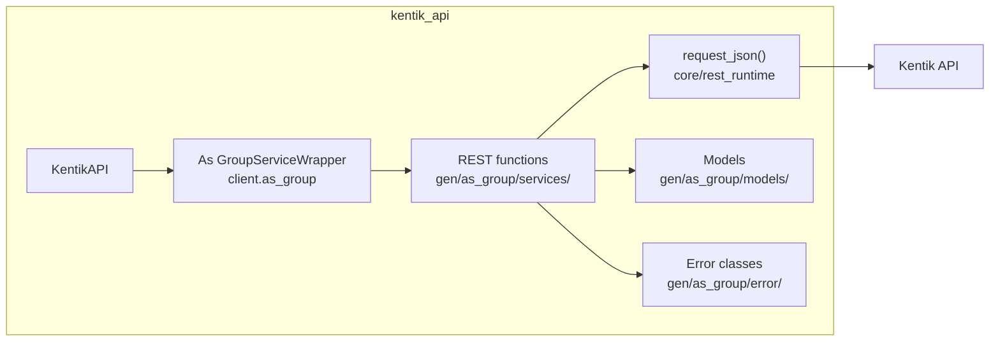

## Endpoints

### `GET` `/as_group/v202212/as_group`

List all AS groups.

Returns list of configured AS groups.

**REST transport**

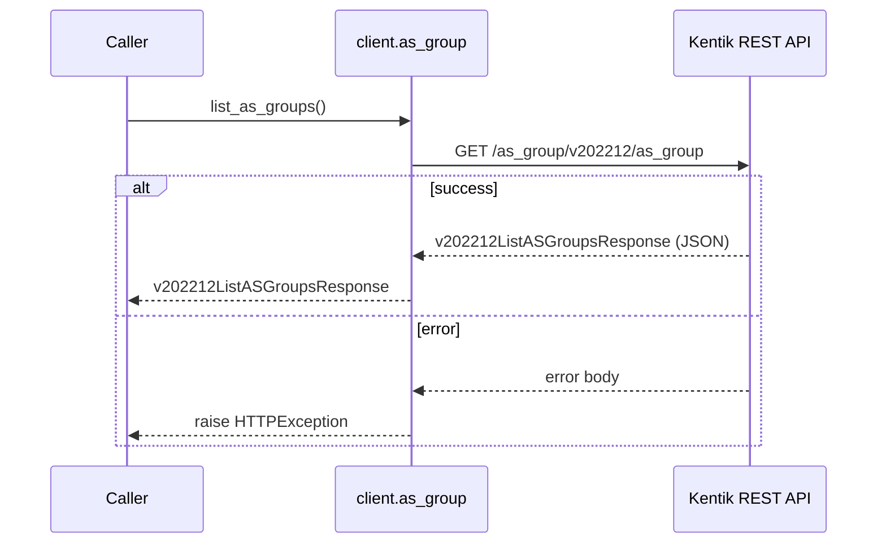

**gRPC transport**

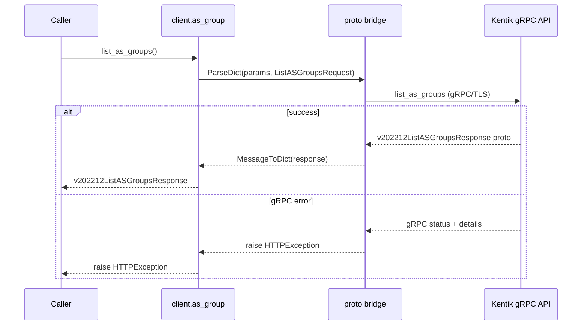

#### Responses

| Status | Description | Model |
| --- | --- | --- |
| 200 | A successful response. | `v202212ListASGroupsResponse` |
| default | An unexpected error response. | `rpcStatus` |

#### Example

```python
from kentik_api.client import KentikAPI

# Both transports work: protocol="rest" (default) or protocol="grpc".
client = KentikAPI(protocol="rest")  # loads KENTIK_EMAIL/KENTIK_API_TOKEN from .env
response = client.as_group.list_as_groups()
```

---

### `POST` `/as_group/v202212/as_group`

Configure a new AS group.

Create configuration for a new AS group. Returns the newly created configuration.

**REST transport**

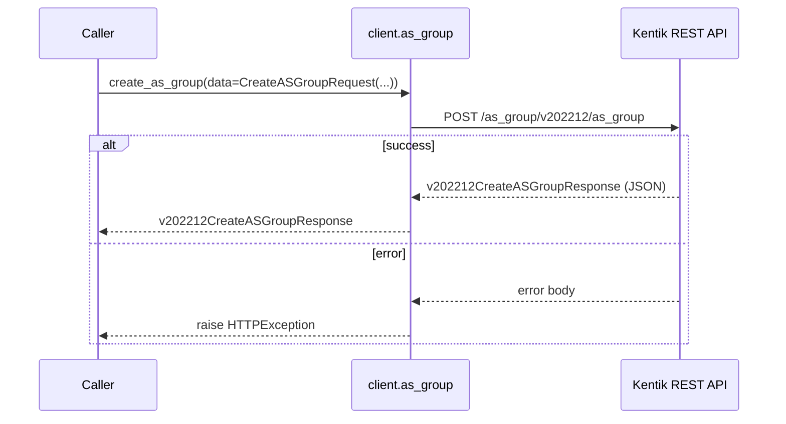

**gRPC transport**

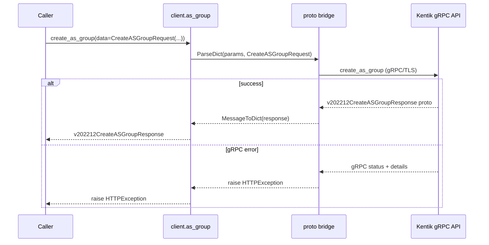

#### Parameters

| Name | In | Type | Required |
| --- | --- | --- | --- |
| `data` | body | `v202212CreateASGroupRequest` | Yes |

#### Responses

| Status | Description | Model |
| --- | --- | --- |
| 200 | A successful response. | `v202212CreateASGroupResponse` |
| default | An unexpected error response. | `rpcStatus` |

#### Example

```python
from kentik_api.client import KentikAPI

# Both transports work: protocol="rest" (default) or protocol="grpc".
client = KentikAPI(protocol="rest")  # loads KENTIK_EMAIL/KENTIK_API_TOKEN from .env
response = client.as_group.create_as_group(
    data=CreateASGroupRequest(...),
)
```

---

### `GET` `/as_group/v202212/as_group/{asGroup.id}`

Retrieve configuration of a AS group.

Returns configuration of a AS group specified by ID.

**REST transport**

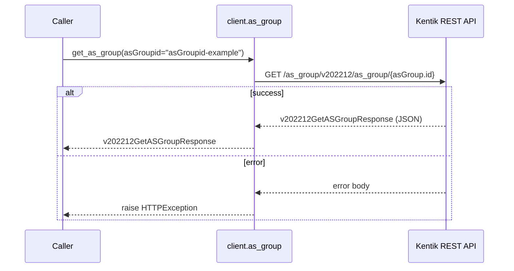

**gRPC transport**

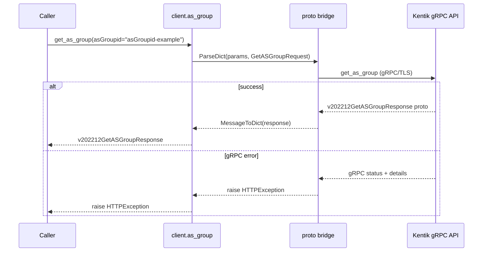

#### Parameters

| Name | In | Type | Required |
| --- | --- | --- | --- |
| `asGroupid` | path | `string` | Yes |

#### Responses

| Status | Description | Model |
| --- | --- | --- |
| 200 | A successful response. | `v202212GetASGroupResponse` |
| default | An unexpected error response. | `rpcStatus` |

#### Example

```python
from kentik_api.client import KentikAPI

# Both transports work: protocol="rest" (default) or protocol="grpc".
client = KentikAPI(protocol="rest")  # loads KENTIK_EMAIL/KENTIK_API_TOKEN from .env
response = client.as_group.get_as_group(
    asGroupid="asGroupid-example",
)
```

---

### `PUT` `/as_group/v202212/as_group/{asGroup.id}`

Updates configuration of a AS group.

Replaces configuration of a AS group with attributes in the request. Returns the updated configuration.

**REST transport**

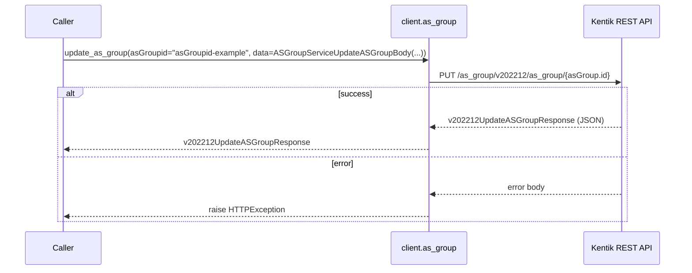

**gRPC transport**

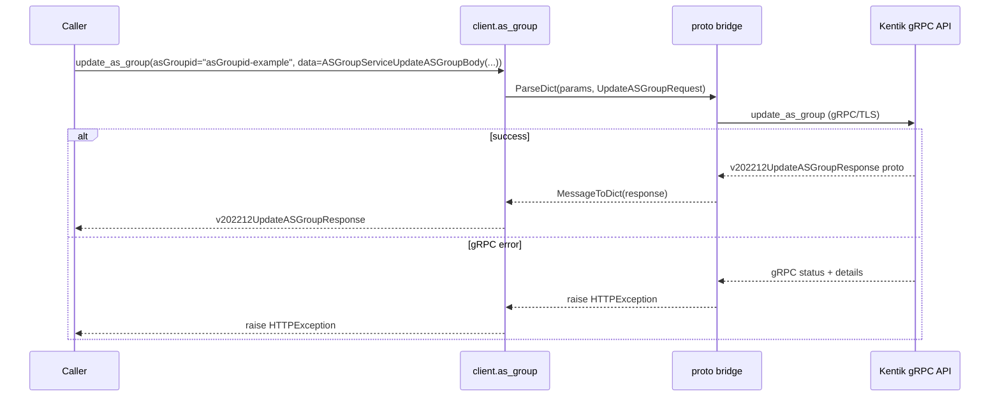

#### Parameters

| Name | In | Type | Required |
| --- | --- | --- | --- |
| `asGroupid` | path | `string` | Yes |
| `data` | body | `ASGroupServiceUpdateASGroupBody` | Yes |

#### Responses

| Status | Description | Model |
| --- | --- | --- |
| 200 | A successful response. | `v202212UpdateASGroupResponse` |
| default | An unexpected error response. | `rpcStatus` |

#### Example

```python
from kentik_api.client import KentikAPI

# Both transports work: protocol="rest" (default) or protocol="grpc".
client = KentikAPI(protocol="rest")  # loads KENTIK_EMAIL/KENTIK_API_TOKEN from .env
response = client.as_group.update_as_group(
    asGroupid="asGroupid-example",
    data=ASGroupServiceUpdateASGroupBody(...),
)
```

---

### `DELETE` `/as_group/v202212/as_group/{asGroup.id}`

Delete configuration of a AS group.

Deletes configuration of a AS group with specific ID.

**REST transport**

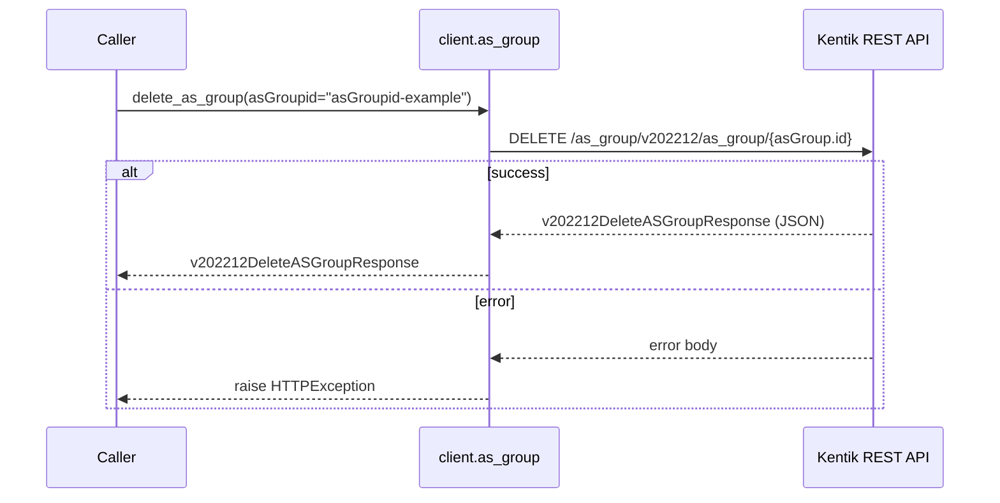

**gRPC transport**

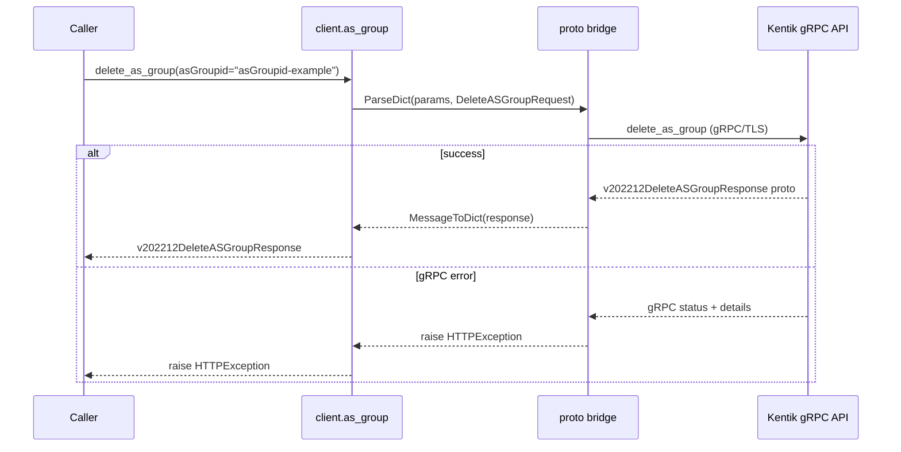

#### Parameters

| Name | In | Type | Required |
| --- | --- | --- | --- |
| `asGroupid` | path | `string` | Yes |

#### Responses

| Status | Description | Model |
| --- | --- | --- |
| 200 | A successful response. | `v202212DeleteASGroupResponse` |
| default | An unexpected error response. | `rpcStatus` |

#### Example

```python
from kentik_api.client import KentikAPI

# Both transports work: protocol="rest" (default) or protocol="grpc".
client = KentikAPI(protocol="rest")  # loads KENTIK_EMAIL/KENTIK_API_TOKEN from .env
response = client.as_group.delete_as_group(
    asGroupid="asGroupid-example",
)
```

## Data Models

<details>
<summary>Model relationships (3 of 12 models)</summary>

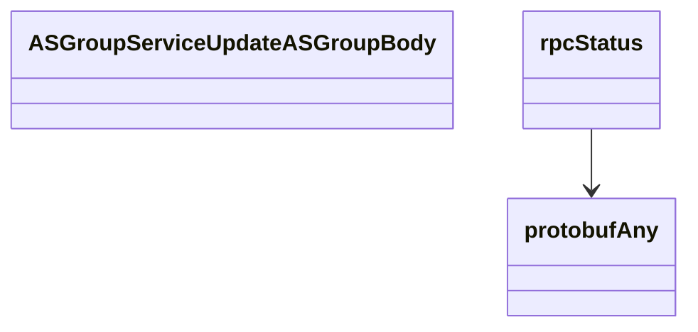

</details>

```{eval-rst}
.. autopydantic_model:: kentik_api.gen.as_group.models.ASGroupConcise
```

```{eval-rst}
.. autopydantic_model:: kentik_api.gen.as_group.models.ASGroupDetailed
```

```{eval-rst}
.. autopydantic_model:: kentik_api.gen.as_group.models.ASGroupServiceUpdateASGroupBody
```

```{eval-rst}
.. autopydantic_model:: kentik_api.gen.as_group.models.AutonomousSystem
```

```{eval-rst}
.. autopydantic_model:: kentik_api.gen.as_group.models.CreateASGroupRequest
```

```{eval-rst}
.. autopydantic_model:: kentik_api.gen.as_group.models.CreateASGroupResponse
```

```{eval-rst}
.. autopydantic_model:: kentik_api.gen.as_group.models.DeleteASGroupResponse
```

```{eval-rst}
.. autopydantic_model:: kentik_api.gen.as_group.models.GetASGroupResponse
```

```{eval-rst}
.. autopydantic_model:: kentik_api.gen.as_group.models.ListASGroupsResponse
```

```{eval-rst}
.. autopydantic_model:: kentik_api.gen.as_group.models.UpdateASGroupResponse
```

```{eval-rst}
.. autopydantic_model:: kentik_api.gen.as_group.models.protobufAny
```

```{eval-rst}
.. autopydantic_model:: kentik_api.gen.as_group.models.rpcStatus
```
