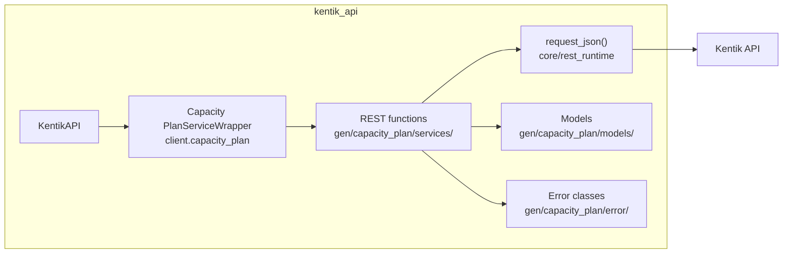
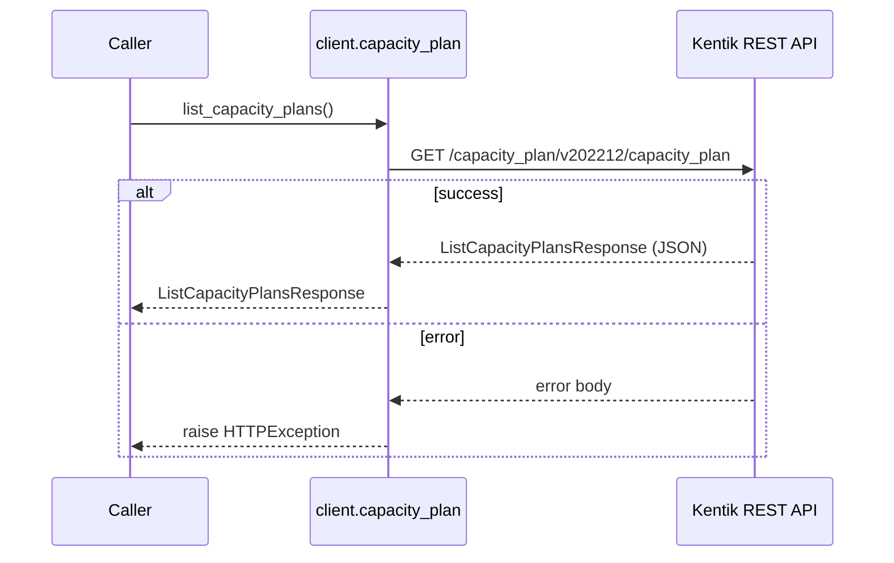
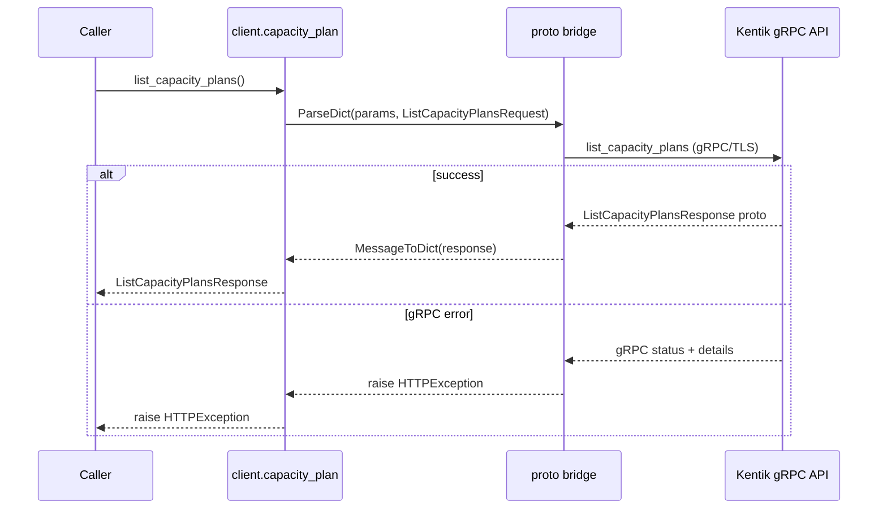
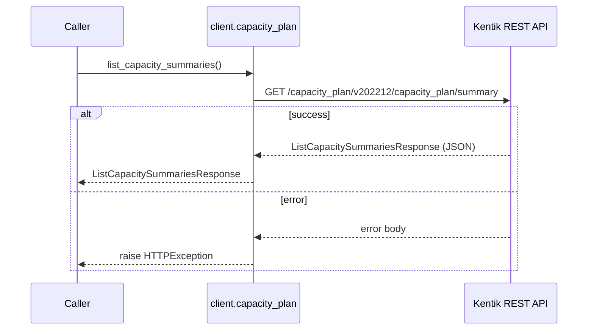
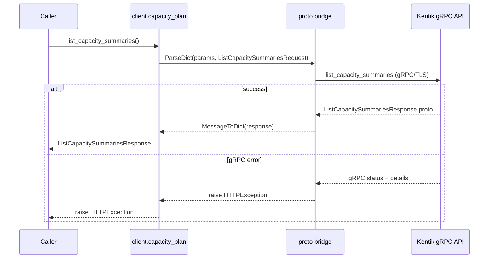
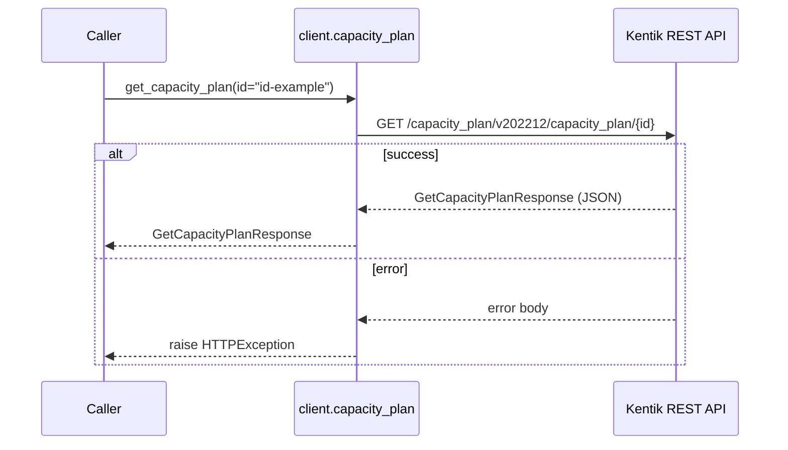
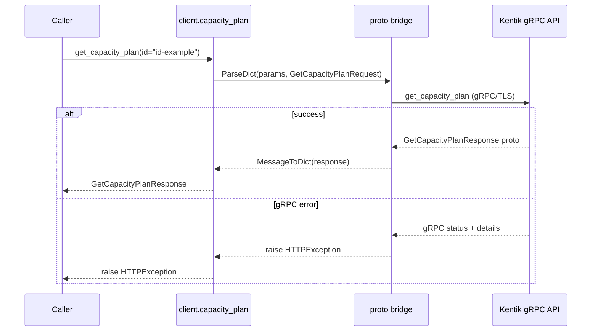
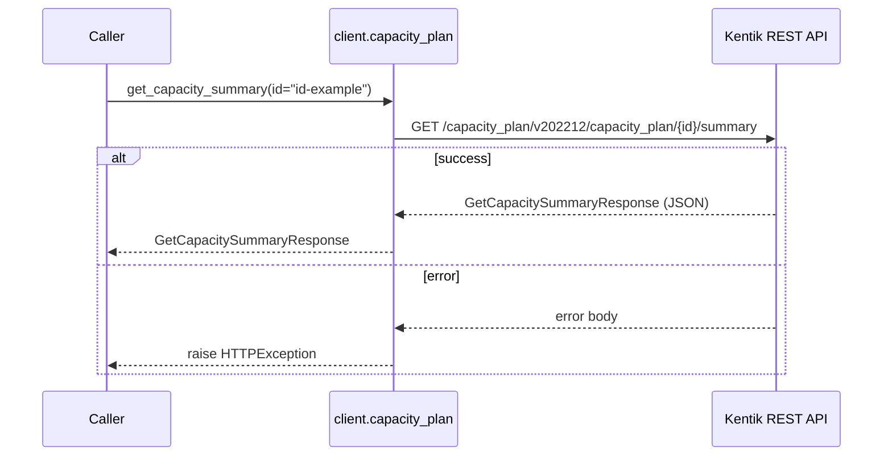
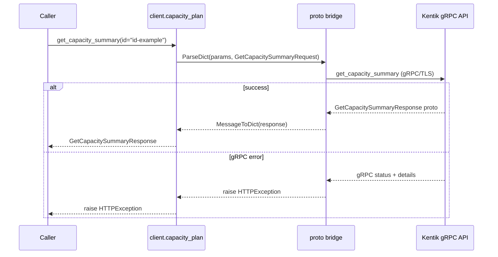
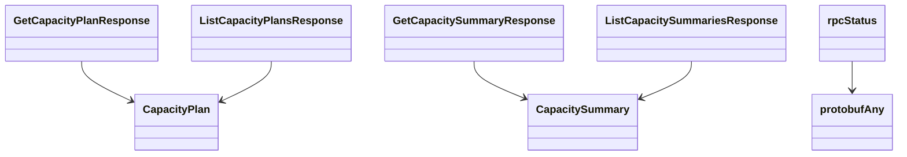

# Capacity Plan Service

## Overview



## Endpoints

### `GET` `/capacity_plan/v202212/capacity_plan`

List all capacity plans.

Returns list of capacity plans.

**REST transport**



**gRPC transport**



#### Responses

| Status | Description | Model |
| --- | --- | --- |
| 200 | A successful response. | `ListCapacityPlansResponse` |
| default | An unexpected error response. | `rpcStatus` |

#### Example

```python
from kentik_api.client import KentikAPI

# Both transports work: protocol="rest" (default) or protocol="grpc".
client = KentikAPI(protocol="rest")  # loads KENTIK_EMAIL/KENTIK_API_TOKEN from .env
response = client.capacity_plan.list_capacity_plans()
```

---

### `GET` `/capacity_plan/v202212/capacity_plan/summary`

List all capacity summaries.

Returns list of capacity summaries.

**REST transport**



**gRPC transport**



#### Responses

| Status | Description | Model |
| --- | --- | --- |
| 200 | A successful response. | `ListCapacitySummariesResponse` |
| default | An unexpected error response. | `rpcStatus` |

#### Example

```python
from kentik_api.client import KentikAPI

# Both transports work: protocol="rest" (default) or protocol="grpc".
client = KentikAPI(protocol="rest")  # loads KENTIK_EMAIL/KENTIK_API_TOKEN from .env
response = client.capacity_plan.list_capacity_summaries()
```

---

### `GET` `/capacity_plan/v202212/capacity_plan/{id}`

Retrieve capacity plan.

Returns capacity plan specified by ID.

**REST transport**



**gRPC transport**



#### Parameters

| Name | In | Type | Required |
| --- | --- | --- | --- |
| `id` | path | `string` | Yes |

#### Responses

| Status | Description | Model |
| --- | --- | --- |
| 200 | A successful response. | `GetCapacityPlanResponse` |
| default | An unexpected error response. | `rpcStatus` |

#### Example

```python
from kentik_api.client import KentikAPI

# Both transports work: protocol="rest" (default) or protocol="grpc".
client = KentikAPI(protocol="rest")  # loads KENTIK_EMAIL/KENTIK_API_TOKEN from .env
response = client.capacity_plan.get_capacity_plan(
    id="id-example",
)
```

---

### `GET` `/capacity_plan/v202212/capacity_plan/{id}/summary`

Retrieve capacity plan summary.

Returns capacity plan summary specified by ID.

**REST transport**



**gRPC transport**



#### Parameters

| Name | In | Type | Required |
| --- | --- | --- | --- |
| `id` | path | `string` | Yes |

#### Responses

| Status | Description | Model |
| --- | --- | --- |
| 200 | A successful response. | `GetCapacitySummaryResponse` |
| default | An unexpected error response. | `rpcStatus` |

#### Example

```python
from kentik_api.client import KentikAPI

# Both transports work: protocol="rest" (default) or protocol="grpc".
client = KentikAPI(protocol="rest")  # loads KENTIK_EMAIL/KENTIK_API_TOKEN from .env
response = client.capacity_plan.get_capacity_summary(
    id="id-example",
)
```

## Data Models

<details>
<summary>Model relationships (8 of 17 models)</summary>



</details>

```{eval-rst}
.. autopydantic_model:: kentik_api.gen.capacity_plan.models.CapacityPlan
```

```{eval-rst}
.. autopydantic_model:: kentik_api.gen.capacity_plan.models.CapacityPlanInterfaceDetail
```

```{eval-rst}
.. autopydantic_model:: kentik_api.gen.capacity_plan.models.CapacitySummary
```

```{eval-rst}
.. autopydantic_model:: kentik_api.gen.capacity_plan.models.CapacitySummaryInterfacesDetail
```

```{eval-rst}
.. autopydantic_model:: kentik_api.gen.capacity_plan.models.Config
```

```{eval-rst}
.. autopydantic_model:: kentik_api.gen.capacity_plan.models.ConfigRunoutConfig
```

```{eval-rst}
.. autopydantic_model:: kentik_api.gen.capacity_plan.models.ConfigUtilConfig
```

```{eval-rst}
.. autopydantic_model:: kentik_api.gen.capacity_plan.models.GetCapacityPlanResponse
```

```{eval-rst}
.. autopydantic_model:: kentik_api.gen.capacity_plan.models.GetCapacitySummaryResponse
```

```{eval-rst}
.. autopydantic_model:: kentik_api.gen.capacity_plan.models.InterfacesDetailStatusDetail
```

```{eval-rst}
.. autopydantic_model:: kentik_api.gen.capacity_plan.models.ListCapacityPlansResponse
```

```{eval-rst}
.. autopydantic_model:: kentik_api.gen.capacity_plan.models.ListCapacitySummariesResponse
```

```{eval-rst}
.. autopydantic_model:: kentik_api.gen.capacity_plan.models.SummaryStatus
```

```{eval-rst}
.. autopydantic_model:: kentik_api.gen.capacity_plan.models.SummaryStatusRunoutStatus
```

```{eval-rst}
.. autopydantic_model:: kentik_api.gen.capacity_plan.models.SummaryStatusUtilStatus
```

```{eval-rst}
.. autopydantic_model:: kentik_api.gen.capacity_plan.models.protobufAny
```

```{eval-rst}
.. autopydantic_model:: kentik_api.gen.capacity_plan.models.rpcStatus
```
