<!-- AUTO-GENERATED: scripts/generation/endpoint_docs.py, _render_sphinx_stubs() -->
<!-- Rebuilt on every `make generate`. Do not edit by hand. -->

# Cloud Export Service

## Overview

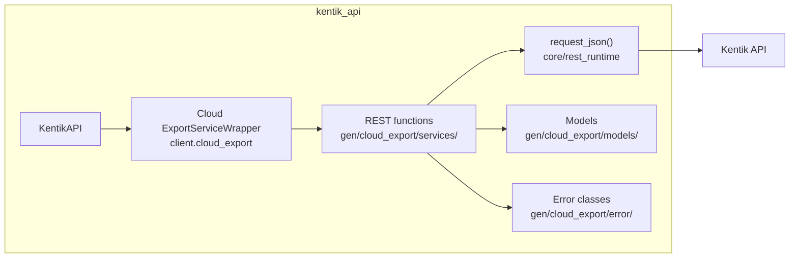

## Endpoints

### `GET` `/cloud_export/v202506/exports`

List cloud exports.

Returns a list of all cloud exports in the account.

**REST transport**

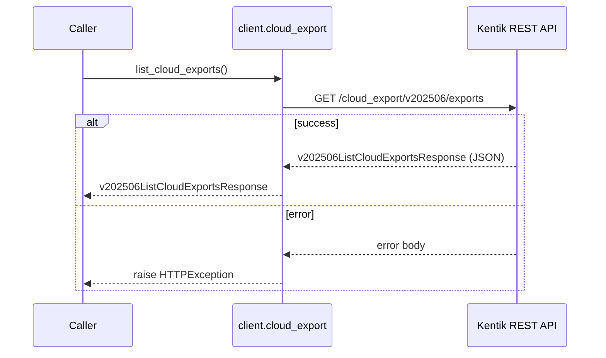

**gRPC transport**

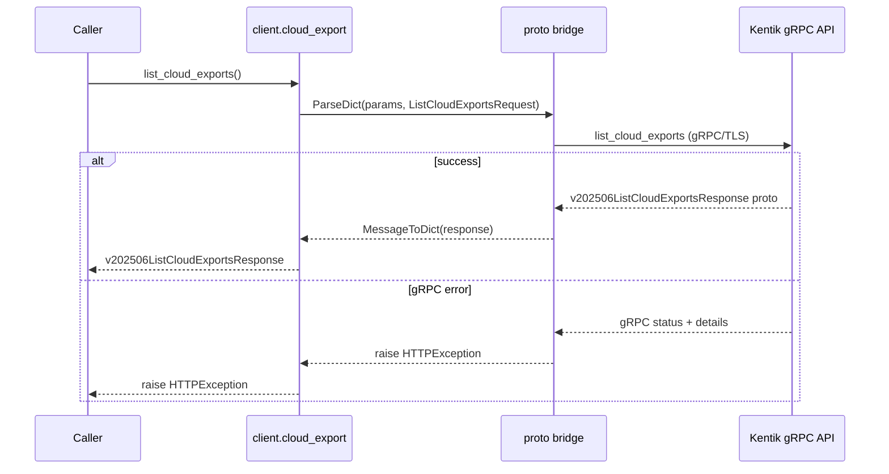

#### Responses

| Status | Description | Model |
| --- | --- | --- |
| 200 | A successful response. | `v202506ListCloudExportsResponse` |
| default | An unexpected error response. | `rpcStatus` |

#### Example

```python
from kentik_api.client import KentikAPI

# Both transports work: protocol="rest" (default) or protocol="grpc".
client = KentikAPI(protocol="rest")  # loads KENTIK_EMAIL/KENTIK_API_TOKEN from .env
response = client.cloud_export.list_cloud_exports()
```

---

### `POST` `/cloud_export/v202506/exports`

Create Cloud Export.

Create new cloud export based on configuration in the request.

**REST transport**

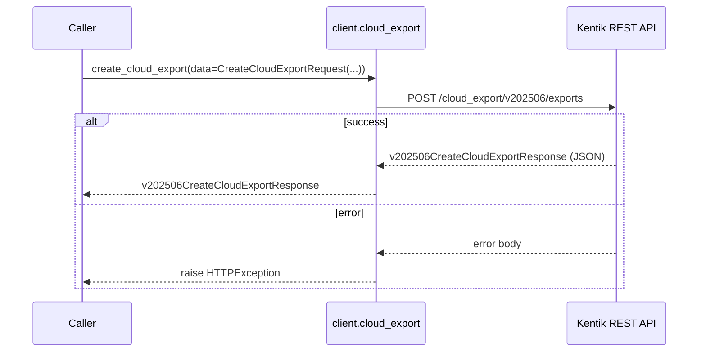

**gRPC transport**

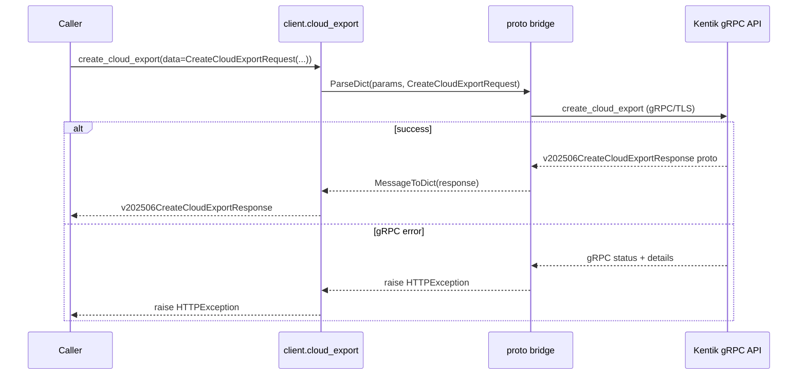

#### Parameters

| Name | In | Type | Required |
| --- | --- | --- | --- |
| `data` | body | `v202506CreateCloudExportRequest` | Yes |

#### Responses

| Status | Description | Model |
| --- | --- | --- |
| 200 | A successful response. | `v202506CreateCloudExportResponse` |
| default | An unexpected error response. | `rpcStatus` |

#### Example

```python
from kentik_api.client import KentikAPI

# Both transports work: protocol="rest" (default) or protocol="grpc".
client = KentikAPI(protocol="rest")  # loads KENTIK_EMAIL/KENTIK_API_TOKEN from .env
response = client.cloud_export.create_cloud_export(
    data=CreateCloudExportRequest(...),
)
```

---

### `GET` `/cloud_export/v202506/exports/{export.id}`

Get cloud export configuration and status.

Returns configuration and status of cloud export with specified ID.

**REST transport**

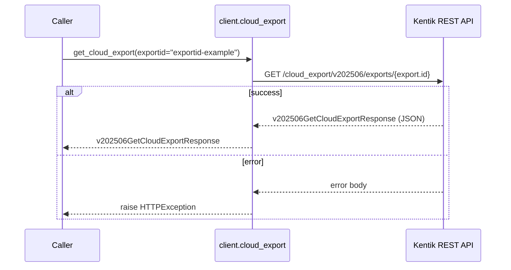

**gRPC transport**

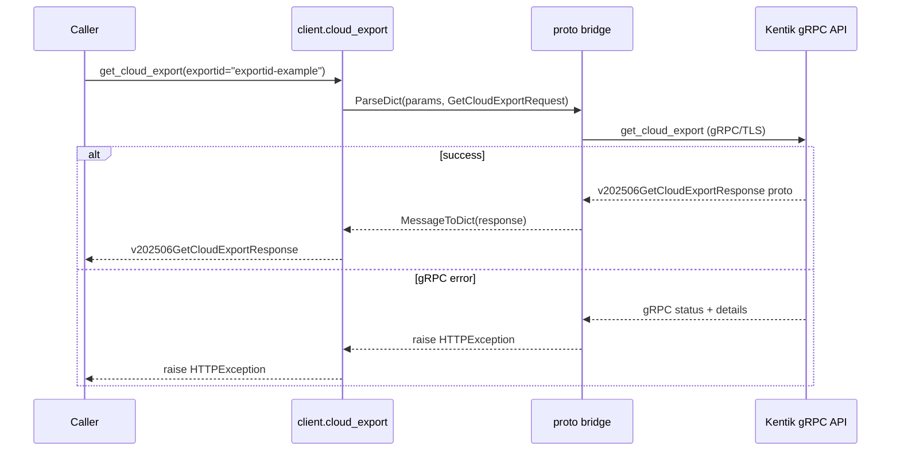

#### Parameters

| Name | In | Type | Required |
| --- | --- | --- | --- |
| `exportid` | path | `string` | Yes |

#### Responses

| Status | Description | Model |
| --- | --- | --- |
| 200 | A successful response. | `v202506GetCloudExportResponse` |
| default | An unexpected error response. | `rpcStatus` |

#### Example

```python
from kentik_api.client import KentikAPI

# Both transports work: protocol="rest" (default) or protocol="grpc".
client = KentikAPI(protocol="rest")  # loads KENTIK_EMAIL/KENTIK_API_TOKEN from .env
response = client.cloud_export.get_cloud_export(
    exportid="exportid-example",
)
```

---

### `PUT` `/cloud_export/v202506/exports/{export.id}`

Update configuration of cloud export.

Replace complete configuration of a cloud export with data in the request.

**REST transport**

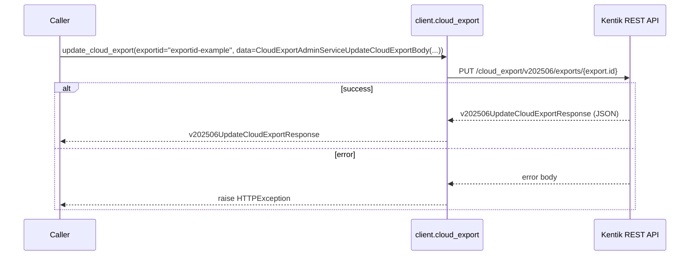

**gRPC transport**

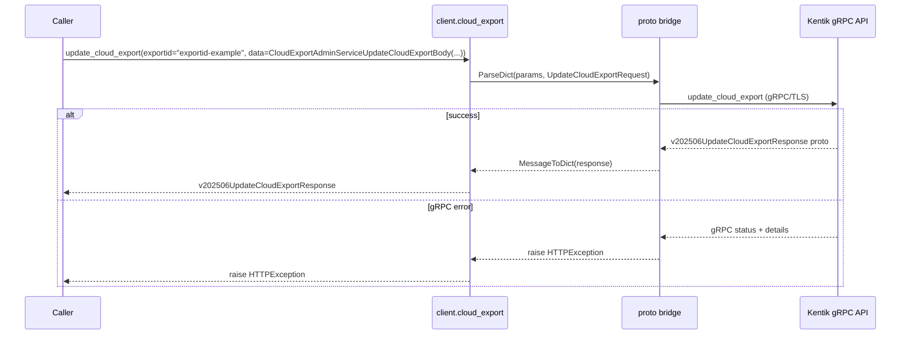

#### Parameters

| Name | In | Type | Required |
| --- | --- | --- | --- |
| `exportid` | path | `string` | Yes |
| `data` | body | `CloudExportAdminServiceUpdateCloudExportBody` | Yes |

#### Responses

| Status | Description | Model |
| --- | --- | --- |
| 200 | A successful response. | `v202506UpdateCloudExportResponse` |
| default | An unexpected error response. | `rpcStatus` |

#### Example

```python
from kentik_api.client import KentikAPI

# Both transports work: protocol="rest" (default) or protocol="grpc".
client = KentikAPI(protocol="rest")  # loads KENTIK_EMAIL/KENTIK_API_TOKEN from .env
response = client.cloud_export.update_cloud_export(
    exportid="exportid-example",
    data=CloudExportAdminServiceUpdateCloudExportBody(...),
)
```

---

### `DELETE` `/cloud_export/v202506/exports/{export.id}`

Delete a cloud export.

Delete cloud export with specified ID.

**REST transport**

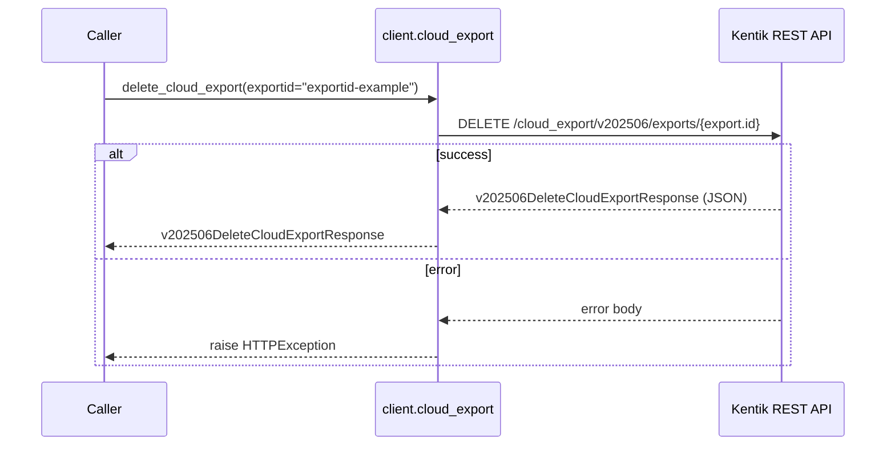

**gRPC transport**

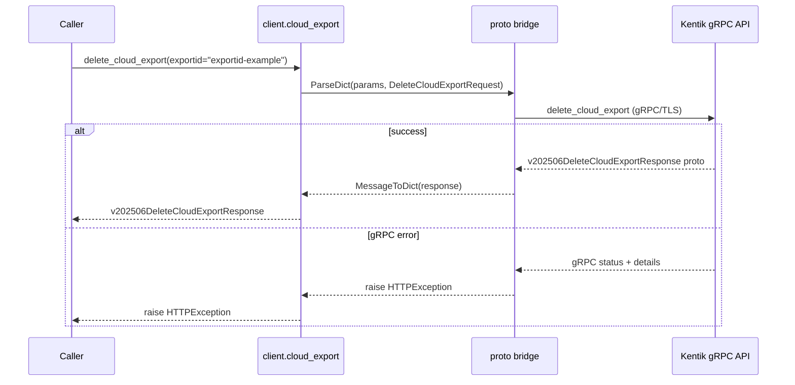

#### Parameters

| Name | In | Type | Required |
| --- | --- | --- | --- |
| `exportid` | path | `string` | Yes |

#### Responses

| Status | Description | Model |
| --- | --- | --- |
| 200 | A successful response. | `v202506DeleteCloudExportResponse` |
| default | An unexpected error response. | `rpcStatus` |

#### Example

```python
from kentik_api.client import KentikAPI

# Both transports work: protocol="rest" (default) or protocol="grpc".
client = KentikAPI(protocol="rest")  # loads KENTIK_EMAIL/KENTIK_API_TOKEN from .env
response = client.cloud_export.delete_cloud_export(
    exportid="exportid-example",
)
```

## Data Models

<details>
<summary>Model relationships (3 of 19 models)</summary>

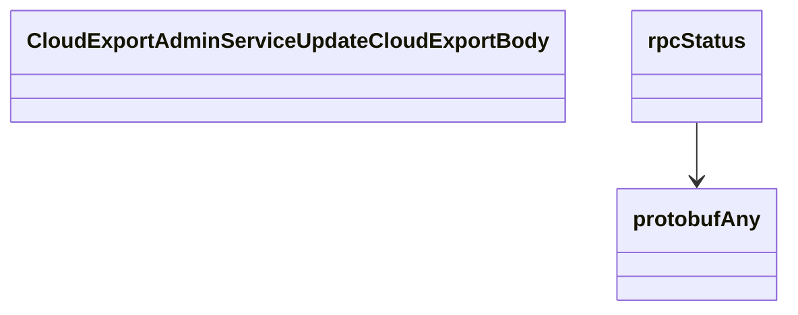

</details>

```{eval-rst}
.. autopydantic_model:: kentik_api.gen.cloud_export.models.AwsProperties
```

```{eval-rst}
.. autopydantic_model:: kentik_api.gen.cloud_export.models.AzureProperties
```

```{eval-rst}
.. autopydantic_model:: kentik_api.gen.cloud_export.models.CloudExport
```

```{eval-rst}
.. autopydantic_model:: kentik_api.gen.cloud_export.models.CloudExportAdminServiceUpdateCloudExportBody
```

```{eval-rst}
.. autopydantic_model:: kentik_api.gen.cloud_export.models.CloudExportSamplingProperties
```

```{eval-rst}
.. autoclass:: kentik_api.gen.cloud_export.models.CloudExportSamplingType
   :members:
```

```{eval-rst}
.. autopydantic_model:: kentik_api.gen.cloud_export.models.CloudExportStatus
```

```{eval-rst}
.. autoclass:: kentik_api.gen.cloud_export.models.CloudExportType
   :members:
```

```{eval-rst}
.. autoclass:: kentik_api.gen.cloud_export.models.CloudProvider
   :members:
```

```{eval-rst}
.. autopydantic_model:: kentik_api.gen.cloud_export.models.CreateCloudExportRequest
```

```{eval-rst}
.. autopydantic_model:: kentik_api.gen.cloud_export.models.CreateCloudExportResponse
```

```{eval-rst}
.. autopydantic_model:: kentik_api.gen.cloud_export.models.DeleteCloudExportResponse
```

```{eval-rst}
.. autopydantic_model:: kentik_api.gen.cloud_export.models.GceProperties
```

```{eval-rst}
.. autopydantic_model:: kentik_api.gen.cloud_export.models.GetCloudExportResponse
```

```{eval-rst}
.. autopydantic_model:: kentik_api.gen.cloud_export.models.ListCloudExportsResponse
```

```{eval-rst}
.. autopydantic_model:: kentik_api.gen.cloud_export.models.OciProperties
```

```{eval-rst}
.. autopydantic_model:: kentik_api.gen.cloud_export.models.UpdateCloudExportResponse
```

```{eval-rst}
.. autopydantic_model:: kentik_api.gen.cloud_export.models.protobufAny
```

```{eval-rst}
.. autopydantic_model:: kentik_api.gen.cloud_export.models.rpcStatus
```
