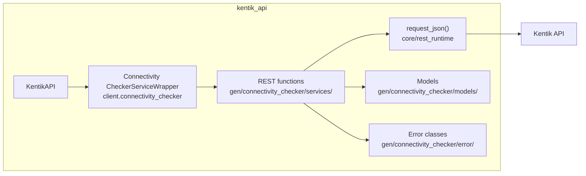
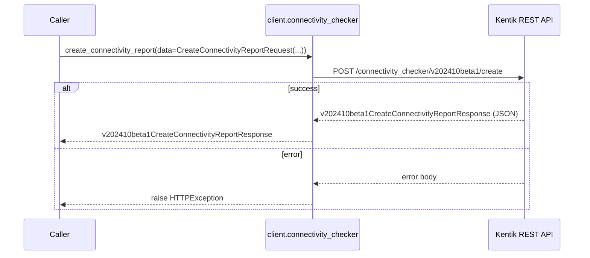
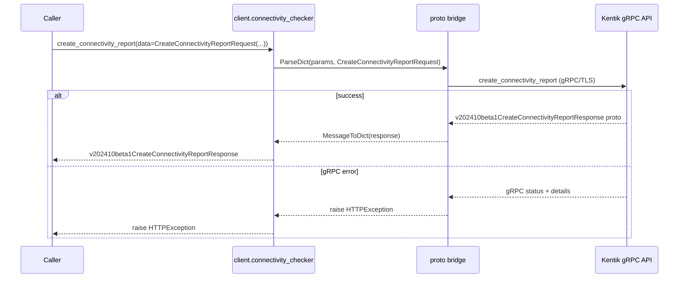
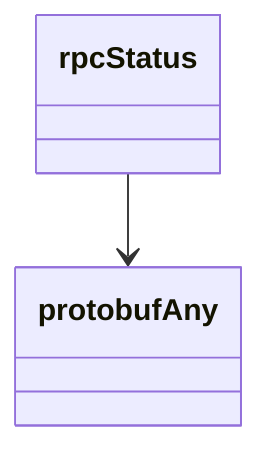

<!-- AUTO-GENERATED: scripts/generation/endpoint_docs.py, render_endpoint_docs() -->
<!-- Rebuilt on every `make generate`. Do not edit by hand. -->

# Connectivity Checker Service

## Overview



## Endpoints

### `POST` `/connectivity_checker/v202410beta1/create`

Create a Connectivity Checker Report.

Create a connectivity checker report based on configuration provided in the request.

**REST transport**



**gRPC transport**



#### Parameters

| Name | In | Type | Required |
| --- | --- | --- | --- |
| `data` | body | `v202410beta1CreateConnectivityReportRequest` | Yes |

#### Responses

| Status | Description | Model |
| --- | --- | --- |
| 200 | A successful response. | `v202410beta1CreateConnectivityReportResponse` |
| default | An unexpected error response. | `rpcStatus` |

#### Example

```python
from kentik_api.client import KentikAPI

# Both transports work: protocol="rest" (default) or protocol="grpc".
client = KentikAPI(protocol="rest")  # loads KENTIK_EMAIL/KENTIK_API_TOKEN from .env
response = client.connectivity_checker.create_connectivity_report(
    data=CreateConnectivityReportRequest(...),
)
```

## Data Models

<details>
<summary>Model relationships (2 of 6 models)</summary>



</details>

```{eval-rst}
.. autoclass:: kentik_api.gen.connectivity_checker.models.CloudProvider
   :members:
```

```{eval-rst}
.. autopydantic_model:: kentik_api.gen.connectivity_checker.models.CreateConnectivityReportRequest
```

```{eval-rst}
.. autopydantic_model:: kentik_api.gen.connectivity_checker.models.CreateConnectivityReportResponse
```

```{eval-rst}
.. autoclass:: kentik_api.gen.connectivity_checker.models.EntityType
   :members:
```

```{eval-rst}
.. autopydantic_model:: kentik_api.gen.connectivity_checker.models.protobufAny
```

```{eval-rst}
.. autopydantic_model:: kentik_api.gen.connectivity_checker.models.rpcStatus
```
