<!-- AUTO-GENERATED: scripts/generation/endpoint_docs.py, _render_sphinx_stubs() -->
<!-- Rebuilt on every `make generate`. Do not edit by hand. -->

# Custom Application Service

## Overview

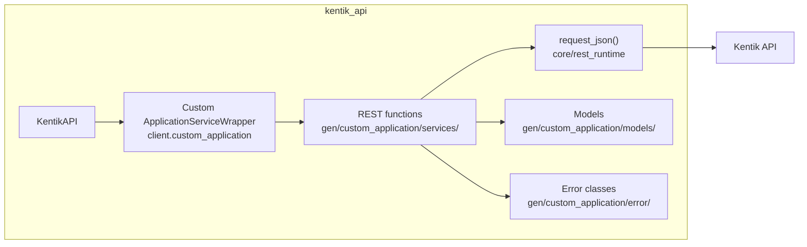

## Endpoints

### `GET` `/custom_application/v202501alpha1`

List Custom Applications

Returns an array of custom application objects that each contain information about an individual custom application.

**REST transport**

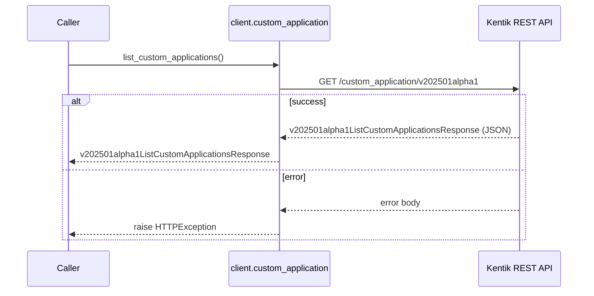

**gRPC transport**

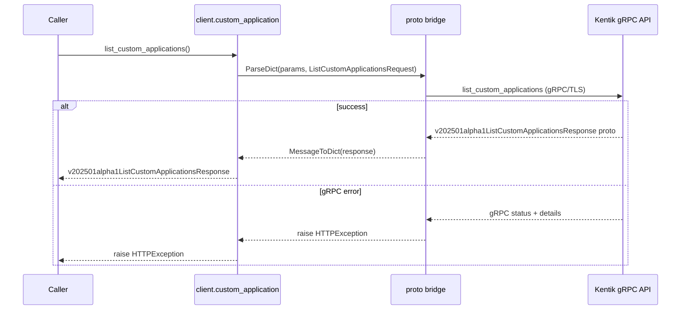

#### Responses

| Status | Description | Model |
| --- | --- | --- |
| 200 | A successful response. | `v202501alpha1ListCustomApplicationsResponse` |
| default | An unexpected error response. | `rpcStatus` |

#### Example

```python
from kentik_api.client import KentikAPI

# Both transports work: protocol="rest" (default) or protocol="grpc".
client = KentikAPI(protocol="rest")  # loads KENTIK_EMAIL/KENTIK_API_TOKEN from .env
response = client.custom_application.list_custom_applications()
```

---

### `POST` `/custom_application/v202501alpha1`

Create Custom Application

Creates and returns a custom application object containing information about an individual custom application.

**REST transport**

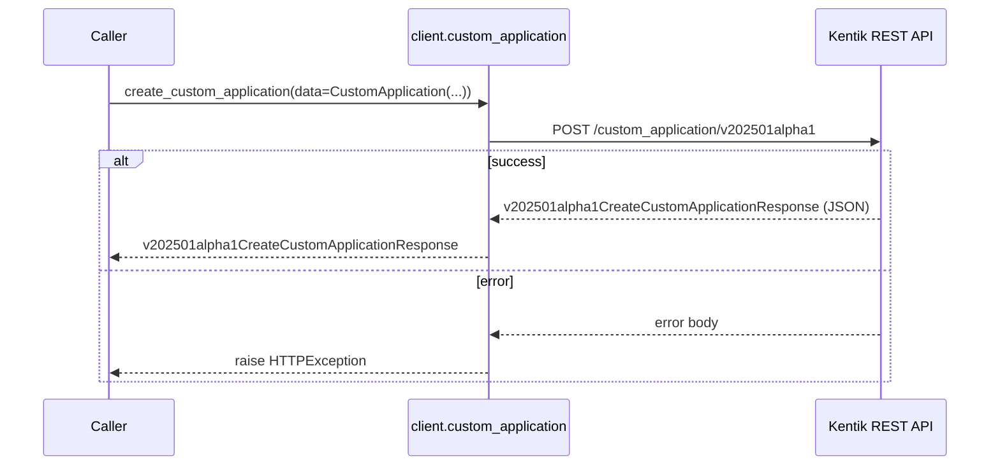

**gRPC transport**

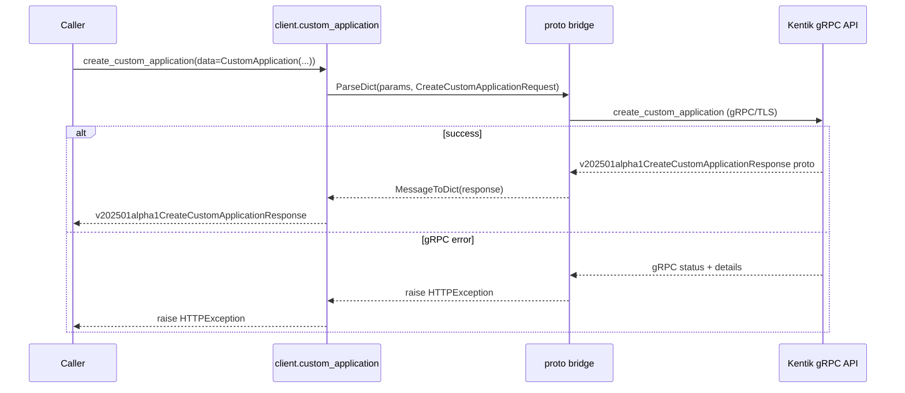

#### Parameters

| Name | In | Type | Required |
| --- | --- | --- | --- |
| `data` | body | `-` | No |

#### Responses

| Status | Description | Model |
| --- | --- | --- |
| 200 | A successful response. | `v202501alpha1CreateCustomApplicationResponse` |
| default | An unexpected error response. | `rpcStatus` |

#### Example

```python
from kentik_api.client import KentikAPI

# Both transports work: protocol="rest" (default) or protocol="grpc".
client = KentikAPI(protocol="rest")  # loads KENTIK_EMAIL/KENTIK_API_TOKEN from .env
response = client.custom_application.create_custom_application(
    data=CustomApplication(...),
)
```

---

### `GET` `/custom_application/v202501alpha1/{customApplicationId}`

Custom Application Info

Returns a custom application object containing information about an individual custom application.

**REST transport**

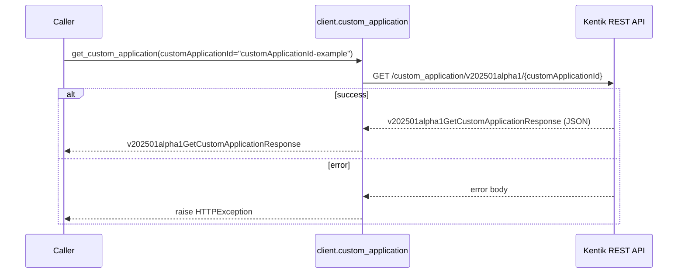

**gRPC transport**

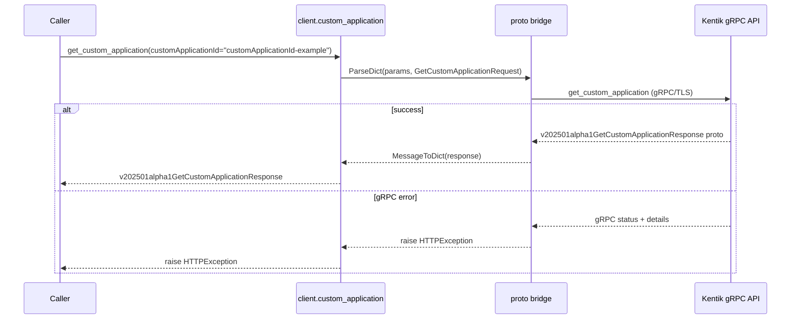

#### Parameters

| Name | In | Type | Required |
| --- | --- | --- | --- |
| `customApplicationId` | path | `string` | Yes |

#### Responses

| Status | Description | Model |
| --- | --- | --- |
| 200 | A successful response. | `v202501alpha1GetCustomApplicationResponse` |
| default | An unexpected error response. | `rpcStatus` |

#### Example

```python
from kentik_api.client import KentikAPI

# Both transports work: protocol="rest" (default) or protocol="grpc".
client = KentikAPI(protocol="rest")  # loads KENTIK_EMAIL/KENTIK_API_TOKEN from .env
response = client.custom_application.get_custom_application(
    customApplicationId="customApplicationId-example",
)
```

---

### `PUT` `/custom_application/v202501alpha1/{customApplicationId}`

Update Custom Application

Updates and returns a custom application object containing information about an individual custom application.

**REST transport**

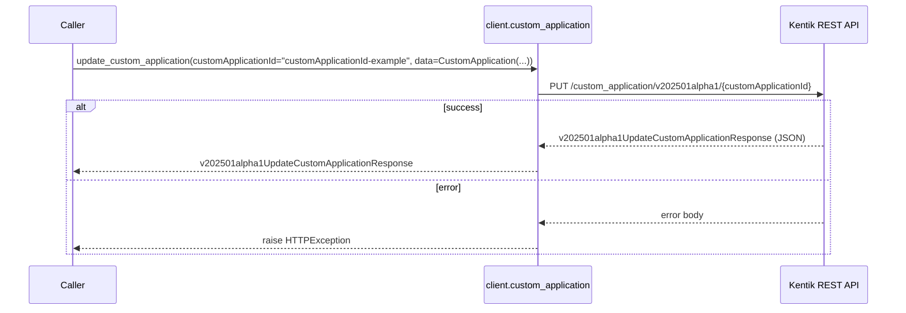

**gRPC transport**

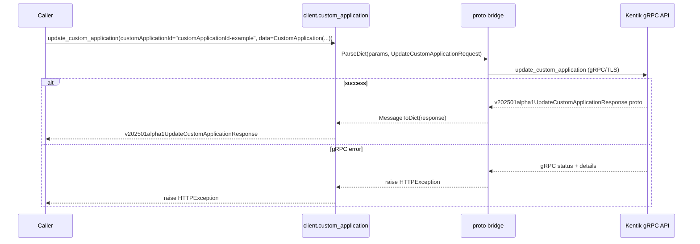

#### Parameters

| Name | In | Type | Required |
| --- | --- | --- | --- |
| `customApplicationId` | path | `string` | Yes |
| `data` | body | `-` | No |

#### Responses

| Status | Description | Model |
| --- | --- | --- |
| 200 | A successful response. | `v202501alpha1UpdateCustomApplicationResponse` |
| default | An unexpected error response. | `rpcStatus` |

#### Example

```python
from kentik_api.client import KentikAPI

# Both transports work: protocol="rest" (default) or protocol="grpc".
client = KentikAPI(protocol="rest")  # loads KENTIK_EMAIL/KENTIK_API_TOKEN from .env
response = client.custom_application.update_custom_application(
    customApplicationId="customApplicationId-example",
    data=CustomApplication(...),
)
```

---

### `DELETE` `/custom_application/v202501alpha1/{customApplicationId}`

Delete Custom Application

Deletes a custom application.

**REST transport**

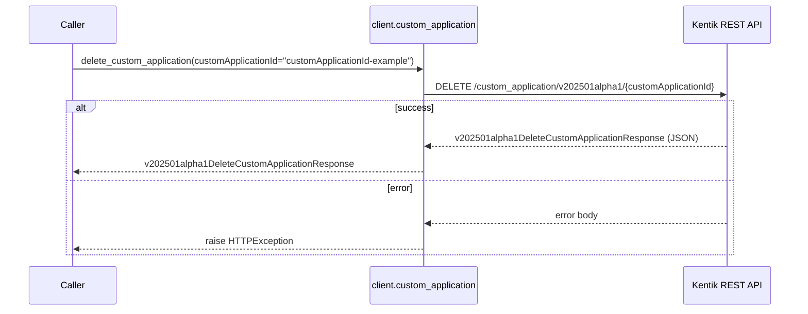

**gRPC transport**

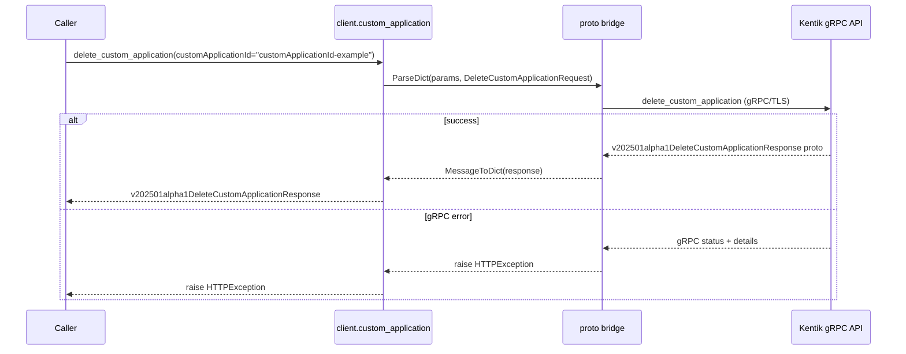

#### Parameters

| Name | In | Type | Required |
| --- | --- | --- | --- |
| `customApplicationId` | path | `string` | Yes |

#### Responses

| Status | Description | Model |
| --- | --- | --- |
| 200 | A successful response. | `v202501alpha1DeleteCustomApplicationResponse` |
| default | An unexpected error response. | `rpcStatus` |

#### Example

```python
from kentik_api.client import KentikAPI

# Both transports work: protocol="rest" (default) or protocol="grpc".
client = KentikAPI(protocol="rest")  # loads KENTIK_EMAIL/KENTIK_API_TOKEN from .env
response = client.custom_application.delete_custom_application(
    customApplicationId="customApplicationId-example",
)
```

## Data Models

<details>
<summary>Model relationships (2 of 8 models)</summary>

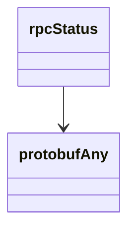

</details>

```{eval-rst}
.. autopydantic_model:: kentik_api.gen.custom_application.models.CreateCustomApplicationResponse
```

```{eval-rst}
.. autopydantic_model:: kentik_api.gen.custom_application.models.CustomApplication
```

```{eval-rst}
.. autopydantic_model:: kentik_api.gen.custom_application.models.DeleteCustomApplicationResponse
```

```{eval-rst}
.. autopydantic_model:: kentik_api.gen.custom_application.models.GetCustomApplicationResponse
```

```{eval-rst}
.. autopydantic_model:: kentik_api.gen.custom_application.models.ListCustomApplicationsResponse
```

```{eval-rst}
.. autopydantic_model:: kentik_api.gen.custom_application.models.UpdateCustomApplicationResponse
```

```{eval-rst}
.. autopydantic_model:: kentik_api.gen.custom_application.models.protobufAny
```

```{eval-rst}
.. autopydantic_model:: kentik_api.gen.custom_application.models.rpcStatus
```
