<!-- AUTO-GENERATED: scripts/generation/endpoint_docs.py, render_endpoint_docs() -->
<!-- Rebuilt on every `uv run poe generate`. Do not edit by hand. -->

# Custom Dimension Service

## Overview

<!-- github-only -->

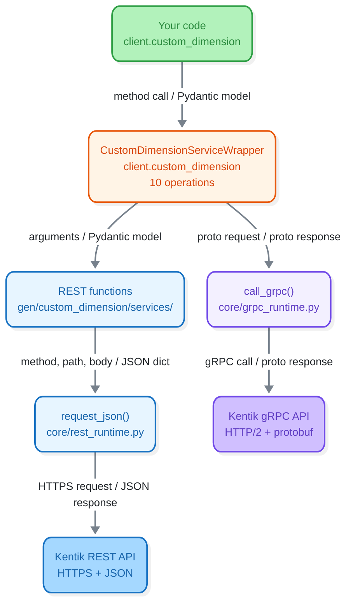
```mermaid
%%{init: {"theme": "redux", "look": "neo", "layout": "dagre", "fontFamily": "ui-monospace, SFMono-Regular, Menlo, monospace", "themeVariables": {"fontFamily": "ui-monospace, SFMono-Regular, Menlo, monospace", "primaryColor": "#f8f9fa", "primaryBorderColor": "#495057", "primaryTextColor": "#212529", "textColor": "#212529", "lineColor": "#77818c", "edgeLabelBackground": "#ffffff", "actorBkg": "#f8f9fa", "actorBorder": "#495057", "actorTextColor": "#212529", "actorLineColor": "#a9b3be", "signalColor": "#57616d", "signalTextColor": "#212529", "labelBoxBkgColor": "#f8f9fa", "labelBoxBorderColor": "#495057", "labelTextColor": "#212529", "loopTextColor": "#57616d", "noteBkgColor": "#fff9db", "noteBorderColor": "#f08c00", "noteTextColor": "#a35a00"}, "sequence": {"activationWidth": 16}, "flowchart": {"curve": "basis", "nodeSpacing": 30, "rankSpacing": 70, "wrappingWidth": 400}}}%%
flowchart TD
  code("Your code<br/>client.custom_dimension"):::greenSrc
  wrap("CustomDimensionServiceWrapper<br/>client.custom_dimension<br/>10 operations"):::orange
  rest("REST functions<br/>gen/custom_dimension/services/"):::blue
  rj("request_json()<br/>core/rest_runtime.py"):::blue
  restapi("Kentik REST API<br/>HTTPS + JSON"):::blueSrc
  cg("call_grpc()<br/>core/grpc_runtime.py"):::violet
  grpcapi("Kentik gRPC API<br/>HTTP/2 + protobuf"):::violetSrc
  code -->|"method call / Pydantic model"| wrap
  wrap -->|"arguments / Pydantic model"| rest
  rest -->|"method, path, body / JSON dict"| rj
  rj -->|"HTTPS request / JSON response"| restapi
  wrap -->|"proto request / proto response"| cg
  cg -->|"gRPC call / proto response"| grpcapi
  classDef blue fill:#e7f5ff,stroke:#1971c2,color:#1864ab,stroke-width:2px,rx:10px
  classDef blueSrc fill:#a5d8ff,stroke:#1971c2,color:#1864ab,stroke-width:2px,rx:10px
  classDef greenSrc fill:#b2f2bb,stroke:#2f9e44,color:#2b8a3e,stroke-width:2px,rx:10px
  classDef orange fill:#fff4e6,stroke:#e8590c,color:#d9480f,stroke-width:2px,rx:10px
  classDef violet fill:#f3f0ff,stroke:#7048e8,color:#5f3dc4,stroke-width:2px,rx:10px
  classDef violetSrc fill:#d0bfff,stroke:#7048e8,color:#5f3dc4,stroke-width:2px,rx:10px
  linkStyle default stroke-width:2px,stroke-linecap:round,stroke-linejoin:round
```

<!-- /github-only -->
<!-- sphinx-only
```{raw} html
<div class="kx">
<div class="chips" role="group" aria-label="Show one path" data-paths-for="overview-svg"></div>
<figure>
<div class="diagram explorer"><svg id="overview-svg" viewBox="0 0 1100 680" role="img" aria-label="Call path of client.custom_dimension: your code calls the wrapper, which sends the call over REST or gRPC." xmlns="http://www.w3.org/2000/svg"><defs><marker id="ov-ah" viewBox="0 0 10 10" refX="8.5" refY="5" markerWidth="7" markerHeight="7" orient="auto-start-reverse"><path d="M0,0 L10,5 L0,10 z" class="ah"/></marker><marker id="ov-ah-hi" viewBox="0 0 10 10" refX="8.5" refY="5" markerWidth="7" markerHeight="7" orient="auto-start-reverse"><path d="M0,0 L10,5 L0,10 z" class="ah-hi"/></marker></defs><g class="edge call" data-seg="code_call" data-links="code>wrap"><path d="M520,102 V170" data-route="M520,102 V170" class="wire arrow" marker-end="url(#ov-ah)"/><text x="512" y="140" class="elabel" text-anchor="end">method call</text></g><g class="edge data" data-seg="wrap_answer" data-links="wrap>code"><path d="M580,170 V102" data-route="M580,170 V102" class="wire arrow" marker-end="url(#ov-ah)"/><text x="588" y="140" class="elabel" text-anchor="start">Pydantic model</text></g><g class="edge call" data-seg="rest_call" data-links="wrap>rest"><path d="M450,196 L240,196 Q230,196 230,206 L230,310" data-route="M450,196 H230 V310" class="wire arrow" marker-end="url(#ov-ah)"/><text x="340" y="188" class="elabel" text-anchor="middle">arguments</text></g><g class="edge data" data-seg="rest_answer" data-links="rest>wrap"><path d="M290,310 L290,236 Q290,226 300,226 L450,226" data-route="M290,310 V226 H450" class="wire arrow" marker-end="url(#ov-ah)"/><text x="298" y="275" class="elabel" text-anchor="start">Pydantic model</text></g><g class="edge call" data-seg="rj_call" data-links="rest>rj"><path d="M230,382 V450" data-route="M230,382 V450" class="wire arrow" marker-end="url(#ov-ah)"/><text x="222" y="420" class="elabel" text-anchor="end">method, path, body</text></g><g class="edge data" data-seg="rj_answer" data-links="rj>rest"><path d="M290,450 V382" data-route="M290,450 V382" class="wire arrow" marker-end="url(#ov-ah)"/><text x="298" y="420" class="elabel" text-anchor="start">JSON dict</text></g><g class="edge call" data-seg="api_call" data-links="rj>restapi"><path d="M230,522 V590" data-route="M230,522 V590" class="wire arrow" marker-end="url(#ov-ah)"/><text x="222" y="560" class="elabel" text-anchor="end">HTTPS request</text></g><g class="edge data" data-seg="api_answer" data-links="restapi>rj"><path d="M290,590 V522" data-route="M290,590 V522" class="wire arrow" marker-end="url(#ov-ah)"/><text x="298" y="560" class="elabel" text-anchor="start">JSON response</text></g><g class="edge call" data-seg="cg_call" data-links="wrap>cg"><path d="M650,196 L860,196 Q870,196 870,206 L870,310" data-route="M650,196 H870 V310" class="wire arrow" marker-end="url(#ov-ah)"/><text x="760" y="188" class="elabel" text-anchor="middle">proto request</text></g><g class="edge data" data-seg="cg_answer" data-links="cg>wrap"><path d="M810,310 L810,236 Q810,226 800,226 L650,226" data-route="M810,310 V226 H650" class="wire arrow" marker-end="url(#ov-ah)"/><text x="802" y="275" class="elabel" text-anchor="end">proto response</text></g><g class="edge call" data-seg="grpc_call" data-links="cg>grpcapi"><path d="M810,382 V590" data-route="M810,382 V590" class="wire arrow" marker-end="url(#ov-ah)"/><text x="802" y="490" class="elabel" text-anchor="end">gRPC call</text></g><g class="edge data" data-seg="grpc_answer" data-links="grpcapi>cg"><path d="M870,590 V382" data-route="M870,590 V382" class="wire arrow" marker-end="url(#ov-ah)"/><text x="878" y="490" class="elabel" text-anchor="start">proto response</text></g><g class="node fam-green src " data-id="code" tabindex="0" role="button" aria-label="Select Your code"><rect x="450" y="30" width="200" height="72" rx="14"/><text x="550.0" y="62.5" class="nm">Your code</text><text x="550.0" y="79.5" class="ft">client.custom_dimension</text></g><g class="node fam-orange proc " data-id="wrap" tabindex="0" role="button" aria-label="Select CustomDimensionServiceWrapper"><rect x="450" y="170" width="200" height="72" rx="14"/><text x="550.0" y="194.0" class="nm">CustomDimensionServiceWrapper</text><text x="550.0" y="211.0" class="ft">client.custom_dimension</text><text x="550.0" y="228.0" class="ft">10 operations</text></g><g class="node fam-blue proc " data-id="rest" tabindex="0" role="button" aria-label="Select REST functions"><rect x="160" y="310" width="200" height="72" rx="14"/><text x="260.0" y="342.5" class="nm">REST functions</text><text x="260.0" y="359.5" class="ft">gen/custom_dimension/services/</text></g><g class="node fam-blue proc " data-id="rj" tabindex="0" role="button" aria-label="Select request_json()"><rect x="160" y="450" width="200" height="72" rx="14"/><text x="260.0" y="482.5" class="nm">request_json()</text><text x="260.0" y="499.5" class="ft">core/rest_runtime.py</text></g><g class="node fam-blue src " data-id="restapi" tabindex="0" role="button" aria-label="Select Kentik REST API"><rect x="160" y="590" width="200" height="72" rx="14"/><text x="260.0" y="622.5" class="nm">Kentik REST API</text><text x="260.0" y="639.5" class="ft">HTTPS + JSON</text></g><g class="node fam-violet proc " data-id="cg" tabindex="0" role="button" aria-label="Select call_grpc()"><rect x="740" y="310" width="200" height="72" rx="14"/><text x="840.0" y="342.5" class="nm">call_grpc()</text><text x="840.0" y="359.5" class="ft">core/grpc_runtime.py</text></g><g class="node fam-violet src " data-id="grpcapi" tabindex="0" role="button" aria-label="Select Kentik gRPC API"><rect x="740" y="590" width="200" height="72" rx="14"/><text x="840.0" y="622.5" class="nm">Kentik gRPC API</text><text x="840.0" y="639.5" class="ft">HTTP/2 + protobuf</text></g></svg></div>
<figcaption>Select a part. Each hop is a call going down and its answer coming back up.</figcaption>
</figure>
<div class="legend" aria-hidden="true"><span><svg viewBox="0 0 34 10"><line x1="2" y1="5" x2="32" y2="5" stroke="var(--wire-hi)" stroke-linecap="round" stroke-width="3"/></svg>what the selected part needs</span><span><svg viewBox="0 0 34 10"><line x1="2" y1="5" x2="32" y2="5" stroke="var(--wire-hi)" stroke-linecap="round" stroke-width="3" stroke-dasharray="9 7"/></svg>where its data goes</span></div>
<div class="detail" data-detail-for="overview-svg" aria-live="polite"></div>
<script type="application/json" id="diagram-data">{"overview-svg": {"select": "wrap", "parts": {"code": {"title": "Your code", "role": "Calls a method on the service wrapper.", "facts": ["client.custom_dimension.<method>(...)"], "stops": "Nothing in the SDK runs."}, "wrap": {"title": "CustomDimensionServiceWrapper", "role": "Sends each call to the REST function or to call_grpc(), for the transport that the client uses.", "facts": ["Source: gen/custom_dimension/services/custom_dimension.py", "Returns models from gen/custom_dimension/models/"], "stops": "Expected: no operation of this service can be called."}, "rest": {"title": "REST functions", "role": "One function per operation. Each one calls request_json() with its own error class.", "facts": ["Error classes: gen/custom_dimension/error/"], "stops": "Expected: calls on a REST transport fail. A gRPC client keeps working."}, "rj": {"title": "request_json()", "role": "The one function that sends REST traffic: auth headers, quota, and errors.", "facts": ["Raises AuthenticationError on 401", "Raises the operation's error class on other errors"], "stops": "Expected: every REST call of every service fails."}, "restapi": {"title": "Kentik REST API", "role": "The REST endpoints of the service.", "facts": ["Reports the quota in response headers"], "stops": "Expected: REST calls raise TransportError. A gRPC client keeps working."}, "cg": {"title": "call_grpc()", "role": "The one function that sends gRPC traffic: deadline, quota, and errors.", "facts": ["Parses each answer into the same models as REST"], "stops": "Expected: every gRPC call fails. A REST client keeps working."}, "grpcapi": {"title": "Kentik gRPC API", "role": "The gRPC methods of the service.", "facts": ["Reports the quota in response metadata"], "stops": "Expected: gRPC calls raise TransportError. A REST client keeps working."}}, "paths": {"rest": {"label": "REST call", "family": "blue", "title": "A call on a REST transport", "text": "The wrapper calls the REST function, which sends the request with request_json().", "links": ["code>wrap", "wrap>rest", "rest>rj", "rj>restapi", "restapi>rj", "rj>rest", "rest>wrap", "wrap>code"]}, "grpc": {"label": "gRPC call", "family": "violet", "title": "A call on a gRPC transport", "text": "The wrapper builds the proto request and sends it with call_grpc().", "links": ["code>wrap", "wrap>cg", "cg>grpcapi", "grpcapi>cg", "cg>wrap", "wrap>code"]}}}}</script>
</div>
```
-->

On an error status or a failed call, the SDK raises an error class from `gen/custom_dimension/error/`, or a shared type from `kentik_api.errors`.

## Endpoints

### `GET` `/custom_dimensions/v202411alpha1`

List Custom Dimensions

Returns an array of custom dimension objects that each contain information about an individual custom dimension.

#### REST call flow

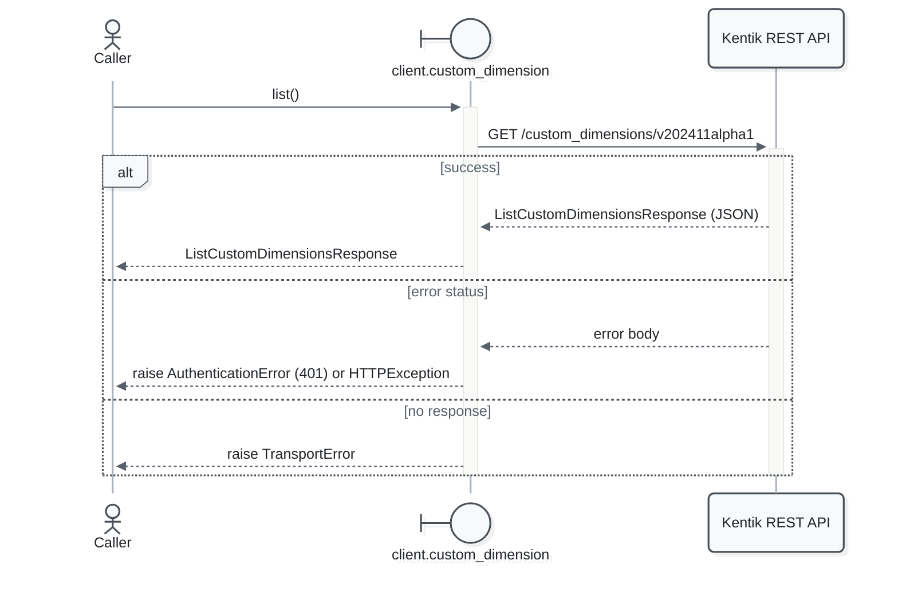
```mermaid
%%{init: {"theme": "redux", "look": "neo", "layout": "elk", "fontFamily": "ui-monospace, SFMono-Regular, Menlo, monospace", "themeVariables": {"fontFamily": "ui-monospace, SFMono-Regular, Menlo, monospace", "primaryColor": "#f8f9fa", "primaryBorderColor": "#495057", "primaryTextColor": "#212529", "textColor": "#212529", "lineColor": "#77818c", "edgeLabelBackground": "#ffffff", "actorBkg": "#f8f9fa", "actorBorder": "#495057", "actorTextColor": "#212529", "actorLineColor": "#a9b3be", "signalColor": "#57616d", "signalTextColor": "#212529", "labelBoxBkgColor": "#f8f9fa", "labelBoxBorderColor": "#495057", "labelTextColor": "#212529", "loopTextColor": "#57616d", "noteBkgColor": "#fff9db", "noteBorderColor": "#f08c00", "noteTextColor": "#a35a00"}, "sequence": {"activationWidth": 16}, "flowchart": {"curve": "basis", "nodeSpacing": 30, "rankSpacing": 70, "wrappingWidth": 400}}}%%
sequenceDiagram
    actor C as Caller
    participant W@{ "type": "boundary" } as client.custom_dimension
    participant API as Kentik REST API

    C->>+W: list()
    W->>+API: GET /custom_dimensions/v202411alpha1
    alt success
        API-->>W: ListCustomDimensionsResponse (JSON)
        W-->>C: ListCustomDimensionsResponse
    else error status
        API-->>W: error body
        W-->>C: raise AuthenticationError (401) or HTTPException
    else no response
        W-->>C: raise TransportError
    end
    deactivate API
    deactivate W
```

#### gRPC call flow

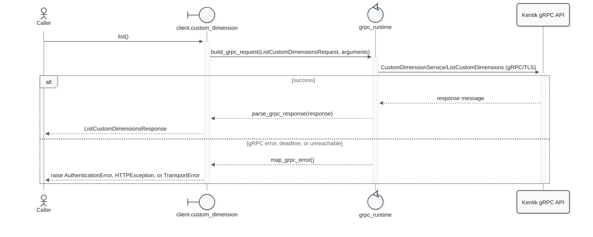
```mermaid
%%{init: {"theme": "redux", "look": "neo", "layout": "elk", "fontFamily": "ui-monospace, SFMono-Regular, Menlo, monospace", "themeVariables": {"fontFamily": "ui-monospace, SFMono-Regular, Menlo, monospace", "primaryColor": "#f8f9fa", "primaryBorderColor": "#495057", "primaryTextColor": "#212529", "textColor": "#212529", "lineColor": "#77818c", "edgeLabelBackground": "#ffffff", "actorBkg": "#f8f9fa", "actorBorder": "#495057", "actorTextColor": "#212529", "actorLineColor": "#a9b3be", "signalColor": "#57616d", "signalTextColor": "#212529", "labelBoxBkgColor": "#f8f9fa", "labelBoxBorderColor": "#495057", "labelTextColor": "#212529", "loopTextColor": "#57616d", "noteBkgColor": "#fff9db", "noteBorderColor": "#f08c00", "noteTextColor": "#a35a00"}, "sequence": {"activationWidth": 16}, "flowchart": {"curve": "basis", "nodeSpacing": 30, "rankSpacing": 70, "wrappingWidth": 400}}}%%
sequenceDiagram
    actor C as Caller
    participant W@{ "type": "boundary" } as client.custom_dimension
    participant R@{ "type": "control" } as grpc_runtime
    participant API as Kentik gRPC API

    C->>+W: list()
    W->>+R: build_grpc_request(ListCustomDimensionsRequest, arguments)
    R->>+API: CustomDimensionService/ListCustomDimensions (gRPC/TLS)
    alt success
        API-->>R: response message
        R-->>W: parse_grpc_response(response)
        W-->>C: ListCustomDimensionsResponse
    else gRPC error, deadline, or unreachable
        R-->>W: map_grpc_error()
        W-->>C: raise AuthenticationError, HTTPException, or TransportError
    end
    deactivate API
    deactivate R
    deactivate W
```

#### Responses

| Status | Description | Model |
| --- | --- | --- |
| 200 | A successful response. | `ListCustomDimensionsResponse` |
| default | An unexpected error response. | `rpcStatus` |

#### Example

```python
from kentik_api.client import KentikAPI

# Both transports work: protocol="rest" (default) or protocol="grpc".
client = KentikAPI(protocol="rest")  # loads KENTIK_EMAIL/KENTIK_API_TOKEN from .env
response = client.custom_dimension.list()
```

---

### `GET` `/custom_dimensions/v202411alpha1/{customDimensionId}`

Custom Dimension Info

Returns a custom dimension object containing information about an individual custom dimension.

#### REST call flow

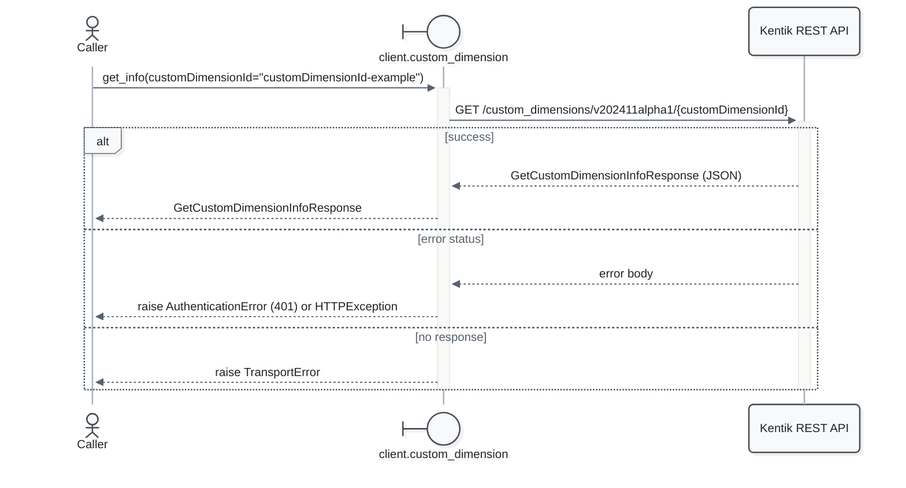
```mermaid
%%{init: {"theme": "redux", "look": "neo", "layout": "elk", "fontFamily": "ui-monospace, SFMono-Regular, Menlo, monospace", "themeVariables": {"fontFamily": "ui-monospace, SFMono-Regular, Menlo, monospace", "primaryColor": "#f8f9fa", "primaryBorderColor": "#495057", "primaryTextColor": "#212529", "textColor": "#212529", "lineColor": "#77818c", "edgeLabelBackground": "#ffffff", "actorBkg": "#f8f9fa", "actorBorder": "#495057", "actorTextColor": "#212529", "actorLineColor": "#a9b3be", "signalColor": "#57616d", "signalTextColor": "#212529", "labelBoxBkgColor": "#f8f9fa", "labelBoxBorderColor": "#495057", "labelTextColor": "#212529", "loopTextColor": "#57616d", "noteBkgColor": "#fff9db", "noteBorderColor": "#f08c00", "noteTextColor": "#a35a00"}, "sequence": {"activationWidth": 16}, "flowchart": {"curve": "basis", "nodeSpacing": 30, "rankSpacing": 70, "wrappingWidth": 400}}}%%
sequenceDiagram
    actor C as Caller
    participant W@{ "type": "boundary" } as client.custom_dimension
    participant API as Kentik REST API

    C->>+W: get_info(customDimensionId="customDimensionId-example")
    W->>+API: GET /custom_dimensions/v202411alpha1/{customDimensionId}
    alt success
        API-->>W: GetCustomDimensionInfoResponse (JSON)
        W-->>C: GetCustomDimensionInfoResponse
    else error status
        API-->>W: error body
        W-->>C: raise AuthenticationError (401) or HTTPException
    else no response
        W-->>C: raise TransportError
    end
    deactivate API
    deactivate W
```

#### gRPC call flow

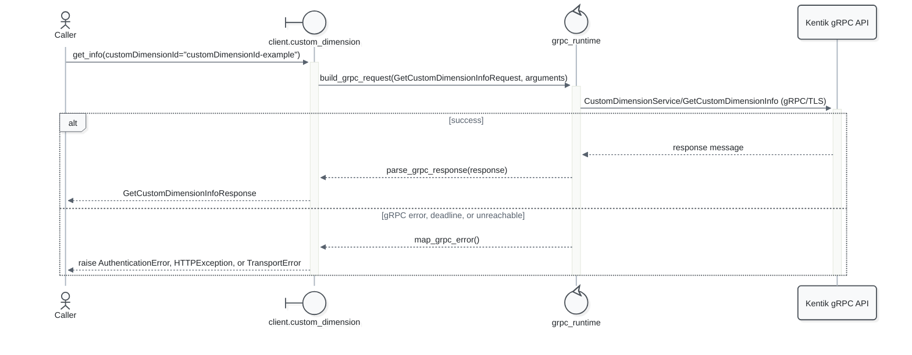
```mermaid
%%{init: {"theme": "redux", "look": "neo", "layout": "elk", "fontFamily": "ui-monospace, SFMono-Regular, Menlo, monospace", "themeVariables": {"fontFamily": "ui-monospace, SFMono-Regular, Menlo, monospace", "primaryColor": "#f8f9fa", "primaryBorderColor": "#495057", "primaryTextColor": "#212529", "textColor": "#212529", "lineColor": "#77818c", "edgeLabelBackground": "#ffffff", "actorBkg": "#f8f9fa", "actorBorder": "#495057", "actorTextColor": "#212529", "actorLineColor": "#a9b3be", "signalColor": "#57616d", "signalTextColor": "#212529", "labelBoxBkgColor": "#f8f9fa", "labelBoxBorderColor": "#495057", "labelTextColor": "#212529", "loopTextColor": "#57616d", "noteBkgColor": "#fff9db", "noteBorderColor": "#f08c00", "noteTextColor": "#a35a00"}, "sequence": {"activationWidth": 16}, "flowchart": {"curve": "basis", "nodeSpacing": 30, "rankSpacing": 70, "wrappingWidth": 400}}}%%
sequenceDiagram
    actor C as Caller
    participant W@{ "type": "boundary" } as client.custom_dimension
    participant R@{ "type": "control" } as grpc_runtime
    participant API as Kentik gRPC API

    C->>+W: get_info(customDimensionId="customDimensionId-example")
    W->>+R: build_grpc_request(GetCustomDimensionInfoRequest, arguments)
    R->>+API: CustomDimensionService/GetCustomDimensionInfo (gRPC/TLS)
    alt success
        API-->>R: response message
        R-->>W: parse_grpc_response(response)
        W-->>C: GetCustomDimensionInfoResponse
    else gRPC error, deadline, or unreachable
        R-->>W: map_grpc_error()
        W-->>C: raise AuthenticationError, HTTPException, or TransportError
    end
    deactivate API
    deactivate R
    deactivate W
```

#### Parameters

| Name | In | Type | Required |
| --- | --- | --- | --- |
| `customDimensionId` | path | `string` | Yes |

#### Responses

| Status | Description | Model |
| --- | --- | --- |
| 200 | A successful response. | `GetCustomDimensionInfoResponse` |
| default | An unexpected error response. | `rpcStatus` |

#### Example

```python
from kentik_api.client import KentikAPI

# Both transports work: protocol="rest" (default) or protocol="grpc".
client = KentikAPI(protocol="rest")  # loads KENTIK_EMAIL/KENTIK_API_TOKEN from .env
response = client.custom_dimension.get_info(
    customDimensionId="customDimensionId-example",
)
```

---

### `PUT` `/custom_dimensions/v202411alpha1/{customDimensionId}`

Update Custom Dimension

Updates and returns a custom dimension object containing information about an individual custom dimension (see About Custom Dimensions). Populators are not sent back in the response body. To get them use 'Custom Dimension info' API instead.

#### REST call flow

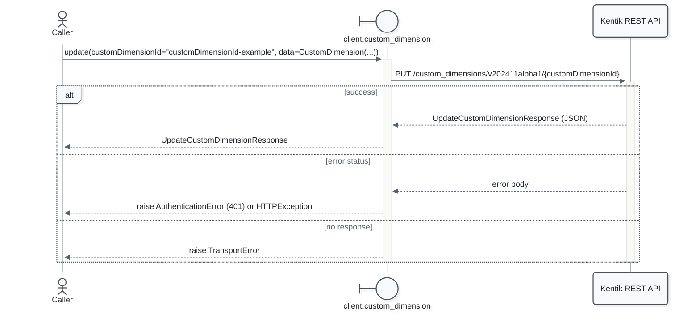
```mermaid
%%{init: {"theme": "redux", "look": "neo", "layout": "elk", "fontFamily": "ui-monospace, SFMono-Regular, Menlo, monospace", "themeVariables": {"fontFamily": "ui-monospace, SFMono-Regular, Menlo, monospace", "primaryColor": "#f8f9fa", "primaryBorderColor": "#495057", "primaryTextColor": "#212529", "textColor": "#212529", "lineColor": "#77818c", "edgeLabelBackground": "#ffffff", "actorBkg": "#f8f9fa", "actorBorder": "#495057", "actorTextColor": "#212529", "actorLineColor": "#a9b3be", "signalColor": "#57616d", "signalTextColor": "#212529", "labelBoxBkgColor": "#f8f9fa", "labelBoxBorderColor": "#495057", "labelTextColor": "#212529", "loopTextColor": "#57616d", "noteBkgColor": "#fff9db", "noteBorderColor": "#f08c00", "noteTextColor": "#a35a00"}, "sequence": {"activationWidth": 16}, "flowchart": {"curve": "basis", "nodeSpacing": 30, "rankSpacing": 70, "wrappingWidth": 400}}}%%
sequenceDiagram
    actor C as Caller
    participant W@{ "type": "boundary" } as client.custom_dimension
    participant API as Kentik REST API

    C->>+W: update(customDimensionId="customDimensionId-example", data=CustomDimension(...))
    W->>+API: PUT /custom_dimensions/v202411alpha1/{customDimensionId}
    alt success
        API-->>W: UpdateCustomDimensionResponse (JSON)
        W-->>C: UpdateCustomDimensionResponse
    else error status
        API-->>W: error body
        W-->>C: raise AuthenticationError (401) or HTTPException
    else no response
        W-->>C: raise TransportError
    end
    deactivate API
    deactivate W
```

#### gRPC call flow

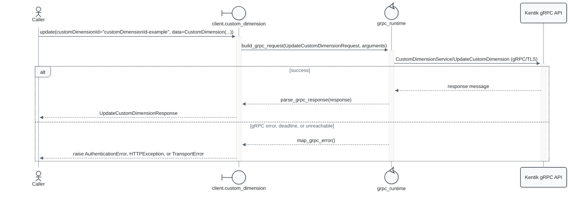
```mermaid
%%{init: {"theme": "redux", "look": "neo", "layout": "elk", "fontFamily": "ui-monospace, SFMono-Regular, Menlo, monospace", "themeVariables": {"fontFamily": "ui-monospace, SFMono-Regular, Menlo, monospace", "primaryColor": "#f8f9fa", "primaryBorderColor": "#495057", "primaryTextColor": "#212529", "textColor": "#212529", "lineColor": "#77818c", "edgeLabelBackground": "#ffffff", "actorBkg": "#f8f9fa", "actorBorder": "#495057", "actorTextColor": "#212529", "actorLineColor": "#a9b3be", "signalColor": "#57616d", "signalTextColor": "#212529", "labelBoxBkgColor": "#f8f9fa", "labelBoxBorderColor": "#495057", "labelTextColor": "#212529", "loopTextColor": "#57616d", "noteBkgColor": "#fff9db", "noteBorderColor": "#f08c00", "noteTextColor": "#a35a00"}, "sequence": {"activationWidth": 16}, "flowchart": {"curve": "basis", "nodeSpacing": 30, "rankSpacing": 70, "wrappingWidth": 400}}}%%
sequenceDiagram
    actor C as Caller
    participant W@{ "type": "boundary" } as client.custom_dimension
    participant R@{ "type": "control" } as grpc_runtime
    participant API as Kentik gRPC API

    C->>+W: update(customDimensionId="customDimensionId-example", data=CustomDimension(...))
    W->>+R: build_grpc_request(UpdateCustomDimensionRequest, arguments)
    R->>+API: CustomDimensionService/UpdateCustomDimension (gRPC/TLS)
    alt success
        API-->>R: response message
        R-->>W: parse_grpc_response(response)
        W-->>C: UpdateCustomDimensionResponse
    else gRPC error, deadline, or unreachable
        R-->>W: map_grpc_error()
        W-->>C: raise AuthenticationError, HTTPException, or TransportError
    end
    deactivate API
    deactivate R
    deactivate W
```

#### Parameters

| Name | In | Type | Required |
| --- | --- | --- | --- |
| `customDimensionId` | path | `string` | Yes |
| `data` | body | `CustomDimension` | Yes |

#### Responses

| Status | Description | Model |
| --- | --- | --- |
| 200 | A successful response. | `UpdateCustomDimensionResponse` |
| default | An unexpected error response. | `rpcStatus` |

#### Example

```python
from kentik_api.client import KentikAPI
from kentik_api.gen.custom_dimension.models import CustomDimension

# Both transports work: protocol="rest" (default) or protocol="grpc".
client = KentikAPI(protocol="rest")  # loads KENTIK_EMAIL/KENTIK_API_TOKEN from .env
response = client.custom_dimension.update(
    customDimensionId="customDimensionId-example",
    data=CustomDimension(...),
)
```

---

### `DELETE` `/custom_dimensions/v202411alpha1/{customDimensionId}`

Delete Custom Dimension

Deletes a custom dimension.

#### REST call flow


```mermaid
%%{init: {"theme": "redux", "look": "neo", "layout": "elk", "fontFamily": "ui-monospace, SFMono-Regular, Menlo, monospace", "themeVariables": {"fontFamily": "ui-monospace, SFMono-Regular, Menlo, monospace", "primaryColor": "#f8f9fa", "primaryBorderColor": "#495057", "primaryTextColor": "#212529", "textColor": "#212529", "lineColor": "#77818c", "edgeLabelBackground": "#ffffff", "actorBkg": "#f8f9fa", "actorBorder": "#495057", "actorTextColor": "#212529", "actorLineColor": "#a9b3be", "signalColor": "#57616d", "signalTextColor": "#212529", "labelBoxBkgColor": "#f8f9fa", "labelBoxBorderColor": "#495057", "labelTextColor": "#212529", "loopTextColor": "#57616d", "noteBkgColor": "#fff9db", "noteBorderColor": "#f08c00", "noteTextColor": "#a35a00"}, "sequence": {"activationWidth": 16}, "flowchart": {"curve": "basis", "nodeSpacing": 30, "rankSpacing": 70, "wrappingWidth": 400}}}%%
sequenceDiagram
    actor C as Caller
    participant W@{ "type": "boundary" } as client.custom_dimension
    participant API as Kentik REST API

    C->>+W: delete(customDimensionId="customDimensionId-example")
    W->>+API: DELETE /custom_dimensions/v202411alpha1/{customDimensionId}
    alt success
        API-->>W: DeleteCustomDimensionResponse (JSON)
        W-->>C: DeleteCustomDimensionResponse
    else error status
        API-->>W: error body
        W-->>C: raise AuthenticationError (401) or HTTPException
    else no response
        W-->>C: raise TransportError
    end
    deactivate API
    deactivate W
```

#### gRPC call flow

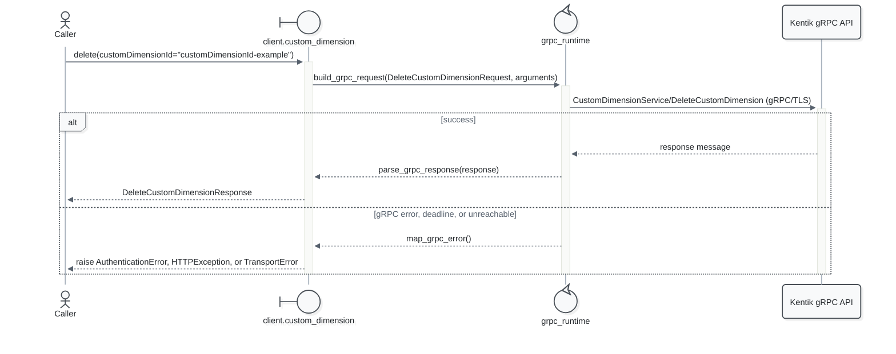
```mermaid
%%{init: {"theme": "redux", "look": "neo", "layout": "elk", "fontFamily": "ui-monospace, SFMono-Regular, Menlo, monospace", "themeVariables": {"fontFamily": "ui-monospace, SFMono-Regular, Menlo, monospace", "primaryColor": "#f8f9fa", "primaryBorderColor": "#495057", "primaryTextColor": "#212529", "textColor": "#212529", "lineColor": "#77818c", "edgeLabelBackground": "#ffffff", "actorBkg": "#f8f9fa", "actorBorder": "#495057", "actorTextColor": "#212529", "actorLineColor": "#a9b3be", "signalColor": "#57616d", "signalTextColor": "#212529", "labelBoxBkgColor": "#f8f9fa", "labelBoxBorderColor": "#495057", "labelTextColor": "#212529", "loopTextColor": "#57616d", "noteBkgColor": "#fff9db", "noteBorderColor": "#f08c00", "noteTextColor": "#a35a00"}, "sequence": {"activationWidth": 16}, "flowchart": {"curve": "basis", "nodeSpacing": 30, "rankSpacing": 70, "wrappingWidth": 400}}}%%
sequenceDiagram
    actor C as Caller
    participant W@{ "type": "boundary" } as client.custom_dimension
    participant R@{ "type": "control" } as grpc_runtime
    participant API as Kentik gRPC API

    C->>+W: delete(customDimensionId="customDimensionId-example")
    W->>+R: build_grpc_request(DeleteCustomDimensionRequest, arguments)
    R->>+API: CustomDimensionService/DeleteCustomDimension (gRPC/TLS)
    alt success
        API-->>R: response message
        R-->>W: parse_grpc_response(response)
        W-->>C: DeleteCustomDimensionResponse
    else gRPC error, deadline, or unreachable
        R-->>W: map_grpc_error()
        W-->>C: raise AuthenticationError, HTTPException, or TransportError
    end
    deactivate API
    deactivate R
    deactivate W
```

#### Parameters

| Name | In | Type | Required |
| --- | --- | --- | --- |
| `customDimensionId` | path | `string` | Yes |

#### Responses

| Status | Description | Model |
| --- | --- | --- |
| 200 | A successful response. | `DeleteCustomDimensionResponse` |
| default | An unexpected error response. | `rpcStatus` |

#### Example

```python
from kentik_api.client import KentikAPI

# Both transports work: protocol="rest" (default) or protocol="grpc".
client = KentikAPI(protocol="rest")  # loads KENTIK_EMAIL/KENTIK_API_TOKEN from .env
response = client.custom_dimension.delete(
    customDimensionId="customDimensionId-example",
)
```

---

### `POST` `/custom_dimensions/v202411alpha1/{customDimensionId}/populator`

Create Populator

Creates and returns a populator object containing information about an individual populator.

#### REST call flow

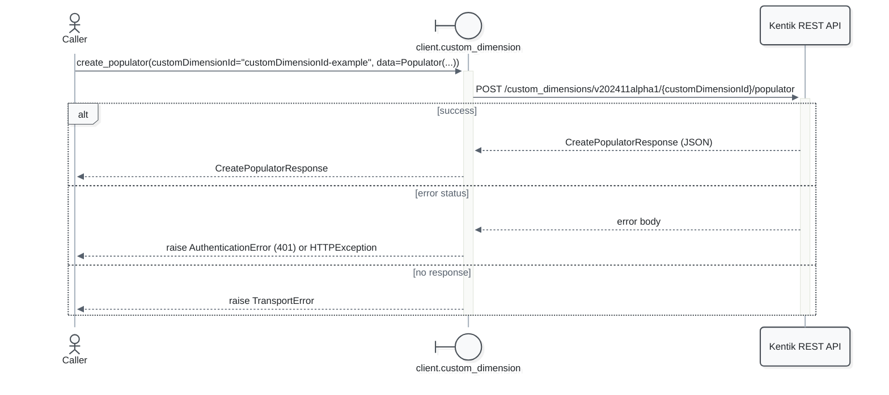
```mermaid
%%{init: {"theme": "redux", "look": "neo", "layout": "elk", "fontFamily": "ui-monospace, SFMono-Regular, Menlo, monospace", "themeVariables": {"fontFamily": "ui-monospace, SFMono-Regular, Menlo, monospace", "primaryColor": "#f8f9fa", "primaryBorderColor": "#495057", "primaryTextColor": "#212529", "textColor": "#212529", "lineColor": "#77818c", "edgeLabelBackground": "#ffffff", "actorBkg": "#f8f9fa", "actorBorder": "#495057", "actorTextColor": "#212529", "actorLineColor": "#a9b3be", "signalColor": "#57616d", "signalTextColor": "#212529", "labelBoxBkgColor": "#f8f9fa", "labelBoxBorderColor": "#495057", "labelTextColor": "#212529", "loopTextColor": "#57616d", "noteBkgColor": "#fff9db", "noteBorderColor": "#f08c00", "noteTextColor": "#a35a00"}, "sequence": {"activationWidth": 16}, "flowchart": {"curve": "basis", "nodeSpacing": 30, "rankSpacing": 70, "wrappingWidth": 400}}}%%
sequenceDiagram
    actor C as Caller
    participant W@{ "type": "boundary" } as client.custom_dimension
    participant API as Kentik REST API

    C->>+W: create_populator(customDimensionId="customDimensionId-example", data=Populator(...))
    W->>+API: POST /custom_dimensions/v202411alpha1/{customDimensionId}/populator
    alt success
        API-->>W: CreatePopulatorResponse (JSON)
        W-->>C: CreatePopulatorResponse
    else error status
        API-->>W: error body
        W-->>C: raise AuthenticationError (401) or HTTPException
    else no response
        W-->>C: raise TransportError
    end
    deactivate API
    deactivate W
```

#### gRPC call flow

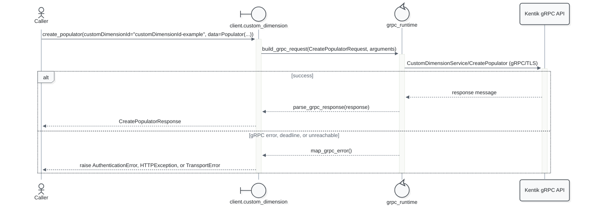
```mermaid
%%{init: {"theme": "redux", "look": "neo", "layout": "elk", "fontFamily": "ui-monospace, SFMono-Regular, Menlo, monospace", "themeVariables": {"fontFamily": "ui-monospace, SFMono-Regular, Menlo, monospace", "primaryColor": "#f8f9fa", "primaryBorderColor": "#495057", "primaryTextColor": "#212529", "textColor": "#212529", "lineColor": "#77818c", "edgeLabelBackground": "#ffffff", "actorBkg": "#f8f9fa", "actorBorder": "#495057", "actorTextColor": "#212529", "actorLineColor": "#a9b3be", "signalColor": "#57616d", "signalTextColor": "#212529", "labelBoxBkgColor": "#f8f9fa", "labelBoxBorderColor": "#495057", "labelTextColor": "#212529", "loopTextColor": "#57616d", "noteBkgColor": "#fff9db", "noteBorderColor": "#f08c00", "noteTextColor": "#a35a00"}, "sequence": {"activationWidth": 16}, "flowchart": {"curve": "basis", "nodeSpacing": 30, "rankSpacing": 70, "wrappingWidth": 400}}}%%
sequenceDiagram
    actor C as Caller
    participant W@{ "type": "boundary" } as client.custom_dimension
    participant R@{ "type": "control" } as grpc_runtime
    participant API as Kentik gRPC API

    C->>+W: create_populator(customDimensionId="customDimensionId-example", data=Populator(...))
    W->>+R: build_grpc_request(CreatePopulatorRequest, arguments)
    R->>+API: CustomDimensionService/CreatePopulator (gRPC/TLS)
    alt success
        API-->>R: response message
        R-->>W: parse_grpc_response(response)
        W-->>C: CreatePopulatorResponse
    else gRPC error, deadline, or unreachable
        R-->>W: map_grpc_error()
        W-->>C: raise AuthenticationError, HTTPException, or TransportError
    end
    deactivate API
    deactivate R
    deactivate W
```

#### Parameters

| Name | In | Type | Required |
| --- | --- | --- | --- |
| `customDimensionId` | path | `string` | Yes |
| `data` | body | `Populator` | Yes |

#### Responses

| Status | Description | Model |
| --- | --- | --- |
| 200 | A successful response. | `CreatePopulatorResponse` |
| default | An unexpected error response. | `rpcStatus` |

#### Example

```python
from kentik_api.client import KentikAPI
from kentik_api.gen.custom_dimension.models import Populator

# Both transports work: protocol="rest" (default) or protocol="grpc".
client = KentikAPI(protocol="rest")  # loads KENTIK_EMAIL/KENTIK_API_TOKEN from .env
response = client.custom_dimension.create_populator(
    customDimensionId="customDimensionId-example",
    data=Populator(...),
)
```

---

### `GET` `/custom_dimensions/v202411alpha1/{customDimensionId}/populator/{populatorId}`

Get Populator

Get Populator by Dimension and Populator ID.

#### REST call flow

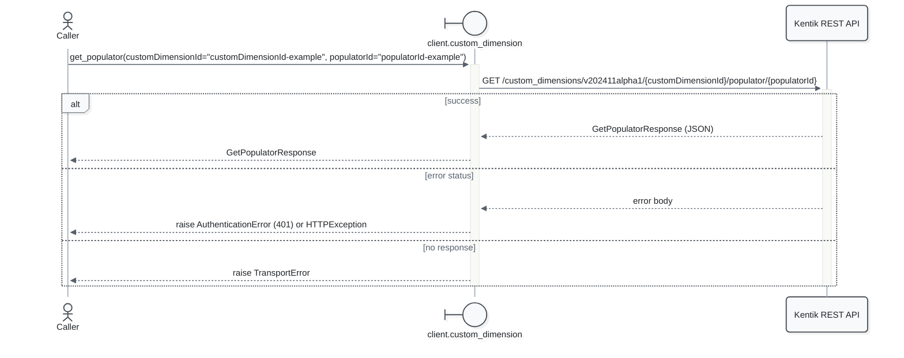
```mermaid
%%{init: {"theme": "redux", "look": "neo", "layout": "elk", "fontFamily": "ui-monospace, SFMono-Regular, Menlo, monospace", "themeVariables": {"fontFamily": "ui-monospace, SFMono-Regular, Menlo, monospace", "primaryColor": "#f8f9fa", "primaryBorderColor": "#495057", "primaryTextColor": "#212529", "textColor": "#212529", "lineColor": "#77818c", "edgeLabelBackground": "#ffffff", "actorBkg": "#f8f9fa", "actorBorder": "#495057", "actorTextColor": "#212529", "actorLineColor": "#a9b3be", "signalColor": "#57616d", "signalTextColor": "#212529", "labelBoxBkgColor": "#f8f9fa", "labelBoxBorderColor": "#495057", "labelTextColor": "#212529", "loopTextColor": "#57616d", "noteBkgColor": "#fff9db", "noteBorderColor": "#f08c00", "noteTextColor": "#a35a00"}, "sequence": {"activationWidth": 16}, "flowchart": {"curve": "basis", "nodeSpacing": 30, "rankSpacing": 70, "wrappingWidth": 400}}}%%
sequenceDiagram
    actor C as Caller
    participant W@{ "type": "boundary" } as client.custom_dimension
    participant API as Kentik REST API

    C->>+W: get_populator(customDimensionId="customDimensionId-example", populatorId="populatorId-example")
    W->>+API: GET /custom_dimensions/v202411alpha1/{customDimensionId}/populator/{populatorId}
    alt success
        API-->>W: GetPopulatorResponse (JSON)
        W-->>C: GetPopulatorResponse
    else error status
        API-->>W: error body
        W-->>C: raise AuthenticationError (401) or HTTPException
    else no response
        W-->>C: raise TransportError
    end
    deactivate API
    deactivate W
```

#### gRPC call flow

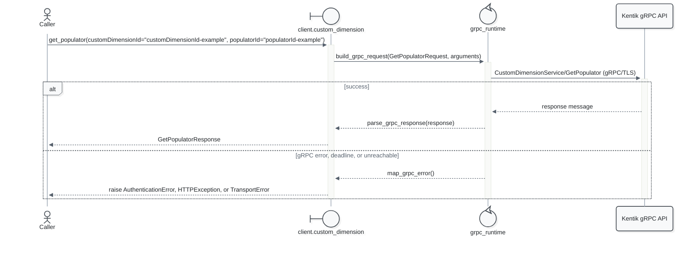
```mermaid
%%{init: {"theme": "redux", "look": "neo", "layout": "elk", "fontFamily": "ui-monospace, SFMono-Regular, Menlo, monospace", "themeVariables": {"fontFamily": "ui-monospace, SFMono-Regular, Menlo, monospace", "primaryColor": "#f8f9fa", "primaryBorderColor": "#495057", "primaryTextColor": "#212529", "textColor": "#212529", "lineColor": "#77818c", "edgeLabelBackground": "#ffffff", "actorBkg": "#f8f9fa", "actorBorder": "#495057", "actorTextColor": "#212529", "actorLineColor": "#a9b3be", "signalColor": "#57616d", "signalTextColor": "#212529", "labelBoxBkgColor": "#f8f9fa", "labelBoxBorderColor": "#495057", "labelTextColor": "#212529", "loopTextColor": "#57616d", "noteBkgColor": "#fff9db", "noteBorderColor": "#f08c00", "noteTextColor": "#a35a00"}, "sequence": {"activationWidth": 16}, "flowchart": {"curve": "basis", "nodeSpacing": 30, "rankSpacing": 70, "wrappingWidth": 400}}}%%
sequenceDiagram
    actor C as Caller
    participant W@{ "type": "boundary" } as client.custom_dimension
    participant R@{ "type": "control" } as grpc_runtime
    participant API as Kentik gRPC API

    C->>+W: get_populator(customDimensionId="customDimensionId-example", populatorId="populatorId-example")
    W->>+R: build_grpc_request(GetPopulatorRequest, arguments)
    R->>+API: CustomDimensionService/GetPopulator (gRPC/TLS)
    alt success
        API-->>R: response message
        R-->>W: parse_grpc_response(response)
        W-->>C: GetPopulatorResponse
    else gRPC error, deadline, or unreachable
        R-->>W: map_grpc_error()
        W-->>C: raise AuthenticationError, HTTPException, or TransportError
    end
    deactivate API
    deactivate R
    deactivate W
```

#### Parameters

| Name | In | Type | Required |
| --- | --- | --- | --- |
| `customDimensionId` | path | `string` | Yes |
| `populatorId` | path | `string` | Yes |
| `fieldLimit` | query | `integer (int64)` | No |

#### Responses

| Status | Description | Model |
| --- | --- | --- |
| 200 | A successful response. | `GetPopulatorResponse` |
| default | An unexpected error response. | `rpcStatus` |

#### Example

```python
from kentik_api.client import KentikAPI

# Both transports work: protocol="rest" (default) or protocol="grpc".
client = KentikAPI(protocol="rest")  # loads KENTIK_EMAIL/KENTIK_API_TOKEN from .env
response = client.custom_dimension.get_populator(
    customDimensionId="customDimensionId-example",
    populatorId="populatorId-example",
)
```

---

### `PUT` `/custom_dimensions/v202411alpha1/{customDimensionId}/populator/{populatorId}`

Update Populator

Updates and returns a populator object containing information about an individual populator.

#### REST call flow

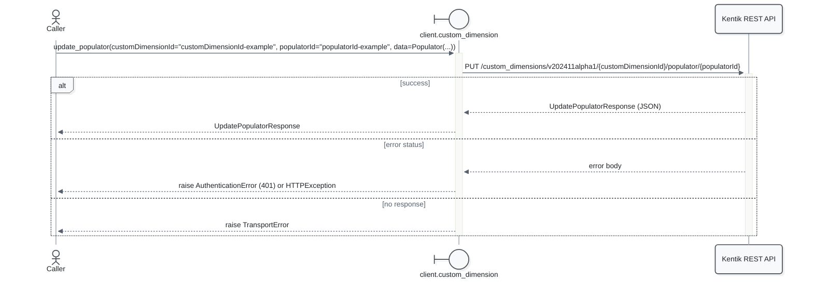
```mermaid
%%{init: {"theme": "redux", "look": "neo", "layout": "elk", "fontFamily": "ui-monospace, SFMono-Regular, Menlo, monospace", "themeVariables": {"fontFamily": "ui-monospace, SFMono-Regular, Menlo, monospace", "primaryColor": "#f8f9fa", "primaryBorderColor": "#495057", "primaryTextColor": "#212529", "textColor": "#212529", "lineColor": "#77818c", "edgeLabelBackground": "#ffffff", "actorBkg": "#f8f9fa", "actorBorder": "#495057", "actorTextColor": "#212529", "actorLineColor": "#a9b3be", "signalColor": "#57616d", "signalTextColor": "#212529", "labelBoxBkgColor": "#f8f9fa", "labelBoxBorderColor": "#495057", "labelTextColor": "#212529", "loopTextColor": "#57616d", "noteBkgColor": "#fff9db", "noteBorderColor": "#f08c00", "noteTextColor": "#a35a00"}, "sequence": {"activationWidth": 16}, "flowchart": {"curve": "basis", "nodeSpacing": 30, "rankSpacing": 70, "wrappingWidth": 400}}}%%
sequenceDiagram
    actor C as Caller
    participant W@{ "type": "boundary" } as client.custom_dimension
    participant API as Kentik REST API

    C->>+W: update_populator(customDimensionId="customDimensionId-example", populatorId="populatorId-example", data=Populator(...))
    W->>+API: PUT /custom_dimensions/v202411alpha1/{customDimensionId}/populator/{populatorId}
    alt success
        API-->>W: UpdatePopulatorResponse (JSON)
        W-->>C: UpdatePopulatorResponse
    else error status
        API-->>W: error body
        W-->>C: raise AuthenticationError (401) or HTTPException
    else no response
        W-->>C: raise TransportError
    end
    deactivate API
    deactivate W
```

#### gRPC call flow

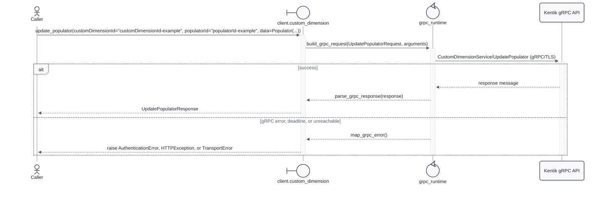
```mermaid
%%{init: {"theme": "redux", "look": "neo", "layout": "elk", "fontFamily": "ui-monospace, SFMono-Regular, Menlo, monospace", "themeVariables": {"fontFamily": "ui-monospace, SFMono-Regular, Menlo, monospace", "primaryColor": "#f8f9fa", "primaryBorderColor": "#495057", "primaryTextColor": "#212529", "textColor": "#212529", "lineColor": "#77818c", "edgeLabelBackground": "#ffffff", "actorBkg": "#f8f9fa", "actorBorder": "#495057", "actorTextColor": "#212529", "actorLineColor": "#a9b3be", "signalColor": "#57616d", "signalTextColor": "#212529", "labelBoxBkgColor": "#f8f9fa", "labelBoxBorderColor": "#495057", "labelTextColor": "#212529", "loopTextColor": "#57616d", "noteBkgColor": "#fff9db", "noteBorderColor": "#f08c00", "noteTextColor": "#a35a00"}, "sequence": {"activationWidth": 16}, "flowchart": {"curve": "basis", "nodeSpacing": 30, "rankSpacing": 70, "wrappingWidth": 400}}}%%
sequenceDiagram
    actor C as Caller
    participant W@{ "type": "boundary" } as client.custom_dimension
    participant R@{ "type": "control" } as grpc_runtime
    participant API as Kentik gRPC API

    C->>+W: update_populator(customDimensionId="customDimensionId-example", populatorId="populatorId-example", data=Populator(...))
    W->>+R: build_grpc_request(UpdatePopulatorRequest, arguments)
    R->>+API: CustomDimensionService/UpdatePopulator (gRPC/TLS)
    alt success
        API-->>R: response message
        R-->>W: parse_grpc_response(response)
        W-->>C: UpdatePopulatorResponse
    else gRPC error, deadline, or unreachable
        R-->>W: map_grpc_error()
        W-->>C: raise AuthenticationError, HTTPException, or TransportError
    end
    deactivate API
    deactivate R
    deactivate W
```

#### Parameters

| Name | In | Type | Required |
| --- | --- | --- | --- |
| `customDimensionId` | path | `string` | Yes |
| `populatorId` | path | `string` | Yes |
| `data` | body | `Populator` | Yes |

#### Responses

| Status | Description | Model |
| --- | --- | --- |
| 200 | A successful response. | `UpdatePopulatorResponse` |
| default | An unexpected error response. | `rpcStatus` |

#### Example

```python
from kentik_api.client import KentikAPI
from kentik_api.gen.custom_dimension.models import Populator

# Both transports work: protocol="rest" (default) or protocol="grpc".
client = KentikAPI(protocol="rest")  # loads KENTIK_EMAIL/KENTIK_API_TOKEN from .env
response = client.custom_dimension.update_populator(
    customDimensionId="customDimensionId-example",
    populatorId="populatorId-example",
    data=Populator(...),
)
```

---

### `DELETE` `/custom_dimensions/v202411alpha1/{customDimensionId}/populator/{populatorId}`

Delete Populator

Deletes a populator.

#### REST call flow

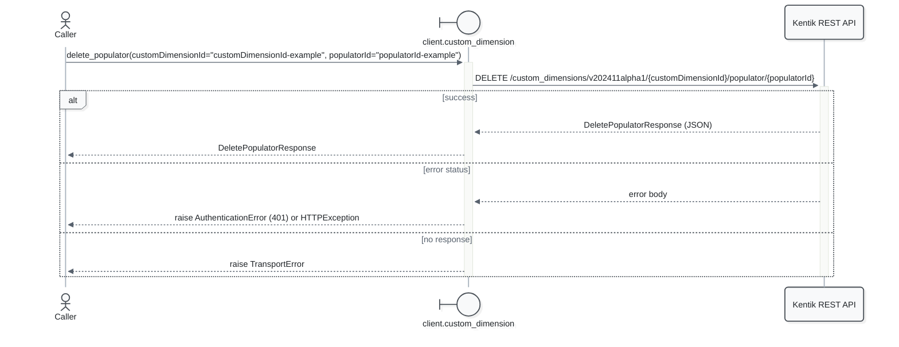
```mermaid
%%{init: {"theme": "redux", "look": "neo", "layout": "elk", "fontFamily": "ui-monospace, SFMono-Regular, Menlo, monospace", "themeVariables": {"fontFamily": "ui-monospace, SFMono-Regular, Menlo, monospace", "primaryColor": "#f8f9fa", "primaryBorderColor": "#495057", "primaryTextColor": "#212529", "textColor": "#212529", "lineColor": "#77818c", "edgeLabelBackground": "#ffffff", "actorBkg": "#f8f9fa", "actorBorder": "#495057", "actorTextColor": "#212529", "actorLineColor": "#a9b3be", "signalColor": "#57616d", "signalTextColor": "#212529", "labelBoxBkgColor": "#f8f9fa", "labelBoxBorderColor": "#495057", "labelTextColor": "#212529", "loopTextColor": "#57616d", "noteBkgColor": "#fff9db", "noteBorderColor": "#f08c00", "noteTextColor": "#a35a00"}, "sequence": {"activationWidth": 16}, "flowchart": {"curve": "basis", "nodeSpacing": 30, "rankSpacing": 70, "wrappingWidth": 400}}}%%
sequenceDiagram
    actor C as Caller
    participant W@{ "type": "boundary" } as client.custom_dimension
    participant API as Kentik REST API

    C->>+W: delete_populator(customDimensionId="customDimensionId-example", populatorId="populatorId-example")
    W->>+API: DELETE /custom_dimensions/v202411alpha1/{customDimensionId}/populator/{populatorId}
    alt success
        API-->>W: DeletePopulatorResponse (JSON)
        W-->>C: DeletePopulatorResponse
    else error status
        API-->>W: error body
        W-->>C: raise AuthenticationError (401) or HTTPException
    else no response
        W-->>C: raise TransportError
    end
    deactivate API
    deactivate W
```

#### gRPC call flow

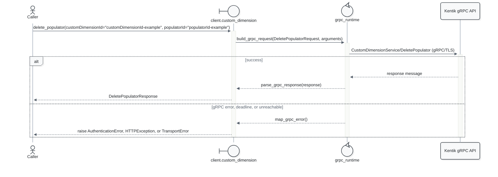
```mermaid
%%{init: {"theme": "redux", "look": "neo", "layout": "elk", "fontFamily": "ui-monospace, SFMono-Regular, Menlo, monospace", "themeVariables": {"fontFamily": "ui-monospace, SFMono-Regular, Menlo, monospace", "primaryColor": "#f8f9fa", "primaryBorderColor": "#495057", "primaryTextColor": "#212529", "textColor": "#212529", "lineColor": "#77818c", "edgeLabelBackground": "#ffffff", "actorBkg": "#f8f9fa", "actorBorder": "#495057", "actorTextColor": "#212529", "actorLineColor": "#a9b3be", "signalColor": "#57616d", "signalTextColor": "#212529", "labelBoxBkgColor": "#f8f9fa", "labelBoxBorderColor": "#495057", "labelTextColor": "#212529", "loopTextColor": "#57616d", "noteBkgColor": "#fff9db", "noteBorderColor": "#f08c00", "noteTextColor": "#a35a00"}, "sequence": {"activationWidth": 16}, "flowchart": {"curve": "basis", "nodeSpacing": 30, "rankSpacing": 70, "wrappingWidth": 400}}}%%
sequenceDiagram
    actor C as Caller
    participant W@{ "type": "boundary" } as client.custom_dimension
    participant R@{ "type": "control" } as grpc_runtime
    participant API as Kentik gRPC API

    C->>+W: delete_populator(customDimensionId="customDimensionId-example", populatorId="populatorId-example")
    W->>+R: build_grpc_request(DeletePopulatorRequest, arguments)
    R->>+API: CustomDimensionService/DeletePopulator (gRPC/TLS)
    alt success
        API-->>R: response message
        R-->>W: parse_grpc_response(response)
        W-->>C: DeletePopulatorResponse
    else gRPC error, deadline, or unreachable
        R-->>W: map_grpc_error()
        W-->>C: raise AuthenticationError, HTTPException, or TransportError
    end
    deactivate API
    deactivate R
    deactivate W
```

#### Parameters

| Name | In | Type | Required |
| --- | --- | --- | --- |
| `customDimensionId` | path | `string` | Yes |
| `populatorId` | path | `string` | Yes |

#### Responses

| Status | Description | Model |
| --- | --- | --- |
| 200 | A successful response. | `DeletePopulatorResponse` |
| default | An unexpected error response. | `rpcStatus` |

#### Example

```python
from kentik_api.client import KentikAPI

# Both transports work: protocol="rest" (default) or protocol="grpc".
client = KentikAPI(protocol="rest")  # loads KENTIK_EMAIL/KENTIK_API_TOKEN from .env
response = client.custom_dimension.delete_populator(
    customDimensionId="customDimensionId-example",
    populatorId="populatorId-example",
)
```

---

### `GET` `/custom_dimensions/v202411alpha1/{customDimensionId}/populator/{populatorId}/field/{fieldName}`

Get Populator Field

Get Populator field by Dimension, Populator ID, and field name.

#### REST call flow

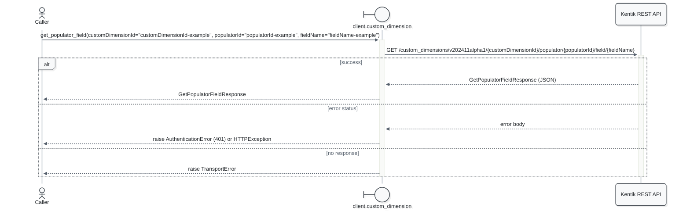
```mermaid
%%{init: {"theme": "redux", "look": "neo", "layout": "elk", "fontFamily": "ui-monospace, SFMono-Regular, Menlo, monospace", "themeVariables": {"fontFamily": "ui-monospace, SFMono-Regular, Menlo, monospace", "primaryColor": "#f8f9fa", "primaryBorderColor": "#495057", "primaryTextColor": "#212529", "textColor": "#212529", "lineColor": "#77818c", "edgeLabelBackground": "#ffffff", "actorBkg": "#f8f9fa", "actorBorder": "#495057", "actorTextColor": "#212529", "actorLineColor": "#a9b3be", "signalColor": "#57616d", "signalTextColor": "#212529", "labelBoxBkgColor": "#f8f9fa", "labelBoxBorderColor": "#495057", "labelTextColor": "#212529", "loopTextColor": "#57616d", "noteBkgColor": "#fff9db", "noteBorderColor": "#f08c00", "noteTextColor": "#a35a00"}, "sequence": {"activationWidth": 16}, "flowchart": {"curve": "basis", "nodeSpacing": 30, "rankSpacing": 70, "wrappingWidth": 400}}}%%
sequenceDiagram
    actor C as Caller
    participant W@{ "type": "boundary" } as client.custom_dimension
    participant API as Kentik REST API

    C->>+W: get_populator_field(customDimensionId="customDimensionId-example", populatorId="populatorId-example", fieldName="fieldName-example")
    W->>+API: GET /custom_dimensions/v202411alpha1/{customDimensionId}/populator/{populatorId}/field/{fieldName}
    alt success
        API-->>W: GetPopulatorFieldResponse (JSON)
        W-->>C: GetPopulatorFieldResponse
    else error status
        API-->>W: error body
        W-->>C: raise AuthenticationError (401) or HTTPException
    else no response
        W-->>C: raise TransportError
    end
    deactivate API
    deactivate W
```

#### gRPC call flow

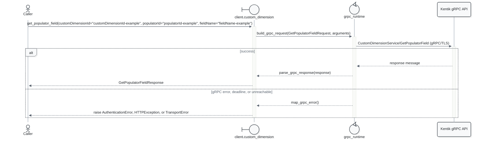
```mermaid
%%{init: {"theme": "redux", "look": "neo", "layout": "elk", "fontFamily": "ui-monospace, SFMono-Regular, Menlo, monospace", "themeVariables": {"fontFamily": "ui-monospace, SFMono-Regular, Menlo, monospace", "primaryColor": "#f8f9fa", "primaryBorderColor": "#495057", "primaryTextColor": "#212529", "textColor": "#212529", "lineColor": "#77818c", "edgeLabelBackground": "#ffffff", "actorBkg": "#f8f9fa", "actorBorder": "#495057", "actorTextColor": "#212529", "actorLineColor": "#a9b3be", "signalColor": "#57616d", "signalTextColor": "#212529", "labelBoxBkgColor": "#f8f9fa", "labelBoxBorderColor": "#495057", "labelTextColor": "#212529", "loopTextColor": "#57616d", "noteBkgColor": "#fff9db", "noteBorderColor": "#f08c00", "noteTextColor": "#a35a00"}, "sequence": {"activationWidth": 16}, "flowchart": {"curve": "basis", "nodeSpacing": 30, "rankSpacing": 70, "wrappingWidth": 400}}}%%
sequenceDiagram
    actor C as Caller
    participant W@{ "type": "boundary" } as client.custom_dimension
    participant R@{ "type": "control" } as grpc_runtime
    participant API as Kentik gRPC API

    C->>+W: get_populator_field(customDimensionId="customDimensionId-example", populatorId="populatorId-example", fieldName="fieldName-example")
    W->>+R: build_grpc_request(GetPopulatorFieldRequest, arguments)
    R->>+API: CustomDimensionService/GetPopulatorField (gRPC/TLS)
    alt success
        API-->>R: response message
        R-->>W: parse_grpc_response(response)
        W-->>C: GetPopulatorFieldResponse
    else gRPC error, deadline, or unreachable
        R-->>W: map_grpc_error()
        W-->>C: raise AuthenticationError, HTTPException, or TransportError
    end
    deactivate API
    deactivate R
    deactivate W
```

#### Parameters

| Name | In | Type | Required |
| --- | --- | --- | --- |
| `customDimensionId` | path | `string` | Yes |
| `populatorId` | path | `string` | Yes |
| `fieldName` | path | `string` | Yes |
| `offset` | query | `integer (int32)` | No |
| `limit` | query | `integer (int32)` | No |

#### Responses

| Status | Description | Model |
| --- | --- | --- |
| 200 | A successful response. | `GetPopulatorFieldResponse` |
| default | An unexpected error response. | `rpcStatus` |

#### Example

```python
from kentik_api.client import KentikAPI

# Both transports work: protocol="rest" (default) or protocol="grpc".
client = KentikAPI(protocol="rest")  # loads KENTIK_EMAIL/KENTIK_API_TOKEN from .env
response = client.custom_dimension.get_populator_field(
    customDimensionId="customDimensionId-example",
    populatorId="populatorId-example",
    fieldName="fieldName-example",
)
```

---

### `POST` `/v1/customdimension`

Create Custom Dimension

Creates and returns a custom dimension object containing information about an individual custom dimension

#### REST call flow

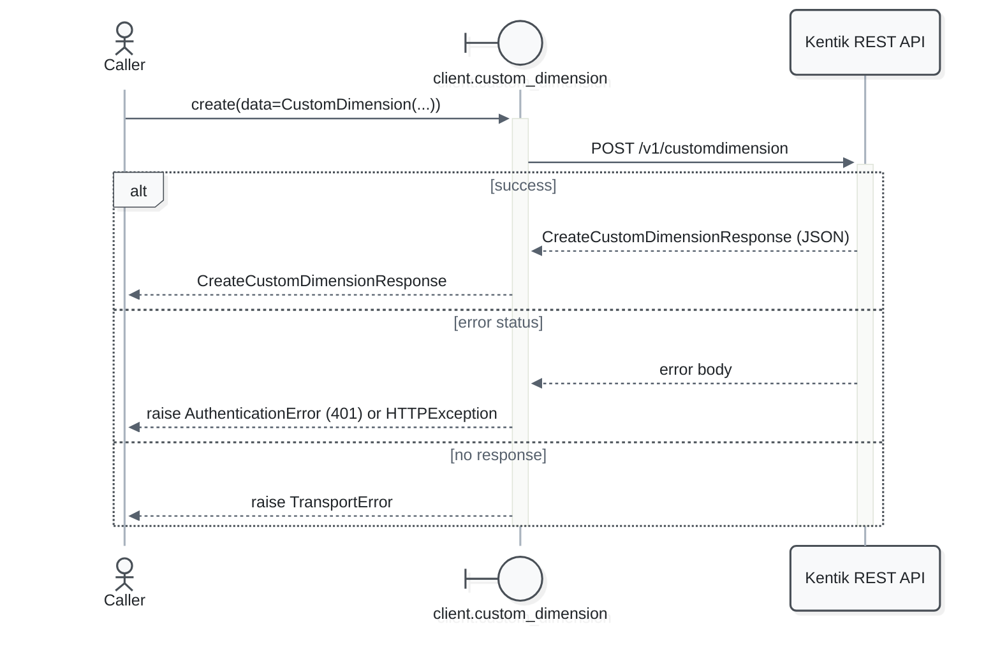
```mermaid
%%{init: {"theme": "redux", "look": "neo", "layout": "elk", "fontFamily": "ui-monospace, SFMono-Regular, Menlo, monospace", "themeVariables": {"fontFamily": "ui-monospace, SFMono-Regular, Menlo, monospace", "primaryColor": "#f8f9fa", "primaryBorderColor": "#495057", "primaryTextColor": "#212529", "textColor": "#212529", "lineColor": "#77818c", "edgeLabelBackground": "#ffffff", "actorBkg": "#f8f9fa", "actorBorder": "#495057", "actorTextColor": "#212529", "actorLineColor": "#a9b3be", "signalColor": "#57616d", "signalTextColor": "#212529", "labelBoxBkgColor": "#f8f9fa", "labelBoxBorderColor": "#495057", "labelTextColor": "#212529", "loopTextColor": "#57616d", "noteBkgColor": "#fff9db", "noteBorderColor": "#f08c00", "noteTextColor": "#a35a00"}, "sequence": {"activationWidth": 16}, "flowchart": {"curve": "basis", "nodeSpacing": 30, "rankSpacing": 70, "wrappingWidth": 400}}}%%
sequenceDiagram
    actor C as Caller
    participant W@{ "type": "boundary" } as client.custom_dimension
    participant API as Kentik REST API

    C->>+W: create(data=CustomDimension(...))
    W->>+API: POST /v1/customdimension
    alt success
        API-->>W: CreateCustomDimensionResponse (JSON)
        W-->>C: CreateCustomDimensionResponse
    else error status
        API-->>W: error body
        W-->>C: raise AuthenticationError (401) or HTTPException
    else no response
        W-->>C: raise TransportError
    end
    deactivate API
    deactivate W
```

#### gRPC call flow

```mermaid
%%{init: {"theme": "redux", "look": "neo", "layout": "elk", "fontFamily": "ui-monospace, SFMono-Regular, Menlo, monospace", "themeVariables": {"fontFamily": "ui-monospace, SFMono-Regular, Menlo, monospace", "primaryColor": "#f8f9fa", "primaryBorderColor": "#495057", "primaryTextColor": "#212529", "textColor": "#212529", "lineColor": "#77818c", "edgeLabelBackground": "#ffffff", "actorBkg": "#f8f9fa", "actorBorder": "#495057", "actorTextColor": "#212529", "actorLineColor": "#a9b3be", "signalColor": "#57616d", "signalTextColor": "#212529", "labelBoxBkgColor": "#f8f9fa", "labelBoxBorderColor": "#495057", "labelTextColor": "#212529", "loopTextColor": "#57616d", "noteBkgColor": "#fff9db", "noteBorderColor": "#f08c00", "noteTextColor": "#a35a00"}, "sequence": {"activationWidth": 16}, "flowchart": {"curve": "basis", "nodeSpacing": 30, "rankSpacing": 70, "wrappingWidth": 400}}}%%
sequenceDiagram
    actor C as Caller
    participant W@{ "type": "boundary" } as client.custom_dimension
    participant R@{ "type": "control" } as grpc_runtime
    participant API as Kentik gRPC API

    C->>+W: create(data=CustomDimension(...))
    W->>+R: build_grpc_request(CreateCustomDimensionRequest, arguments)
    R->>+API: CustomDimensionService/CreateCustomDimension (gRPC/TLS)
    alt success
        API-->>R: response message
        R-->>W: parse_grpc_response(response)
        W-->>C: CreateCustomDimensionResponse
    else gRPC error, deadline, or unreachable
        R-->>W: map_grpc_error()
        W-->>C: raise AuthenticationError, HTTPException, or TransportError
    end
    deactivate API
    deactivate R
    deactivate W
```

#### Parameters

| Name | In | Type | Required |
| --- | --- | --- | --- |
| `data` | body | `CustomDimension` | Yes |

#### Responses

| Status | Description | Model |
| --- | --- | --- |
| 200 | A successful response. | `CreateCustomDimensionResponse` |
| default | An unexpected error response. | `rpcStatus` |

#### Example

```python
from kentik_api.client import KentikAPI
from kentik_api.gen.custom_dimension.models import CustomDimension

# Both transports work: protocol="rest" (default) or protocol="grpc".
client = KentikAPI(protocol="rest")  # loads KENTIK_EMAIL/KENTIK_API_TOKEN from .env
response = client.custom_dimension.create(
    data=CustomDimension(...),
)
```

## Data Models

<details>
<summary>Model relationships (14 of 15 models)</summary>

Each arrow points from a model to a model that one of its fields holds. The label names the field.

```mermaid
%%{init: {"theme": "redux", "look": "neo", "layout": "elk", "fontFamily": "ui-monospace, SFMono-Regular, Menlo, monospace", "themeVariables": {"fontFamily": "ui-monospace, SFMono-Regular, Menlo, monospace", "primaryColor": "#f8f9fa", "primaryBorderColor": "#495057", "primaryTextColor": "#212529", "textColor": "#212529", "lineColor": "#77818c", "edgeLabelBackground": "#ffffff", "actorBkg": "#f8f9fa", "actorBorder": "#495057", "actorTextColor": "#212529", "actorLineColor": "#a9b3be", "signalColor": "#57616d", "signalTextColor": "#212529", "labelBoxBkgColor": "#f8f9fa", "labelBoxBorderColor": "#495057", "labelTextColor": "#212529", "loopTextColor": "#57616d", "noteBkgColor": "#fff9db", "noteBorderColor": "#f08c00", "noteTextColor": "#a35a00"}, "sequence": {"activationWidth": 16}, "flowchart": {"curve": "basis", "nodeSpacing": 30, "rankSpacing": 70, "wrappingWidth": 400}}}%%
classDiagram
    class CreateCustomDimensionResponse
    class CreatePopulatorResponse
    class CustomDimension
    class DeleteCustomDimensionResponse
    class DeletePopulatorResponse
    class GetCustomDimensionInfoResponse
    class GetPopulatorFieldResponse
    class GetPopulatorResponse
    class ListCustomDimensionsResponse
    class Populator
    class UpdateCustomDimensionResponse
    class UpdatePopulatorResponse
    class protobufAny
    class rpcStatus
    CreateCustomDimensionResponse --> CustomDimension : dimension
    CreatePopulatorResponse --> Populator : populator
    CustomDimension --> Populator : populators
    GetCustomDimensionInfoResponse --> CustomDimension : dimension
    GetPopulatorResponse --> Populator : populator
    ListCustomDimensionsResponse --> CustomDimension : dimensions
    UpdateCustomDimensionResponse --> CustomDimension : dimension
    UpdatePopulatorResponse --> Populator : populator
    rpcStatus --> protobufAny : details
```

</details>

```{eval-rst}
.. autopydantic_model:: kentik_api.gen.custom_dimension.models.CreateCustomDimensionResponse
```

```{eval-rst}
.. autopydantic_model:: kentik_api.gen.custom_dimension.models.CreatePopulatorResponse
```

```{eval-rst}
.. autopydantic_model:: kentik_api.gen.custom_dimension.models.CustomDimension
```

```{eval-rst}
.. autopydantic_model:: kentik_api.gen.custom_dimension.models.DeleteCustomDimensionResponse
```

```{eval-rst}
.. autopydantic_model:: kentik_api.gen.custom_dimension.models.DeletePopulatorResponse
```

```{eval-rst}
.. autopydantic_model:: kentik_api.gen.custom_dimension.models.ExtendedField
```

```{eval-rst}
.. autopydantic_model:: kentik_api.gen.custom_dimension.models.GetCustomDimensionInfoResponse
```

```{eval-rst}
.. autopydantic_model:: kentik_api.gen.custom_dimension.models.GetPopulatorFieldResponse
```

```{eval-rst}
.. autopydantic_model:: kentik_api.gen.custom_dimension.models.GetPopulatorResponse
```

```{eval-rst}
.. autopydantic_model:: kentik_api.gen.custom_dimension.models.ListCustomDimensionsResponse
```

```{eval-rst}
.. autopydantic_model:: kentik_api.gen.custom_dimension.models.Populator
```

```{eval-rst}
.. autopydantic_model:: kentik_api.gen.custom_dimension.models.UpdateCustomDimensionResponse
```

```{eval-rst}
.. autopydantic_model:: kentik_api.gen.custom_dimension.models.UpdatePopulatorResponse
```

```{eval-rst}
.. autopydantic_model:: kentik_api.gen.custom_dimension.models.protobufAny
```

```{eval-rst}
.. autopydantic_model:: kentik_api.gen.custom_dimension.models.rpcStatus
```
