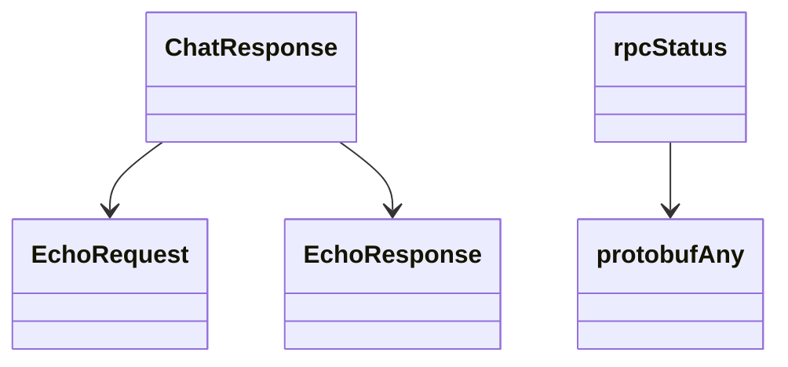

<!-- AUTO-GENERATED: scripts/generation/endpoint_docs.py, render_endpoint_docs() -->
<!-- Rebuilt on every `make generate`. Do not edit by hand. -->

# Diagnostic Service

## Endpoints

This service's schema defines shared types only -- no REST endpoints.

## Data Models

<details>
<summary>Model relationships (5 of 5 models)</summary>



</details>

```{eval-rst}
.. autopydantic_model:: kentik_api.gen.diagnostic.models.ChatResponse
```

```{eval-rst}
.. autopydantic_model:: kentik_api.gen.diagnostic.models.EchoRequest
```

```{eval-rst}
.. autopydantic_model:: kentik_api.gen.diagnostic.models.EchoResponse
```

```{eval-rst}
.. autopydantic_model:: kentik_api.gen.diagnostic.models.protobufAny
```

```{eval-rst}
.. autopydantic_model:: kentik_api.gen.diagnostic.models.rpcStatus
```
