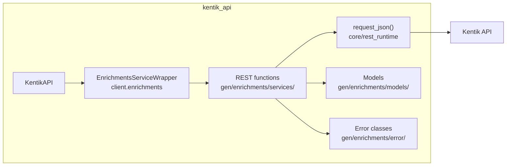
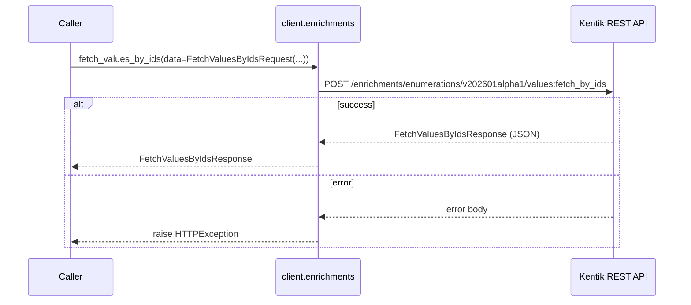
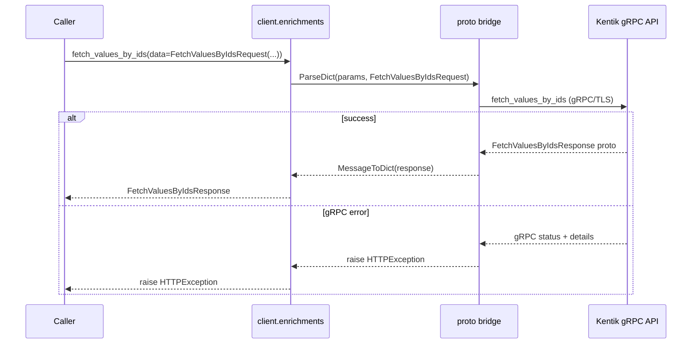
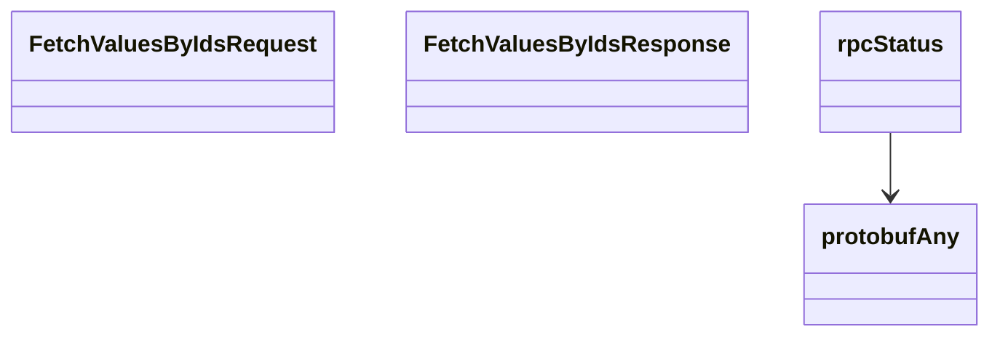

# Enrichments Service

## Overview



## Endpoints

### `POST` `/enrichments/enumerations/v202601alpha1/values:fetch_by_ids`

Resolve enumeration IDs to values.

Return the string values for the supplied enumeration lookup IDs within the authenticated company. Unknown IDs are omitted from the response.

**REST transport**



**gRPC transport**



#### Parameters

| Name | In | Type | Required |
| --- | --- | --- | --- |
| `data` | body | `FetchValuesByIdsRequest` | Yes |

#### Responses

| Status | Description | Model |
| --- | --- | --- |
| 200 | A successful response. | `FetchValuesByIdsResponse` |
| default | An unexpected error response. | `rpcStatus` |

#### Example

```python
from kentik_api.client import KentikAPI

# Both transports work: protocol="rest" (default) or protocol="grpc".
client = KentikAPI(protocol="rest")  # loads KENTIK_EMAIL/KENTIK_API_TOKEN from .env
response = client.enrichments.fetch_values_by_ids(
    data=FetchValuesByIdsRequest(...),
)
```

## Data Models

<details>
<summary>Model relationships (4 of 4 models)</summary>



</details>

```{eval-rst}
.. autopydantic_model:: kentik_api.gen.enrichments.models.FetchValuesByIdsRequest
```

```{eval-rst}
.. autopydantic_model:: kentik_api.gen.enrichments.models.FetchValuesByIdsResponse
```

```{eval-rst}
.. autopydantic_model:: kentik_api.gen.enrichments.models.protobufAny
```

```{eval-rst}
.. autopydantic_model:: kentik_api.gen.enrichments.models.rpcStatus
```
