<!-- AUTO-GENERATED: scripts/generation/endpoint_docs.py, render_endpoint_docs() -->
<!-- Rebuilt on every `make generate`. Do not edit by hand. -->

# Interface Service

## Overview

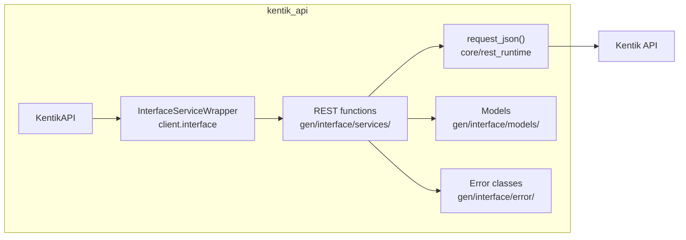

## Endpoints

### `GET` `/interface/v202108alpha1/interfaces`

Fetch Search Interfaces

Return list of interfaces matches search critera.

**REST transport**

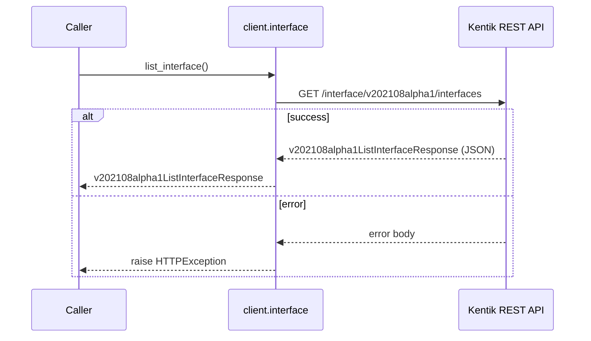

**gRPC transport**

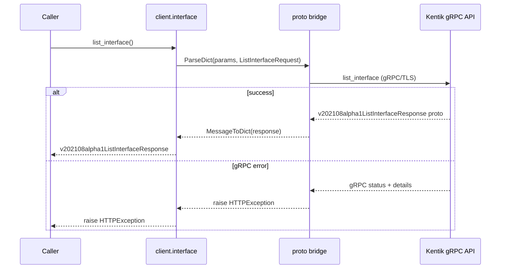

#### Parameters

| Name | In | Type | Required |
| --- | --- | --- | --- |
| `filterstext` | query | `string` | No |
| `filtersdeviceIds` | query | `string[]` | No |
| `filtersconnectivityTypes` | query | `string[]` | No |
| `filtersnetworkBoundaries` | query | `string[]` | No |
| `filtersproviders` | query | `string[]` | No |
| `filterssnmpSpeeds` | query | `integer (int32)[]` | No |
| `filtersipTypes` | query | `string[]` | No |

#### Responses

| Status | Description | Model |
| --- | --- | --- |
| 200 | A successful response. | `v202108alpha1ListInterfaceResponse` |
| default | An unexpected error response. | `rpcStatus` |

#### Example

```python
from kentik_api.client import KentikAPI

# Both transports work: protocol="rest" (default) or protocol="grpc".
client = KentikAPI(protocol="rest")  # loads KENTIK_EMAIL/KENTIK_API_TOKEN from .env
response = client.interface.list_interface()
```

---

### `POST` `/interface/v202108alpha1/interfaces`

Create a interface.

Create a interface from request. returns created.

**REST transport**

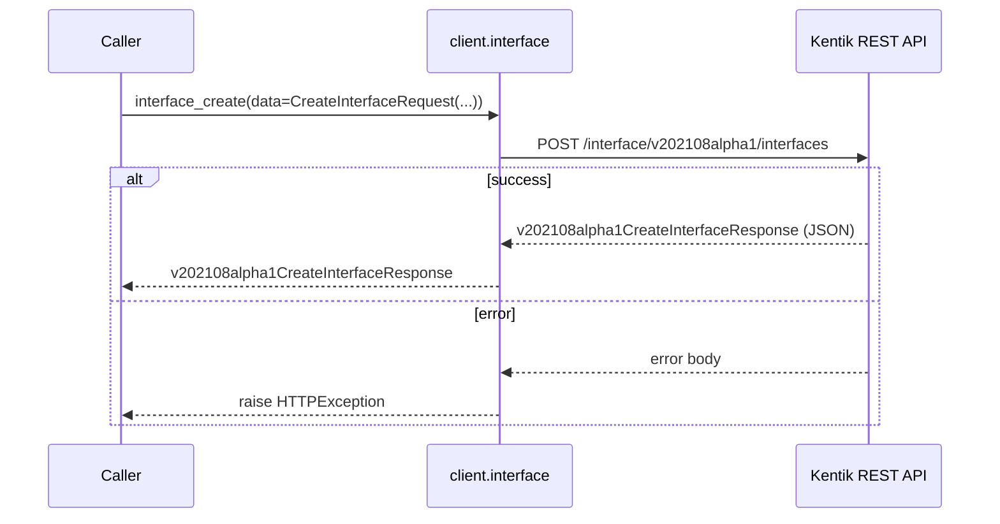

**gRPC transport**

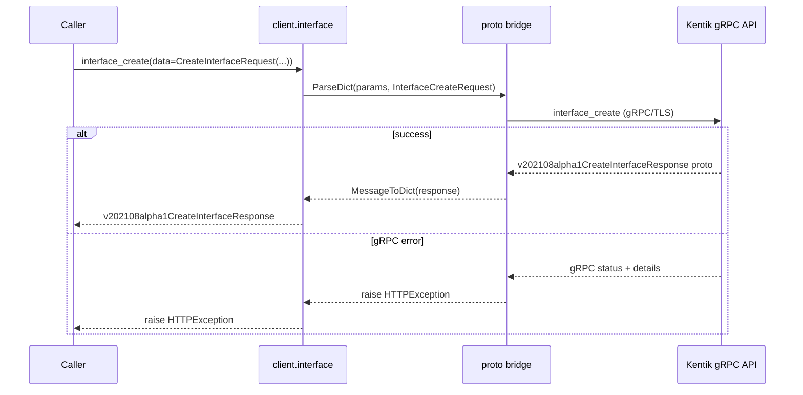

#### Parameters

| Name | In | Type | Required |
| --- | --- | --- | --- |
| `data` | body | `v202108alpha1CreateInterfaceRequest` | Yes |

#### Responses

| Status | Description | Model |
| --- | --- | --- |
| 200 | A successful response. | `v202108alpha1CreateInterfaceResponse` |
| default | An unexpected error response. | `rpcStatus` |

#### Example

```python
from kentik_api.client import KentikAPI

# Both transports work: protocol="rest" (default) or protocol="grpc".
client = KentikAPI(protocol="rest")  # loads KENTIK_EMAIL/KENTIK_API_TOKEN from .env
response = client.interface.interface_create(
    data=CreateInterfaceRequest(...),
)
```

---

### `GET` `/interface/v202108alpha1/interfaces/{id}`

Get a interface.

Returns information about a interface specified with ID.

**REST transport**

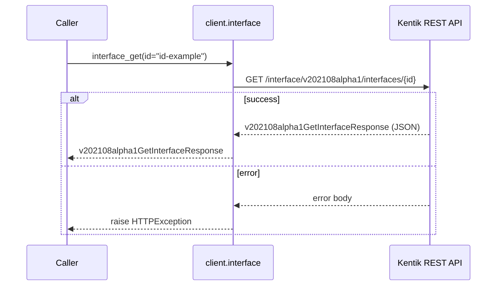

**gRPC transport**

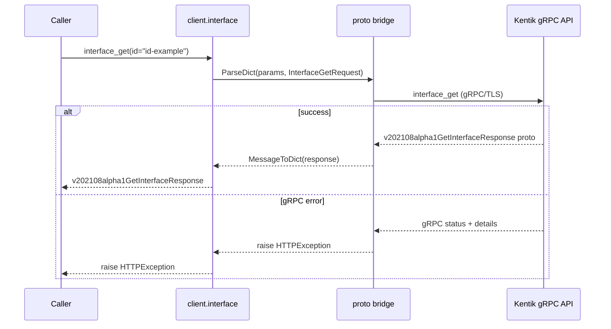

#### Parameters

| Name | In | Type | Required |
| --- | --- | --- | --- |
| `id` | path | `string` | Yes |

#### Responses

| Status | Description | Model |
| --- | --- | --- |
| 200 | A successful response. | `v202108alpha1GetInterfaceResponse` |
| default | An unexpected error response. | `rpcStatus` |

#### Example

```python
from kentik_api.client import KentikAPI

# Both transports work: protocol="rest" (default) or protocol="grpc".
client = KentikAPI(protocol="rest")  # loads KENTIK_EMAIL/KENTIK_API_TOKEN from .env
response = client.interface.interface_get(
    id="id-example",
)
```

---

### `PUT` `/interface/v202108alpha1/interfaces/{id}`

Update a interface.

Replaces the entire interface attributes specified with id.

**REST transport**

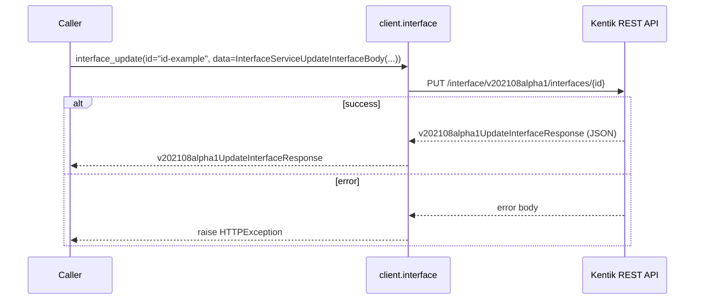

**gRPC transport**

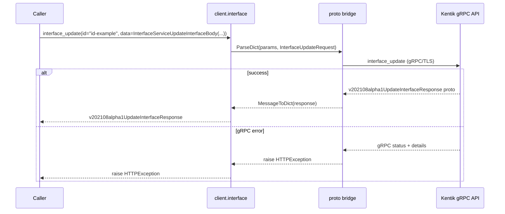

#### Parameters

| Name | In | Type | Required |
| --- | --- | --- | --- |
| `id` | path | `string` | Yes |
| `data` | body | `InterfaceServiceUpdateInterfaceBody` | Yes |

#### Responses

| Status | Description | Model |
| --- | --- | --- |
| 200 | A successful response. | `v202108alpha1UpdateInterfaceResponse` |
| default | An unexpected error response. | `rpcStatus` |

#### Example

```python
from kentik_api.client import KentikAPI

# Both transports work: protocol="rest" (default) or protocol="grpc".
client = KentikAPI(protocol="rest")  # loads KENTIK_EMAIL/KENTIK_API_TOKEN from .env
response = client.interface.interface_update(
    id="id-example",
    data=InterfaceServiceUpdateInterfaceBody(...),
)
```

---

### `DELETE` `/interface/v202108alpha1/interfaces/{id}`

Delete a interface.

Deletes the interface specified with id.

**REST transport**

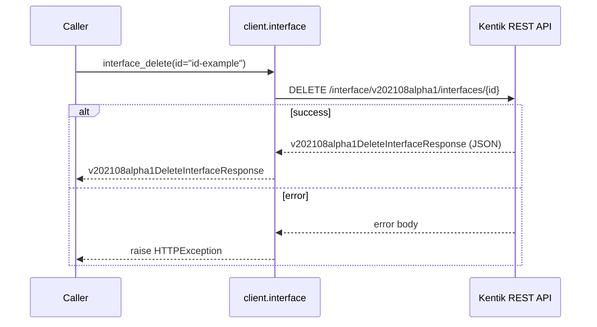

**gRPC transport**

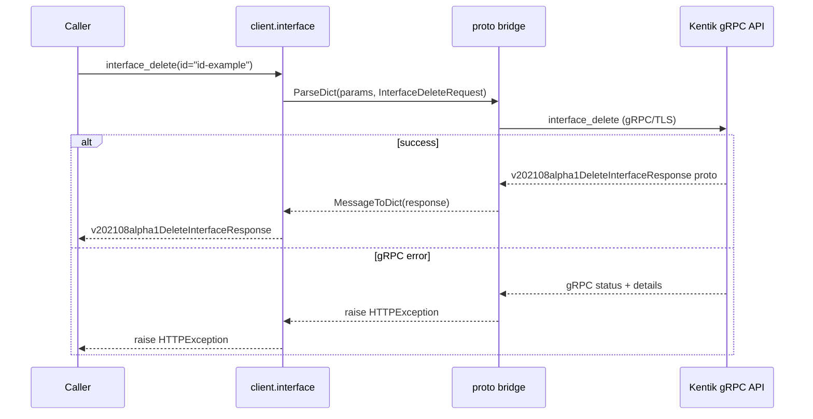

#### Parameters

| Name | In | Type | Required |
| --- | --- | --- | --- |
| `id` | path | `string` | Yes |

#### Responses

| Status | Description | Model |
| --- | --- | --- |
| 200 | A successful response. | `v202108alpha1DeleteInterfaceResponse` |
| default | An unexpected error response. | `rpcStatus` |

#### Example

```python
from kentik_api.client import KentikAPI

# Both transports work: protocol="rest" (default) or protocol="grpc".
client = KentikAPI(protocol="rest")  # loads KENTIK_EMAIL/KENTIK_API_TOKEN from .env
response = client.interface.interface_delete(
    id="id-example",
)
```

---

### `POST` `/interface/v202108alpha1/manual_classify`

Manual Classify Interface

Manually set interface(s) classification.

**REST transport**

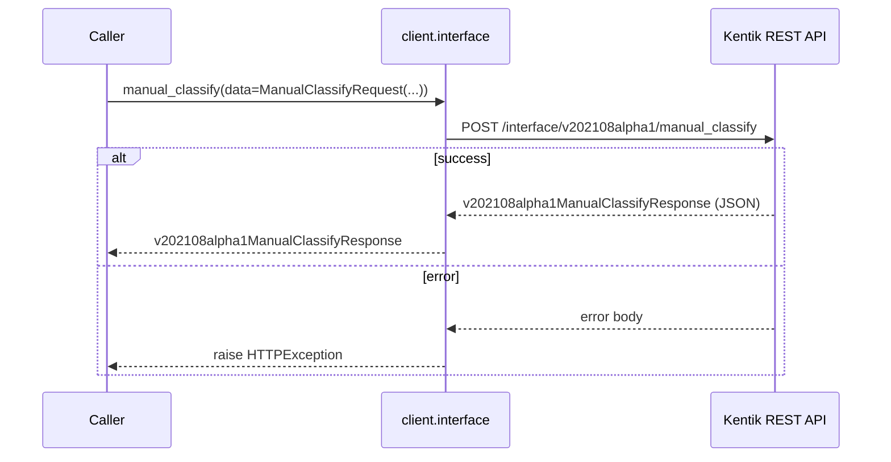

**gRPC transport**

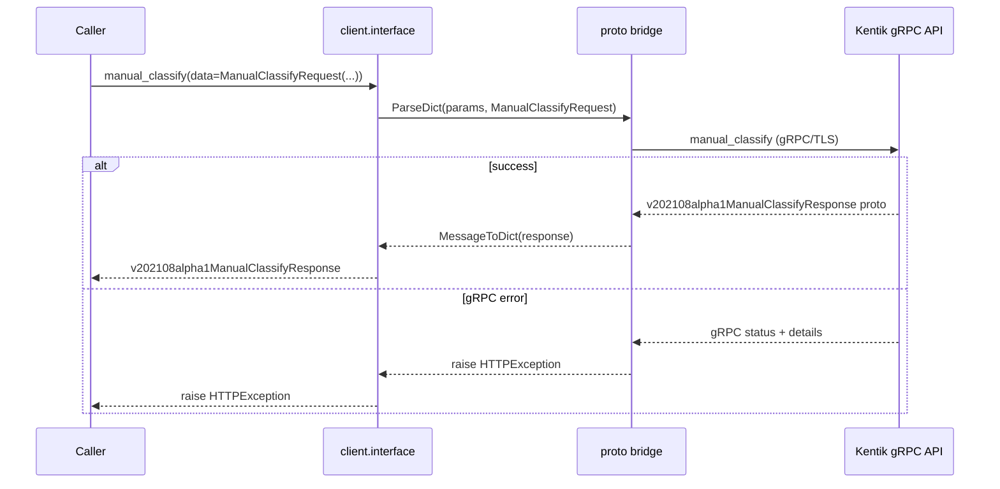

#### Parameters

| Name | In | Type | Required |
| --- | --- | --- | --- |
| `data` | body | `v202108alpha1ManualClassifyRequest` | Yes |

#### Responses

| Status | Description | Model |
| --- | --- | --- |
| 200 | A successful response. | `v202108alpha1ManualClassifyResponse` |
| default | An unexpected error response. | `rpcStatus` |

#### Example

```python
from kentik_api.client import KentikAPI

# Both transports work: protocol="rest" (default) or protocol="grpc".
client = KentikAPI(protocol="rest")  # loads KENTIK_EMAIL/KENTIK_API_TOKEN from .env
response = client.interface.manual_classify(
    data=ManualClassifyRequest(...),
)
```

## Data Models

<details>
<summary>Model relationships (3 of 17 models)</summary>

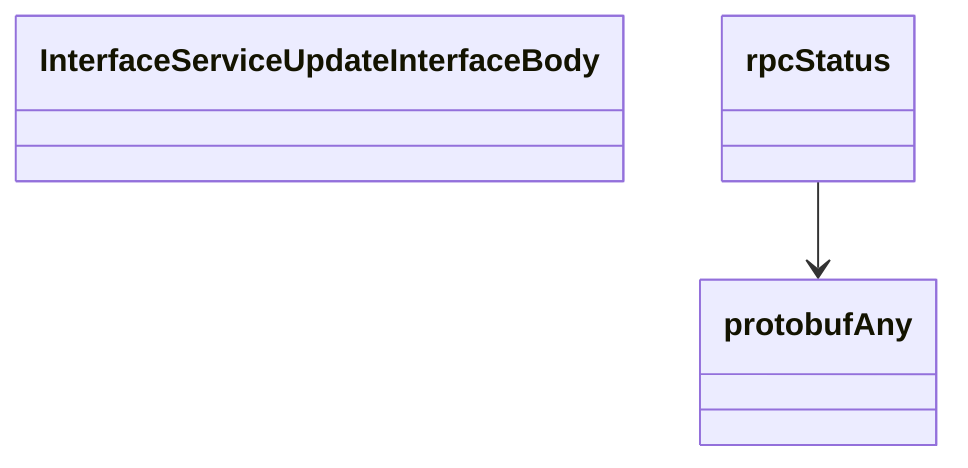

</details>

```{eval-rst}
.. autoclass:: kentik_api.gen.interface.models.ConnectivityType
   :members:
```

```{eval-rst}
.. autopydantic_model:: kentik_api.gen.interface.models.CreateInterfaceRequest
```

```{eval-rst}
.. autopydantic_model:: kentik_api.gen.interface.models.CreateInterfaceResponse
```

```{eval-rst}
.. autopydantic_model:: kentik_api.gen.interface.models.DeleteInterfaceResponse
```

```{eval-rst}
.. autopydantic_model:: kentik_api.gen.interface.models.GetInterfaceResponse
```

```{eval-rst}
.. autopydantic_model:: kentik_api.gen.interface.models.Interface
```

```{eval-rst}
.. autopydantic_model:: kentik_api.gen.interface.models.InterfaceFilter
```

```{eval-rst}
.. autopydantic_model:: kentik_api.gen.interface.models.InterfaceServiceUpdateInterfaceBody
```

```{eval-rst}
.. autopydantic_model:: kentik_api.gen.interface.models.InterfaceVrf
```

```{eval-rst}
.. autoclass:: kentik_api.gen.interface.models.IpFilter
   :members:
```

```{eval-rst}
.. autopydantic_model:: kentik_api.gen.interface.models.ListInterfaceResponse
```

```{eval-rst}
.. autopydantic_model:: kentik_api.gen.interface.models.ManualClassifyRequest
```

```{eval-rst}
.. autopydantic_model:: kentik_api.gen.interface.models.ManualClassifyResponse
```

```{eval-rst}
.. autoclass:: kentik_api.gen.interface.models.NetworkBoundary
   :members:
```

```{eval-rst}
.. autopydantic_model:: kentik_api.gen.interface.models.UpdateInterfaceResponse
```

```{eval-rst}
.. autopydantic_model:: kentik_api.gen.interface.models.protobufAny
```

```{eval-rst}
.. autopydantic_model:: kentik_api.gen.interface.models.rpcStatus
```
