<!-- AUTO-GENERATED: scripts/generation/endpoint_docs.py, _render_sphinx_stubs() -->
<!-- Rebuilt on every `make generate`. Do not edit by hand. -->

# Kagent Service

## Overview

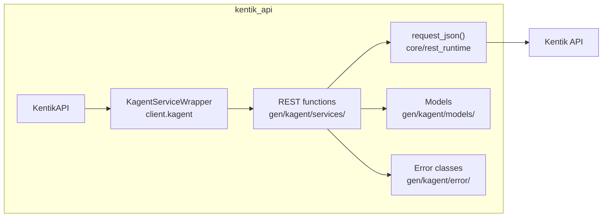

## Endpoints

### AgentService

#### `GET` `/kagent/v202401/agents`

List agents.

Returns a list of agents in the account, optionally filtered by registration state, IDs or capabilities.

**REST transport**

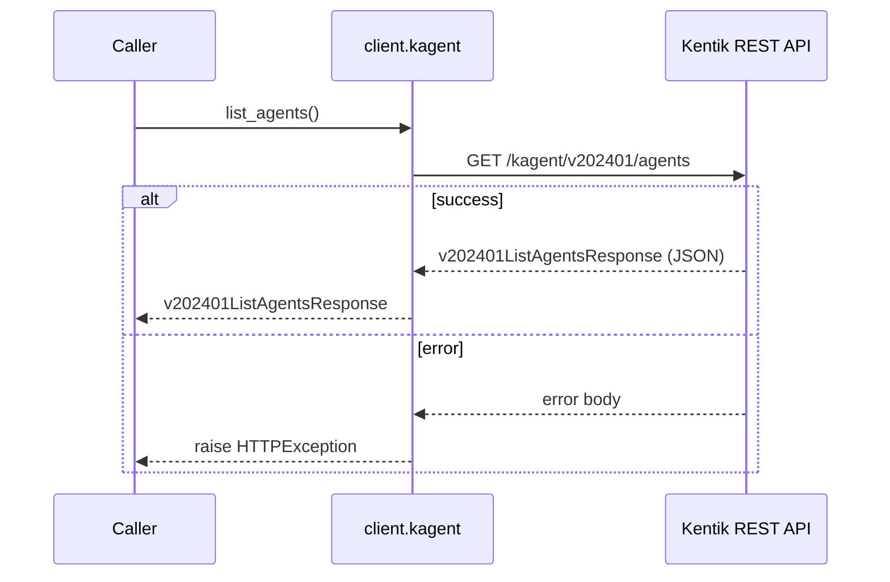

**gRPC transport**

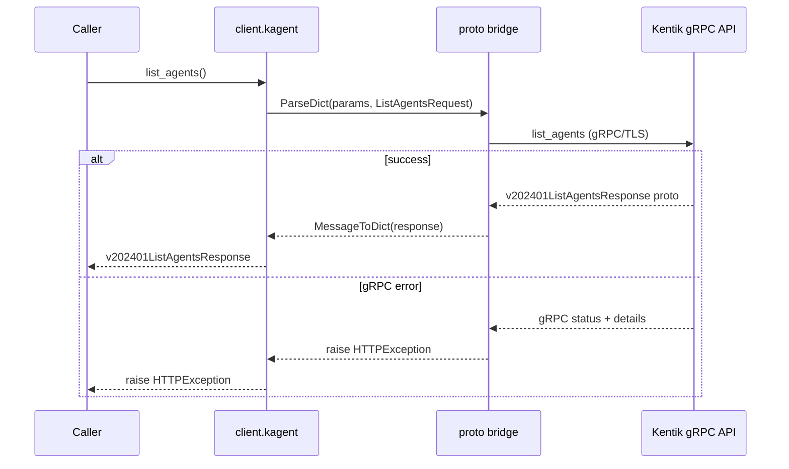

##### Parameters

| Name | In | Type | Required |
| --- | --- | --- | --- |
| `unregistered` | query | `boolean` | No |
| `ids` | query | `string[]` | No |
| `capabilities` | query | `string[]` | No |
| `includeDesiredState` | query | `boolean` | No |

##### Responses

| Status | Description | Model |
| --- | --- | --- |
| 200 | A successful response. | `v202401ListAgentsResponse` |
| default | An unexpected error response. | `rpcStatus` |

##### Example

```python
from kentik_api.client import KentikAPI

# Both transports work: protocol="rest" (default) or protocol="grpc".
client = KentikAPI(protocol="rest")  # loads KENTIK_EMAIL/KENTIK_API_TOKEN from .env
response = client.kagent.list_agents()
```

---

#### `POST` `/kagent/v202401/agents`

Create an agent.

Registers a new agent based on configuration in the request and returns it together with the commands for installing it on the target host.

**REST transport**

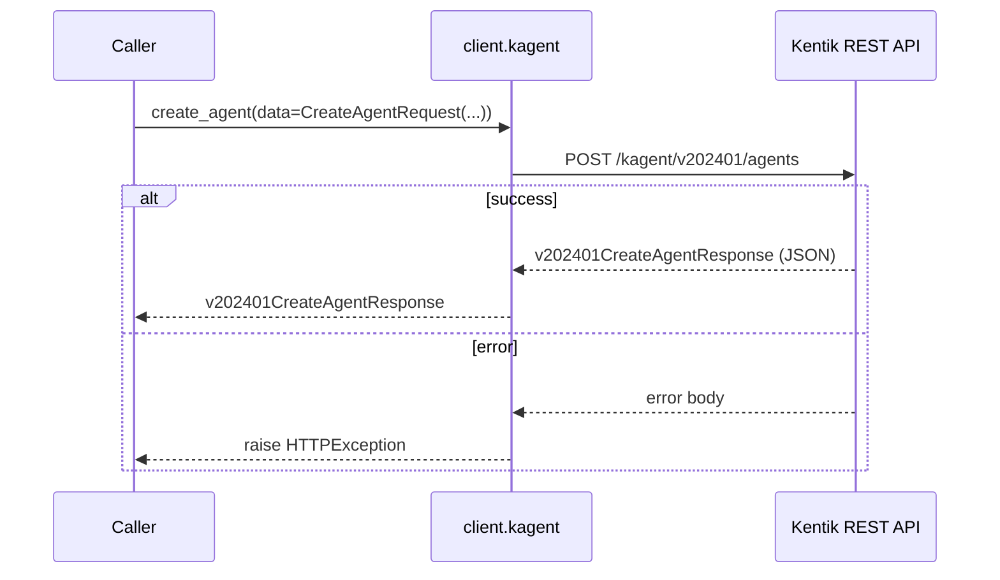

**gRPC transport**

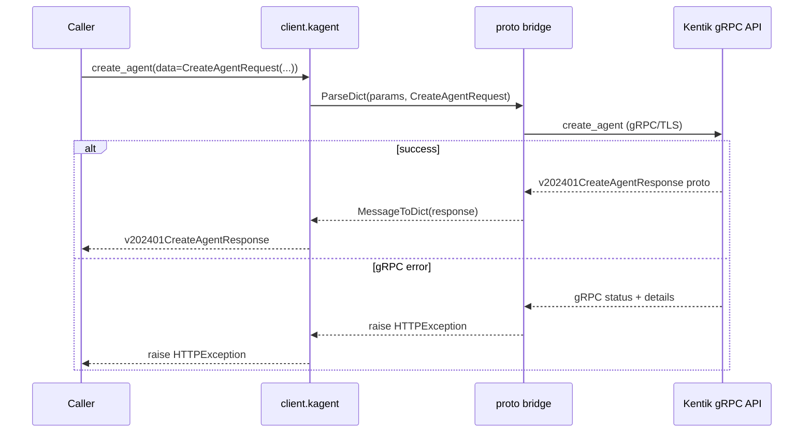

##### Parameters

| Name | In | Type | Required |
| --- | --- | --- | --- |
| `data` | body | `v202401CreateAgentRequest` | Yes |

##### Responses

| Status | Description | Model |
| --- | --- | --- |
| 200 | A successful response. | `v202401CreateAgentResponse` |
| default | An unexpected error response. | `rpcStatus` |

##### Example

```python
from kentik_api.client import KentikAPI

# Both transports work: protocol="rest" (default) or protocol="grpc".
client = KentikAPI(protocol="rest")  # loads KENTIK_EMAIL/KENTIK_API_TOKEN from .env
response = client.kagent.create_agent(
    data=CreateAgentRequest(...),
)
```

---

#### `PUT` `/kagent/v202401/agents/authorize/{installId}`

Authorize an unregistered agent.

Approves the agent installed under the specified install ID and returns the ID assigned to it.

**REST transport**

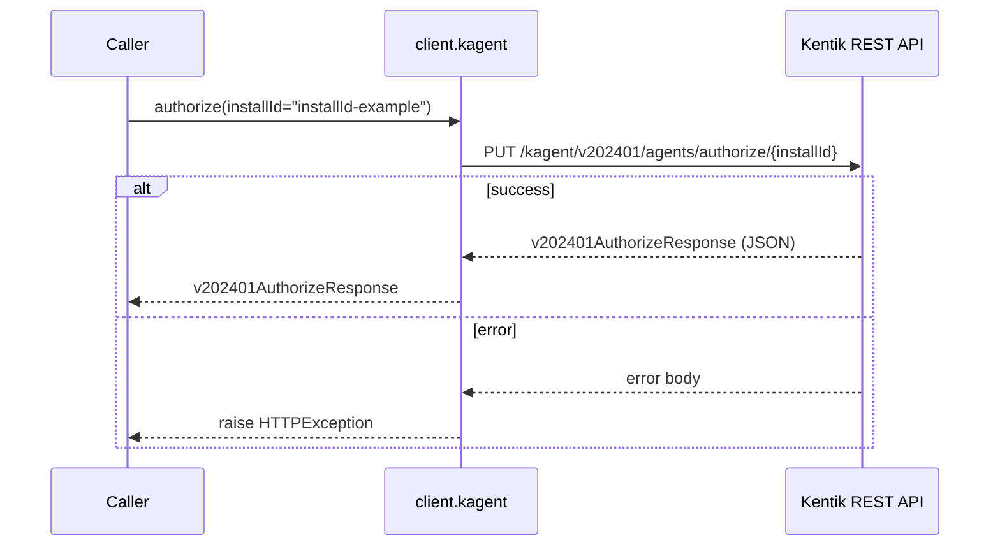

**gRPC transport**

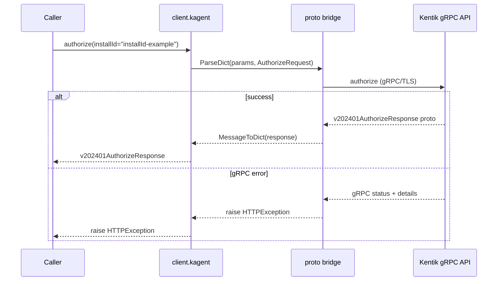

##### Parameters

| Name | In | Type | Required |
| --- | --- | --- | --- |
| `installId` | path | `string` | Yes |

##### Responses

| Status | Description | Model |
| --- | --- | --- |
| 200 | A successful response. | `v202401AuthorizeResponse` |
| default | An unexpected error response. | `rpcStatus` |

##### Example

```python
from kentik_api.client import KentikAPI

# Both transports work: protocol="rest" (default) or protocol="grpc".
client = KentikAPI(protocol="rest")  # loads KENTIK_EMAIL/KENTIK_API_TOKEN from .env
response = client.kagent.authorize(
    installId="installId-example",
)
```

---

#### `POST` `/kagent/v202401/agents/install-commands`

Generate agent install commands.

Returns commands for deploying an agent. The commands embed a provisioning token and are ready to execute on the target host.

**REST transport**

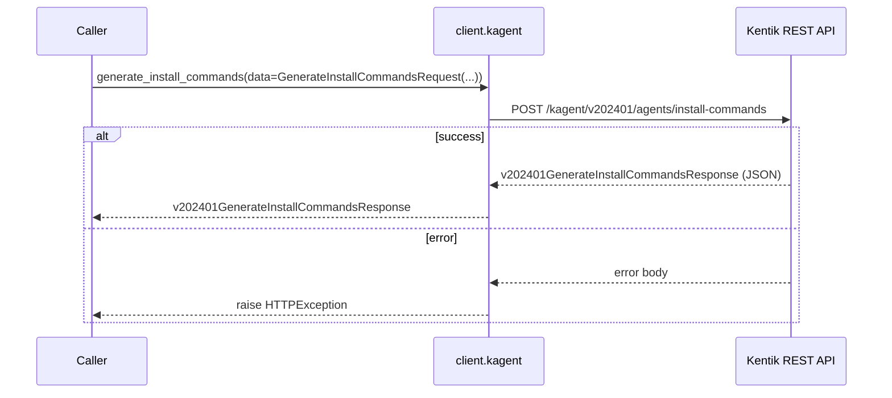

**gRPC transport**

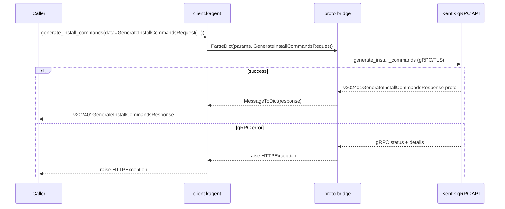

##### Parameters

| Name | In | Type | Required |
| --- | --- | --- | --- |
| `data` | body | `v202401GenerateInstallCommandsRequest` | Yes |

##### Responses

| Status | Description | Model |
| --- | --- | --- |
| 200 | A successful response. | `v202401GenerateInstallCommandsResponse` |
| default | An unexpected error response. | `rpcStatus` |

##### Example

```python
from kentik_api.client import KentikAPI

# Both transports work: protocol="rest" (default) or protocol="grpc".
client = KentikAPI(protocol="rest")  # loads KENTIK_EMAIL/KENTIK_API_TOKEN from .env
response = client.kagent.generate_install_commands(
    data=GenerateInstallCommandsRequest(...),
)
```

---

#### `GET` `/kagent/v202401/agents/{agent.id}`

Get agent configuration and state.

Returns configuration and state of the agent with the specified ID.

**REST transport**

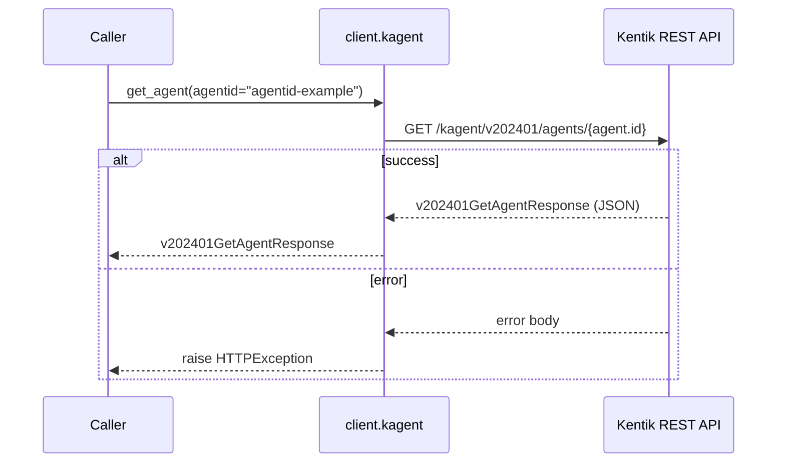

**gRPC transport**

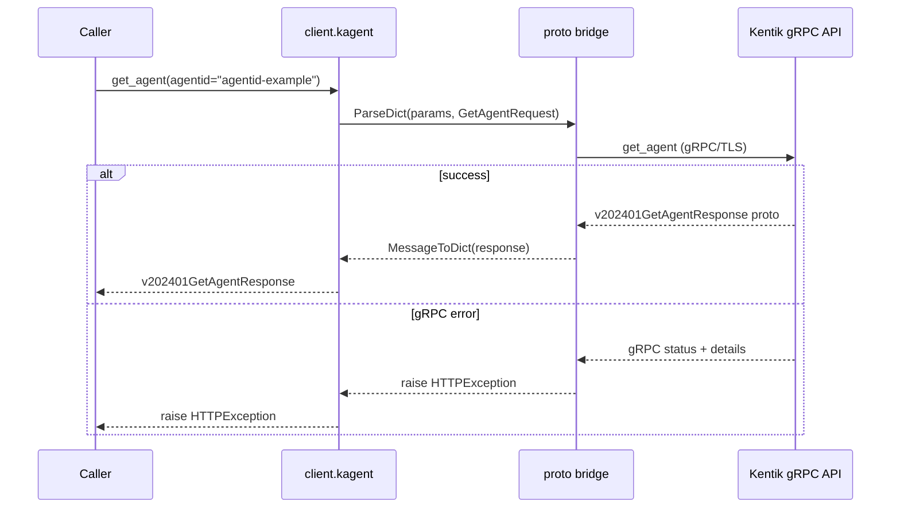

##### Parameters

| Name | In | Type | Required |
| --- | --- | --- | --- |
| `agentid` | path | `string` | Yes |
| `unregistered` | query | `boolean` | No |

##### Responses

| Status | Description | Model |
| --- | --- | --- |
| 200 | A successful response. | `v202401GetAgentResponse` |
| default | An unexpected error response. | `rpcStatus` |

##### Example

```python
from kentik_api.client import KentikAPI

# Both transports work: protocol="rest" (default) or protocol="grpc".
client = KentikAPI(protocol="rest")  # loads KENTIK_EMAIL/KENTIK_API_TOKEN from .env
response = client.kagent.get_agent(
    agentid="agentid-example",
)
```

---

#### `PATCH` `/kagent/v202401/agents/{agent.id}`

Update configuration of an agent.

Updates the attributes of an agent selected by the field mask in the request.

**REST transport**

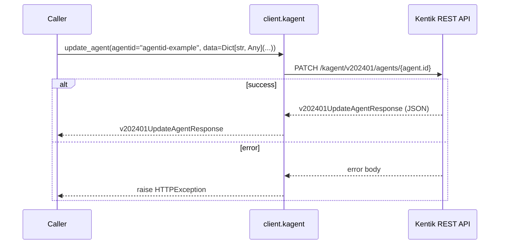

**gRPC transport**

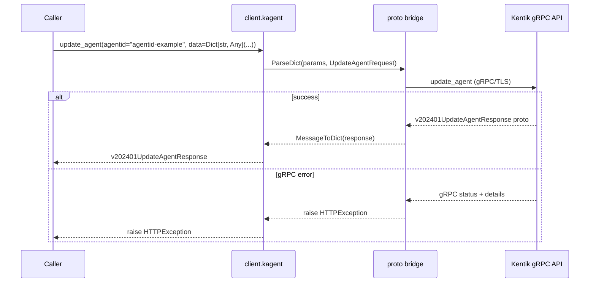

##### Parameters

| Name | In | Type | Required |
| --- | --- | --- | --- |
| `agentid` | path | `string` | Yes |
| `mask` | query | `string` | No |
| `data` | body | `object` | Yes |

##### Responses

| Status | Description | Model |
| --- | --- | --- |
| 200 | A successful response. | `v202401UpdateAgentResponse` |
| default | An unexpected error response. | `rpcStatus` |

##### Example

```python
from kentik_api.client import KentikAPI

# Both transports work: protocol="rest" (default) or protocol="grpc".
client = KentikAPI(protocol="rest")  # loads KENTIK_EMAIL/KENTIK_API_TOKEN from .env
response = client.kagent.update_agent(
    agentid="agentid-example",
    data=Dict[str, Any](...),
)
```

---

#### `DELETE` `/kagent/v202401/agents/{agent.id}`

Delete an agent.

Deletes the agent with the specified ID.

**REST transport**

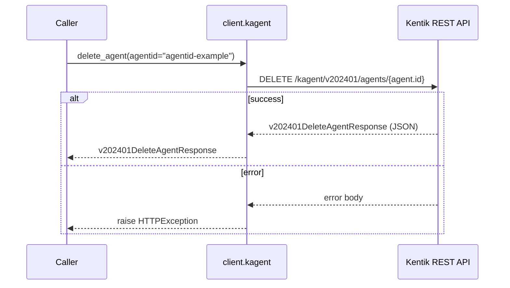

**gRPC transport**

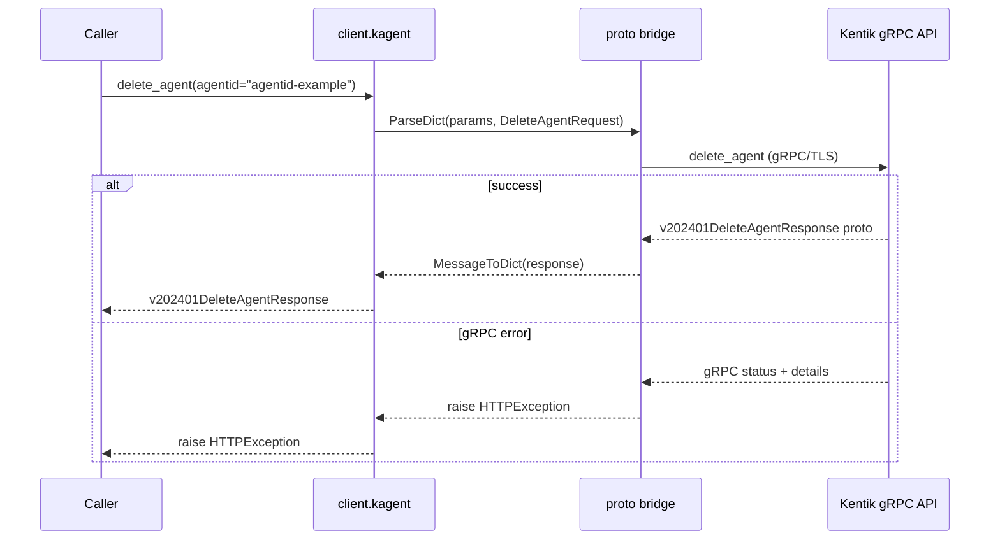

##### Parameters

| Name | In | Type | Required |
| --- | --- | --- | --- |
| `agentid` | path | `string` | Yes |
| `unregistered` | query | `boolean` | No |

##### Responses

| Status | Description | Model |
| --- | --- | --- |
| 200 | A successful response. | `v202401DeleteAgentResponse` |
| default | An unexpected error response. | `rpcStatus` |

##### Example

```python
from kentik_api.client import KentikAPI

# Both transports work: protocol="rest" (default) or protocol="grpc".
client = KentikAPI(protocol="rest")  # loads KENTIK_EMAIL/KENTIK_API_TOKEN from .env
response = client.kagent.delete_agent(
    agentid="agentid-example",
)
```

### AgentCapabilityService

#### `GET` `/kagent/v202401/agents/{agentId}/capabilities`

List agent capabilities.

Returns a list of all capabilities of the specified agent.

**REST transport**

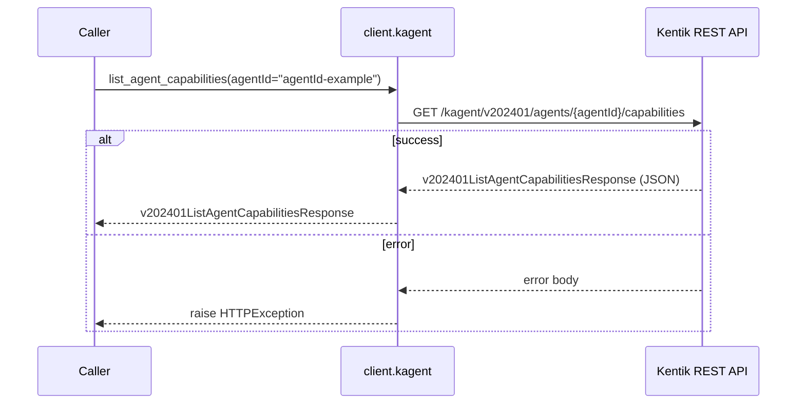

**gRPC transport**

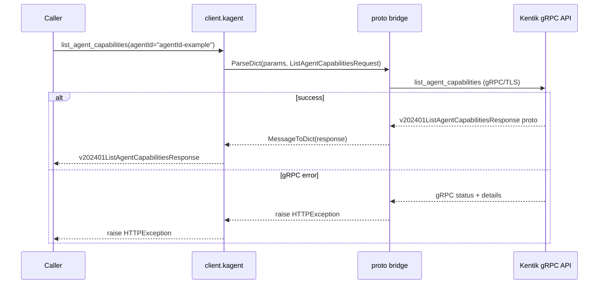

##### Parameters

| Name | In | Type | Required |
| --- | --- | --- | --- |
| `agentId` | path | `string` | Yes |

##### Responses

| Status | Description | Model |
| --- | --- | --- |
| 200 | A successful response. | `v202401ListAgentCapabilitiesResponse` |
| default | An unexpected error response. | `rpcStatus` |

##### Example

```python
from kentik_api.client import KentikAPI

# Both transports work: protocol="rest" (default) or protocol="grpc".
client = KentikAPI(protocol="rest")  # loads KENTIK_EMAIL/KENTIK_API_TOKEN from .env
response = client.kagent.list_agent_capabilities(
    agentId="agentId-example",
)
```

---

#### `GET` `/kagent/v202401/agents/{agentId}/capabilities/{capability.name}`

Get an agent capability.

Returns configuration of the named capability of the specified agent.

**REST transport**

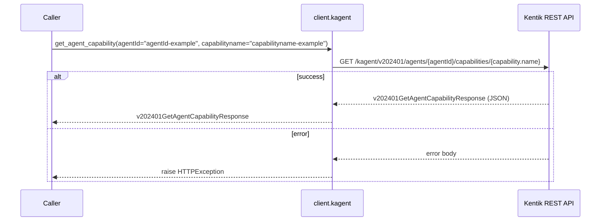

**gRPC transport**

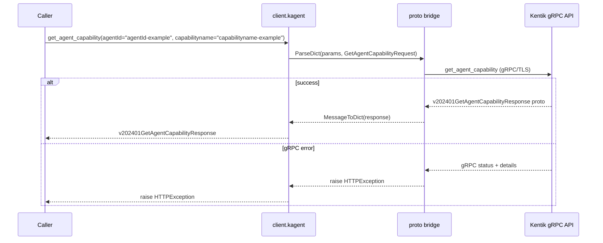

##### Parameters

| Name | In | Type | Required |
| --- | --- | --- | --- |
| `agentId` | path | `string` | Yes |
| `capabilityname` | path | `string` | Yes |

##### Responses

| Status | Description | Model |
| --- | --- | --- |
| 200 | A successful response. | `v202401GetAgentCapabilityResponse` |
| default | An unexpected error response. | `rpcStatus` |

##### Example

```python
from kentik_api.client import KentikAPI

# Both transports work: protocol="rest" (default) or protocol="grpc".
client = KentikAPI(protocol="rest")  # loads KENTIK_EMAIL/KENTIK_API_TOKEN from .env
response = client.kagent.get_agent_capability(
    agentId="agentId-example",
    capabilityname="capabilityname-example",
)
```

---

#### `PATCH` `/kagent/v202401/agents/{agentId}/capabilities/{capability.name}`

Create or update an agent capability.

Adds the capability to the agent, or updates it if already present.

**REST transport**

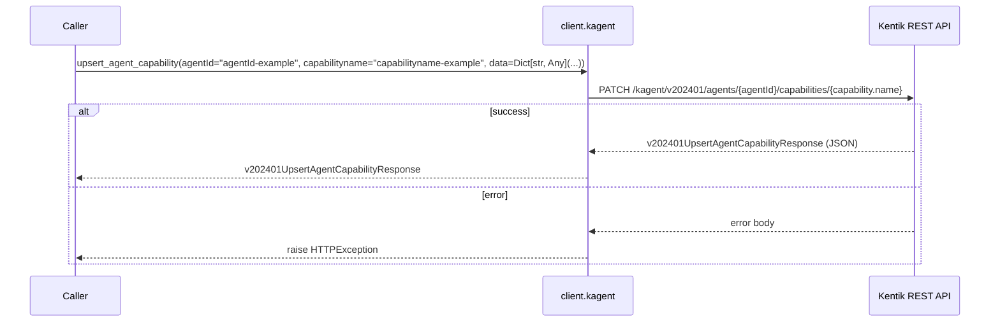

**gRPC transport**

```mermaid
sequenceDiagram
    participant C as Caller
    participant W as client.kagent
    participant B as proto bridge
    participant API as Kentik gRPC API

    C->>W: upsert_agent_capability(agentId="agentId-example", capabilityname="capabilityname-example", data=Dict[str, Any](...))
    W->>B: ParseDict(params, UpsertAgentCapabilityRequest)
    B->>API: upsert_agent_capability (gRPC/TLS)
    alt success
        API-->>B: v202401UpsertAgentCapabilityResponse proto
        B-->>W: MessageToDict(response)
        W-->>C: v202401UpsertAgentCapabilityResponse
    else gRPC error
        API-->>B: gRPC status + details
        B-->>W: raise HTTPException
        W-->>C: raise HTTPException
    end
```

##### Parameters

| Name | In | Type | Required |
| --- | --- | --- | --- |
| `agentId` | path | `string` | Yes |
| `capabilityname` | path | `string` | Yes |
| `mask` | query | `string` | No |
| `data` | body | `object` | Yes |

##### Responses

| Status | Description | Model |
| --- | --- | --- |
| 200 | A successful response. | `v202401UpsertAgentCapabilityResponse` |
| default | An unexpected error response. | `rpcStatus` |

##### Example

```python
from kentik_api.client import KentikAPI

# Both transports work: protocol="rest" (default) or protocol="grpc".
client = KentikAPI(protocol="rest")  # loads KENTIK_EMAIL/KENTIK_API_TOKEN from .env
response = client.kagent.upsert_agent_capability(
    agentId="agentId-example",
    capabilityname="capabilityname-example",
    data=Dict[str, Any](...),
)
```

---

#### `DELETE` `/kagent/v202401/agents/{agentId}/capabilities/{capability.name}`

Delete an agent capability.

Removes the named capability from the specified agent.

**REST transport**

```mermaid
sequenceDiagram
    participant C as Caller
    participant W as client.kagent
    participant API as Kentik REST API

    C->>W: delete_agent_capability(agentId="agentId-example", capabilityname="capabilityname-example")
    W->>API: DELETE /kagent/v202401/agents/{agentId}/capabilities/{capability.name}
    alt success
        API-->>W: v202401DeleteAgentCapabilityResponse (JSON)
        W-->>C: v202401DeleteAgentCapabilityResponse
    else error
        API-->>W: error body
        W-->>C: raise HTTPException
    end
```

**gRPC transport**

```mermaid
sequenceDiagram
    participant C as Caller
    participant W as client.kagent
    participant B as proto bridge
    participant API as Kentik gRPC API

    C->>W: delete_agent_capability(agentId="agentId-example", capabilityname="capabilityname-example")
    W->>B: ParseDict(params, DeleteAgentCapabilityRequest)
    B->>API: delete_agent_capability (gRPC/TLS)
    alt success
        API-->>B: v202401DeleteAgentCapabilityResponse proto
        B-->>W: MessageToDict(response)
        W-->>C: v202401DeleteAgentCapabilityResponse
    else gRPC error
        API-->>B: gRPC status + details
        B-->>W: raise HTTPException
        W-->>C: raise HTTPException
    end
```

##### Parameters

| Name | In | Type | Required |
| --- | --- | --- | --- |
| `agentId` | path | `string` | Yes |
| `capabilityname` | path | `string` | Yes |

##### Responses

| Status | Description | Model |
| --- | --- | --- |
| 200 | A successful response. | `v202401DeleteAgentCapabilityResponse` |
| default | An unexpected error response. | `rpcStatus` |

##### Example

```python
from kentik_api.client import KentikAPI

# Both transports work: protocol="rest" (default) or protocol="grpc".
client = KentikAPI(protocol="rest")  # loads KENTIK_EMAIL/KENTIK_API_TOKEN from .env
response = client.kagent.delete_agent_capability(
    agentId="agentId-example",
    capabilityname="capabilityname-example",
)
```

### CapabilityAdminService

#### `GET` `/kagent/v202401/capabilities`

List all capabilities

**REST transport**

```mermaid
sequenceDiagram
    participant C as Caller
    participant W as client.kagent
    participant API as Kentik REST API

    C->>W: capability_admin_service__list_capabilities()
    W->>API: GET /kagent/v202401/capabilities
    alt success
        API-->>W: v202401ListCapabilitiesResponse (JSON)
        W-->>C: v202401ListCapabilitiesResponse
    else error
        API-->>W: error body
        W-->>C: raise HTTPException
    end
```

**gRPC transport**

```mermaid
sequenceDiagram
    participant C as Caller
    participant W as client.kagent
    participant B as proto bridge
    participant API as Kentik gRPC API

    C->>W: capability_admin_service__list_capabilities()
    W->>B: ParseDict(params, CapabilityAdminService_ListCapabilitiesRequest)
    B->>API: capability_admin_service__list_capabilities (gRPC/TLS)
    alt success
        API-->>B: v202401ListCapabilitiesResponse proto
        B-->>W: MessageToDict(response)
        W-->>C: v202401ListCapabilitiesResponse
    else gRPC error
        API-->>B: gRPC status + details
        B-->>W: raise HTTPException
        W-->>C: raise HTTPException
    end
```

##### Responses

| Status | Description | Model |
| --- | --- | --- |
| 200 | A successful response. | `v202401ListCapabilitiesResponse` |
| default | An unexpected error response. | `rpcStatus` |

##### Example

```python
from kentik_api.client import KentikAPI

# Both transports work: protocol="rest" (default) or protocol="grpc".
client = KentikAPI(protocol="rest")  # loads KENTIK_EMAIL/KENTIK_API_TOKEN from .env
response = client.kagent.capability_admin_service__list_capabilities()
```

---

#### `POST` `/kagent/v202401/capabilities`

Create a new capability

**REST transport**

```mermaid
sequenceDiagram
    participant C as Caller
    participant W as client.kagent
    participant API as Kentik REST API

    C->>W: capability_admin_service__create_capability(data=Capability(...))
    W->>API: POST /kagent/v202401/capabilities
    alt success
        API-->>W: v202401CreateCapabilityResponse (JSON)
        W-->>C: v202401CreateCapabilityResponse
    else error
        API-->>W: error body
        W-->>C: raise HTTPException
    end
```

**gRPC transport**

```mermaid
sequenceDiagram
    participant C as Caller
    participant W as client.kagent
    participant B as proto bridge
    participant API as Kentik gRPC API

    C->>W: capability_admin_service__create_capability(data=Capability(...))
    W->>B: ParseDict(params, CapabilityAdminService_CreateCapabilityRequest)
    B->>API: capability_admin_service__create_capability (gRPC/TLS)
    alt success
        API-->>B: v202401CreateCapabilityResponse proto
        B-->>W: MessageToDict(response)
        W-->>C: v202401CreateCapabilityResponse
    else gRPC error
        API-->>B: gRPC status + details
        B-->>W: raise HTTPException
        W-->>C: raise HTTPException
    end
```

##### Parameters

| Name | In | Type | Required |
| --- | --- | --- | --- |
| `data` | body | `v202401Capability` | Yes |

##### Responses

| Status | Description | Model |
| --- | --- | --- |
| 200 | A successful response. | `v202401CreateCapabilityResponse` |
| default | An unexpected error response. | `rpcStatus` |

##### Example

```python
from kentik_api.client import KentikAPI

# Both transports work: protocol="rest" (default) or protocol="grpc".
client = KentikAPI(protocol="rest")  # loads KENTIK_EMAIL/KENTIK_API_TOKEN from .env
response = client.kagent.capability_admin_service__create_capability(
    data=Capability(...),
)
```

---

#### `GET` `/kagent/v202401/capabilities/{capability.name}`

Get a capabilities

**REST transport**

```mermaid
sequenceDiagram
    participant C as Caller
    participant W as client.kagent
    participant API as Kentik REST API

    C->>W: capability_admin_service__get_capability(capabilityname="capabilityname-example")
    W->>API: GET /kagent/v202401/capabilities/{capability.name}
    alt success
        API-->>W: v202401GetCapabilityResponse (JSON)
        W-->>C: v202401GetCapabilityResponse
    else error
        API-->>W: error body
        W-->>C: raise HTTPException
    end
```

**gRPC transport**

```mermaid
sequenceDiagram
    participant C as Caller
    participant W as client.kagent
    participant B as proto bridge
    participant API as Kentik gRPC API

    C->>W: capability_admin_service__get_capability(capabilityname="capabilityname-example")
    W->>B: ParseDict(params, CapabilityAdminService_GetCapabilityRequest)
    B->>API: capability_admin_service__get_capability (gRPC/TLS)
    alt success
        API-->>B: v202401GetCapabilityResponse proto
        B-->>W: MessageToDict(response)
        W-->>C: v202401GetCapabilityResponse
    else gRPC error
        API-->>B: gRPC status + details
        B-->>W: raise HTTPException
        W-->>C: raise HTTPException
    end
```

##### Parameters

| Name | In | Type | Required |
| --- | --- | --- | --- |
| `capabilityname` | path | `string` | Yes |

##### Responses

| Status | Description | Model |
| --- | --- | --- |
| 200 | A successful response. | `v202401GetCapabilityResponse` |
| default | An unexpected error response. | `rpcStatus` |

##### Example

```python
from kentik_api.client import KentikAPI

# Both transports work: protocol="rest" (default) or protocol="grpc".
client = KentikAPI(protocol="rest")  # loads KENTIK_EMAIL/KENTIK_API_TOKEN from .env
response = client.kagent.capability_admin_service__get_capability(
    capabilityname="capabilityname-example",
)
```

---

#### `PATCH` `/kagent/v202401/capabilities/{capability.name}`

Update an existing capability

**REST transport**

```mermaid
sequenceDiagram
    participant C as Caller
    participant W as client.kagent
    participant API as Kentik REST API

    C->>W: capability_admin_service__update_capability(capabilityname="capabilityname-example", data=Dict[str, Any](...))
    W->>API: PATCH /kagent/v202401/capabilities/{capability.name}
    alt success
        API-->>W: v202401UpdateCapabilityResponse (JSON)
        W-->>C: v202401UpdateCapabilityResponse
    else error
        API-->>W: error body
        W-->>C: raise HTTPException
    end
```

**gRPC transport**

```mermaid
sequenceDiagram
    participant C as Caller
    participant W as client.kagent
    participant B as proto bridge
    participant API as Kentik gRPC API

    C->>W: capability_admin_service__update_capability(capabilityname="capabilityname-example", data=Dict[str, Any](...))
    W->>B: ParseDict(params, CapabilityAdminService_UpdateCapabilityRequest)
    B->>API: capability_admin_service__update_capability (gRPC/TLS)
    alt success
        API-->>B: v202401UpdateCapabilityResponse proto
        B-->>W: MessageToDict(response)
        W-->>C: v202401UpdateCapabilityResponse
    else gRPC error
        API-->>B: gRPC status + details
        B-->>W: raise HTTPException
        W-->>C: raise HTTPException
    end
```

##### Parameters

| Name | In | Type | Required |
| --- | --- | --- | --- |
| `capabilityname` | path | `string` | Yes |
| `data` | body | `object` | Yes |

##### Responses

| Status | Description | Model |
| --- | --- | --- |
| 200 | A successful response. | `v202401UpdateCapabilityResponse` |
| default | An unexpected error response. | `rpcStatus` |

##### Example

```python
from kentik_api.client import KentikAPI

# Both transports work: protocol="rest" (default) or protocol="grpc".
client = KentikAPI(protocol="rest")  # loads KENTIK_EMAIL/KENTIK_API_TOKEN from .env
response = client.kagent.capability_admin_service__update_capability(
    capabilityname="capabilityname-example",
    data=Dict[str, Any](...),
)
```

---

#### `DELETE` `/kagent/v202401/capabilities/{capability.name}`

Delete a capability

**REST transport**

```mermaid
sequenceDiagram
    participant C as Caller
    participant W as client.kagent
    participant API as Kentik REST API

    C->>W: capability_admin_service__delete_capability(capabilityname="capabilityname-example")
    W->>API: DELETE /kagent/v202401/capabilities/{capability.name}
    alt success
        API-->>W: v202401DeleteCapabilityResponse (JSON)
        W-->>C: v202401DeleteCapabilityResponse
    else error
        API-->>W: error body
        W-->>C: raise HTTPException
    end
```

**gRPC transport**

```mermaid
sequenceDiagram
    participant C as Caller
    participant W as client.kagent
    participant B as proto bridge
    participant API as Kentik gRPC API

    C->>W: capability_admin_service__delete_capability(capabilityname="capabilityname-example")
    W->>B: ParseDict(params, CapabilityAdminService_DeleteCapabilityRequest)
    B->>API: capability_admin_service__delete_capability (gRPC/TLS)
    alt success
        API-->>B: v202401DeleteCapabilityResponse proto
        B-->>W: MessageToDict(response)
        W-->>C: v202401DeleteCapabilityResponse
    else gRPC error
        API-->>B: gRPC status + details
        B-->>W: raise HTTPException
        W-->>C: raise HTTPException
    end
```

##### Parameters

| Name | In | Type | Required |
| --- | --- | --- | --- |
| `capabilityname` | path | `string` | Yes |

##### Responses

| Status | Description | Model |
| --- | --- | --- |
| 200 | A successful response. | `v202401DeleteCapabilityResponse` |
| default | An unexpected error response. | `rpcStatus` |

##### Example

```python
from kentik_api.client import KentikAPI

# Both transports work: protocol="rest" (default) or protocol="grpc".
client = KentikAPI(protocol="rest")  # loads KENTIK_EMAIL/KENTIK_API_TOKEN from .env
response = client.kagent.capability_admin_service__delete_capability(
    capabilityname="capabilityname-example",
)
```

### CapabilityReleaseService

#### `GET` `/kagent/v202401/releases`

GetCapabilityRelease can be used by install/upgrade modules to fetch a single release.

**REST transport**

```mermaid
sequenceDiagram
    participant C as Caller
    participant W as client.kagent
    participant API as Kentik REST API

    C->>W: capability_release_service__get_capability_release()
    W->>API: GET /kagent/v202401/releases
    alt success
        API-->>W: v202401GetCapabilityReleaseResponse (JSON)
        W-->>C: v202401GetCapabilityReleaseResponse
    else error
        API-->>W: error body
        W-->>C: raise HTTPException
    end
```

**gRPC transport**

```mermaid
sequenceDiagram
    participant C as Caller
    participant W as client.kagent
    participant B as proto bridge
    participant API as Kentik gRPC API

    C->>W: capability_release_service__get_capability_release()
    W->>B: ParseDict(params, CapabilityReleaseService_GetCapabilityReleaseRequest)
    B->>API: capability_release_service__get_capability_release (gRPC/TLS)
    alt success
        API-->>B: v202401GetCapabilityReleaseResponse proto
        B-->>W: MessageToDict(response)
        W-->>C: v202401GetCapabilityReleaseResponse
    else gRPC error
        API-->>B: gRPC status + details
        B-->>W: raise HTTPException
        W-->>C: raise HTTPException
    end
```

##### Parameters

| Name | In | Type | Required |
| --- | --- | --- | --- |
| `os` | query | `string` | No |
| `arch` | query | `string` | No |
| `channel` | query | `string` | No |
| `capability` | query | `string` | No |
| `semver` | query | `string` | No |
| `distro` | query | `string` | No |

##### Responses

| Status | Description | Model |
| --- | --- | --- |
| 200 | A successful response. | `v202401GetCapabilityReleaseResponse` |
| default | An unexpected error response. | `rpcStatus` |

##### Example

```python
from kentik_api.client import KentikAPI

# Both transports work: protocol="rest" (default) or protocol="grpc".
client = KentikAPI(protocol="rest")  # loads KENTIK_EMAIL/KENTIK_API_TOKEN from .env
response = client.kagent.capability_release_service__get_capability_release()
```

---

#### `GET` `/kagent/v202401/releases/latest`

GetCapabilityLatestReleases can be used by install/upgrade modules to fetch the latest available releases.

**REST transport**

```mermaid
sequenceDiagram
    participant C as Caller
    participant W as client.kagent
    participant API as Kentik REST API

    C->>W: capability_release_service__get_capability_latest_releases()
    W->>API: GET /kagent/v202401/releases/latest
    alt success
        API-->>W: v202401GetCapabilityLatestReleasesResponse (JSON)
        W-->>C: v202401GetCapabilityLatestReleasesResponse
    else error
        API-->>W: error body
        W-->>C: raise HTTPException
    end
```

**gRPC transport**

```mermaid
sequenceDiagram
    participant C as Caller
    participant W as client.kagent
    participant B as proto bridge
    participant API as Kentik gRPC API

    C->>W: capability_release_service__get_capability_latest_releases()
    W->>B: ParseDict(params, CapabilityReleaseService_GetCapabilityLatestReleasesRequest)
    B->>API: capability_release_service__get_capability_latest_releases (gRPC/TLS)
    alt success
        API-->>B: v202401GetCapabilityLatestReleasesResponse proto
        B-->>W: MessageToDict(response)
        W-->>C: v202401GetCapabilityLatestReleasesResponse
    else gRPC error
        API-->>B: gRPC status + details
        B-->>W: raise HTTPException
        W-->>C: raise HTTPException
    end
```

##### Parameters

| Name | In | Type | Required |
| --- | --- | --- | --- |
| `os` | query | `string` | No |
| `arch` | query | `string` | No |
| `channel` | query | `string` | No |
| `installId` | query | `string` | No |
| `capabilities` | query | `string[]` | No |
| `distro` | query | `string` | No |

##### Responses

| Status | Description | Model |
| --- | --- | --- |
| 200 | A successful response. | `v202401GetCapabilityLatestReleasesResponse` |
| default | An unexpected error response. | `rpcStatus` |

##### Example

```python
from kentik_api.client import KentikAPI

# Both transports work: protocol="rest" (default) or protocol="grpc".
client = KentikAPI(protocol="rest")  # loads KENTIK_EMAIL/KENTIK_API_TOKEN from .env
response = client.kagent.capability_release_service__get_capability_latest_releases()
```

---

#### `GET` `/kagent/v202401/releases/supported_distros`

**REST transport**

```mermaid
sequenceDiagram
    participant C as Caller
    participant W as client.kagent
    participant API as Kentik REST API

    C->>W: capability_release_service__get_capability_supported_distros()
    W->>API: GET /kagent/v202401/releases/supported_distros
    alt success
        API-->>W: v202401GetCapabilitySupportedDistrosResponse (JSON)
        W-->>C: v202401GetCapabilitySupportedDistrosResponse
    else error
        API-->>W: error body
        W-->>C: raise HTTPException
    end
```

**gRPC transport**

```mermaid
sequenceDiagram
    participant C as Caller
    participant W as client.kagent
    participant B as proto bridge
    participant API as Kentik gRPC API

    C->>W: capability_release_service__get_capability_supported_distros()
    W->>B: ParseDict(params, CapabilityReleaseService_GetCapabilitySupportedDistrosRequest)
    B->>API: capability_release_service__get_capability_supported_distros (gRPC/TLS)
    alt success
        API-->>B: v202401GetCapabilitySupportedDistrosResponse proto
        B-->>W: MessageToDict(response)
        W-->>C: v202401GetCapabilitySupportedDistrosResponse
    else gRPC error
        API-->>B: gRPC status + details
        B-->>W: raise HTTPException
        W-->>C: raise HTTPException
    end
```

##### Parameters

| Name | In | Type | Required |
| --- | --- | --- | --- |
| `capabilities` | query | `string[]` | No |

##### Responses

| Status | Description | Model |
| --- | --- | --- |
| 200 | A successful response. | `v202401GetCapabilitySupportedDistrosResponse` |
| default | An unexpected error response. | `rpcStatus` |

##### Example

```python
from kentik_api.client import KentikAPI

# Both transports work: protocol="rest" (default) or protocol="grpc".
client = KentikAPI(protocol="rest")  # loads KENTIK_EMAIL/KENTIK_API_TOKEN from .env
response = client.kagent.capability_release_service__get_capability_supported_distros()
```

### ConfigService

#### `POST` `/kagent/v202401/config`

Create a config.

Creates a new config based on the request and returns it.

**REST transport**

```mermaid
sequenceDiagram
    participant C as Caller
    participant W as client.kagent
    participant API as Kentik REST API

    C->>W: create_config(data=Config(...))
    W->>API: POST /kagent/v202401/config
    alt success
        API-->>W: v202401CreateConfigResponse (JSON)
        W-->>C: v202401CreateConfigResponse
    else error
        API-->>W: error body
        W-->>C: raise HTTPException
    end
```

**gRPC transport**

```mermaid
sequenceDiagram
    participant C as Caller
    participant W as client.kagent
    participant B as proto bridge
    participant API as Kentik gRPC API

    C->>W: create_config(data=Config(...))
    W->>B: ParseDict(params, CreateConfigRequest)
    B->>API: create_config (gRPC/TLS)
    alt success
        API-->>B: v202401CreateConfigResponse proto
        B-->>W: MessageToDict(response)
        W-->>C: v202401CreateConfigResponse
    else gRPC error
        API-->>B: gRPC status + details
        B-->>W: raise HTTPException
        W-->>C: raise HTTPException
    end
```

##### Parameters

| Name | In | Type | Required |
| --- | --- | --- | --- |
| `data` | body | `v202401Config` | Yes |

##### Responses

| Status | Description | Model |
| --- | --- | --- |
| 200 | A successful response. | `v202401CreateConfigResponse` |
| default | An unexpected error response. | `rpcStatus` |

##### Example

```python
from kentik_api.client import KentikAPI

# Both transports work: protocol="rest" (default) or protocol="grpc".
client = KentikAPI(protocol="rest")  # loads KENTIK_EMAIL/KENTIK_API_TOKEN from .env
response = client.kagent.create_config(
    data=Config(...),
)
```

---

#### `GET` `/kagent/v202401/config/{config.name}`

Get a config.

Returns the config with the specified name.

**REST transport**

```mermaid
sequenceDiagram
    participant C as Caller
    participant W as client.kagent
    participant API as Kentik REST API

    C->>W: get_config(configname="configname-example")
    W->>API: GET /kagent/v202401/config/{config.name}
    alt success
        API-->>W: v202401GetConfigResponse (JSON)
        W-->>C: v202401GetConfigResponse
    else error
        API-->>W: error body
        W-->>C: raise HTTPException
    end
```

**gRPC transport**

```mermaid
sequenceDiagram
    participant C as Caller
    participant W as client.kagent
    participant B as proto bridge
    participant API as Kentik gRPC API

    C->>W: get_config(configname="configname-example")
    W->>B: ParseDict(params, GetConfigRequest)
    B->>API: get_config (gRPC/TLS)
    alt success
        API-->>B: v202401GetConfigResponse proto
        B-->>W: MessageToDict(response)
        W-->>C: v202401GetConfigResponse
    else gRPC error
        API-->>B: gRPC status + details
        B-->>W: raise HTTPException
        W-->>C: raise HTTPException
    end
```

##### Parameters

| Name | In | Type | Required |
| --- | --- | --- | --- |
| `configname` | path | `string` | Yes |

##### Responses

| Status | Description | Model |
| --- | --- | --- |
| 200 | A successful response. | `v202401GetConfigResponse` |
| default | An unexpected error response. | `rpcStatus` |

##### Example

```python
from kentik_api.client import KentikAPI

# Both transports work: protocol="rest" (default) or protocol="grpc".
client = KentikAPI(protocol="rest")  # loads KENTIK_EMAIL/KENTIK_API_TOKEN from .env
response = client.kagent.get_config(
    configname="configname-example",
)
```

---

#### `PATCH` `/kagent/v202401/config/{config.name}`

Update a config.

Updates the attributes of a config selected by the field mask in the request.

**REST transport**

```mermaid
sequenceDiagram
    participant C as Caller
    participant W as client.kagent
    participant API as Kentik REST API

    C->>W: update_config(configname="configname-example", data=ConfigServiceUpdateConfigBody(...))
    W->>API: PATCH /kagent/v202401/config/{config.name}
    alt success
        API-->>W: v202401UpdateConfigResponse (JSON)
        W-->>C: v202401UpdateConfigResponse
    else error
        API-->>W: error body
        W-->>C: raise HTTPException
    end
```

**gRPC transport**

```mermaid
sequenceDiagram
    participant C as Caller
    participant W as client.kagent
    participant B as proto bridge
    participant API as Kentik gRPC API

    C->>W: update_config(configname="configname-example", data=ConfigServiceUpdateConfigBody(...))
    W->>B: ParseDict(params, UpdateConfigRequest)
    B->>API: update_config (gRPC/TLS)
    alt success
        API-->>B: v202401UpdateConfigResponse proto
        B-->>W: MessageToDict(response)
        W-->>C: v202401UpdateConfigResponse
    else gRPC error
        API-->>B: gRPC status + details
        B-->>W: raise HTTPException
        W-->>C: raise HTTPException
    end
```

##### Parameters

| Name | In | Type | Required |
| --- | --- | --- | --- |
| `configname` | path | `string` | Yes |
| `data` | body | `ConfigServiceUpdateConfigBody` | Yes |

##### Responses

| Status | Description | Model |
| --- | --- | --- |
| 200 | A successful response. | `v202401UpdateConfigResponse` |
| default | An unexpected error response. | `rpcStatus` |

##### Example

```python
from kentik_api.client import KentikAPI

# Both transports work: protocol="rest" (default) or protocol="grpc".
client = KentikAPI(protocol="rest")  # loads KENTIK_EMAIL/KENTIK_API_TOKEN from .env
response = client.kagent.update_config(
    configname="configname-example",
    data=ConfigServiceUpdateConfigBody(...),
)
```

---

#### `DELETE` `/kagent/v202401/config/{config.name}`

Delete a config.

Deletes the config with the specified name.

**REST transport**

```mermaid
sequenceDiagram
    participant C as Caller
    participant W as client.kagent
    participant API as Kentik REST API

    C->>W: delete_config(configname="configname-example")
    W->>API: DELETE /kagent/v202401/config/{config.name}
    alt success
        API-->>W: v202401DeleteConfigResponse (JSON)
        W-->>C: v202401DeleteConfigResponse
    else error
        API-->>W: error body
        W-->>C: raise HTTPException
    end
```

**gRPC transport**

```mermaid
sequenceDiagram
    participant C as Caller
    participant W as client.kagent
    participant B as proto bridge
    participant API as Kentik gRPC API

    C->>W: delete_config(configname="configname-example")
    W->>B: ParseDict(params, DeleteConfigRequest)
    B->>API: delete_config (gRPC/TLS)
    alt success
        API-->>B: v202401DeleteConfigResponse proto
        B-->>W: MessageToDict(response)
        W-->>C: v202401DeleteConfigResponse
    else gRPC error
        API-->>B: gRPC status + details
        B-->>W: raise HTTPException
        W-->>C: raise HTTPException
    end
```

##### Parameters

| Name | In | Type | Required |
| --- | --- | --- | --- |
| `configname` | path | `string` | Yes |

##### Responses

| Status | Description | Model |
| --- | --- | --- |
| 200 | A successful response. | `v202401DeleteConfigResponse` |
| default | An unexpected error response. | `rpcStatus` |

##### Example

```python
from kentik_api.client import KentikAPI

# Both transports work: protocol="rest" (default) or protocol="grpc".
client = KentikAPI(protocol="rest")  # loads KENTIK_EMAIL/KENTIK_API_TOKEN from .env
response = client.kagent.delete_config(
    configname="configname-example",
)
```

### ProvisioningTokenService

#### `GET` `/kagent/v202401/provisioning-tokens`

List provisioning tokens.

Returns a list of all provisioning tokens in the account.

**REST transport**

```mermaid
sequenceDiagram
    participant C as Caller
    participant W as client.kagent
    participant API as Kentik REST API

    C->>W: list_provisioning_tokens()
    W->>API: GET /kagent/v202401/provisioning-tokens
    alt success
        API-->>W: v202401ListProvisioningTokensResponse (JSON)
        W-->>C: v202401ListProvisioningTokensResponse
    else error
        API-->>W: error body
        W-->>C: raise HTTPException
    end
```

**gRPC transport**

```mermaid
sequenceDiagram
    participant C as Caller
    participant W as client.kagent
    participant B as proto bridge
    participant API as Kentik gRPC API

    C->>W: list_provisioning_tokens()
    W->>B: ParseDict(params, ListProvisioningTokensRequest)
    B->>API: list_provisioning_tokens (gRPC/TLS)
    alt success
        API-->>B: v202401ListProvisioningTokensResponse proto
        B-->>W: MessageToDict(response)
        W-->>C: v202401ListProvisioningTokensResponse
    else gRPC error
        API-->>B: gRPC status + details
        B-->>W: raise HTTPException
        W-->>C: raise HTTPException
    end
```

##### Responses

| Status | Description | Model |
| --- | --- | --- |
| 200 | A successful response. | `v202401ListProvisioningTokensResponse` |
| default | An unexpected error response. | `rpcStatus` |

##### Example

```python
from kentik_api.client import KentikAPI

# Both transports work: protocol="rest" (default) or protocol="grpc".
client = KentikAPI(protocol="rest")  # loads KENTIK_EMAIL/KENTIK_API_TOKEN from .env
response = client.kagent.list_provisioning_tokens()
```

---

#### `POST` `/kagent/v202401/provisioning-tokens`

Create a provisioning token.

Creates a new provisioning token based on configuration in the request and returns it, including its secret value.

**REST transport**

```mermaid
sequenceDiagram
    participant C as Caller
    participant W as client.kagent
    participant API as Kentik REST API

    C->>W: create_provisioning_token(data=ProvisioningToken(...))
    W->>API: POST /kagent/v202401/provisioning-tokens
    alt success
        API-->>W: v202401CreateProvisioningTokenResponse (JSON)
        W-->>C: v202401CreateProvisioningTokenResponse
    else error
        API-->>W: error body
        W-->>C: raise HTTPException
    end
```

**gRPC transport**

```mermaid
sequenceDiagram
    participant C as Caller
    participant W as client.kagent
    participant B as proto bridge
    participant API as Kentik gRPC API

    C->>W: create_provisioning_token(data=ProvisioningToken(...))
    W->>B: ParseDict(params, CreateProvisioningTokenRequest)
    B->>API: create_provisioning_token (gRPC/TLS)
    alt success
        API-->>B: v202401CreateProvisioningTokenResponse proto
        B-->>W: MessageToDict(response)
        W-->>C: v202401CreateProvisioningTokenResponse
    else gRPC error
        API-->>B: gRPC status + details
        B-->>W: raise HTTPException
        W-->>C: raise HTTPException
    end
```

##### Parameters

| Name | In | Type | Required |
| --- | --- | --- | --- |
| `data` | body | `v202401ProvisioningToken` | Yes |

##### Responses

| Status | Description | Model |
| --- | --- | --- |
| 200 | A successful response. | `v202401CreateProvisioningTokenResponse` |
| default | An unexpected error response. | `rpcStatus` |

##### Example

```python
from kentik_api.client import KentikAPI

# Both transports work: protocol="rest" (default) or protocol="grpc".
client = KentikAPI(protocol="rest")  # loads KENTIK_EMAIL/KENTIK_API_TOKEN from .env
response = client.kagent.create_provisioning_token(
    data=ProvisioningToken(...),
)
```

---

#### `GET` `/kagent/v202401/provisioning-tokens/{token}`

Get provisioning token configuration and status.

Returns configuration, usage and revocation status of the provisioning token with the specified value.

**REST transport**

```mermaid
sequenceDiagram
    participant C as Caller
    participant W as client.kagent
    participant API as Kentik REST API

    C->>W: get_provisioning_token(token="token-example")
    W->>API: GET /kagent/v202401/provisioning-tokens/{token}
    alt success
        API-->>W: v202401GetProvisioningTokenResponse (JSON)
        W-->>C: v202401GetProvisioningTokenResponse
    else error
        API-->>W: error body
        W-->>C: raise HTTPException
    end
```

**gRPC transport**

```mermaid
sequenceDiagram
    participant C as Caller
    participant W as client.kagent
    participant B as proto bridge
    participant API as Kentik gRPC API

    C->>W: get_provisioning_token(token="token-example")
    W->>B: ParseDict(params, GetProvisioningTokenRequest)
    B->>API: get_provisioning_token (gRPC/TLS)
    alt success
        API-->>B: v202401GetProvisioningTokenResponse proto
        B-->>W: MessageToDict(response)
        W-->>C: v202401GetProvisioningTokenResponse
    else gRPC error
        API-->>B: gRPC status + details
        B-->>W: raise HTTPException
        W-->>C: raise HTTPException
    end
```

##### Parameters

| Name | In | Type | Required |
| --- | --- | --- | --- |
| `token` | path | `string` | Yes |

##### Responses

| Status | Description | Model |
| --- | --- | --- |
| 200 | A successful response. | `v202401GetProvisioningTokenResponse` |
| default | An unexpected error response. | `rpcStatus` |

##### Example

```python
from kentik_api.client import KentikAPI

# Both transports work: protocol="rest" (default) or protocol="grpc".
client = KentikAPI(protocol="rest")  # loads KENTIK_EMAIL/KENTIK_API_TOKEN from .env
response = client.kagent.get_provisioning_token(
    token="token-example",
)
```

---

#### `GET` `/kagent/v202401/provisioning-tokens/{token}/agents`

List agents registered with a provisioning token.

Returns the IDs of all agents that have registered with the provisioning token with the specified value.

**REST transport**

```mermaid
sequenceDiagram
    participant C as Caller
    participant W as client.kagent
    participant API as Kentik REST API

    C->>W: list_agents_by_provisioning_token(token="token-example")
    W->>API: GET /kagent/v202401/provisioning-tokens/{token}/agents
    alt success
        API-->>W: v202401ListAgentsByProvisioningTokenResponse (JSON)
        W-->>C: v202401ListAgentsByProvisioningTokenResponse
    else error
        API-->>W: error body
        W-->>C: raise HTTPException
    end
```

**gRPC transport**

```mermaid
sequenceDiagram
    participant C as Caller
    participant W as client.kagent
    participant B as proto bridge
    participant API as Kentik gRPC API

    C->>W: list_agents_by_provisioning_token(token="token-example")
    W->>B: ParseDict(params, ListAgentsByProvisioningTokenRequest)
    B->>API: list_agents_by_provisioning_token (gRPC/TLS)
    alt success
        API-->>B: v202401ListAgentsByProvisioningTokenResponse proto
        B-->>W: MessageToDict(response)
        W-->>C: v202401ListAgentsByProvisioningTokenResponse
    else gRPC error
        API-->>B: gRPC status + details
        B-->>W: raise HTTPException
        W-->>C: raise HTTPException
    end
```

##### Parameters

| Name | In | Type | Required |
| --- | --- | --- | --- |
| `token` | path | `string` | Yes |

##### Responses

| Status | Description | Model |
| --- | --- | --- |
| 200 | A successful response. | `v202401ListAgentsByProvisioningTokenResponse` |
| default | An unexpected error response. | `rpcStatus` |

##### Example

```python
from kentik_api.client import KentikAPI

# Both transports work: protocol="rest" (default) or protocol="grpc".
client = KentikAPI(protocol="rest")  # loads KENTIK_EMAIL/KENTIK_API_TOKEN from .env
response = client.kagent.list_agents_by_provisioning_token(
    token="token-example",
)
```

---

#### `POST` `/kagent/v202401/provisioning-tokens/{token}/revoke`

Revoke a provisioning token.

Revokes the provisioning token with the specified value. Agents already registered with the token are not affected, but the token can no longer be used for new registrations.

**REST transport**

```mermaid
sequenceDiagram
    participant C as Caller
    participant W as client.kagent
    participant API as Kentik REST API

    C->>W: revoke_provisioning_token(token="token-example", data=ProvisioningTokenServiceRevokeProvisioningTokenBody(...))
    W->>API: POST /kagent/v202401/provisioning-tokens/{token}/revoke
    alt success
        API-->>W: v202401RevokeProvisioningTokenResponse (JSON)
        W-->>C: v202401RevokeProvisioningTokenResponse
    else error
        API-->>W: error body
        W-->>C: raise HTTPException
    end
```

**gRPC transport**

```mermaid
sequenceDiagram
    participant C as Caller
    participant W as client.kagent
    participant B as proto bridge
    participant API as Kentik gRPC API

    C->>W: revoke_provisioning_token(token="token-example", data=ProvisioningTokenServiceRevokeProvisioningTokenBody(...))
    W->>B: ParseDict(params, RevokeProvisioningTokenRequest)
    B->>API: revoke_provisioning_token (gRPC/TLS)
    alt success
        API-->>B: v202401RevokeProvisioningTokenResponse proto
        B-->>W: MessageToDict(response)
        W-->>C: v202401RevokeProvisioningTokenResponse
    else gRPC error
        API-->>B: gRPC status + details
        B-->>W: raise HTTPException
        W-->>C: raise HTTPException
    end
```

##### Parameters

| Name | In | Type | Required |
| --- | --- | --- | --- |
| `token` | path | `string` | Yes |
| `data` | body | `ProvisioningTokenServiceRevokeProvisioningTokenBody` | Yes |

##### Responses

| Status | Description | Model |
| --- | --- | --- |
| 200 | A successful response. | `v202401RevokeProvisioningTokenResponse` |
| default | An unexpected error response. | `rpcStatus` |

##### Example

```python
from kentik_api.client import KentikAPI

# Both transports work: protocol="rest" (default) or protocol="grpc".
client = KentikAPI(protocol="rest")  # loads KENTIK_EMAIL/KENTIK_API_TOKEN from .env
response = client.kagent.revoke_provisioning_token(
    token="token-example",
    data=ProvisioningTokenServiceRevokeProvisioningTokenBody(...),
)
```

## Data Models

<details>
<summary>Model relationships (4 of 57 models)</summary>

```mermaid
classDiagram
    class ConfigServiceUpdateConfigBody
    class ProvisioningTokenServiceRevokeProvisioningTokenBody
    class protobufAny
    class rpcStatus
    rpcStatus --> protobufAny
```

</details>

```{eval-rst}
.. autopydantic_model:: kentik_api.gen.kagent.models.Agent
```

```{eval-rst}
.. autopydantic_model:: kentik_api.gen.kagent.models.AgentCapability
```

```{eval-rst}
.. autopydantic_model:: kentik_api.gen.kagent.models.AgentRegistration
```

```{eval-rst}
.. autopydantic_model:: kentik_api.gen.kagent.models.AuthorizeResponse
```

```{eval-rst}
.. autopydantic_model:: kentik_api.gen.kagent.models.BootstrapInfo
```

```{eval-rst}
.. autopydantic_model:: kentik_api.gen.kagent.models.Capability
```

```{eval-rst}
.. autopydantic_model:: kentik_api.gen.kagent.models.CapabilityDistro
```

```{eval-rst}
.. autopydantic_model:: kentik_api.gen.kagent.models.CapabilityRelease
```

```{eval-rst}
.. autopydantic_model:: kentik_api.gen.kagent.models.CapabilitySupportedDistro
```

```{eval-rst}
.. autopydantic_model:: kentik_api.gen.kagent.models.CompatibilityInfo
```

```{eval-rst}
.. autopydantic_model:: kentik_api.gen.kagent.models.Config
```

```{eval-rst}
.. autopydantic_model:: kentik_api.gen.kagent.models.ConfigLayer
```

```{eval-rst}
.. autoclass:: kentik_api.gen.kagent.models.ConfigLayerLayerType
   :members:
```

```{eval-rst}
.. autopydantic_model:: kentik_api.gen.kagent.models.ConfigServiceUpdateConfigBody
```

```{eval-rst}
.. autopydantic_model:: kentik_api.gen.kagent.models.CreateAgentRequest
```

```{eval-rst}
.. autopydantic_model:: kentik_api.gen.kagent.models.CreateAgentResponse
```

```{eval-rst}
.. autopydantic_model:: kentik_api.gen.kagent.models.CreateCapabilityResponse
```

```{eval-rst}
.. autopydantic_model:: kentik_api.gen.kagent.models.CreateConfigResponse
```

```{eval-rst}
.. autopydantic_model:: kentik_api.gen.kagent.models.CreateProvisioningTokenResponse
```

```{eval-rst}
.. autopydantic_model:: kentik_api.gen.kagent.models.DeleteAgentCapabilityResponse
```

```{eval-rst}
.. autopydantic_model:: kentik_api.gen.kagent.models.DeleteAgentResponse
```

```{eval-rst}
.. autopydantic_model:: kentik_api.gen.kagent.models.DeleteCapabilityResponse
```

```{eval-rst}
.. autopydantic_model:: kentik_api.gen.kagent.models.DeleteConfigResponse
```

```{eval-rst}
.. autopydantic_model:: kentik_api.gen.kagent.models.GenerateInstallCommandsRequest
```

```{eval-rst}
.. autopydantic_model:: kentik_api.gen.kagent.models.GenerateInstallCommandsResponse
```

```{eval-rst}
.. autopydantic_model:: kentik_api.gen.kagent.models.GetAgentCapabilityResponse
```

```{eval-rst}
.. autopydantic_model:: kentik_api.gen.kagent.models.GetAgentResponse
```

```{eval-rst}
.. autopydantic_model:: kentik_api.gen.kagent.models.GetCapabilityLatestReleasesResponse
```

```{eval-rst}
.. autopydantic_model:: kentik_api.gen.kagent.models.GetCapabilityReleaseResponse
```

```{eval-rst}
.. autopydantic_model:: kentik_api.gen.kagent.models.GetCapabilityResponse
```

```{eval-rst}
.. autopydantic_model:: kentik_api.gen.kagent.models.GetCapabilitySupportedDistrosResponse
```

```{eval-rst}
.. autopydantic_model:: kentik_api.gen.kagent.models.GetConfigResponse
```

```{eval-rst}
.. autopydantic_model:: kentik_api.gen.kagent.models.GetProvisioningTokenResponse
```

```{eval-rst}
.. autopydantic_model:: kentik_api.gen.kagent.models.HostMetadata
```

```{eval-rst}
.. autopydantic_model:: kentik_api.gen.kagent.models.InstallConfig
```

```{eval-rst}
.. autoclass:: kentik_api.gen.kagent.models.InstallerType
   :members:
```

```{eval-rst}
.. autopydantic_model:: kentik_api.gen.kagent.models.ListAgentCapabilitiesResponse
```

```{eval-rst}
.. autopydantic_model:: kentik_api.gen.kagent.models.ListAgentsByProvisioningTokenResponse
```

```{eval-rst}
.. autopydantic_model:: kentik_api.gen.kagent.models.ListAgentsResponse
```

```{eval-rst}
.. autopydantic_model:: kentik_api.gen.kagent.models.ListCapabilitiesResponse
```

```{eval-rst}
.. autopydantic_model:: kentik_api.gen.kagent.models.ListProvisioningTokensResponse
```

```{eval-rst}
.. autopydantic_model:: kentik_api.gen.kagent.models.ProvisioningToken
```

```{eval-rst}
.. autopydantic_model:: kentik_api.gen.kagent.models.ProvisioningTokenAgentConfig
```

```{eval-rst}
.. autopydantic_model:: kentik_api.gen.kagent.models.ProvisioningTokenServiceRevokeProvisioningTokenBody
```

```{eval-rst}
.. autopydantic_model:: kentik_api.gen.kagent.models.RegistrationConfig
```

```{eval-rst}
.. autopydantic_model:: kentik_api.gen.kagent.models.RevokeProvisioningTokenResponse
```

```{eval-rst}
.. autopydantic_model:: kentik_api.gen.kagent.models.RuntimeConfig
```

```{eval-rst}
.. autopydantic_model:: kentik_api.gen.kagent.models.RuntimeConfigEnvVar
```

```{eval-rst}
.. autopydantic_model:: kentik_api.gen.kagent.models.TelemetryConfig
```

```{eval-rst}
.. autopydantic_model:: kentik_api.gen.kagent.models.TokenRevoked
```

```{eval-rst}
.. autopydantic_model:: kentik_api.gen.kagent.models.UpdateAgentResponse
```

```{eval-rst}
.. autopydantic_model:: kentik_api.gen.kagent.models.UpdateCapabilityResponse
```

```{eval-rst}
.. autopydantic_model:: kentik_api.gen.kagent.models.UpdateConfigResponse
```

```{eval-rst}
.. autopydantic_model:: kentik_api.gen.kagent.models.UpsertAgentCapabilityResponse
```

```{eval-rst}
.. autopydantic_model:: kentik_api.gen.kagent.models.kagentv202401AgentConfig
```

```{eval-rst}
.. autopydantic_model:: kentik_api.gen.kagent.models.protobufAny
```

```{eval-rst}
.. autopydantic_model:: kentik_api.gen.kagent.models.rpcStatus
```
