<!-- AUTO-GENERATED: scripts/generation/endpoint_docs.py, render_endpoint_docs() -->
<!-- Rebuilt on every `make generate`. Do not edit by hand. -->

# Kmi Service

## Overview

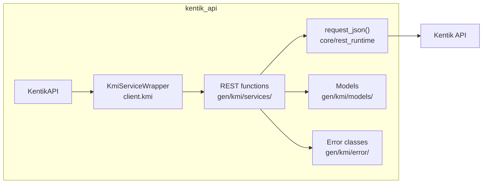

## Endpoints

### `GET` `/kmi/v202212/insights`

List global KMI insights.

Returns list of global KMI insights.

**REST transport**

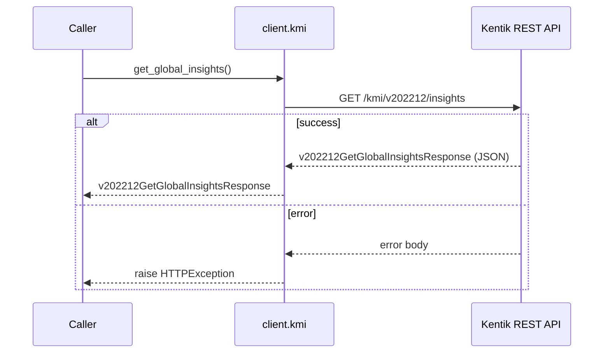

**gRPC transport**

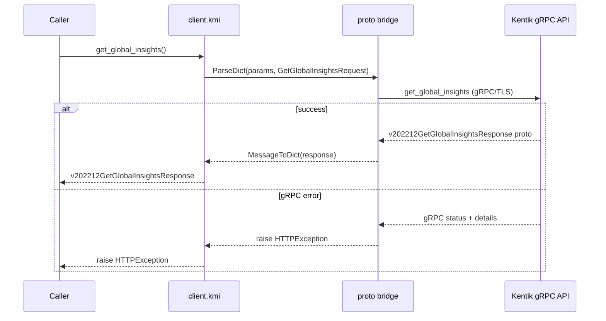

#### Parameters

| Name | In | Type | Required |
| --- | --- | --- | --- |
| `limit` | query | `integer (int64)` | No |
| `marketId` | query | `string` | No |
| `ip` | query | `string` | No |
| `lookback` | query | `integer (int64)` | No |
| `types` | query | `string[]` | No |
| `magnitude` | query | `integer (int64)` | No |

#### Responses

| Status | Description | Model |
| --- | --- | --- |
| 200 | A successful response. | `v202212GetGlobalInsightsResponse` |
| default | An unexpected error response. | `rpcStatus` |

#### Example

```python
from kentik_api.client import KentikAPI

# Both transports work: protocol="rest" (default) or protocol="grpc".
client = KentikAPI(protocol="rest")  # loads KENTIK_EMAIL/KENTIK_API_TOKEN from .env
response = client.kmi.get_global_insights()
```

---

### `GET` `/kmi/v202212/insights/{asn}`

List ASN-specific KMI insights.

Returns list of KMI insights for a specific Autonomous System.

**REST transport**

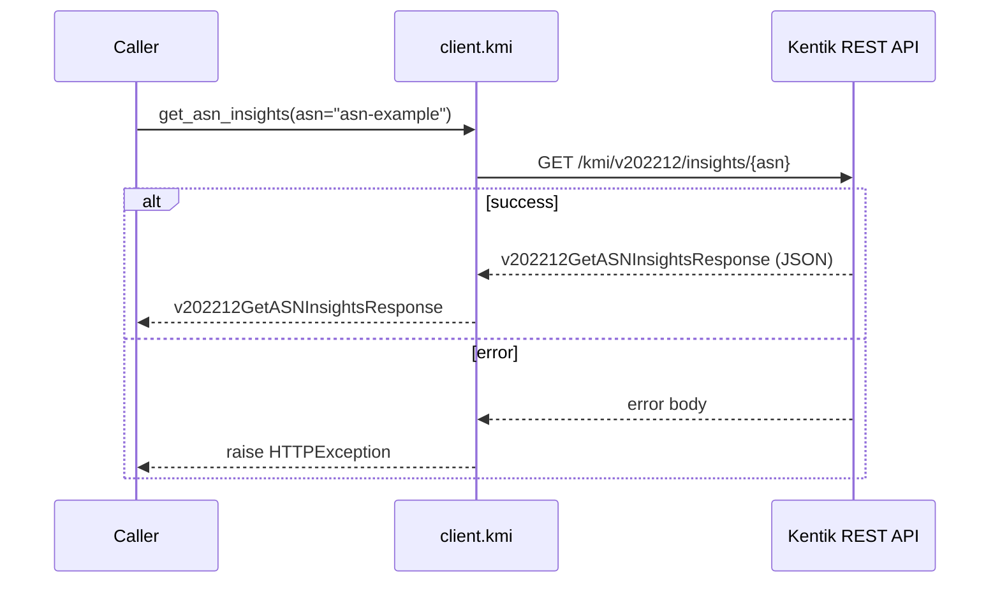

**gRPC transport**

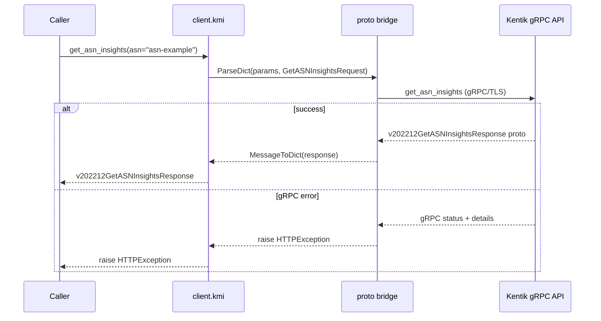

#### Parameters

| Name | In | Type | Required |
| --- | --- | --- | --- |
| `asn` | path | `string` | Yes |
| `limit` | query | `integer (int64)` | No |
| `marketId` | query | `string` | No |
| `ip` | query | `string` | No |
| `lookback` | query | `integer (int64)` | No |
| `types` | query | `string[]` | No |
| `magnitude` | query | `integer (int64)` | No |

#### Responses

| Status | Description | Model |
| --- | --- | --- |
| 200 | A successful response. | `v202212GetASNInsightsResponse` |
| default | An unexpected error response. | `rpcStatus` |

#### Example

```python
from kentik_api.client import KentikAPI

# Both transports work: protocol="rest" (default) or protocol="grpc".
client = KentikAPI(protocol="rest")  # loads KENTIK_EMAIL/KENTIK_API_TOKEN from .env
response = client.kmi.get_asn_insights(
    asn="asn-example",
)
```

---

### `POST` `/kmi/v202212/market/{marketId}/network/{asn}/{type}`

List metadata and list of customers, providers, and peers for an Autonomous System.

Returns metadata and list of customers, providers, and peers for an Autonomous System.

**REST transport**

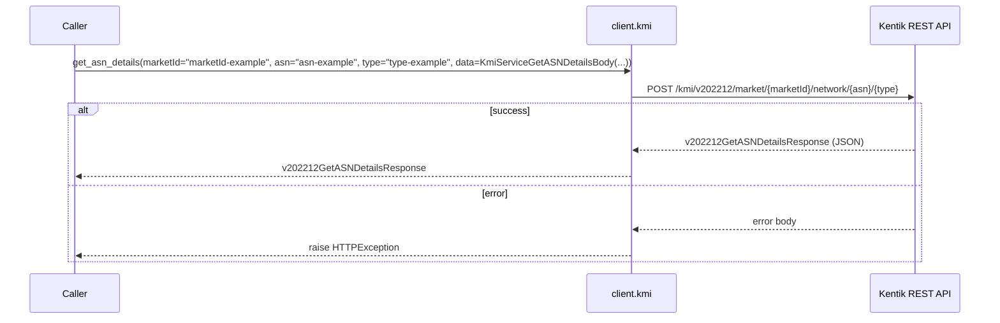

**gRPC transport**

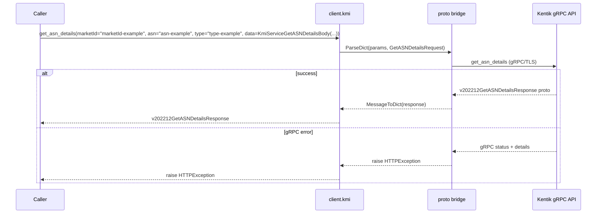

#### Parameters

| Name | In | Type | Required |
| --- | --- | --- | --- |
| `marketId` | path | `string` | Yes |
| `asn` | path | `string` | Yes |
| `type` | path | `string` | Yes |
| `data` | body | `KmiServiceGetASNDetailsBody` | Yes |

#### Responses

| Status | Description | Model |
| --- | --- | --- |
| 200 | A successful response. | `v202212GetASNDetailsResponse` |
| default | An unexpected error response. | `rpcStatus` |

#### Example

```python
from kentik_api.client import KentikAPI

# Both transports work: protocol="rest" (default) or protocol="grpc".
client = KentikAPI(protocol="rest")  # loads KENTIK_EMAIL/KENTIK_API_TOKEN from .env
response = client.kmi.get_asn_details(
    marketId="marketId-example",
    asn="asn-example",
    type="type-example",
    data=KmiServiceGetASNDetailsBody(...),
)
```

---

### `POST` `/kmi/v202212/market/{marketId}/rankings/{rankType}/ip/{ip}`

List KMI rankings by geo market and rank type.

Returns list of KMI rankings.

**REST transport**

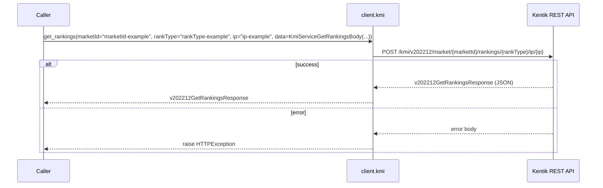

**gRPC transport**

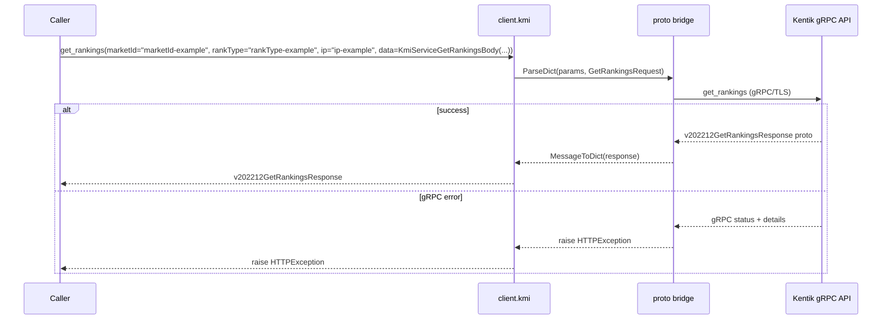

#### Parameters

| Name | In | Type | Required |
| --- | --- | --- | --- |
| `marketId` | path | `string` | Yes |
| `rankType` | path | `string` | Yes |
| `ip` | path | `string` | Yes |
| `data` | body | `KmiServiceGetRankingsBody` | Yes |

#### Responses

| Status | Description | Model |
| --- | --- | --- |
| 200 | A successful response. | `v202212GetRankingsResponse` |
| default | An unexpected error response. | `rpcStatus` |

#### Example

```python
from kentik_api.client import KentikAPI

# Both transports work: protocol="rest" (default) or protocol="grpc".
client = KentikAPI(protocol="rest")  # loads KENTIK_EMAIL/KENTIK_API_TOKEN from .env
response = client.kmi.get_rankings(
    marketId="marketId-example",
    rankType="rankType-example",
    ip="ip-example",
    data=KmiServiceGetRankingsBody(...),
)
```

---

### `GET` `/kmi/v202212/markets`

List all geo markets for KMI.

Returns list of geo markets for KMI.

**REST transport**

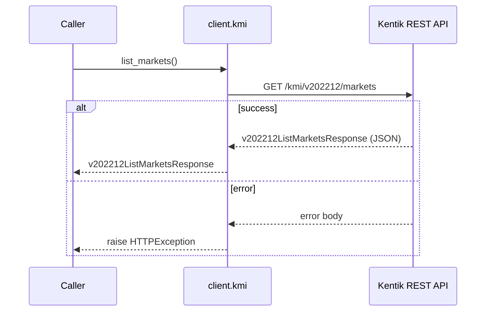

**gRPC transport**

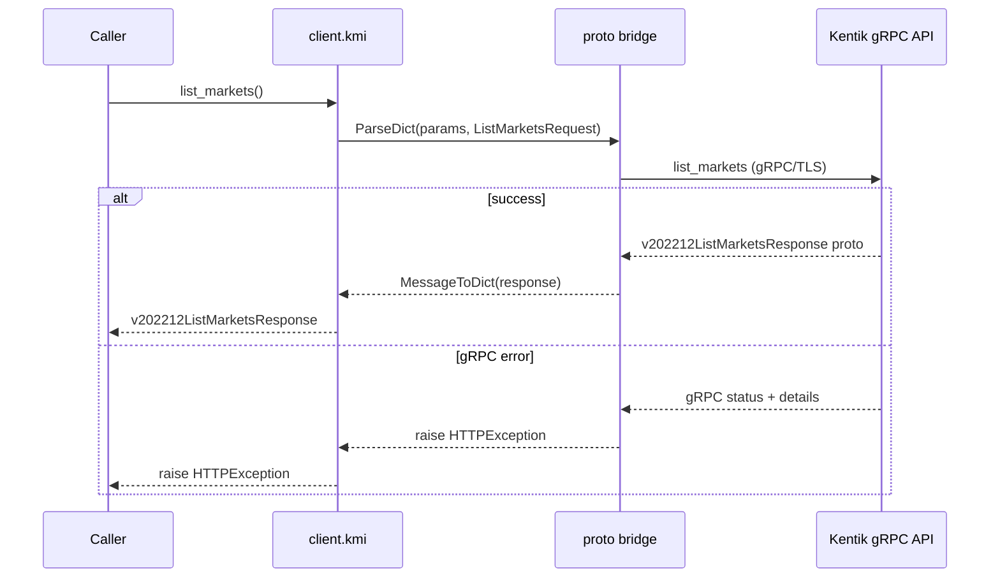

#### Responses

| Status | Description | Model |
| --- | --- | --- |
| 200 | A successful response. | `v202212ListMarketsResponse` |
| default | An unexpected error response. | `rpcStatus` |

#### Example

```python
from kentik_api.client import KentikAPI

# Both transports work: protocol="rest" (default) or protocol="grpc".
client = KentikAPI(protocol="rest")  # loads KENTIK_EMAIL/KENTIK_API_TOKEN from .env
response = client.kmi.list_markets()
```

## Data Models

<details>
<summary>Model relationships (4 of 15 models)</summary>

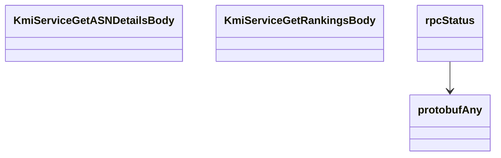

</details>

```{eval-rst}
.. autopydantic_model:: kentik_api.gen.kmi.models.ASNDetails
```

```{eval-rst}
.. autopydantic_model:: kentik_api.gen.kmi.models.CustomerProvider
```

```{eval-rst}
.. autopydantic_model:: kentik_api.gen.kmi.models.GetASNDetailsResponse
```

```{eval-rst}
.. autopydantic_model:: kentik_api.gen.kmi.models.GetASNInsightsResponse
```

```{eval-rst}
.. autopydantic_model:: kentik_api.gen.kmi.models.GetGlobalInsightsResponse
```

```{eval-rst}
.. autopydantic_model:: kentik_api.gen.kmi.models.GetRankingsResponse
```

```{eval-rst}
.. autopydantic_model:: kentik_api.gen.kmi.models.Insight
```

```{eval-rst}
.. autopydantic_model:: kentik_api.gen.kmi.models.KmiServiceGetASNDetailsBody
```

```{eval-rst}
.. autopydantic_model:: kentik_api.gen.kmi.models.KmiServiceGetRankingsBody
```

```{eval-rst}
.. autopydantic_model:: kentik_api.gen.kmi.models.ListMarketsResponse
```

```{eval-rst}
.. autopydantic_model:: kentik_api.gen.kmi.models.Market
```

```{eval-rst}
.. autopydantic_model:: kentik_api.gen.kmi.models.Peer
```

```{eval-rst}
.. autopydantic_model:: kentik_api.gen.kmi.models.Ranking
```

```{eval-rst}
.. autopydantic_model:: kentik_api.gen.kmi.models.protobufAny
```

```{eval-rst}
.. autopydantic_model:: kentik_api.gen.kmi.models.rpcStatus
```
