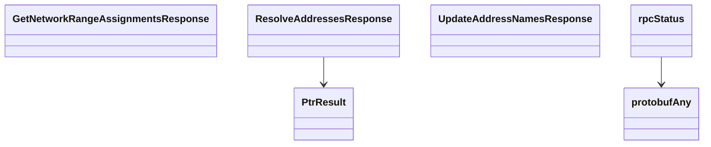

<!-- AUTO-GENERATED: scripts/generation/endpoint_docs.py, render_endpoint_docs() -->
<!-- Rebuilt on every `make generate`. Do not edit by hand. -->

# Kptr Service

## Endpoints

This service's schema defines shared types only -- no REST endpoints.

## Data Models

<details>
<summary>Model relationships (6 of 6 models)</summary>



</details>

```{eval-rst}
.. autopydantic_model:: kentik_api.gen.kptr.models.GetNetworkRangeAssignmentsResponse
```

```{eval-rst}
.. autopydantic_model:: kentik_api.gen.kptr.models.PtrResult
```

```{eval-rst}
.. autopydantic_model:: kentik_api.gen.kptr.models.ResolveAddressesResponse
```

```{eval-rst}
.. autopydantic_model:: kentik_api.gen.kptr.models.UpdateAddressNamesResponse
```

```{eval-rst}
.. autopydantic_model:: kentik_api.gen.kptr.models.protobufAny
```

```{eval-rst}
.. autopydantic_model:: kentik_api.gen.kptr.models.rpcStatus
```
