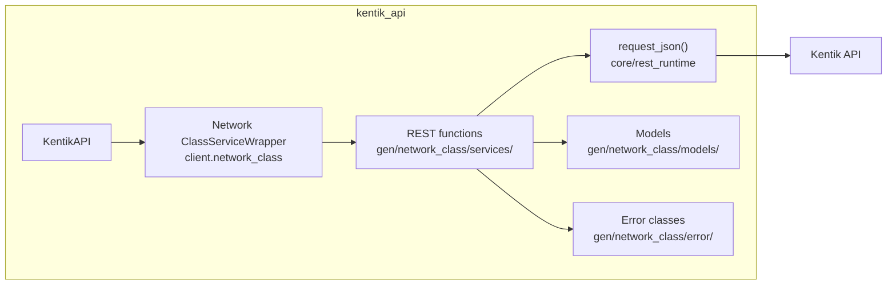
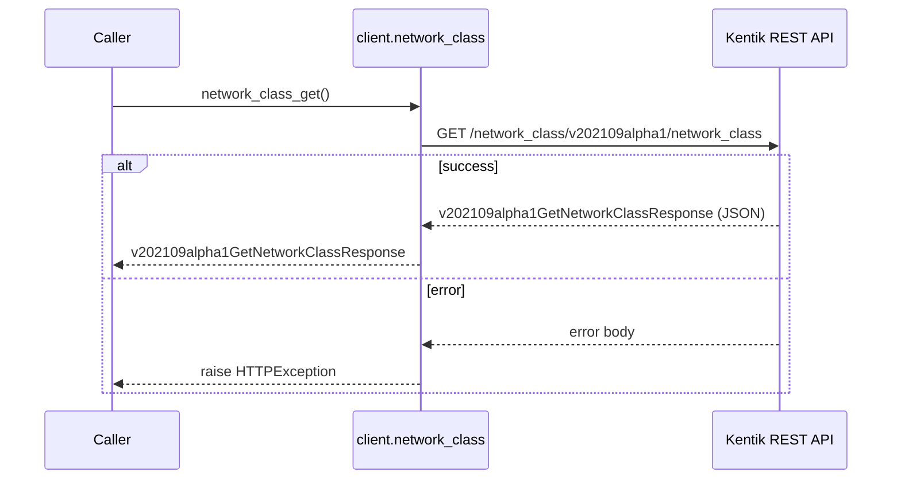
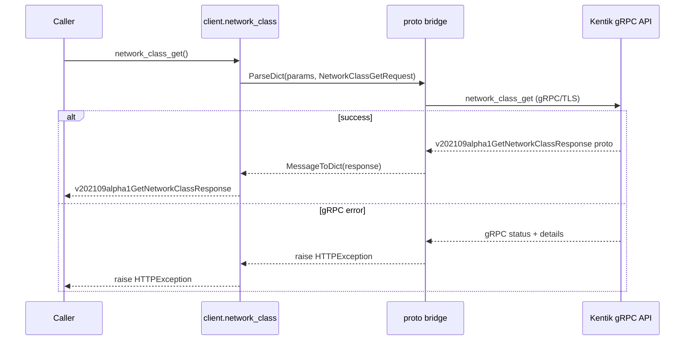
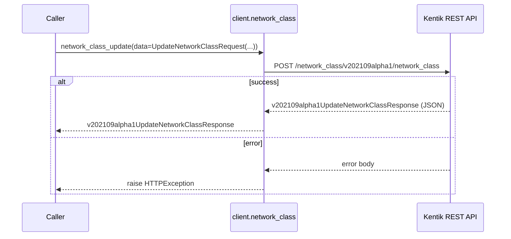
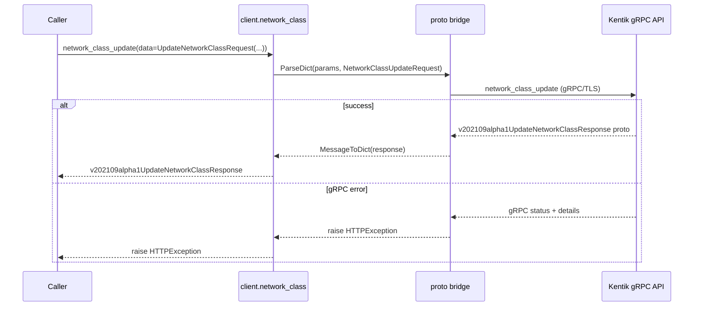
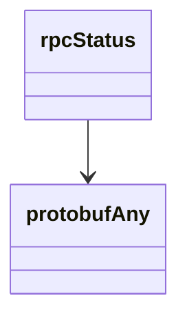

<!-- AUTO-GENERATED: scripts/generation/endpoint_docs.py, render_endpoint_docs() -->
<!-- Rebuilt on every `make generate`. Do not edit by hand. -->

# Network Class Service

## Overview



## Endpoints

### `GET` `/network_class/v202109alpha1/network_class`

Get a network classification.

Returns information about a network classification for the company.

**REST transport**



**gRPC transport**



#### Responses

| Status | Description | Model |
| --- | --- | --- |
| 200 | A successful response. | `v202109alpha1GetNetworkClassResponse` |
| default | An unexpected error response. | `rpcStatus` |

#### Example

```python
from kentik_api.client import KentikAPI

# Both transports work: protocol="rest" (default) or protocol="grpc".
client = KentikAPI(protocol="rest")  # loads KENTIK_EMAIL/KENTIK_API_TOKEN from .env
response = client.network_class.network_class_get()
```

---

### `POST` `/network_class/v202109alpha1/network_class`

Update a network classification.

Replaces the entire network classification attributes for the company.

**REST transport**



**gRPC transport**



#### Parameters

| Name | In | Type | Required |
| --- | --- | --- | --- |
| `data` | body | `v202109alpha1UpdateNetworkClassRequest` | Yes |

#### Responses

| Status | Description | Model |
| --- | --- | --- |
| 200 | A successful response. | `v202109alpha1UpdateNetworkClassResponse` |
| default | An unexpected error response. | `rpcStatus` |

#### Example

```python
from kentik_api.client import KentikAPI

# Both transports work: protocol="rest" (default) or protocol="grpc".
client = KentikAPI(protocol="rest")  # loads KENTIK_EMAIL/KENTIK_API_TOKEN from .env
response = client.network_class.network_class_update(
    data=UpdateNetworkClassRequest(...),
)
```

## Data Models

<details>
<summary>Model relationships (2 of 8 models)</summary>



</details>

```{eval-rst}
.. autopydantic_model:: kentik_api.gen.network_class.models.CloudSubnet
```

```{eval-rst}
.. autoclass:: kentik_api.gen.network_class.models.CloudType
   :members:
```

```{eval-rst}
.. autopydantic_model:: kentik_api.gen.network_class.models.GetNetworkClassResponse
```

```{eval-rst}
.. autopydantic_model:: kentik_api.gen.network_class.models.NetworkClass
```

```{eval-rst}
.. autopydantic_model:: kentik_api.gen.network_class.models.UpdateNetworkClassRequest
```

```{eval-rst}
.. autopydantic_model:: kentik_api.gen.network_class.models.UpdateNetworkClassResponse
```

```{eval-rst}
.. autopydantic_model:: kentik_api.gen.network_class.models.protobufAny
```

```{eval-rst}
.. autopydantic_model:: kentik_api.gen.network_class.models.rpcStatus
```
