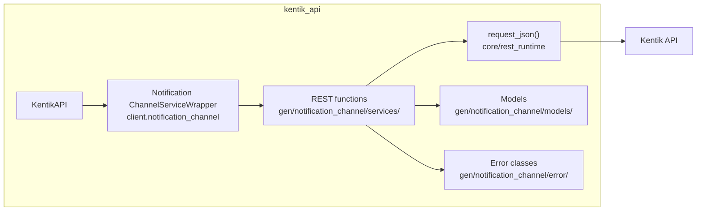
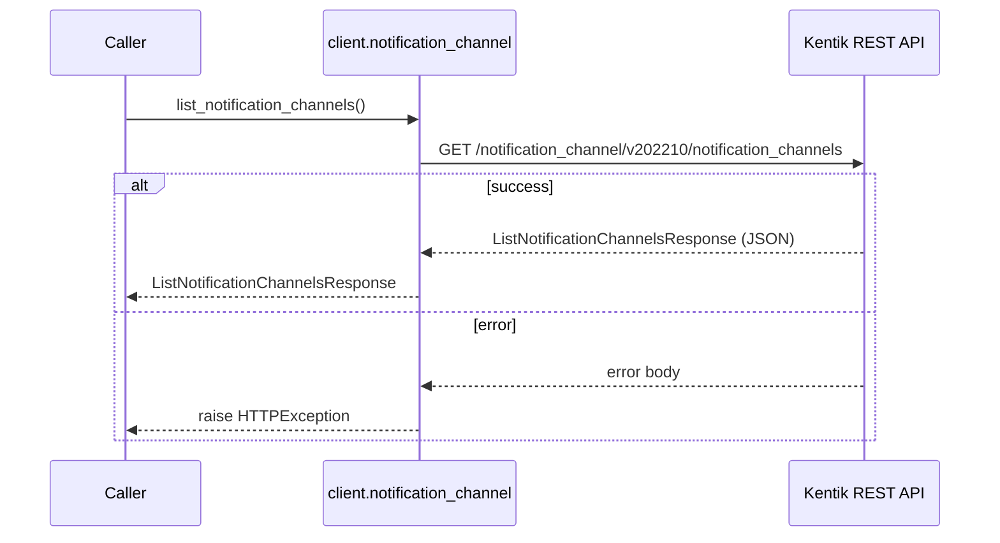
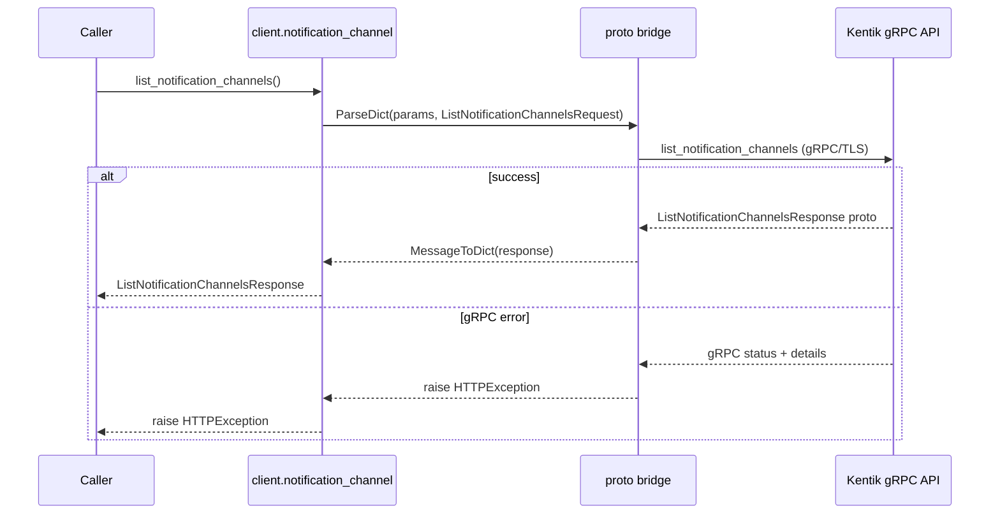
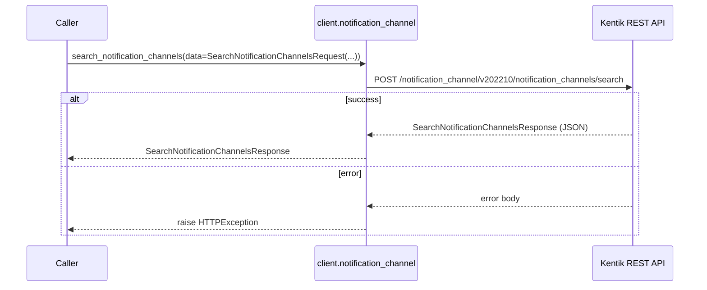
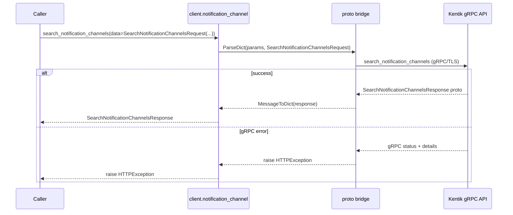
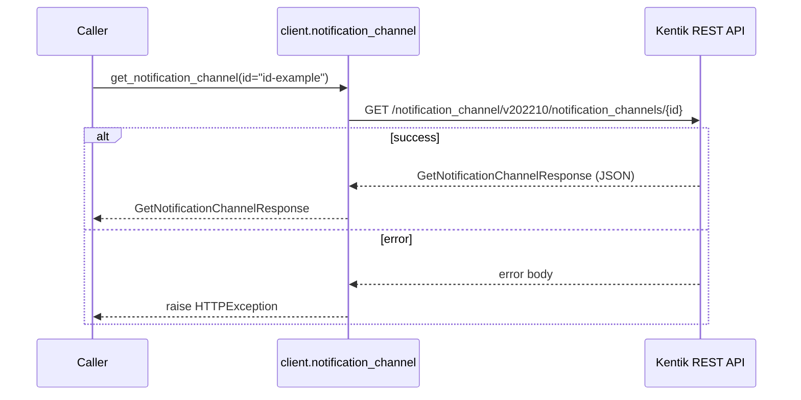
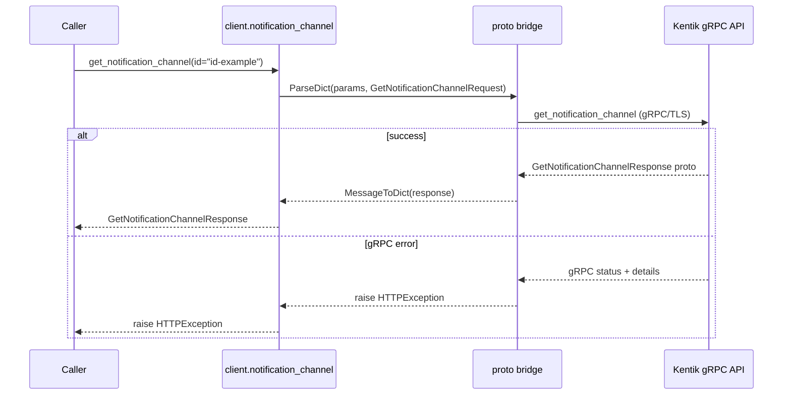
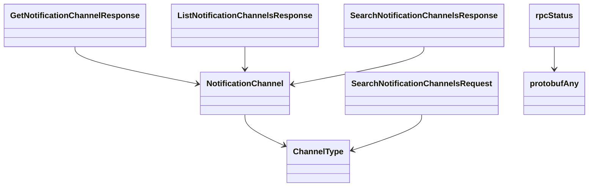

# Notification Channel Service

## Overview



## Endpoints

### `GET` `/notification_channel/v202210/notification_channels`

List available notification channels

Returns list of all configured notification channels.

**REST transport**



**gRPC transport**



#### Responses

| Status | Description | Model |
| --- | --- | --- |
| 200 | A successful response. | `ListNotificationChannelsResponse` |
| default | An unexpected error response. | `rpcStatus` |

#### Example

```python
from kentik_api.client import KentikAPI

# Both transports work: protocol="rest" (default) or protocol="grpc".
client = KentikAPI(protocol="rest")  # loads KENTIK_EMAIL/KENTIK_API_TOKEN from .env
response = client.notification_channel.list_notification_channels()
```

---

### `POST` `/notification_channel/v202210/notification_channels/search`

Retrieve notification channels matching criteria.

Returns list of all notification channels matching request criteria. Match criteria are treated as a logical AND, i.e. all provided criteria must match in order for an entry to be included in the response.

**REST transport**



**gRPC transport**



#### Parameters

| Name | In | Type | Required |
| --- | --- | --- | --- |
| `data` | body | `SearchNotificationChannelsRequest` | Yes |

#### Responses

| Status | Description | Model |
| --- | --- | --- |
| 200 | A successful response. | `SearchNotificationChannelsResponse` |
| default | An unexpected error response. | `rpcStatus` |

#### Example

```python
from kentik_api.client import KentikAPI

# Both transports work: protocol="rest" (default) or protocol="grpc".
client = KentikAPI(protocol="rest")  # loads KENTIK_EMAIL/KENTIK_API_TOKEN from .env
response = client.notification_channel.search_notification_channels(
    data=SearchNotificationChannelsRequest(...),
)
```

---

### `GET` `/notification_channel/v202210/notification_channels/{id}`

Get information about a notification channel

Returns information about a notification channel with specific ID.

**REST transport**



**gRPC transport**



#### Parameters

| Name | In | Type | Required |
| --- | --- | --- | --- |
| `id` | path | `string` | Yes |

#### Responses

| Status | Description | Model |
| --- | --- | --- |
| 200 | A successful response. | `GetNotificationChannelResponse` |
| default | An unexpected error response. | `rpcStatus` |

#### Example

```python
from kentik_api.client import KentikAPI

# Both transports work: protocol="rest" (default) or protocol="grpc".
client = KentikAPI(protocol="rest")  # loads KENTIK_EMAIL/KENTIK_API_TOKEN from .env
response = client.notification_channel.get_notification_channel(
    id="id-example",
)
```

## Data Models

<details>
<summary>Model relationships (8 of 8 models)</summary>



</details>

```{eval-rst}
.. autoclass:: kentik_api.gen.notification_channel.models.ChannelType
   :members:
```

```{eval-rst}
.. autopydantic_model:: kentik_api.gen.notification_channel.models.GetNotificationChannelResponse
```

```{eval-rst}
.. autopydantic_model:: kentik_api.gen.notification_channel.models.ListNotificationChannelsResponse
```

```{eval-rst}
.. autopydantic_model:: kentik_api.gen.notification_channel.models.NotificationChannel
```

```{eval-rst}
.. autopydantic_model:: kentik_api.gen.notification_channel.models.SearchNotificationChannelsRequest
```

```{eval-rst}
.. autopydantic_model:: kentik_api.gen.notification_channel.models.SearchNotificationChannelsResponse
```

```{eval-rst}
.. autopydantic_model:: kentik_api.gen.notification_channel.models.protobufAny
```

```{eval-rst}
.. autopydantic_model:: kentik_api.gen.notification_channel.models.rpcStatus
```
