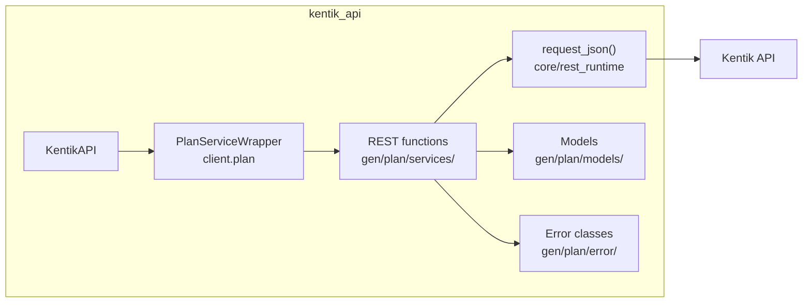
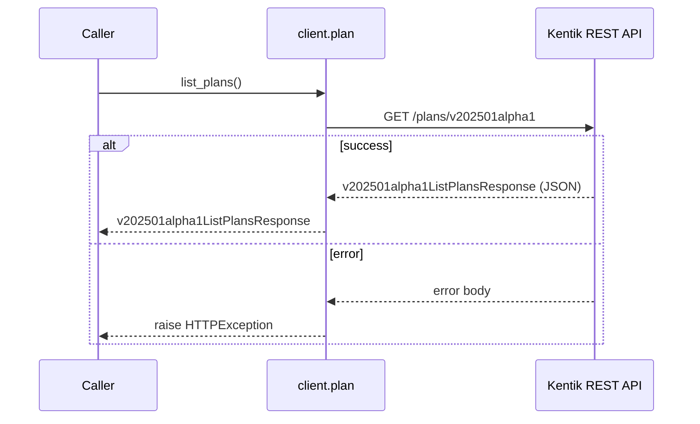
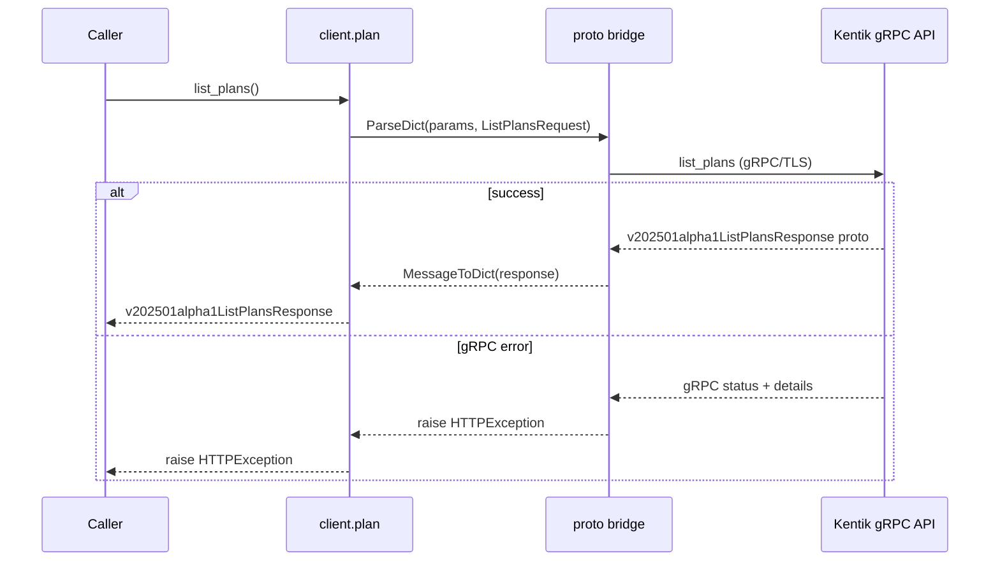
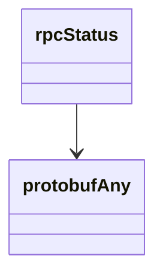

<!-- AUTO-GENERATED: scripts/generation/endpoint_docs.py, render_endpoint_docs() -->
<!-- Rebuilt on every `make generate`. Do not edit by hand. -->

# Plan Service

## Overview



## Endpoints

### `GET` `/plans/v202501alpha1`

List Plans

Returns all plans configured for the user's company.

**REST transport**



**gRPC transport**



#### Responses

| Status | Description | Model |
| --- | --- | --- |
| 200 | A successful response. | `v202501alpha1ListPlansResponse` |
| default | An unexpected error response. | `rpcStatus` |

#### Example

```python
from kentik_api.client import KentikAPI

# Both transports work: protocol="rest" (default) or protocol="grpc".
client = KentikAPI(protocol="rest")  # loads KENTIK_EMAIL/KENTIK_API_TOKEN from .env
response = client.plan.list_plans()
```

## Data Models

<details>
<summary>Model relationships (2 of 6 models)</summary>



</details>

```{eval-rst}
.. autoclass:: kentik_api.gen.plan.models.DeviceSubtype
   :members:
```

```{eval-rst}
.. autopydantic_model:: kentik_api.gen.plan.models.ListPlansResponse
```

```{eval-rst}
.. autopydantic_model:: kentik_api.gen.plan.models.Plan
```

```{eval-rst}
.. autopydantic_model:: kentik_api.gen.plan.models.PlanDevice
```

```{eval-rst}
.. autopydantic_model:: kentik_api.gen.plan.models.protobufAny
```

```{eval-rst}
.. autopydantic_model:: kentik_api.gen.plan.models.rpcStatus
```
