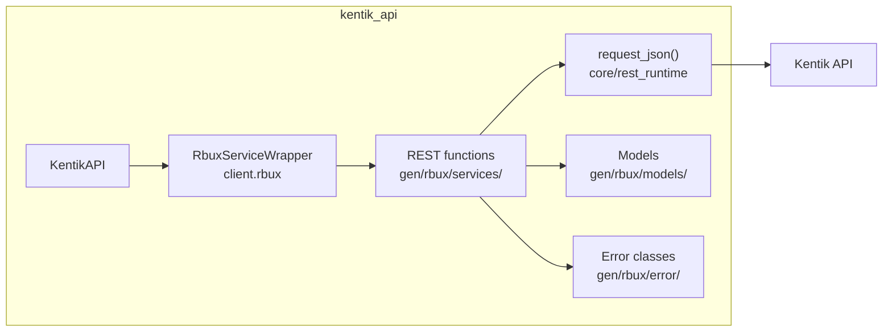
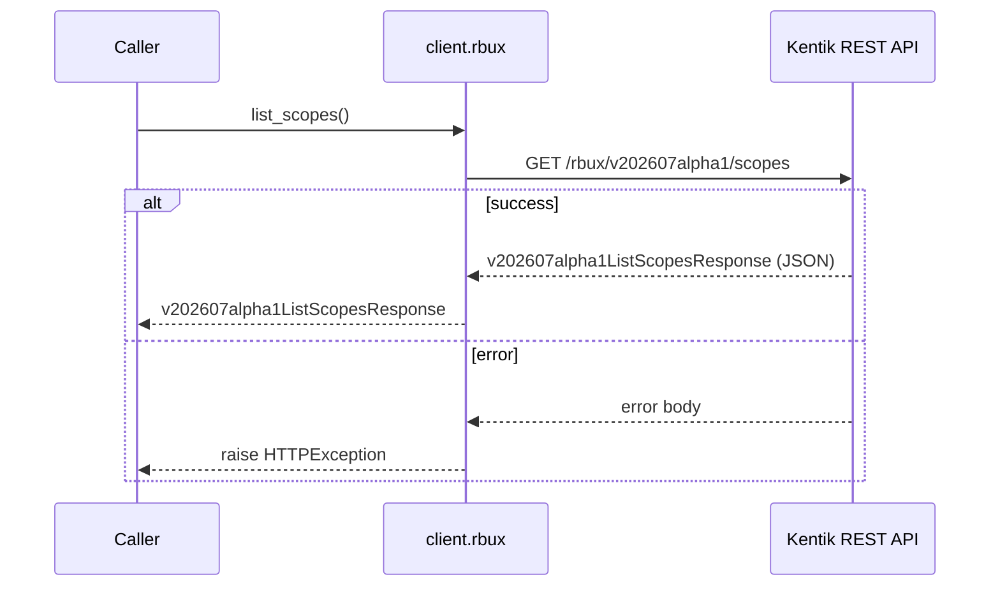
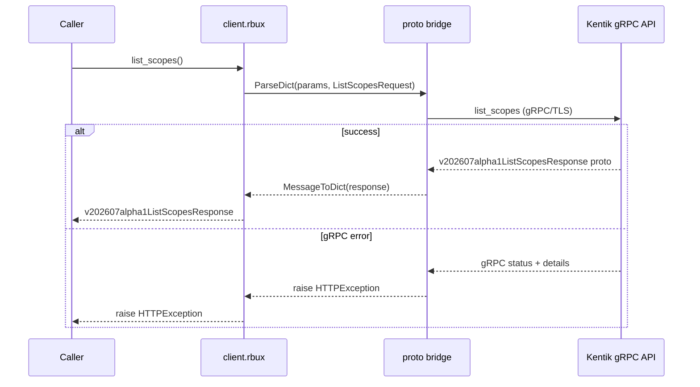
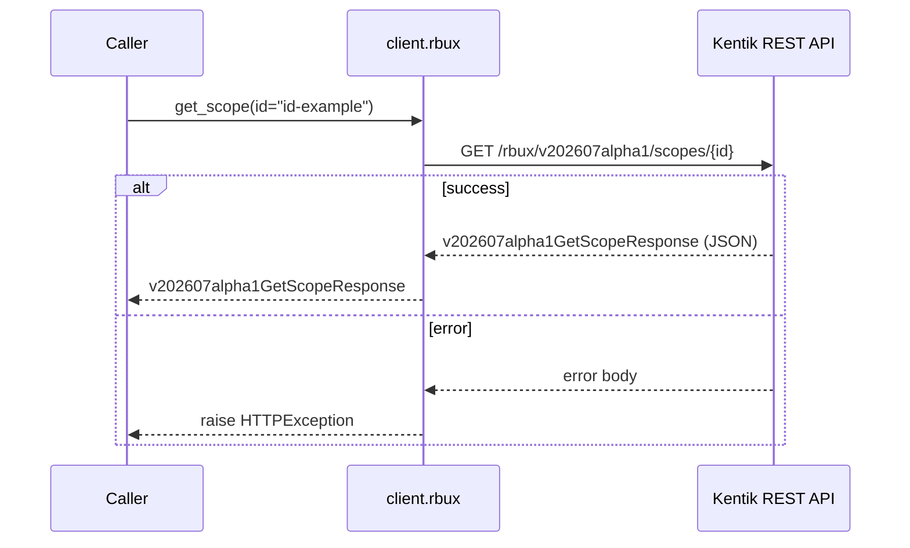
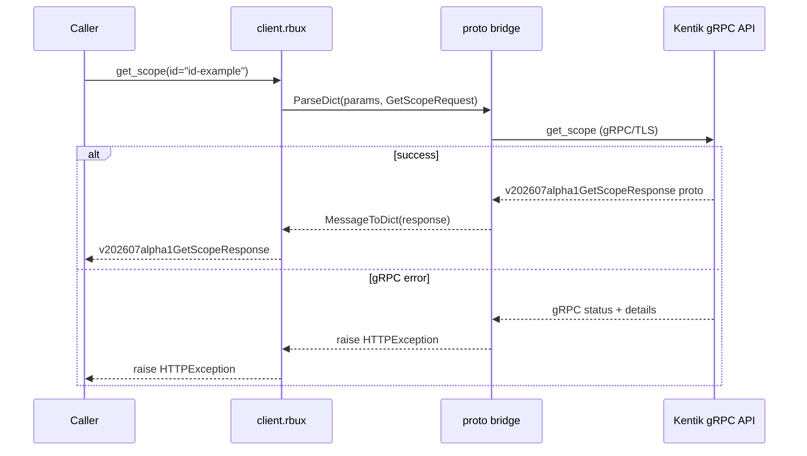
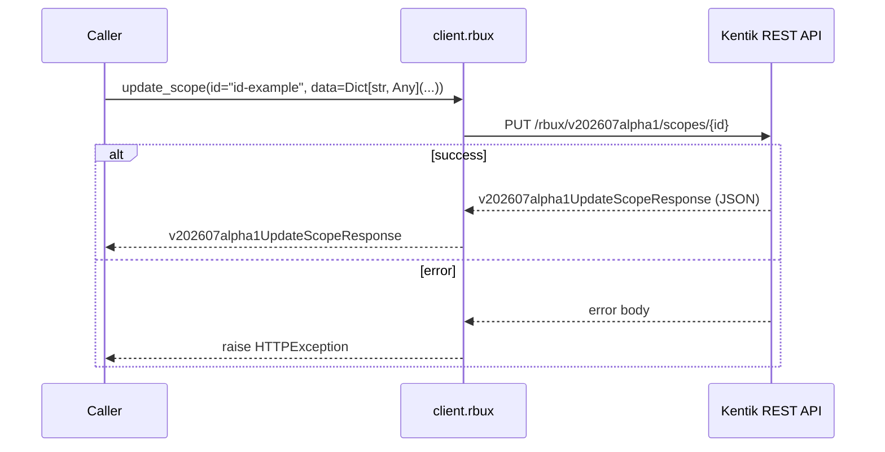
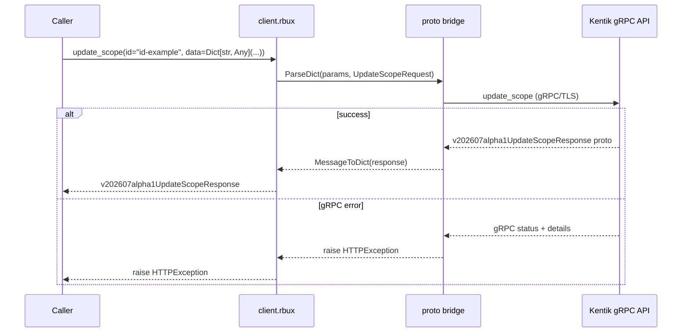
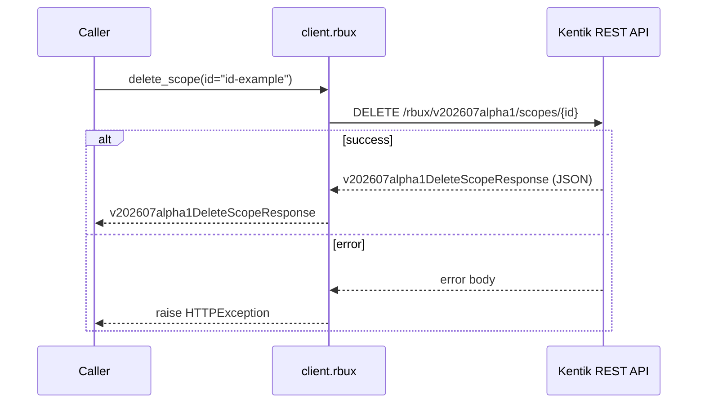
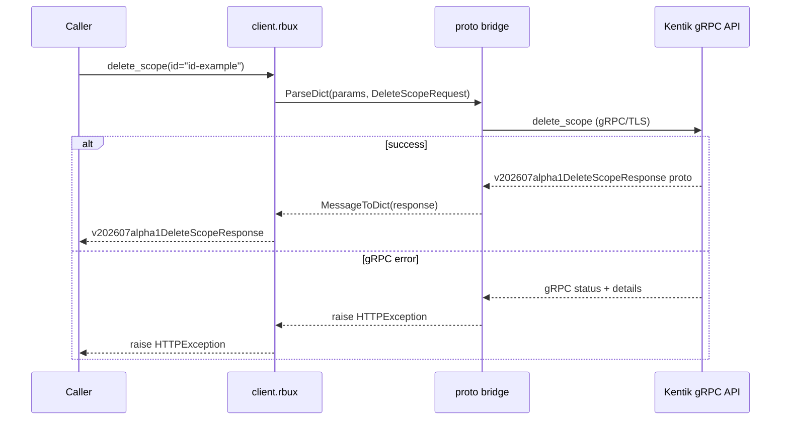
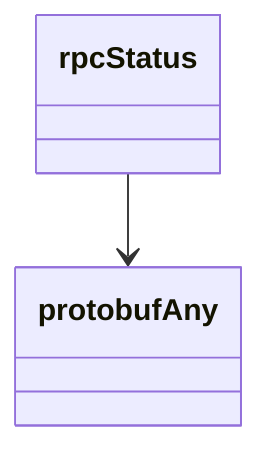

<!-- AUTO-GENERATED: scripts/generation/endpoint_docs.py, render_endpoint_docs() -->
<!-- Rebuilt on every `make generate`. Do not edit by hand. -->

# Rbux Service

## Overview



## Endpoints

### `GET` `/rbux/v202607alpha1/scopes`

List Focus Scopes

Returns all Focus Scopes for the user's company.

**REST transport**



**gRPC transport**



#### Responses

| Status | Description | Model |
| --- | --- | --- |
| 200 | A successful response. | `v202607alpha1ListScopesResponse` |
| default | An unexpected error response. | `rpcStatus` |

#### Example

```python
from kentik_api.client import KentikAPI

# Both transports work: protocol="rest" (default) or protocol="grpc".
client = KentikAPI(protocol="rest")  # loads KENTIK_EMAIL/KENTIK_API_TOKEN from .env
response = client.rbux.list_scopes()
```

---

### `POST` `/rbux/v202607alpha1/scopes`

Create Focus Scope

Creates and returns a new Focus Scope.

**REST transport**


**gRPC transport**


#### Parameters

| Name | In | Type | Required |
| --- | --- | --- | --- |
| `data` | body | `v202607alpha1Scope` | Yes |

#### Responses

| Status | Description | Model |
| --- | --- | --- |
| 200 | A successful response. | `v202607alpha1CreateScopeResponse` |
| default | An unexpected error response. | `rpcStatus` |

#### Example

```python
from kentik_api.client import KentikAPI

# Both transports work: protocol="rest" (default) or protocol="grpc".
client = KentikAPI(protocol="rest")  # loads KENTIK_EMAIL/KENTIK_API_TOKEN from .env
response = client.rbux.create_scope(
    data=Scope(...),
)
```

---

### `GET` `/rbux/v202607alpha1/scopes/{id}`

Get Focus Scope

Returns a single Focus Scope by id.

**REST transport**



**gRPC transport**



#### Parameters

| Name | In | Type | Required |
| --- | --- | --- | --- |
| `id` | path | `string` | Yes |

#### Responses

| Status | Description | Model |
| --- | --- | --- |
| 200 | A successful response. | `v202607alpha1GetScopeResponse` |
| default | An unexpected error response. | `rpcStatus` |

#### Example

```python
from kentik_api.client import KentikAPI

# Both transports work: protocol="rest" (default) or protocol="grpc".
client = KentikAPI(protocol="rest")  # loads KENTIK_EMAIL/KENTIK_API_TOKEN from .env
response = client.rbux.get_scope(
    id="id-example",
)
```

---

### `PUT` `/rbux/v202607alpha1/scopes/{id}`

Update Focus Scope

Updates and returns an existing Focus Scope.

**REST transport**



**gRPC transport**



#### Parameters

| Name | In | Type | Required |
| --- | --- | --- | --- |
| `id` | path | `string` | Yes |
| `data` | body | `object` | Yes |

#### Responses

| Status | Description | Model |
| --- | --- | --- |
| 200 | A successful response. | `v202607alpha1UpdateScopeResponse` |
| default | An unexpected error response. | `rpcStatus` |

#### Example

```python
from kentik_api.client import KentikAPI

# Both transports work: protocol="rest" (default) or protocol="grpc".
client = KentikAPI(protocol="rest")  # loads KENTIK_EMAIL/KENTIK_API_TOKEN from .env
response = client.rbux.update_scope(
    id="id-example",
    data=Dict[str, Any](...),
)
```

---

### `DELETE` `/rbux/v202607alpha1/scopes/{id}`

Delete Focus Scope

Deletes a Focus Scope.

**REST transport**



**gRPC transport**



#### Parameters

| Name | In | Type | Required |
| --- | --- | --- | --- |
| `id` | path | `string` | Yes |

#### Responses

| Status | Description | Model |
| --- | --- | --- |
| 200 | A successful response. | `v202607alpha1DeleteScopeResponse` |
| default | An unexpected error response. | `rpcStatus` |

#### Example

```python
from kentik_api.client import KentikAPI

# Both transports work: protocol="rest" (default) or protocol="grpc".
client = KentikAPI(protocol="rest")  # loads KENTIK_EMAIL/KENTIK_API_TOKEN from .env
response = client.rbux.delete_scope(
    id="id-example",
)
```

## Data Models

<details>
<summary>Model relationships (2 of 17 models)</summary>



</details>

```{eval-rst}
.. autopydantic_model:: kentik_api.gen.rbux.models.AssetTagSelector
```

```{eval-rst}
.. autopydantic_model:: kentik_api.gen.rbux.models.CreateScopeResponse
```

```{eval-rst}
.. autopydantic_model:: kentik_api.gen.rbux.models.DeleteScopeResponse
```

```{eval-rst}
.. autopydantic_model:: kentik_api.gen.rbux.models.GetScopeResponse
```

```{eval-rst}
.. autopydantic_model:: kentik_api.gen.rbux.models.ListScopesResponse
```

```{eval-rst}
.. autopydantic_model:: kentik_api.gen.rbux.models.Scope
```

```{eval-rst}
.. autopydantic_model:: kentik_api.gen.rbux.models.ScopeConfig
```

```{eval-rst}
.. autopydantic_model:: kentik_api.gen.rbux.models.ScopeDimensions
```

```{eval-rst}
.. autopydantic_model:: kentik_api.gen.rbux.models.UpdateScopeResponse
```

```{eval-rst}
.. autopydantic_model:: kentik_api.gen.rbux.models.protobufAny
```

```{eval-rst}
.. autopydantic_model:: kentik_api.gen.rbux.models.rpcStatus
```

```{eval-rst}
.. autoclass:: kentik_api.gen.rbux.models.v202501alpha1FilterField
   :members:
```

```{eval-rst}
.. autoclass:: kentik_api.gen.rbux.models.v202501alpha1FilterOperator
   :members:
```

```{eval-rst}
.. autopydantic_model:: kentik_api.gen.rbux.models.v202501alpha1SavedFilterFilter
```

```{eval-rst}
.. autopydantic_model:: kentik_api.gen.rbux.models.v202501alpha1SavedFilterFilterGroup
```

```{eval-rst}
.. autopydantic_model:: kentik_api.gen.rbux.models.v202501alpha1SavedFilterFilterId
```

```{eval-rst}
.. autopydantic_model:: kentik_api.gen.rbux.models.v202501alpha1SavedFilterFilters
```
