# Saved Filter Service

## Overview

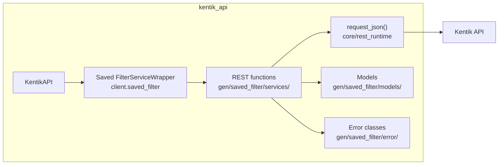

## Endpoints

### `POST` `/saved-filter/v202501alpha1`

Create Saved Filter

Creates and returns a saved filter object containing information about an individual saved filter.

**REST transport**

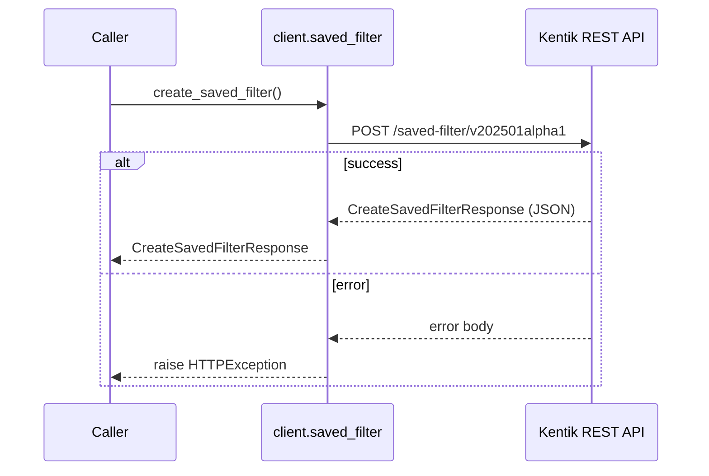

**gRPC transport**

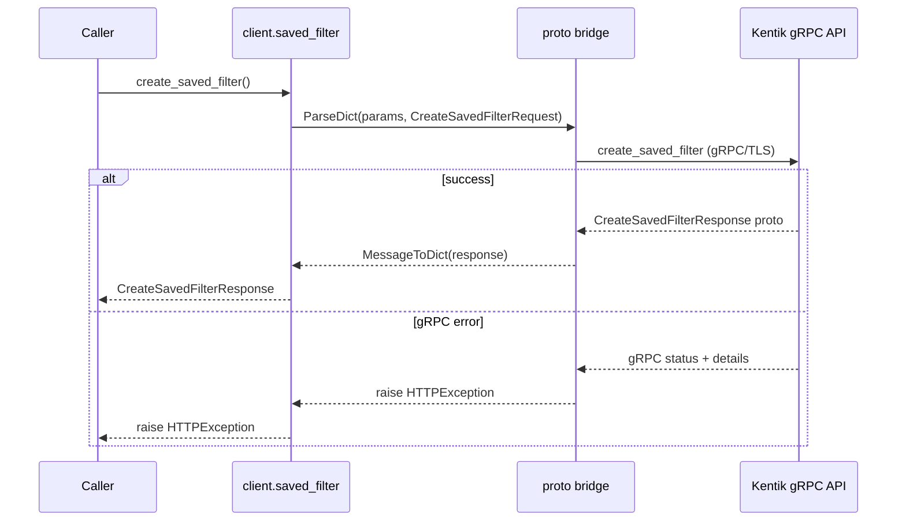

#### Parameters

| Name | In | Type | Required |
| --- | --- | --- | --- |
| `data` | body | `-` | No |

#### Responses

| Status | Description | Model |
| --- | --- | --- |
| 200 | A successful response. | `CreateSavedFilterResponse` |
| default | An unexpected error response. | `rpcStatus` |

#### Example

```python
from kentik_api.client import KentikAPI

# Both transports work: protocol="rest" (default) or protocol="grpc".
client = KentikAPI(protocol="rest")  # loads KENTIK_EMAIL/KENTIK_API_TOKEN from .env
response = client.saved_filter.create_saved_filter()
```

---

### `GET` `/saved-filter/v202501alpha1/{id}`

Custom Saved Filter Info

Returns a saved filter object containing information about an individual saved filter.

**REST transport**

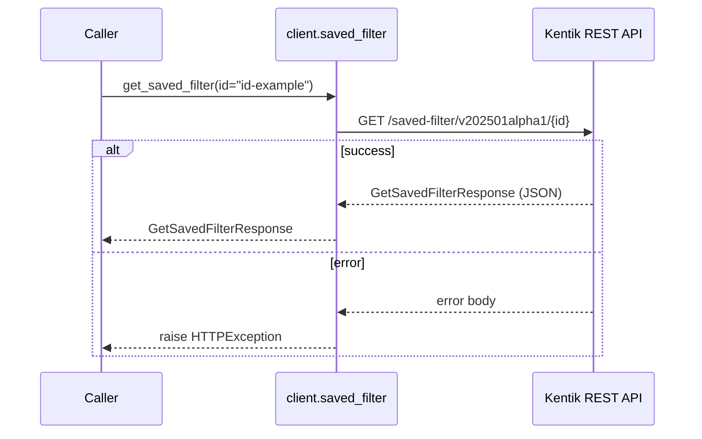

**gRPC transport**

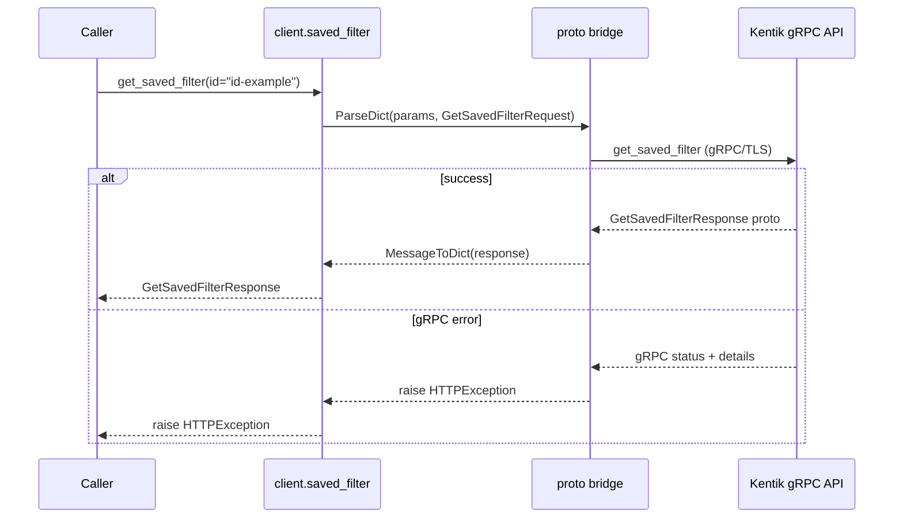

#### Parameters

| Name | In | Type | Required |
| --- | --- | --- | --- |
| `id` | path | `string` | Yes |

#### Responses

| Status | Description | Model |
| --- | --- | --- |
| 200 | A successful response. | `GetSavedFilterResponse` |
| default | An unexpected error response. | `rpcStatus` |

#### Example

```python
from kentik_api.client import KentikAPI

# Both transports work: protocol="rest" (default) or protocol="grpc".
client = KentikAPI(protocol="rest")  # loads KENTIK_EMAIL/KENTIK_API_TOKEN from .env
response = client.saved_filter.get_saved_filter(
    id="id-example",
)
```

---

### `PUT` `/saved-filter/v202501alpha1/{id}`

Update Saved Filter

Updates and returns a saved filter object containing information about an individual saved filter.

**REST transport**

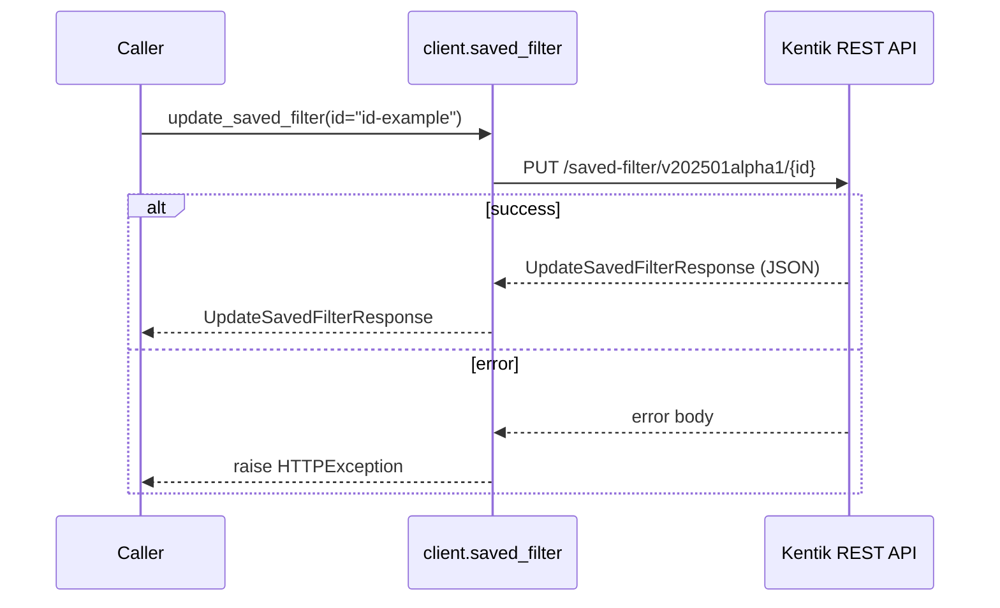

**gRPC transport**

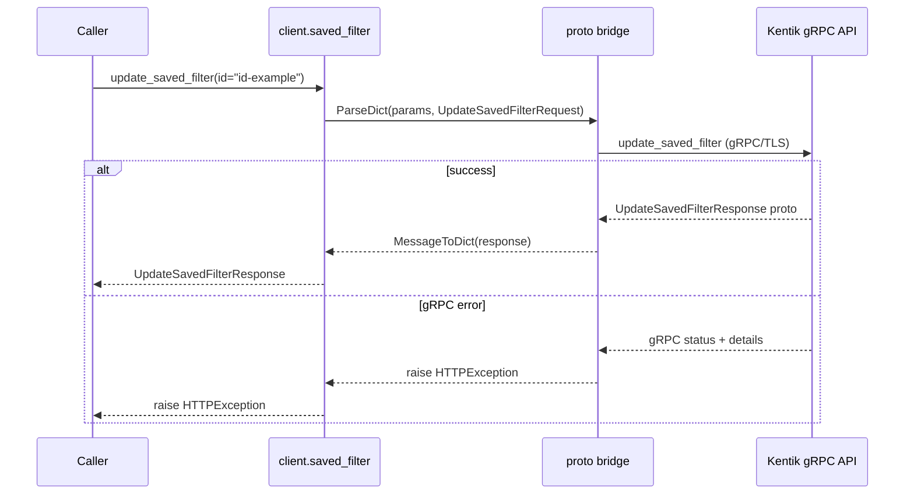

#### Parameters

| Name | In | Type | Required |
| --- | --- | --- | --- |
| `id` | path | `string` | Yes |
| `data` | body | `-` | No |

#### Responses

| Status | Description | Model |
| --- | --- | --- |
| 200 | A successful response. | `UpdateSavedFilterResponse` |
| default | An unexpected error response. | `rpcStatus` |

#### Example

```python
from kentik_api.client import KentikAPI

# Both transports work: protocol="rest" (default) or protocol="grpc".
client = KentikAPI(protocol="rest")  # loads KENTIK_EMAIL/KENTIK_API_TOKEN from .env
response = client.saved_filter.update_saved_filter(
    id="id-example",
)
```

---

### `DELETE` `/saved-filter/v202501alpha1/{id}`

Delete Saved Filter

Deletes a saved filter.

**REST transport**

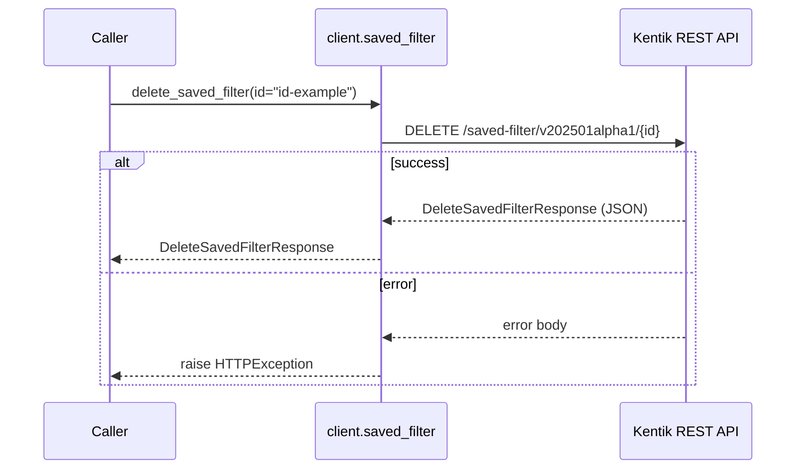

**gRPC transport**

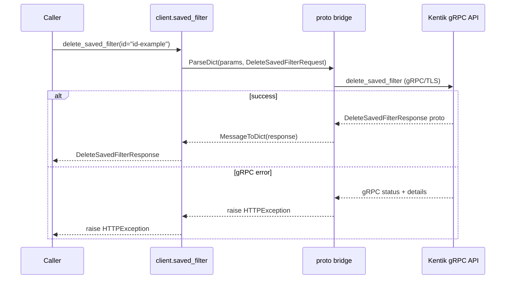

#### Parameters

| Name | In | Type | Required |
| --- | --- | --- | --- |
| `id` | path | `string` | Yes |

#### Responses

| Status | Description | Model |
| --- | --- | --- |
| 200 | A successful response. | `DeleteSavedFilterResponse` |
| default | An unexpected error response. | `rpcStatus` |

#### Example

```python
from kentik_api.client import KentikAPI

# Both transports work: protocol="rest" (default) or protocol="grpc".
client = KentikAPI(protocol="rest")  # loads KENTIK_EMAIL/KENTIK_API_TOKEN from .env
response = client.saved_filter.delete_saved_filter(
    id="id-example",
)
```

---

### `GET` `/saved-filters/v202501alpha1`

List Saved Filters

Returns all custom saved filters created by the user's company.

**REST transport**

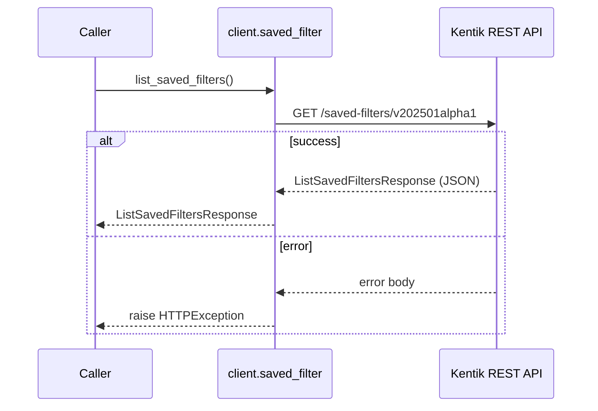

**gRPC transport**

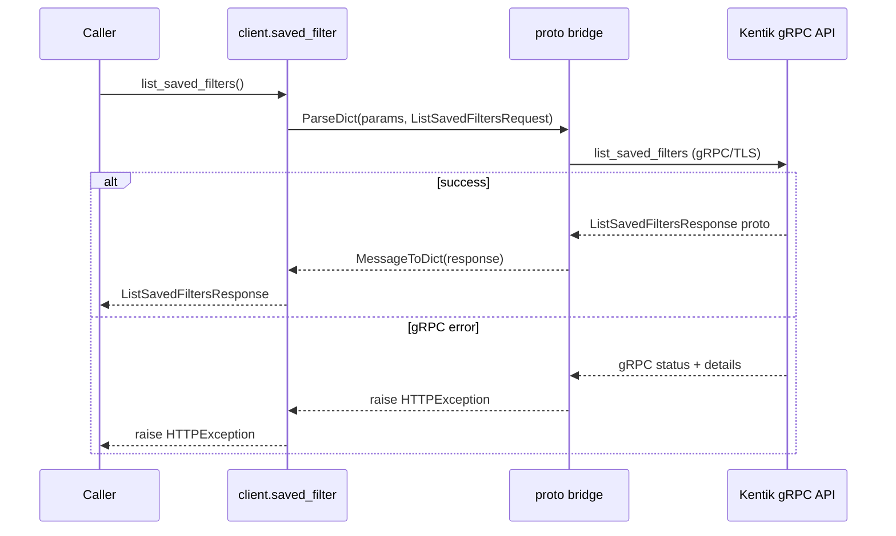

#### Responses

| Status | Description | Model |
| --- | --- | --- |
| 200 | A successful response. | `ListSavedFiltersResponse` |
| default | An unexpected error response. | `rpcStatus` |

#### Example

```python
from kentik_api.client import KentikAPI

# Both transports work: protocol="rest" (default) or protocol="grpc".
client = KentikAPI(protocol="rest")  # loads KENTIK_EMAIL/KENTIK_API_TOKEN from .env
response = client.saved_filter.list_saved_filters()
```

---

### `GET` `/saved-filters/v202501alpha1/all`

List All Saved Filters

Returns all saved filters, including system default filters.

**REST transport**

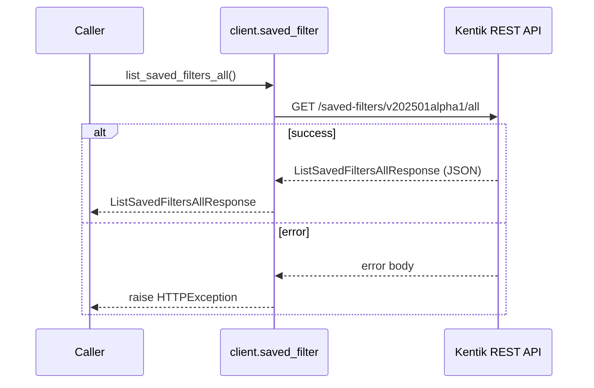

**gRPC transport**

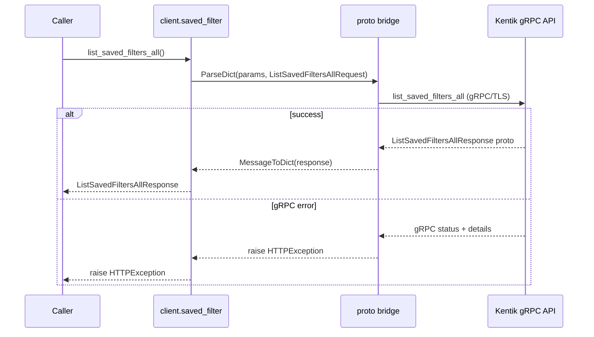

#### Responses

| Status | Description | Model |
| --- | --- | --- |
| 200 | A successful response. | `ListSavedFiltersAllResponse` |
| default | An unexpected error response. | `rpcStatus` |

#### Example

```python
from kentik_api.client import KentikAPI

# Both transports work: protocol="rest" (default) or protocol="grpc".
client = KentikAPI(protocol="rest")  # loads KENTIK_EMAIL/KENTIK_API_TOKEN from .env
response = client.saved_filter.list_saved_filters_all()
```

## Data Models

<details>
<summary>Model relationships (9 of 16 models)</summary>

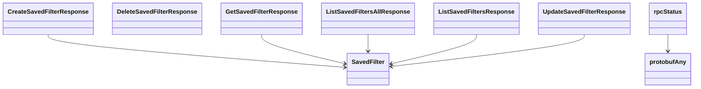

</details>

```{eval-rst}
.. autopydantic_model:: kentik_api.gen.saved_filter.models.CreateSavedFilterResponse
```

```{eval-rst}
.. autopydantic_model:: kentik_api.gen.saved_filter.models.DeleteSavedFilterResponse
```

```{eval-rst}
.. autoclass:: kentik_api.gen.saved_filter.models.FilterField
   :members:
```

```{eval-rst}
.. autoclass:: kentik_api.gen.saved_filter.models.FilterLevel
   :members:
```

```{eval-rst}
.. autoclass:: kentik_api.gen.saved_filter.models.FilterOperator
   :members:
```

```{eval-rst}
.. autopydantic_model:: kentik_api.gen.saved_filter.models.GetSavedFilterResponse
```

```{eval-rst}
.. autopydantic_model:: kentik_api.gen.saved_filter.models.ListSavedFiltersAllResponse
```

```{eval-rst}
.. autopydantic_model:: kentik_api.gen.saved_filter.models.ListSavedFiltersResponse
```

```{eval-rst}
.. autopydantic_model:: kentik_api.gen.saved_filter.models.SavedFilter
```

```{eval-rst}
.. autopydantic_model:: kentik_api.gen.saved_filter.models.SavedFilterFilter
```

```{eval-rst}
.. autopydantic_model:: kentik_api.gen.saved_filter.models.SavedFilterFilterGroup
```

```{eval-rst}
.. autopydantic_model:: kentik_api.gen.saved_filter.models.SavedFilterFilterId
```

```{eval-rst}
.. autopydantic_model:: kentik_api.gen.saved_filter.models.SavedFilterFilters
```

```{eval-rst}
.. autopydantic_model:: kentik_api.gen.saved_filter.models.UpdateSavedFilterResponse
```

```{eval-rst}
.. autopydantic_model:: kentik_api.gen.saved_filter.models.protobufAny
```

```{eval-rst}
.. autopydantic_model:: kentik_api.gen.saved_filter.models.rpcStatus
```
