<!-- AUTO-GENERATED: scripts/generation/endpoint_docs.py, render_endpoint_docs() -->
<!-- Rebuilt on every `make generate`. Do not edit by hand. -->

# Site Service

## Overview

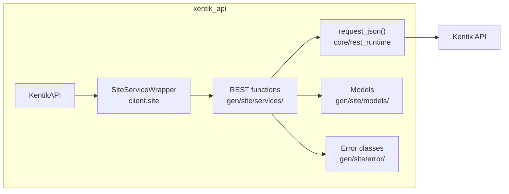
```mermaid
flowchart LR
    subgraph sdk["kentik_api"]
        KA["KentikAPI"]
        W["SiteServiceWrapper\nclient.site"]
        REST["REST functions\ngen/site/services/"]
        RJ["request_json()\ncore/rest_runtime"]
        M["Models\ngen/site/models/"]
        E["Error classes\ngen/site/error/"]
    end
    API["Kentik API"]

    KA --> W
    W --> REST
    REST --> RJ
    REST --> M
    REST --> E
    RJ --> API
```

## Endpoints

### `GET` `/site/v202509/site_markets`

List all site markets.

Returns list of configured site markets.

**REST transport**

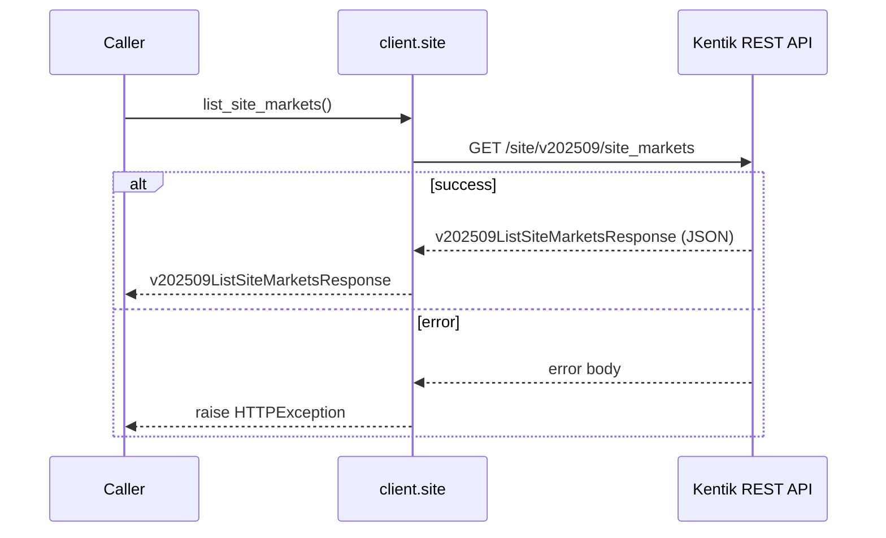
```mermaid
sequenceDiagram
    participant C as Caller
    participant W as client.site
    participant API as Kentik REST API

    C->>W: list_site_markets()
    W->>API: GET /site/v202509/site_markets
    alt success
        API-->>W: v202509ListSiteMarketsResponse (JSON)
        W-->>C: v202509ListSiteMarketsResponse
    else error
        API-->>W: error body
        W-->>C: raise HTTPException
    end
```

**gRPC transport**

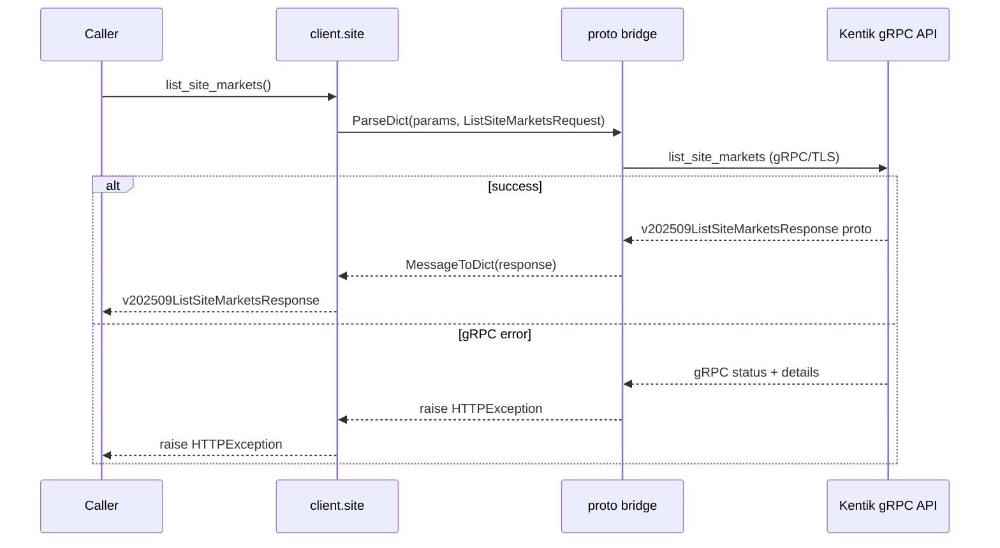
```mermaid
sequenceDiagram
    participant C as Caller
    participant W as client.site
    participant B as proto bridge
    participant API as Kentik gRPC API

    C->>W: list_site_markets()
    W->>B: ParseDict(params, ListSiteMarketsRequest)
    B->>API: list_site_markets (gRPC/TLS)
    alt success
        API-->>B: v202509ListSiteMarketsResponse proto
        B-->>W: MessageToDict(response)
        W-->>C: v202509ListSiteMarketsResponse
    else gRPC error
        API-->>B: gRPC status + details
        B-->>W: raise HTTPException
        W-->>C: raise HTTPException
    end
```

#### Responses

| Status | Description | Model |
| --- | --- | --- |
| 200 | A successful response. | `v202509ListSiteMarketsResponse` |
| default | An unexpected error response. | `rpcStatus` |

#### Example

```python
from kentik_api.client import KentikAPI

# Both transports work: protocol="rest" (default) or protocol="grpc".
client = KentikAPI(protocol="rest")  # loads KENTIK_EMAIL/KENTIK_API_TOKEN from .env
response = client.site.list_site_markets()
```

---

### `POST` `/site/v202509/site_markets`

Configure a new site market.

Create configuration for a new site market. Returns the newly created configuration.

**REST transport**

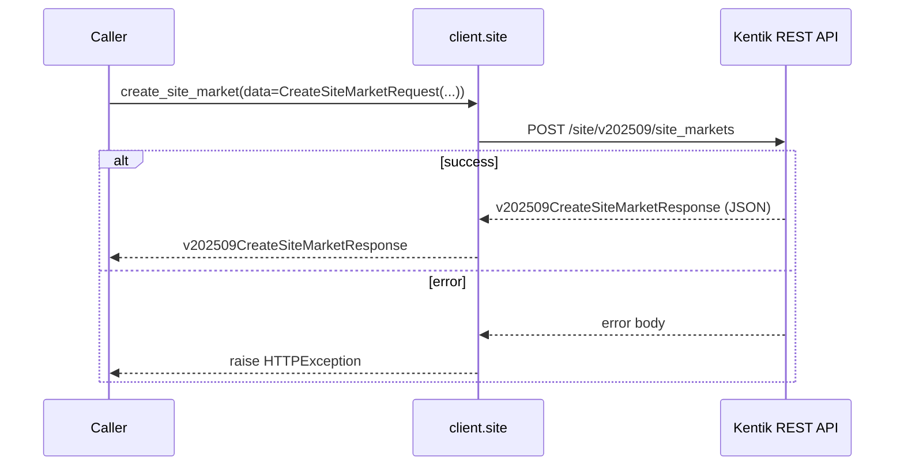
```mermaid
sequenceDiagram
    participant C as Caller
    participant W as client.site
    participant API as Kentik REST API

    C->>W: create_site_market(data=CreateSiteMarketRequest(...))
    W->>API: POST /site/v202509/site_markets
    alt success
        API-->>W: v202509CreateSiteMarketResponse (JSON)
        W-->>C: v202509CreateSiteMarketResponse
    else error
        API-->>W: error body
        W-->>C: raise HTTPException
    end
```

**gRPC transport**

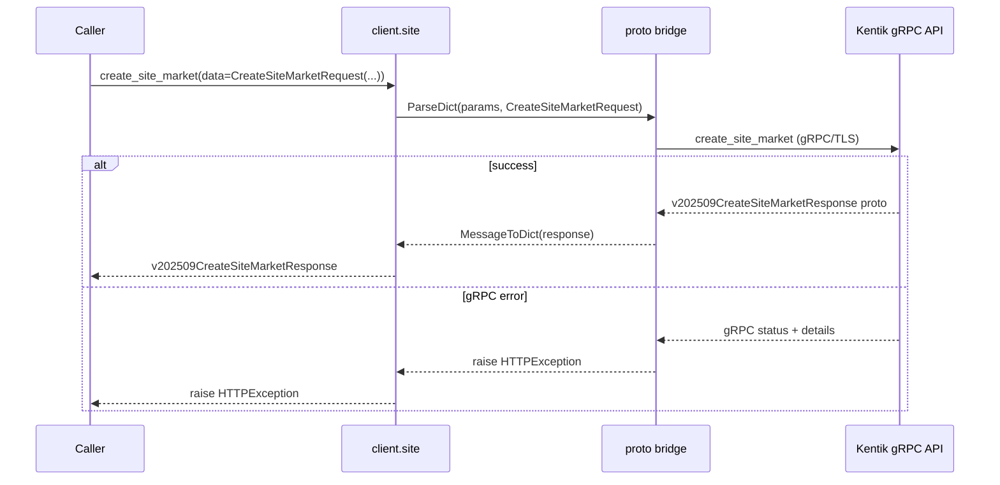
```mermaid
sequenceDiagram
    participant C as Caller
    participant W as client.site
    participant B as proto bridge
    participant API as Kentik gRPC API

    C->>W: create_site_market(data=CreateSiteMarketRequest(...))
    W->>B: ParseDict(params, CreateSiteMarketRequest)
    B->>API: create_site_market (gRPC/TLS)
    alt success
        API-->>B: v202509CreateSiteMarketResponse proto
        B-->>W: MessageToDict(response)
        W-->>C: v202509CreateSiteMarketResponse
    else gRPC error
        API-->>B: gRPC status + details
        B-->>W: raise HTTPException
        W-->>C: raise HTTPException
    end
```

#### Parameters

| Name | In | Type | Required |
| --- | --- | --- | --- |
| `data` | body | `v202509CreateSiteMarketRequest` | Yes |

#### Responses

| Status | Description | Model |
| --- | --- | --- |
| 200 | A successful response. | `v202509CreateSiteMarketResponse` |
| default | An unexpected error response. | `rpcStatus` |

#### Example

```python
from kentik_api.client import KentikAPI

# Both transports work: protocol="rest" (default) or protocol="grpc".
client = KentikAPI(protocol="rest")  # loads KENTIK_EMAIL/KENTIK_API_TOKEN from .env
response = client.site.create_site_market(
    data=CreateSiteMarketRequest(...),
)
```

---

### `GET` `/site/v202509/site_markets/{id}`

Retrieve configuration of a site market.

Returns configuration of a site market specified by ID.

**REST transport**

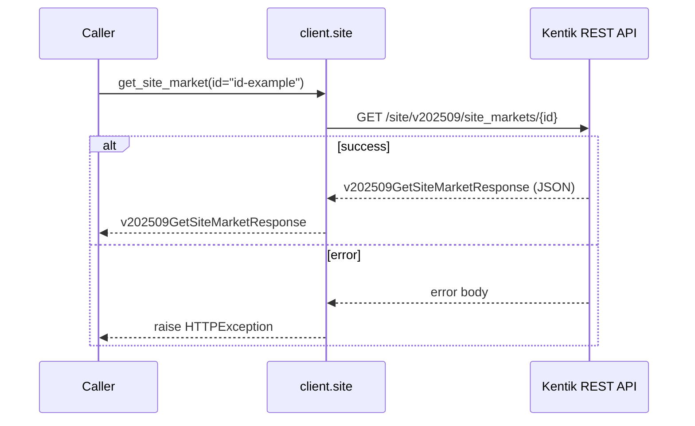
```mermaid
sequenceDiagram
    participant C as Caller
    participant W as client.site
    participant API as Kentik REST API

    C->>W: get_site_market(id="id-example")
    W->>API: GET /site/v202509/site_markets/{id}
    alt success
        API-->>W: v202509GetSiteMarketResponse (JSON)
        W-->>C: v202509GetSiteMarketResponse
    else error
        API-->>W: error body
        W-->>C: raise HTTPException
    end
```

**gRPC transport**

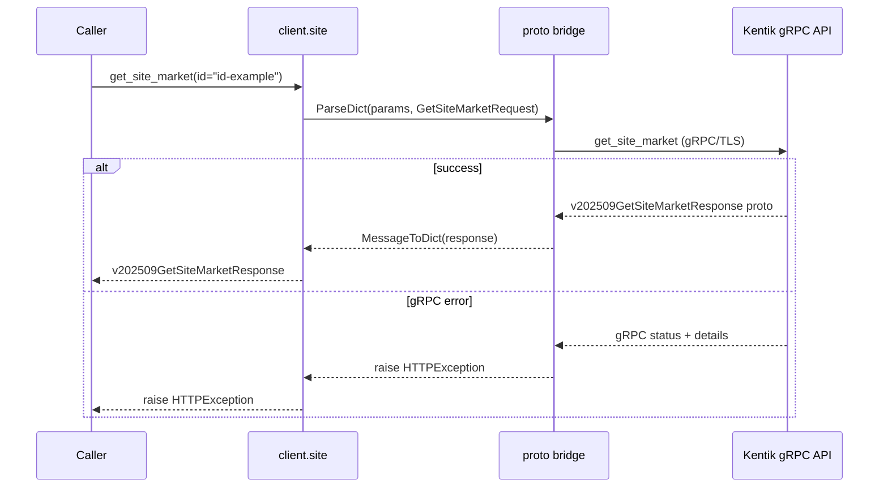
```mermaid
sequenceDiagram
    participant C as Caller
    participant W as client.site
    participant B as proto bridge
    participant API as Kentik gRPC API

    C->>W: get_site_market(id="id-example")
    W->>B: ParseDict(params, GetSiteMarketRequest)
    B->>API: get_site_market (gRPC/TLS)
    alt success
        API-->>B: v202509GetSiteMarketResponse proto
        B-->>W: MessageToDict(response)
        W-->>C: v202509GetSiteMarketResponse
    else gRPC error
        API-->>B: gRPC status + details
        B-->>W: raise HTTPException
        W-->>C: raise HTTPException
    end
```

#### Parameters

| Name | In | Type | Required |
| --- | --- | --- | --- |
| `id` | path | `string` | Yes |

#### Responses

| Status | Description | Model |
| --- | --- | --- |
| 200 | A successful response. | `v202509GetSiteMarketResponse` |
| default | An unexpected error response. | `rpcStatus` |

#### Example

```python
from kentik_api.client import KentikAPI

# Both transports work: protocol="rest" (default) or protocol="grpc".
client = KentikAPI(protocol="rest")  # loads KENTIK_EMAIL/KENTIK_API_TOKEN from .env
response = client.site.get_site_market(
    id="id-example",
)
```

---

### `PUT` `/site/v202509/site_markets/{id}`

Updates configuration of a site market.

Replaces configuration of a site market with attributes in the request. Returns the updated configuration.

**REST transport**

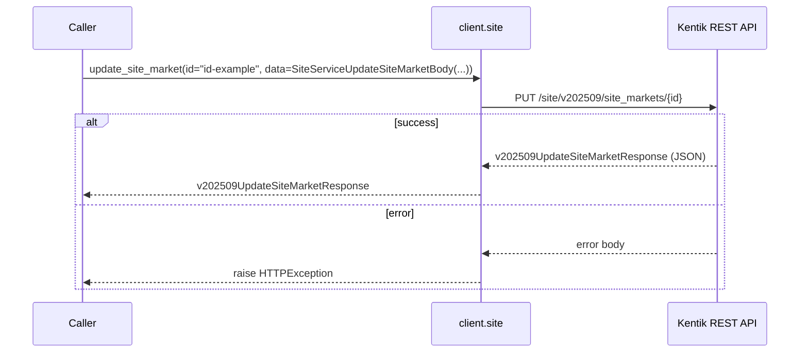
```mermaid
sequenceDiagram
    participant C as Caller
    participant W as client.site
    participant API as Kentik REST API

    C->>W: update_site_market(id="id-example", data=SiteServiceUpdateSiteMarketBody(...))
    W->>API: PUT /site/v202509/site_markets/{id}
    alt success
        API-->>W: v202509UpdateSiteMarketResponse (JSON)
        W-->>C: v202509UpdateSiteMarketResponse
    else error
        API-->>W: error body
        W-->>C: raise HTTPException
    end
```

**gRPC transport**

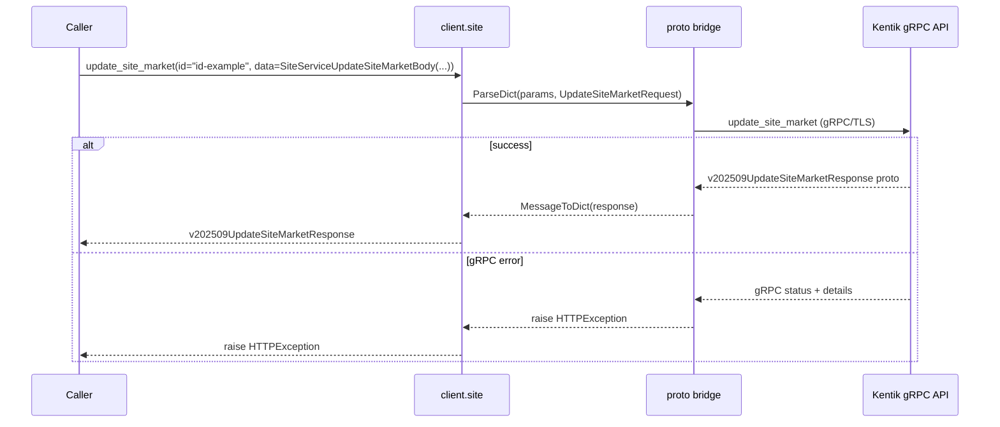
```mermaid
sequenceDiagram
    participant C as Caller
    participant W as client.site
    participant B as proto bridge
    participant API as Kentik gRPC API

    C->>W: update_site_market(id="id-example", data=SiteServiceUpdateSiteMarketBody(...))
    W->>B: ParseDict(params, UpdateSiteMarketRequest)
    B->>API: update_site_market (gRPC/TLS)
    alt success
        API-->>B: v202509UpdateSiteMarketResponse proto
        B-->>W: MessageToDict(response)
        W-->>C: v202509UpdateSiteMarketResponse
    else gRPC error
        API-->>B: gRPC status + details
        B-->>W: raise HTTPException
        W-->>C: raise HTTPException
    end
```

#### Parameters

| Name | In | Type | Required |
| --- | --- | --- | --- |
| `id` | path | `string` | Yes |
| `data` | body | `SiteServiceUpdateSiteMarketBody` | Yes |

#### Responses

| Status | Description | Model |
| --- | --- | --- |
| 200 | A successful response. | `v202509UpdateSiteMarketResponse` |
| default | An unexpected error response. | `rpcStatus` |

#### Example

```python
from kentik_api.client import KentikAPI

# Both transports work: protocol="rest" (default) or protocol="grpc".
client = KentikAPI(protocol="rest")  # loads KENTIK_EMAIL/KENTIK_API_TOKEN from .env
response = client.site.update_site_market(
    id="id-example",
    data=SiteServiceUpdateSiteMarketBody(...),
)
```

---

### `DELETE` `/site/v202509/site_markets/{id}`

Delete configuration of a site market.

Deletes configuration of a site market with specific ID.

**REST transport**

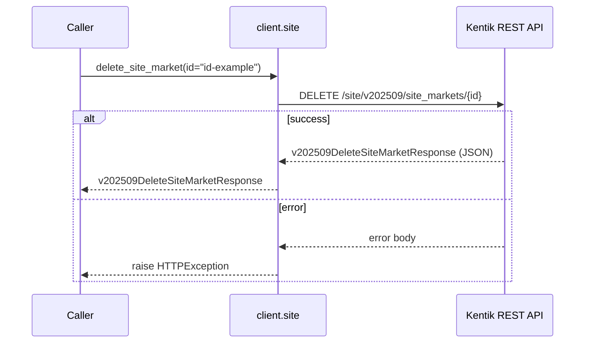
```mermaid
sequenceDiagram
    participant C as Caller
    participant W as client.site
    participant API as Kentik REST API

    C->>W: delete_site_market(id="id-example")
    W->>API: DELETE /site/v202509/site_markets/{id}
    alt success
        API-->>W: v202509DeleteSiteMarketResponse (JSON)
        W-->>C: v202509DeleteSiteMarketResponse
    else error
        API-->>W: error body
        W-->>C: raise HTTPException
    end
```

**gRPC transport**

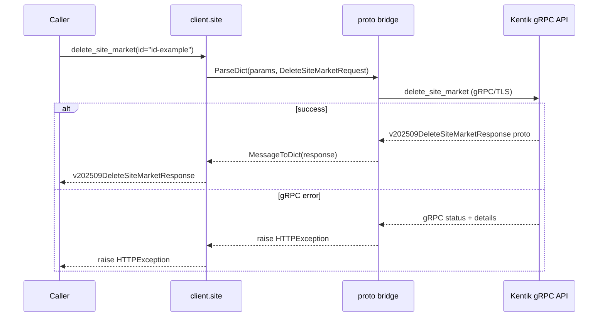
```mermaid
sequenceDiagram
    participant C as Caller
    participant W as client.site
    participant B as proto bridge
    participant API as Kentik gRPC API

    C->>W: delete_site_market(id="id-example")
    W->>B: ParseDict(params, DeleteSiteMarketRequest)
    B->>API: delete_site_market (gRPC/TLS)
    alt success
        API-->>B: v202509DeleteSiteMarketResponse proto
        B-->>W: MessageToDict(response)
        W-->>C: v202509DeleteSiteMarketResponse
    else gRPC error
        API-->>B: gRPC status + details
        B-->>W: raise HTTPException
        W-->>C: raise HTTPException
    end
```

#### Parameters

| Name | In | Type | Required |
| --- | --- | --- | --- |
| `id` | path | `string` | Yes |

#### Responses

| Status | Description | Model |
| --- | --- | --- |
| 200 | A successful response. | `v202509DeleteSiteMarketResponse` |
| default | An unexpected error response. | `rpcStatus` |

#### Example

```python
from kentik_api.client import KentikAPI

# Both transports work: protocol="rest" (default) or protocol="grpc".
client = KentikAPI(protocol="rest")  # loads KENTIK_EMAIL/KENTIK_API_TOKEN from .env
response = client.site.delete_site_market(
    id="id-example",
)
```

---

### `GET` `/site/v202509/sites`

List all sites.

Returns list of configured sites.

**REST transport**

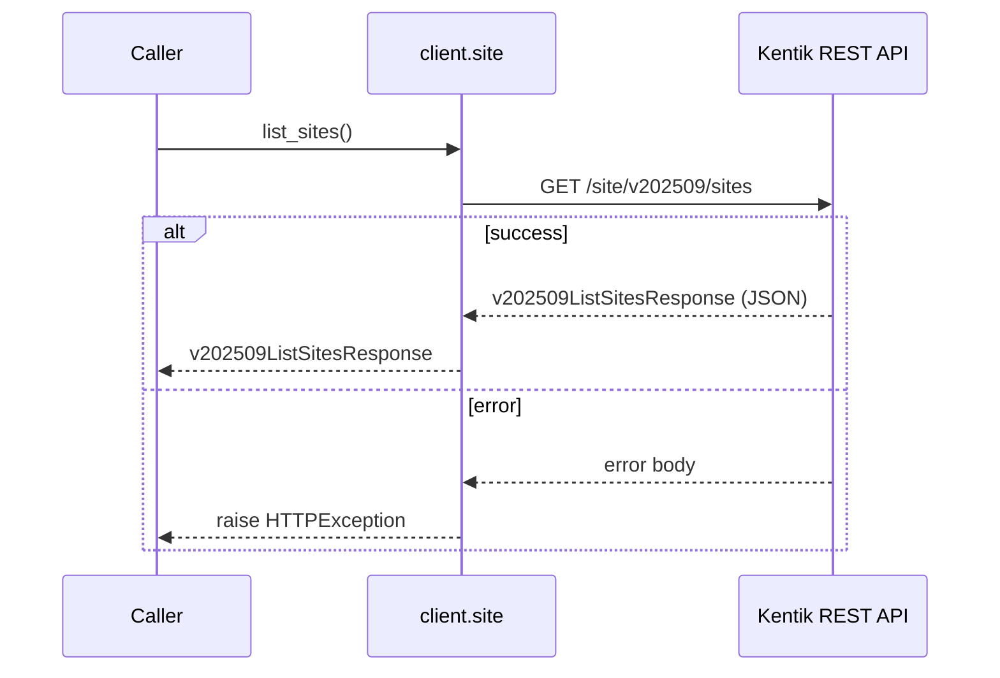
```mermaid
sequenceDiagram
    participant C as Caller
    participant W as client.site
    participant API as Kentik REST API

    C->>W: list_sites()
    W->>API: GET /site/v202509/sites
    alt success
        API-->>W: v202509ListSitesResponse (JSON)
        W-->>C: v202509ListSitesResponse
    else error
        API-->>W: error body
        W-->>C: raise HTTPException
    end
```

**gRPC transport**

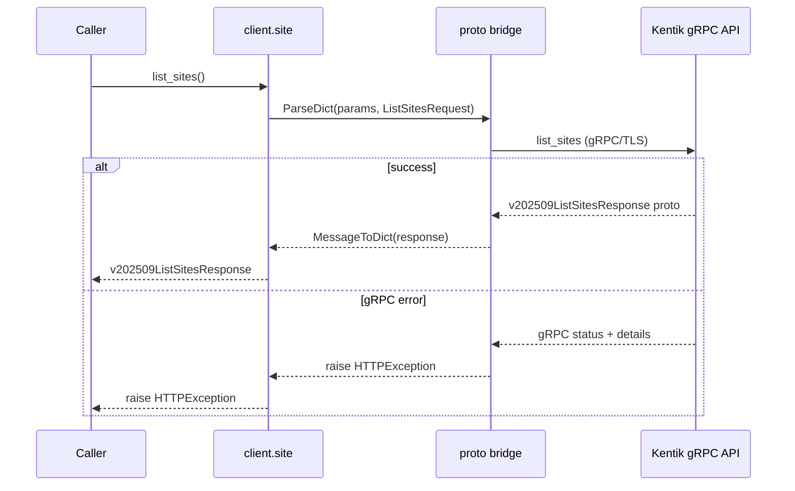
```mermaid
sequenceDiagram
    participant C as Caller
    participant W as client.site
    participant B as proto bridge
    participant API as Kentik gRPC API

    C->>W: list_sites()
    W->>B: ParseDict(params, ListSitesRequest)
    B->>API: list_sites (gRPC/TLS)
    alt success
        API-->>B: v202509ListSitesResponse proto
        B-->>W: MessageToDict(response)
        W-->>C: v202509ListSitesResponse
    else gRPC error
        API-->>B: gRPC status + details
        B-->>W: raise HTTPException
        W-->>C: raise HTTPException
    end
```

#### Responses

| Status | Description | Model |
| --- | --- | --- |
| 200 | A successful response. | `v202509ListSitesResponse` |
| default | An unexpected error response. | `rpcStatus` |

#### Example

```python
from kentik_api.client import KentikAPI

# Both transports work: protocol="rest" (default) or protocol="grpc".
client = KentikAPI(protocol="rest")  # loads KENTIK_EMAIL/KENTIK_API_TOKEN from .env
response = client.site.list_sites()
```

---

### `POST` `/site/v202509/sites`

Configure a new site.

Create configuration for a new site. Returns the newly created configuration.

**REST transport**

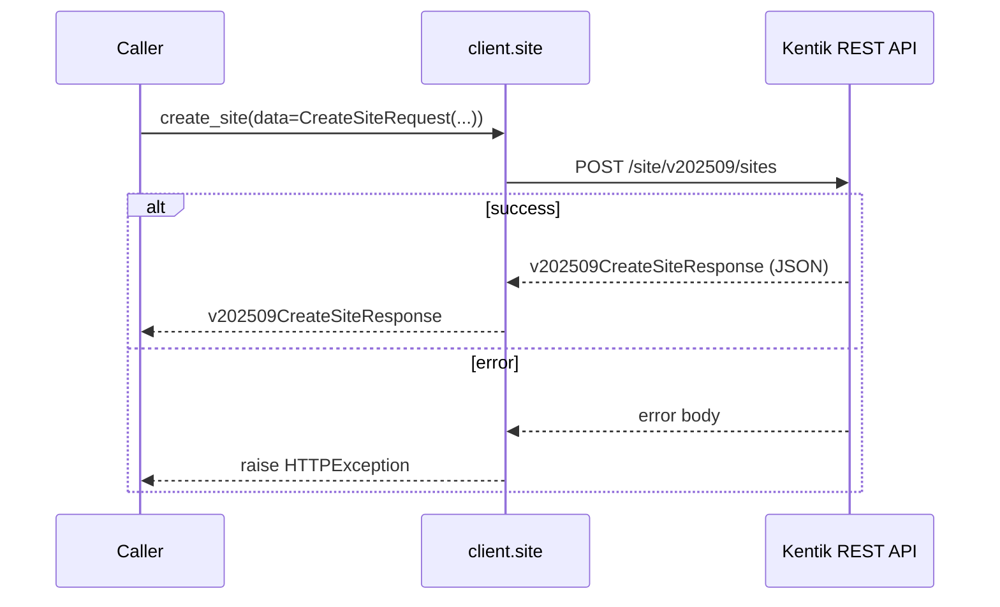
```mermaid
sequenceDiagram
    participant C as Caller
    participant W as client.site
    participant API as Kentik REST API

    C->>W: create_site(data=CreateSiteRequest(...))
    W->>API: POST /site/v202509/sites
    alt success
        API-->>W: v202509CreateSiteResponse (JSON)
        W-->>C: v202509CreateSiteResponse
    else error
        API-->>W: error body
        W-->>C: raise HTTPException
    end
```

**gRPC transport**

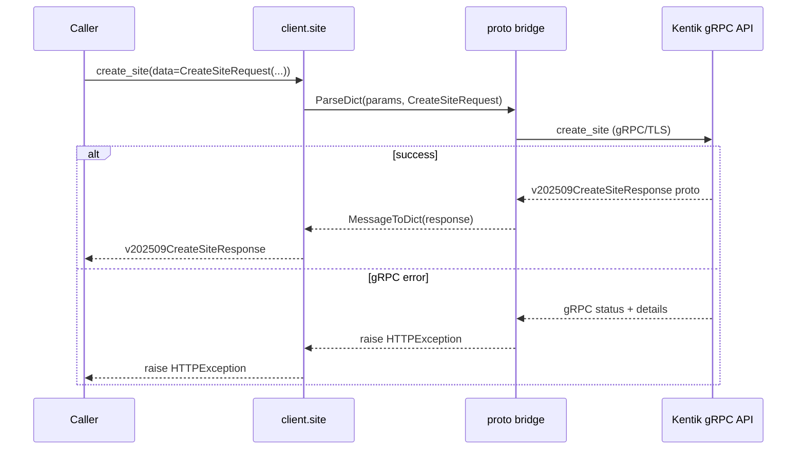
```mermaid
sequenceDiagram
    participant C as Caller
    participant W as client.site
    participant B as proto bridge
    participant API as Kentik gRPC API

    C->>W: create_site(data=CreateSiteRequest(...))
    W->>B: ParseDict(params, CreateSiteRequest)
    B->>API: create_site (gRPC/TLS)
    alt success
        API-->>B: v202509CreateSiteResponse proto
        B-->>W: MessageToDict(response)
        W-->>C: v202509CreateSiteResponse
    else gRPC error
        API-->>B: gRPC status + details
        B-->>W: raise HTTPException
        W-->>C: raise HTTPException
    end
```

#### Parameters

| Name | In | Type | Required |
| --- | --- | --- | --- |
| `data` | body | `v202509CreateSiteRequest` | Yes |

#### Responses

| Status | Description | Model |
| --- | --- | --- |
| 200 | A successful response. | `v202509CreateSiteResponse` |
| default | An unexpected error response. | `rpcStatus` |

#### Example

```python
from kentik_api.client import KentikAPI

# Both transports work: protocol="rest" (default) or protocol="grpc".
client = KentikAPI(protocol="rest")  # loads KENTIK_EMAIL/KENTIK_API_TOKEN from .env
response = client.site.create_site(
    data=CreateSiteRequest(...),
)
```

---

### `GET` `/site/v202509/sites/{id}`

Retrieve configuration of a site.

Returns configuration of a site specified by ID.

**REST transport**

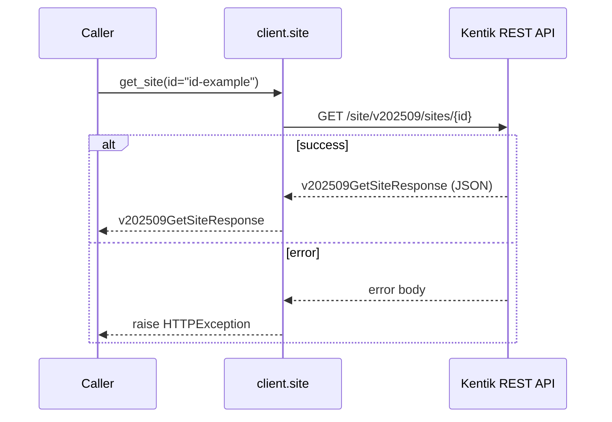
```mermaid
sequenceDiagram
    participant C as Caller
    participant W as client.site
    participant API as Kentik REST API

    C->>W: get_site(id="id-example")
    W->>API: GET /site/v202509/sites/{id}
    alt success
        API-->>W: v202509GetSiteResponse (JSON)
        W-->>C: v202509GetSiteResponse
    else error
        API-->>W: error body
        W-->>C: raise HTTPException
    end
```

**gRPC transport**

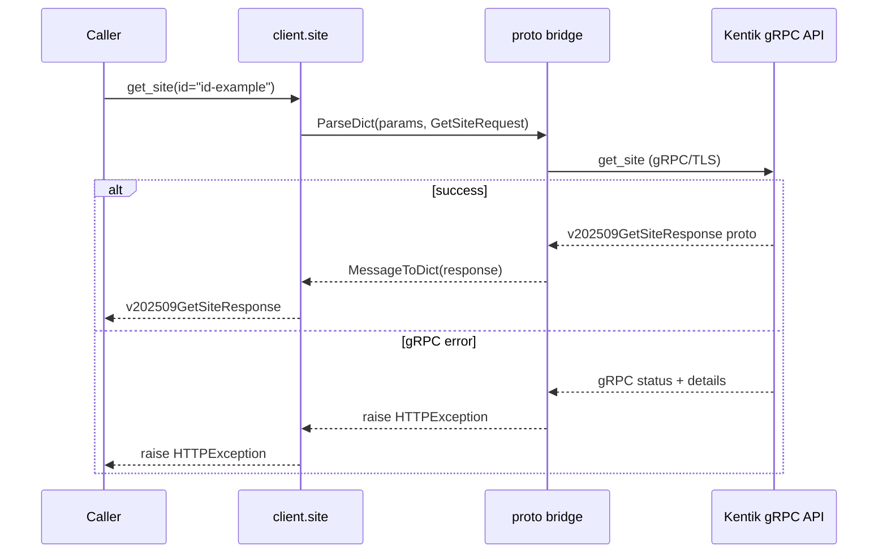
```mermaid
sequenceDiagram
    participant C as Caller
    participant W as client.site
    participant B as proto bridge
    participant API as Kentik gRPC API

    C->>W: get_site(id="id-example")
    W->>B: ParseDict(params, GetSiteRequest)
    B->>API: get_site (gRPC/TLS)
    alt success
        API-->>B: v202509GetSiteResponse proto
        B-->>W: MessageToDict(response)
        W-->>C: v202509GetSiteResponse
    else gRPC error
        API-->>B: gRPC status + details
        B-->>W: raise HTTPException
        W-->>C: raise HTTPException
    end
```

#### Parameters

| Name | In | Type | Required |
| --- | --- | --- | --- |
| `id` | path | `string` | Yes |

#### Responses

| Status | Description | Model |
| --- | --- | --- |
| 200 | A successful response. | `v202509GetSiteResponse` |
| default | An unexpected error response. | `rpcStatus` |

#### Example

```python
from kentik_api.client import KentikAPI

# Both transports work: protocol="rest" (default) or protocol="grpc".
client = KentikAPI(protocol="rest")  # loads KENTIK_EMAIL/KENTIK_API_TOKEN from .env
response = client.site.get_site(
    id="id-example",
)
```

---

### `PUT` `/site/v202509/sites/{id}`

Updates configuration of a site.

Replaces configuration of a site with attributes in the request. Returns the updated configuration.

**REST transport**

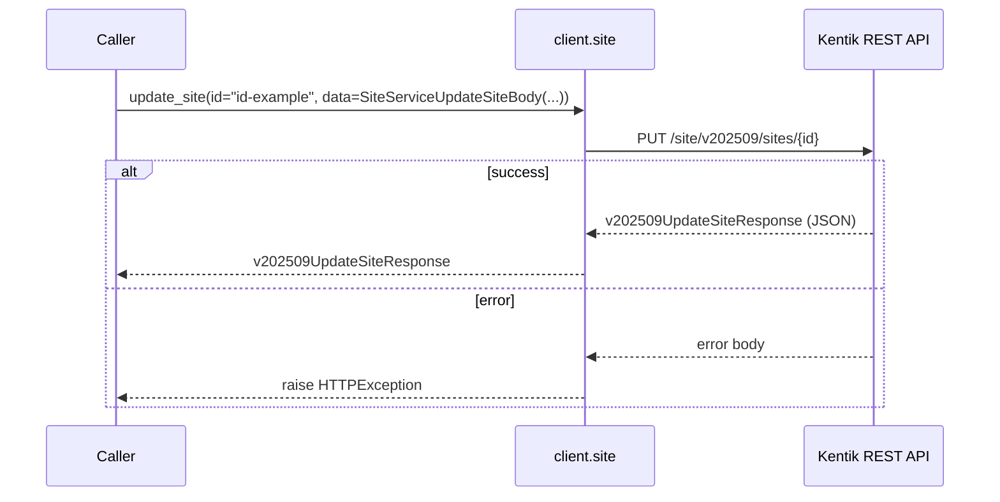
```mermaid
sequenceDiagram
    participant C as Caller
    participant W as client.site
    participant API as Kentik REST API

    C->>W: update_site(id="id-example", data=SiteServiceUpdateSiteBody(...))
    W->>API: PUT /site/v202509/sites/{id}
    alt success
        API-->>W: v202509UpdateSiteResponse (JSON)
        W-->>C: v202509UpdateSiteResponse
    else error
        API-->>W: error body
        W-->>C: raise HTTPException
    end
```

**gRPC transport**

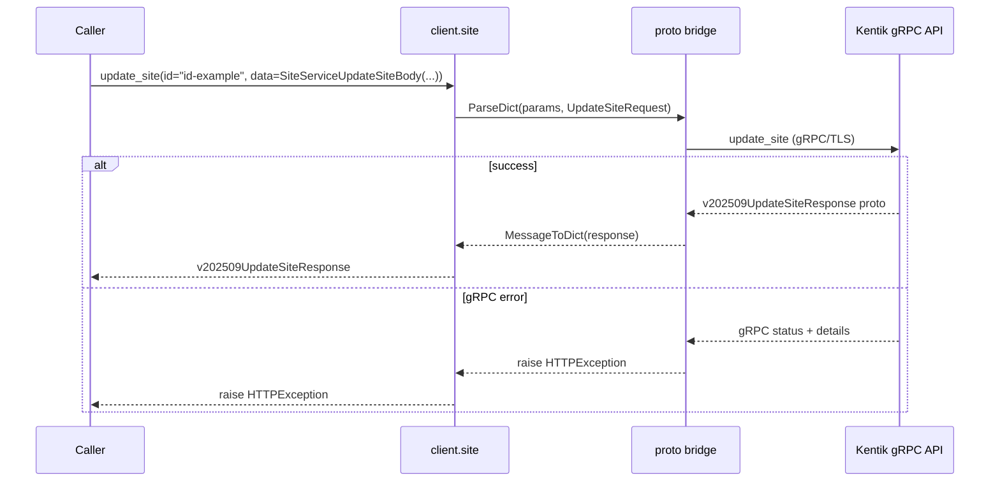
```mermaid
sequenceDiagram
    participant C as Caller
    participant W as client.site
    participant B as proto bridge
    participant API as Kentik gRPC API

    C->>W: update_site(id="id-example", data=SiteServiceUpdateSiteBody(...))
    W->>B: ParseDict(params, UpdateSiteRequest)
    B->>API: update_site (gRPC/TLS)
    alt success
        API-->>B: v202509UpdateSiteResponse proto
        B-->>W: MessageToDict(response)
        W-->>C: v202509UpdateSiteResponse
    else gRPC error
        API-->>B: gRPC status + details
        B-->>W: raise HTTPException
        W-->>C: raise HTTPException
    end
```

#### Parameters

| Name | In | Type | Required |
| --- | --- | --- | --- |
| `id` | path | `string` | Yes |
| `data` | body | `SiteServiceUpdateSiteBody` | Yes |

#### Responses

| Status | Description | Model |
| --- | --- | --- |
| 200 | A successful response. | `v202509UpdateSiteResponse` |
| default | An unexpected error response. | `rpcStatus` |

#### Example

```python
from kentik_api.client import KentikAPI

# Both transports work: protocol="rest" (default) or protocol="grpc".
client = KentikAPI(protocol="rest")  # loads KENTIK_EMAIL/KENTIK_API_TOKEN from .env
response = client.site.update_site(
    id="id-example",
    data=SiteServiceUpdateSiteBody(...),
)
```

---

### `DELETE` `/site/v202509/sites/{id}`

Delete configuration of a site.

Deletes configuration of a site with specific ID.

**REST transport**

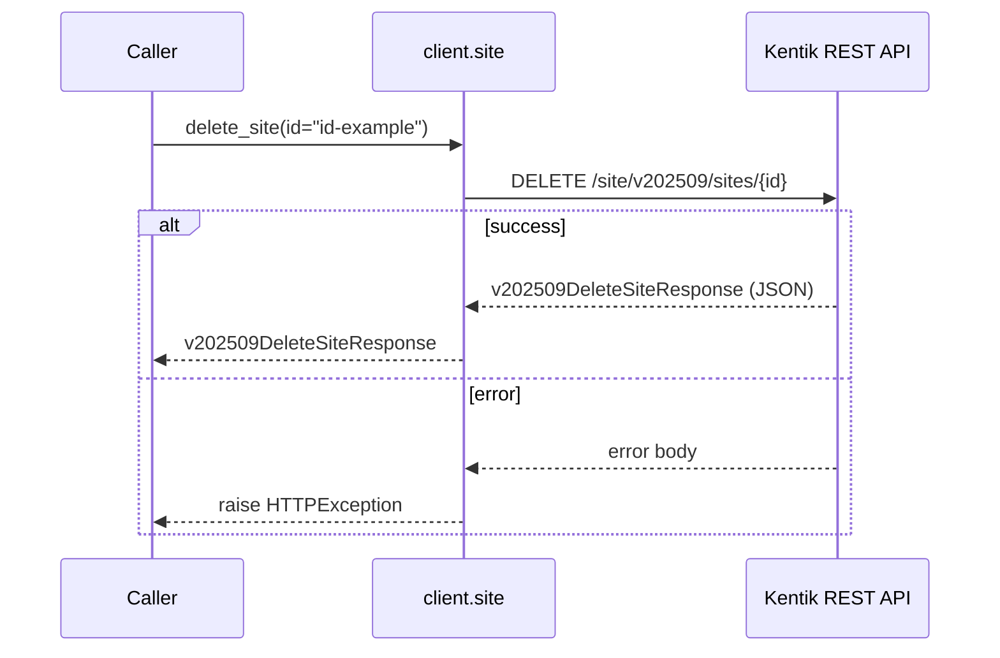
```mermaid
sequenceDiagram
    participant C as Caller
    participant W as client.site
    participant API as Kentik REST API

    C->>W: delete_site(id="id-example")
    W->>API: DELETE /site/v202509/sites/{id}
    alt success
        API-->>W: v202509DeleteSiteResponse (JSON)
        W-->>C: v202509DeleteSiteResponse
    else error
        API-->>W: error body
        W-->>C: raise HTTPException
    end
```

**gRPC transport**

```mermaid
sequenceDiagram
    participant C as Caller
    participant W as client.site
    participant B as proto bridge
    participant API as Kentik gRPC API

    C->>W: delete_site(id="id-example")
    W->>B: ParseDict(params, DeleteSiteRequest)
    B->>API: delete_site (gRPC/TLS)
    alt success
        API-->>B: v202509DeleteSiteResponse proto
        B-->>W: MessageToDict(response)
        W-->>C: v202509DeleteSiteResponse
    else gRPC error
        API-->>B: gRPC status + details
        B-->>W: raise HTTPException
        W-->>C: raise HTTPException
    end
```

#### Parameters

| Name | In | Type | Required |
| --- | --- | --- | --- |
| `id` | path | `string` | Yes |

#### Responses

| Status | Description | Model |
| --- | --- | --- |
| 200 | A successful response. | `v202509DeleteSiteResponse` |
| default | An unexpected error response. | `rpcStatus` |

#### Example

```python
from kentik_api.client import KentikAPI

# Both transports work: protocol="rest" (default) or protocol="grpc".
client = KentikAPI(protocol="rest")  # loads KENTIK_EMAIL/KENTIK_API_TOKEN from .env
response = client.site.delete_site(
    id="id-example",
)
```

## Data Models

<details>
<summary>Model relationships (4 of 24 models)</summary>

```mermaid
classDiagram
    class SiteServiceUpdateSiteBody
    class SiteServiceUpdateSiteMarketBody
    class protobufAny
    class rpcStatus
    rpcStatus --> protobufAny
```

</details>

```{eval-rst}
.. autopydantic_model:: kentik_api.gen.site.models.CreateSiteMarketRequest
```

```{eval-rst}
.. autopydantic_model:: kentik_api.gen.site.models.CreateSiteMarketResponse
```

```{eval-rst}
.. autopydantic_model:: kentik_api.gen.site.models.CreateSiteRequest
```

```{eval-rst}
.. autopydantic_model:: kentik_api.gen.site.models.CreateSiteResponse
```

```{eval-rst}
.. autopydantic_model:: kentik_api.gen.site.models.DeleteSiteMarketResponse
```

```{eval-rst}
.. autopydantic_model:: kentik_api.gen.site.models.DeleteSiteResponse
```

```{eval-rst}
.. autopydantic_model:: kentik_api.gen.site.models.GetSiteMarketResponse
```

```{eval-rst}
.. autopydantic_model:: kentik_api.gen.site.models.GetSiteResponse
```

```{eval-rst}
.. autopydantic_model:: kentik_api.gen.site.models.Layer
```

```{eval-rst}
.. autopydantic_model:: kentik_api.gen.site.models.LayerSet
```

```{eval-rst}
.. autopydantic_model:: kentik_api.gen.site.models.ListSiteMarketsResponse
```

```{eval-rst}
.. autopydantic_model:: kentik_api.gen.site.models.ListSitesResponse
```

```{eval-rst}
.. autopydantic_model:: kentik_api.gen.site.models.PeeringDBSiteMapping
```

```{eval-rst}
.. autopydantic_model:: kentik_api.gen.site.models.PostalAddress
```

```{eval-rst}
.. autopydantic_model:: kentik_api.gen.site.models.Site
```

```{eval-rst}
.. autopydantic_model:: kentik_api.gen.site.models.SiteIpAddressClassification
```

```{eval-rst}
.. autopydantic_model:: kentik_api.gen.site.models.SiteMarket
```

```{eval-rst}
.. autopydantic_model:: kentik_api.gen.site.models.SiteServiceUpdateSiteBody
```

```{eval-rst}
.. autopydantic_model:: kentik_api.gen.site.models.SiteServiceUpdateSiteMarketBody
```

```{eval-rst}
.. autoclass:: kentik_api.gen.site.models.SiteType
   :members:
```

```{eval-rst}
.. autopydantic_model:: kentik_api.gen.site.models.UpdateSiteMarketResponse
```

```{eval-rst}
.. autopydantic_model:: kentik_api.gen.site.models.UpdateSiteResponse
```

```{eval-rst}
.. autopydantic_model:: kentik_api.gen.site.models.protobufAny
```

```{eval-rst}
.. autopydantic_model:: kentik_api.gen.site.models.rpcStatus
```
