# Synthetics Service

## Overview

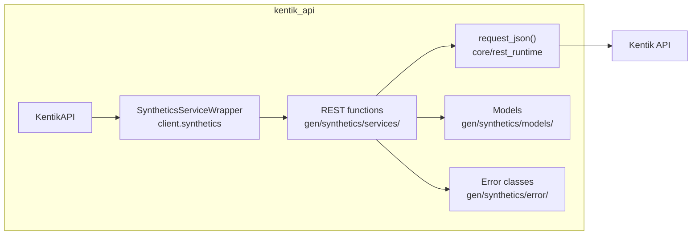
```mermaid
flowchart LR
    subgraph sdk["kentik_api"]
        KA["KentikAPI"]
        W["SyntheticsServiceWrapper\nclient.synthetics"]
        REST["REST functions\ngen/synthetics/services/"]
        RJ["request_json()\ncore/rest_runtime"]
        M["Models\ngen/synthetics/models/"]
        E["Error classes\ngen/synthetics/error/"]
    end
    API["Kentik API"]

    KA --> W
    W --> REST
    REST --> RJ
    REST --> M
    REST --> E
    RJ --> API
```

## Endpoints

### SyntheticsAdminService

#### `GET` `/synthetics/v202309/agentAlerts`

List agent alert configurations

Lists all agent alert configurations, optionally filtered by a list of agent ids.

**REST transport**

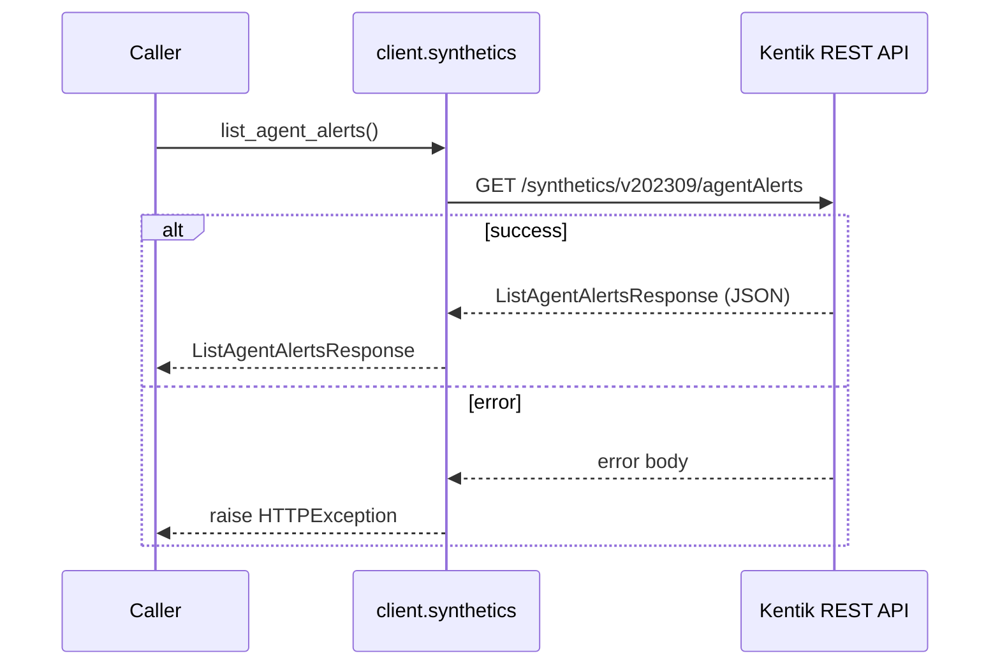
```mermaid
sequenceDiagram
    participant C as Caller
    participant W as client.synthetics
    participant API as Kentik REST API

    C->>W: list_agent_alerts()
    W->>API: GET /synthetics/v202309/agentAlerts
    alt success
        API-->>W: ListAgentAlertsResponse (JSON)
        W-->>C: ListAgentAlertsResponse
    else error
        API-->>W: error body
        W-->>C: raise HTTPException
    end
```

**gRPC transport**

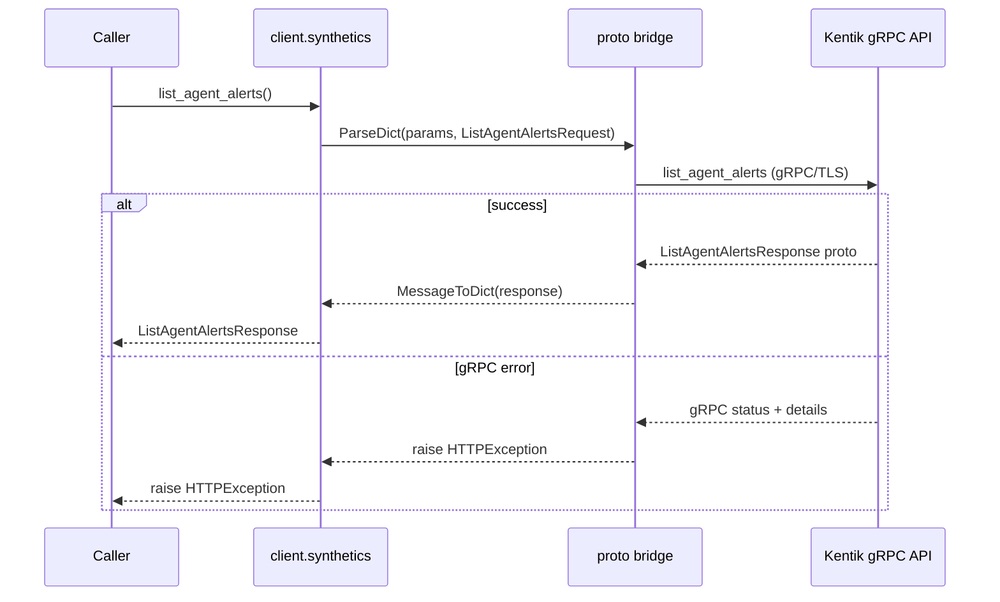
```mermaid
sequenceDiagram
    participant C as Caller
    participant W as client.synthetics
    participant B as proto bridge
    participant API as Kentik gRPC API

    C->>W: list_agent_alerts()
    W->>B: ParseDict(params, ListAgentAlertsRequest)
    B->>API: list_agent_alerts (gRPC/TLS)
    alt success
        API-->>B: ListAgentAlertsResponse proto
        B-->>W: MessageToDict(response)
        W-->>C: ListAgentAlertsResponse
    else gRPC error
        API-->>B: gRPC status + details
        B-->>W: raise HTTPException
        W-->>C: raise HTTPException
    end
```

##### Parameters

| Name | In | Type | Required |
| --- | --- | --- | --- |
| `agentIds` | query | `string[]` | No |

##### Responses

| Status | Description | Model |
| --- | --- | --- |
| 200 | A successful response. | `ListAgentAlertsResponse` |
| default | An unexpected error response. | `rpcStatus` |

##### Example

```python
from kentik_api.client import KentikAPI

# Both transports work: protocol="rest" (default) or protocol="grpc".
client = KentikAPI(protocol="rest")  # loads KENTIK_EMAIL/KENTIK_API_TOKEN from .env
response = client.synthetics.list_agent_alerts()
```

---

#### `POST` `/synthetics/v202309/agentAlerts`

Create an agent alert configuration

Creates a new agent alert configuration.

**REST transport**

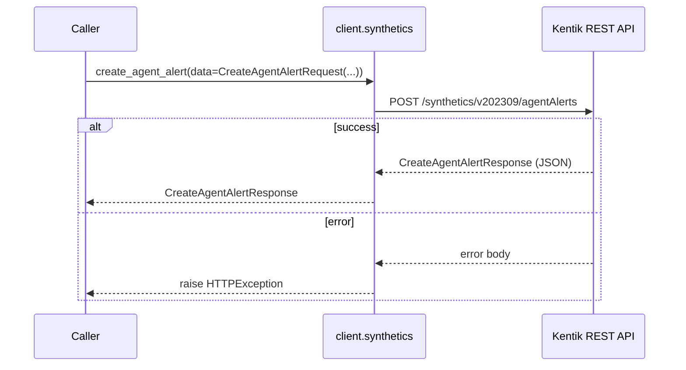
```mermaid
sequenceDiagram
    participant C as Caller
    participant W as client.synthetics
    participant API as Kentik REST API

    C->>W: create_agent_alert(data=CreateAgentAlertRequest(...))
    W->>API: POST /synthetics/v202309/agentAlerts
    alt success
        API-->>W: CreateAgentAlertResponse (JSON)
        W-->>C: CreateAgentAlertResponse
    else error
        API-->>W: error body
        W-->>C: raise HTTPException
    end
```

**gRPC transport**

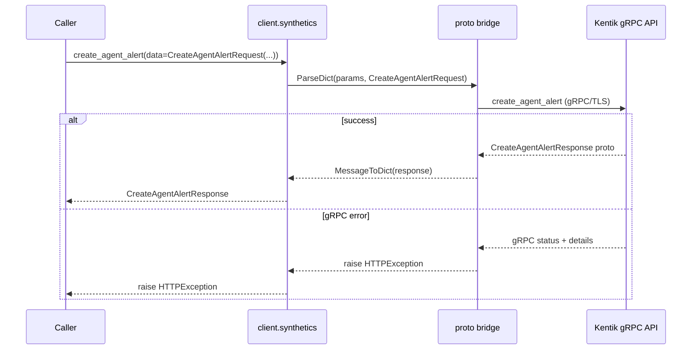
```mermaid
sequenceDiagram
    participant C as Caller
    participant W as client.synthetics
    participant B as proto bridge
    participant API as Kentik gRPC API

    C->>W: create_agent_alert(data=CreateAgentAlertRequest(...))
    W->>B: ParseDict(params, CreateAgentAlertRequest)
    B->>API: create_agent_alert (gRPC/TLS)
    alt success
        API-->>B: CreateAgentAlertResponse proto
        B-->>W: MessageToDict(response)
        W-->>C: CreateAgentAlertResponse
    else gRPC error
        API-->>B: gRPC status + details
        B-->>W: raise HTTPException
        W-->>C: raise HTTPException
    end
```

##### Parameters

| Name | In | Type | Required |
| --- | --- | --- | --- |
| `data` | body | `CreateAgentAlertRequest` | Yes |

##### Responses

| Status | Description | Model |
| --- | --- | --- |
| 200 | A successful response. | `CreateAgentAlertResponse` |
| default | An unexpected error response. | `rpcStatus` |

##### Example

```python
from kentik_api.client import KentikAPI

# Both transports work: protocol="rest" (default) or protocol="grpc".
client = KentikAPI(protocol="rest")  # loads KENTIK_EMAIL/KENTIK_API_TOKEN from .env
response = client.synthetics.create_agent_alert(
    data=CreateAgentAlertRequest(...),
)
```

---

#### `GET` `/synthetics/v202309/agentAlerts/{id}`

Get an agent alert configuration

Retrieves an existing agent alert configuration.

**REST transport**

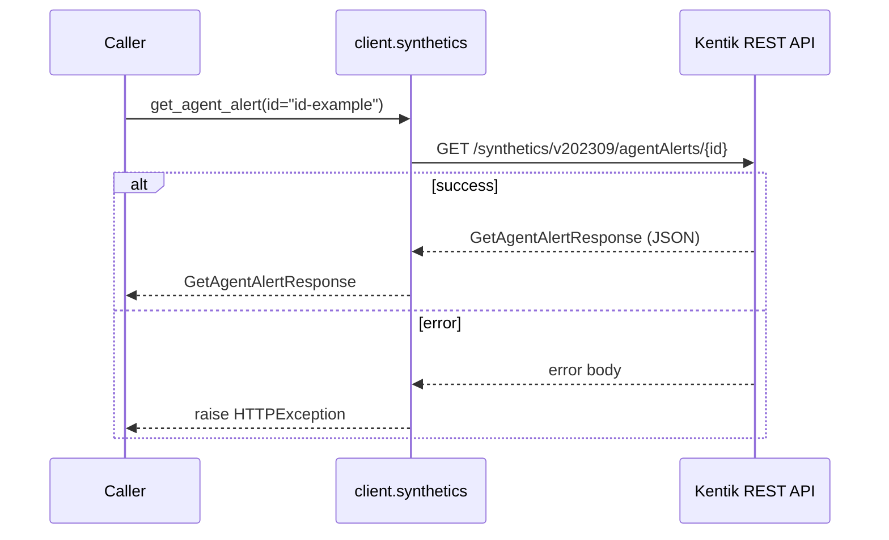
```mermaid
sequenceDiagram
    participant C as Caller
    participant W as client.synthetics
    participant API as Kentik REST API

    C->>W: get_agent_alert(id="id-example")
    W->>API: GET /synthetics/v202309/agentAlerts/{id}
    alt success
        API-->>W: GetAgentAlertResponse (JSON)
        W-->>C: GetAgentAlertResponse
    else error
        API-->>W: error body
        W-->>C: raise HTTPException
    end
```

**gRPC transport**

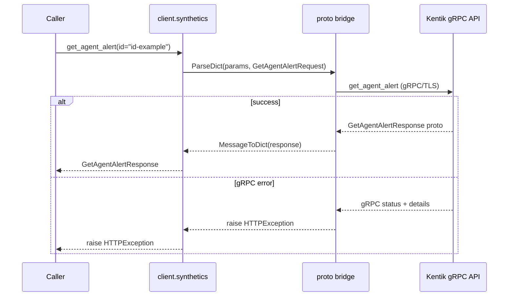
```mermaid
sequenceDiagram
    participant C as Caller
    participant W as client.synthetics
    participant B as proto bridge
    participant API as Kentik gRPC API

    C->>W: get_agent_alert(id="id-example")
    W->>B: ParseDict(params, GetAgentAlertRequest)
    B->>API: get_agent_alert (gRPC/TLS)
    alt success
        API-->>B: GetAgentAlertResponse proto
        B-->>W: MessageToDict(response)
        W-->>C: GetAgentAlertResponse
    else gRPC error
        API-->>B: gRPC status + details
        B-->>W: raise HTTPException
        W-->>C: raise HTTPException
    end
```

##### Parameters

| Name | In | Type | Required |
| --- | --- | --- | --- |
| `id` | path | `string` | Yes |

##### Responses

| Status | Description | Model |
| --- | --- | --- |
| 200 | A successful response. | `GetAgentAlertResponse` |
| default | An unexpected error response. | `rpcStatus` |

##### Example

```python
from kentik_api.client import KentikAPI

# Both transports work: protocol="rest" (default) or protocol="grpc".
client = KentikAPI(protocol="rest")  # loads KENTIK_EMAIL/KENTIK_API_TOKEN from .env
response = client.synthetics.get_agent_alert(
    id="id-example",
)
```

---

#### `PUT` `/synthetics/v202309/agentAlerts/{id}`

Update an agent alert configuration

Updates an existing agent alert configuration with the time threshold and notification channels provided.

**REST transport**

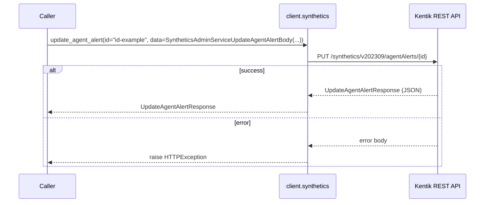
```mermaid
sequenceDiagram
    participant C as Caller
    participant W as client.synthetics
    participant API as Kentik REST API

    C->>W: update_agent_alert(id="id-example", data=SyntheticsAdminServiceUpdateAgentAlertBody(...))
    W->>API: PUT /synthetics/v202309/agentAlerts/{id}
    alt success
        API-->>W: UpdateAgentAlertResponse (JSON)
        W-->>C: UpdateAgentAlertResponse
    else error
        API-->>W: error body
        W-->>C: raise HTTPException
    end
```

**gRPC transport**

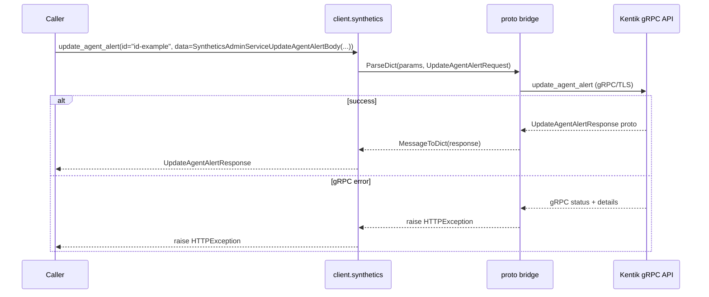
```mermaid
sequenceDiagram
    participant C as Caller
    participant W as client.synthetics
    participant B as proto bridge
    participant API as Kentik gRPC API

    C->>W: update_agent_alert(id="id-example", data=SyntheticsAdminServiceUpdateAgentAlertBody(...))
    W->>B: ParseDict(params, UpdateAgentAlertRequest)
    B->>API: update_agent_alert (gRPC/TLS)
    alt success
        API-->>B: UpdateAgentAlertResponse proto
        B-->>W: MessageToDict(response)
        W-->>C: UpdateAgentAlertResponse
    else gRPC error
        API-->>B: gRPC status + details
        B-->>W: raise HTTPException
        W-->>C: raise HTTPException
    end
```

##### Parameters

| Name | In | Type | Required |
| --- | --- | --- | --- |
| `id` | path | `string` | Yes |
| `data` | body | `SyntheticsAdminServiceUpdateAgentAlertBody` | Yes |

##### Responses

| Status | Description | Model |
| --- | --- | --- |
| 200 | A successful response. | `UpdateAgentAlertResponse` |
| default | An unexpected error response. | `rpcStatus` |

##### Example

```python
from kentik_api.client import KentikAPI

# Both transports work: protocol="rest" (default) or protocol="grpc".
client = KentikAPI(protocol="rest")  # loads KENTIK_EMAIL/KENTIK_API_TOKEN from .env
response = client.synthetics.update_agent_alert(
    id="id-example",
    data=SyntheticsAdminServiceUpdateAgentAlertBody(...),
)
```

---

#### `DELETE` `/synthetics/v202309/agentAlerts/{id}`

Delete an agent alert configuration

Deletes an existing agent alert configuration.

**REST transport**

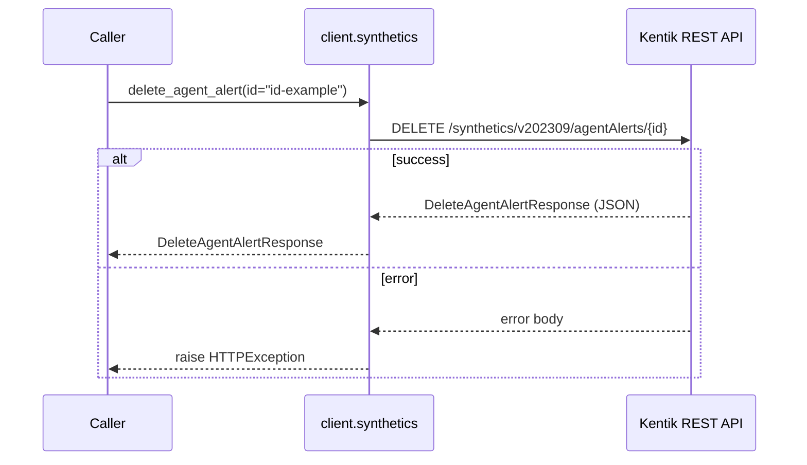
```mermaid
sequenceDiagram
    participant C as Caller
    participant W as client.synthetics
    participant API as Kentik REST API

    C->>W: delete_agent_alert(id="id-example")
    W->>API: DELETE /synthetics/v202309/agentAlerts/{id}
    alt success
        API-->>W: DeleteAgentAlertResponse (JSON)
        W-->>C: DeleteAgentAlertResponse
    else error
        API-->>W: error body
        W-->>C: raise HTTPException
    end
```

**gRPC transport**

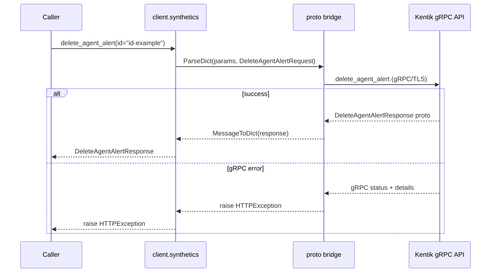
```mermaid
sequenceDiagram
    participant C as Caller
    participant W as client.synthetics
    participant B as proto bridge
    participant API as Kentik gRPC API

    C->>W: delete_agent_alert(id="id-example")
    W->>B: ParseDict(params, DeleteAgentAlertRequest)
    B->>API: delete_agent_alert (gRPC/TLS)
    alt success
        API-->>B: DeleteAgentAlertResponse proto
        B-->>W: MessageToDict(response)
        W-->>C: DeleteAgentAlertResponse
    else gRPC error
        API-->>B: gRPC status + details
        B-->>W: raise HTTPException
        W-->>C: raise HTTPException
    end
```

##### Parameters

| Name | In | Type | Required |
| --- | --- | --- | --- |
| `id` | path | `string` | Yes |

##### Responses

| Status | Description | Model |
| --- | --- | --- |
| 200 | A successful response. | `DeleteAgentAlertResponse` |
| default | An unexpected error response. | `rpcStatus` |

##### Example

```python
from kentik_api.client import KentikAPI

# Both transports work: protocol="rest" (default) or protocol="grpc".
client = KentikAPI(protocol="rest")  # loads KENTIK_EMAIL/KENTIK_API_TOKEN from .env
response = client.synthetics.delete_agent_alert(
    id="id-example",
)
```

---

#### `GET` `/synthetics/v202309/agents`

List available agents

Returns list of all synthetic agents available in the account.

**REST transport**

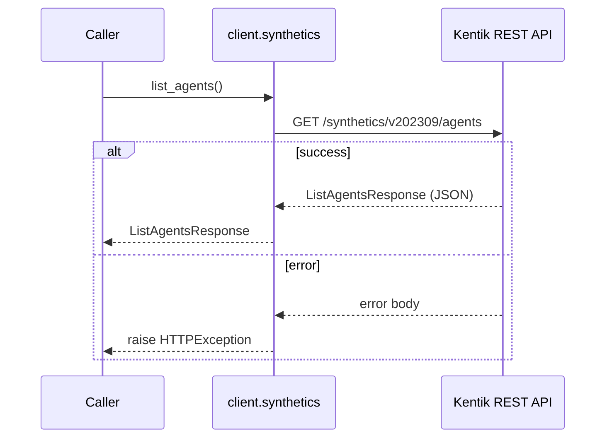
```mermaid
sequenceDiagram
    participant C as Caller
    participant W as client.synthetics
    participant API as Kentik REST API

    C->>W: list_agents()
    W->>API: GET /synthetics/v202309/agents
    alt success
        API-->>W: ListAgentsResponse (JSON)
        W-->>C: ListAgentsResponse
    else error
        API-->>W: error body
        W-->>C: raise HTTPException
    end
```

**gRPC transport**

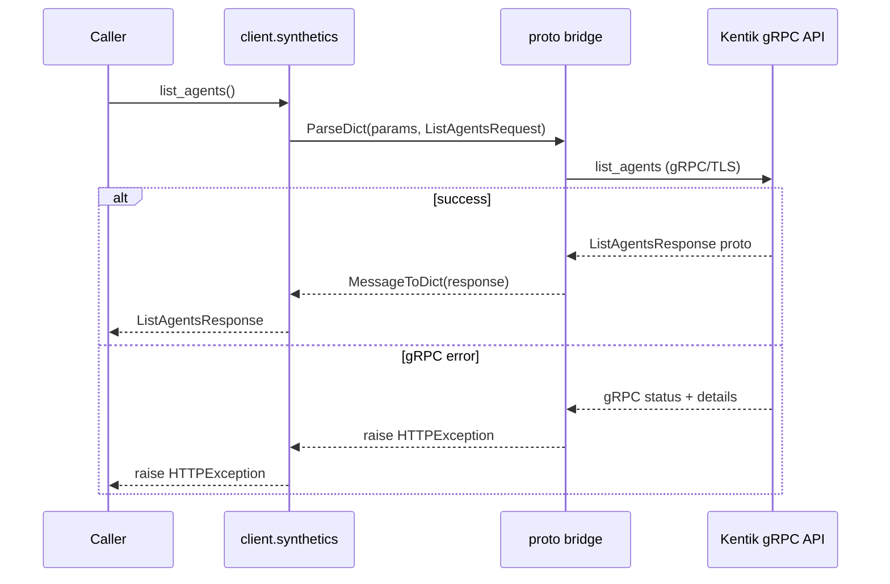
```mermaid
sequenceDiagram
    participant C as Caller
    participant W as client.synthetics
    participant B as proto bridge
    participant API as Kentik gRPC API

    C->>W: list_agents()
    W->>B: ParseDict(params, ListAgentsRequest)
    B->>API: list_agents (gRPC/TLS)
    alt success
        API-->>B: ListAgentsResponse proto
        B-->>W: MessageToDict(response)
        W-->>C: ListAgentsResponse
    else gRPC error
        API-->>B: gRPC status + details
        B-->>W: raise HTTPException
        W-->>C: raise HTTPException
    end
```

##### Responses

| Status | Description | Model |
| --- | --- | --- |
| 200 | A successful response. | `ListAgentsResponse` |
| default | An unexpected error response. | `rpcStatus` |

##### Example

```python
from kentik_api.client import KentikAPI

# Both transports work: protocol="rest" (default) or protocol="grpc".
client = KentikAPI(protocol="rest")  # loads KENTIK_EMAIL/KENTIK_API_TOKEN from .env
response = client.synthetics.list_agents()
```

---

#### `GET` `/synthetics/v202309/agents/{agent.id}`

Get information about an agent

Returns information about the requested synthetic agent.

**REST transport**

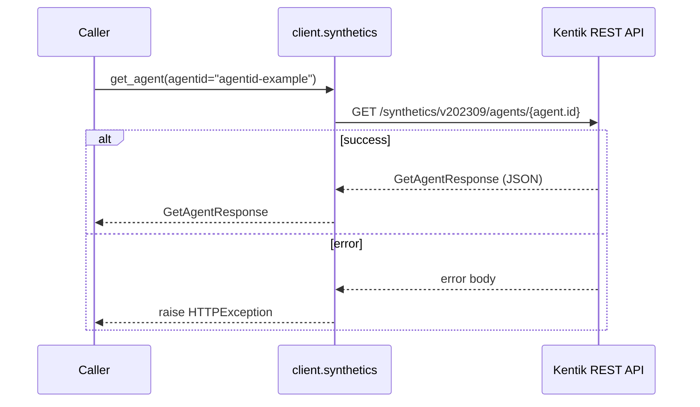
```mermaid
sequenceDiagram
    participant C as Caller
    participant W as client.synthetics
    participant API as Kentik REST API

    C->>W: get_agent(agentid="agentid-example")
    W->>API: GET /synthetics/v202309/agents/{agent.id}
    alt success
        API-->>W: GetAgentResponse (JSON)
        W-->>C: GetAgentResponse
    else error
        API-->>W: error body
        W-->>C: raise HTTPException
    end
```

**gRPC transport**

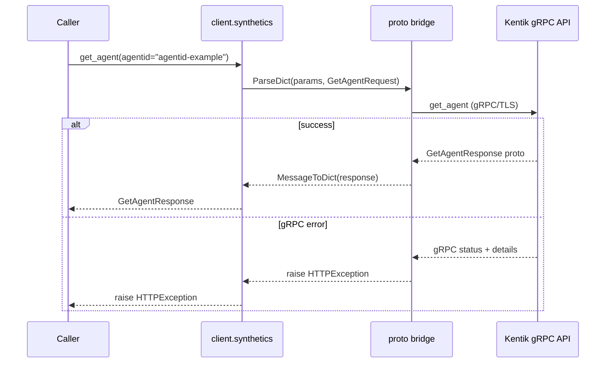
```mermaid
sequenceDiagram
    participant C as Caller
    participant W as client.synthetics
    participant B as proto bridge
    participant API as Kentik gRPC API

    C->>W: get_agent(agentid="agentid-example")
    W->>B: ParseDict(params, GetAgentRequest)
    B->>API: get_agent (gRPC/TLS)
    alt success
        API-->>B: GetAgentResponse proto
        B-->>W: MessageToDict(response)
        W-->>C: GetAgentResponse
    else gRPC error
        API-->>B: gRPC status + details
        B-->>W: raise HTTPException
        W-->>C: raise HTTPException
    end
```

##### Parameters

| Name | In | Type | Required |
| --- | --- | --- | --- |
| `agentid` | path | `string` | Yes |

##### Responses

| Status | Description | Model |
| --- | --- | --- |
| 200 | A successful response. | `GetAgentResponse` |
| default | An unexpected error response. | `rpcStatus` |

##### Example

```python
from kentik_api.client import KentikAPI

# Both transports work: protocol="rest" (default) or protocol="grpc".
client = KentikAPI(protocol="rest")  # loads KENTIK_EMAIL/KENTIK_API_TOKEN from .env
response = client.synthetics.get_agent(
    agentid="agentid-example",
)
```

---

#### `PUT` `/synthetics/v202309/agents/{agent.id}`

Update configuration of an agent

Update configuration of a synthetic agent.

**REST transport**

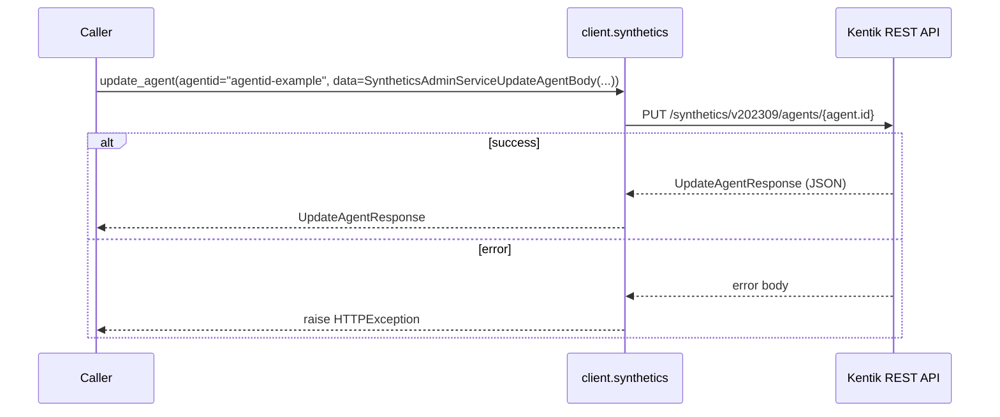
```mermaid
sequenceDiagram
    participant C as Caller
    participant W as client.synthetics
    participant API as Kentik REST API

    C->>W: update_agent(agentid="agentid-example", data=SyntheticsAdminServiceUpdateAgentBody(...))
    W->>API: PUT /synthetics/v202309/agents/{agent.id}
    alt success
        API-->>W: UpdateAgentResponse (JSON)
        W-->>C: UpdateAgentResponse
    else error
        API-->>W: error body
        W-->>C: raise HTTPException
    end
```

**gRPC transport**

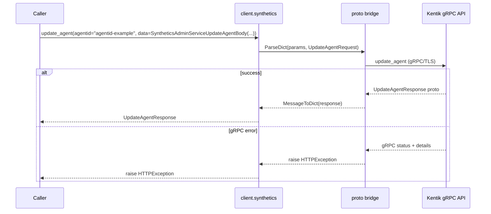
```mermaid
sequenceDiagram
    participant C as Caller
    participant W as client.synthetics
    participant B as proto bridge
    participant API as Kentik gRPC API

    C->>W: update_agent(agentid="agentid-example", data=SyntheticsAdminServiceUpdateAgentBody(...))
    W->>B: ParseDict(params, UpdateAgentRequest)
    B->>API: update_agent (gRPC/TLS)
    alt success
        API-->>B: UpdateAgentResponse proto
        B-->>W: MessageToDict(response)
        W-->>C: UpdateAgentResponse
    else gRPC error
        API-->>B: gRPC status + details
        B-->>W: raise HTTPException
        W-->>C: raise HTTPException
    end
```

##### Parameters

| Name | In | Type | Required |
| --- | --- | --- | --- |
| `agentid` | path | `string` | Yes |
| `data` | body | `SyntheticsAdminServiceUpdateAgentBody` | Yes |

##### Responses

| Status | Description | Model |
| --- | --- | --- |
| 200 | A successful response. | `UpdateAgentResponse` |
| default | An unexpected error response. | `rpcStatus` |

##### Example

```python
from kentik_api.client import KentikAPI

# Both transports work: protocol="rest" (default) or protocol="grpc".
client = KentikAPI(protocol="rest")  # loads KENTIK_EMAIL/KENTIK_API_TOKEN from .env
response = client.synthetics.update_agent(
    agentid="agentid-example",
    data=SyntheticsAdminServiceUpdateAgentBody(...),
)
```

---

#### `DELETE` `/synthetics/v202309/agents/{agent.id}`

Delete an agent

Deletes the requested agent. The deleted agent is removed from configuration of all tests.

**REST transport**

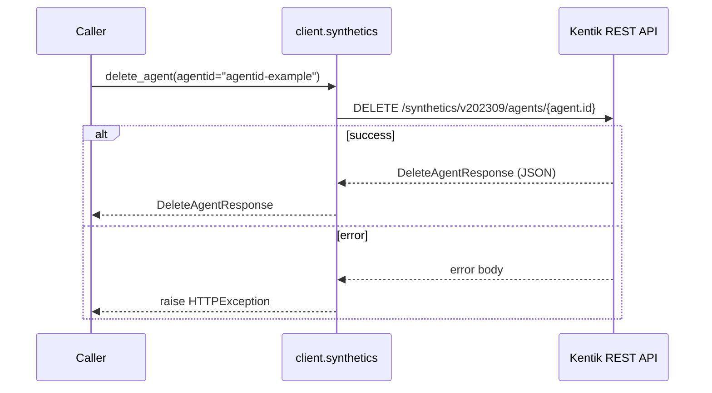
```mermaid
sequenceDiagram
    participant C as Caller
    participant W as client.synthetics
    participant API as Kentik REST API

    C->>W: delete_agent(agentid="agentid-example")
    W->>API: DELETE /synthetics/v202309/agents/{agent.id}
    alt success
        API-->>W: DeleteAgentResponse (JSON)
        W-->>C: DeleteAgentResponse
    else error
        API-->>W: error body
        W-->>C: raise HTTPException
    end
```

**gRPC transport**

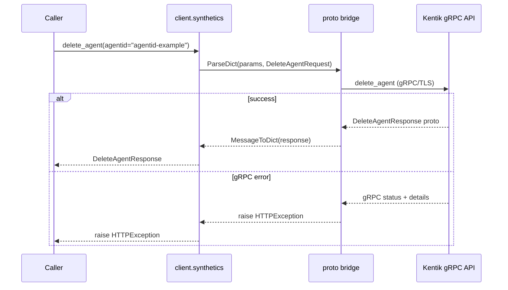
```mermaid
sequenceDiagram
    participant C as Caller
    participant W as client.synthetics
    participant B as proto bridge
    participant API as Kentik gRPC API

    C->>W: delete_agent(agentid="agentid-example")
    W->>B: ParseDict(params, DeleteAgentRequest)
    B->>API: delete_agent (gRPC/TLS)
    alt success
        API-->>B: DeleteAgentResponse proto
        B-->>W: MessageToDict(response)
        W-->>C: DeleteAgentResponse
    else gRPC error
        API-->>B: gRPC status + details
        B-->>W: raise HTTPException
        W-->>C: raise HTTPException
    end
```

##### Parameters

| Name | In | Type | Required |
| --- | --- | --- | --- |
| `agentid` | path | `string` | Yes |

##### Responses

| Status | Description | Model |
| --- | --- | --- |
| 200 | A successful response. | `DeleteAgentResponse` |
| default | An unexpected error response. | `rpcStatus` |

##### Example

```python
from kentik_api.client import KentikAPI

# Both transports work: protocol="rest" (default) or protocol="grpc".
client = KentikAPI(protocol="rest")  # loads KENTIK_EMAIL/KENTIK_API_TOKEN from .env
response = client.synthetics.delete_agent(
    agentid="agentid-example",
)
```

---

#### `GET` `/synthetics/v202309/tests`

List all tests

Returns a list of all configured active and paused synthetic tests.

**REST transport**

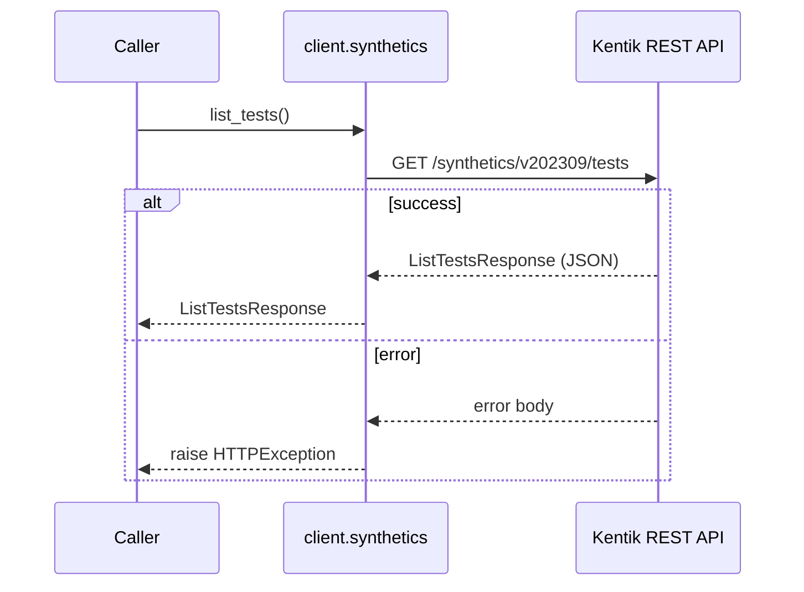
```mermaid
sequenceDiagram
    participant C as Caller
    participant W as client.synthetics
    participant API as Kentik REST API

    C->>W: list_tests()
    W->>API: GET /synthetics/v202309/tests
    alt success
        API-->>W: ListTestsResponse (JSON)
        W-->>C: ListTestsResponse
    else error
        API-->>W: error body
        W-->>C: raise HTTPException
    end
```

**gRPC transport**

```mermaid
sequenceDiagram
    participant C as Caller
    participant W as client.synthetics
    participant B as proto bridge
    participant API as Kentik gRPC API

    C->>W: list_tests()
    W->>B: ParseDict(params, ListTestsRequest)
    B->>API: list_tests (gRPC/TLS)
    alt success
        API-->>B: ListTestsResponse proto
        B-->>W: MessageToDict(response)
        W-->>C: ListTestsResponse
    else gRPC error
        API-->>B: gRPC status + details
        B-->>W: raise HTTPException
        W-->>C: raise HTTPException
    end
```

##### Responses

| Status | Description | Model |
| --- | --- | --- |
| 200 | A successful response. | `ListTestsResponse` |
| default | An unexpected error response. | `rpcStatus` |

##### Example

```python
from kentik_api.client import KentikAPI

# Both transports work: protocol="rest" (default) or protocol="grpc".
client = KentikAPI(protocol="rest")  # loads KENTIK_EMAIL/KENTIK_API_TOKEN from .env
response = client.synthetics.list_tests()
```

---

#### `POST` `/synthetics/v202309/tests`

Create a test

Create synthetic test based on configuration provided in the request.

**REST transport**

```mermaid
sequenceDiagram
    participant C as Caller
    participant W as client.synthetics
    participant API as Kentik REST API

    C->>W: create_test(data=CreateTestRequest(...))
    W->>API: POST /synthetics/v202309/tests
    alt success
        API-->>W: CreateTestResponse (JSON)
        W-->>C: CreateTestResponse
    else error
        API-->>W: error body
        W-->>C: raise HTTPException
    end
```

**gRPC transport**

```mermaid
sequenceDiagram
    participant C as Caller
    participant W as client.synthetics
    participant B as proto bridge
    participant API as Kentik gRPC API

    C->>W: create_test(data=CreateTestRequest(...))
    W->>B: ParseDict(params, CreateTestRequest)
    B->>API: create_test (gRPC/TLS)
    alt success
        API-->>B: CreateTestResponse proto
        B-->>W: MessageToDict(response)
        W-->>C: CreateTestResponse
    else gRPC error
        API-->>B: gRPC status + details
        B-->>W: raise HTTPException
        W-->>C: raise HTTPException
    end
```

##### Parameters

| Name | In | Type | Required |
| --- | --- | --- | --- |
| `data` | body | `CreateTestRequest` | Yes |

##### Responses

| Status | Description | Model |
| --- | --- | --- |
| 200 | A successful response. | `CreateTestResponse` |
| default | An unexpected error response. | `rpcStatus` |

##### Example

```python
from kentik_api.client import KentikAPI

# Both transports work: protocol="rest" (default) or protocol="grpc".
client = KentikAPI(protocol="rest")  # loads KENTIK_EMAIL/KENTIK_API_TOKEN from .env
response = client.synthetics.create_test(
    data=CreateTestRequest(...),
)
```

---

#### `GET` `/synthetics/v202309/tests/{id}`

Get information about a test

Returns configuration and status for the requested synthetic test.

**REST transport**

```mermaid
sequenceDiagram
    participant C as Caller
    participant W as client.synthetics
    participant API as Kentik REST API

    C->>W: get_test(id="id-example")
    W->>API: GET /synthetics/v202309/tests/{id}
    alt success
        API-->>W: GetTestResponse (JSON)
        W-->>C: GetTestResponse
    else error
        API-->>W: error body
        W-->>C: raise HTTPException
    end
```

**gRPC transport**

```mermaid
sequenceDiagram
    participant C as Caller
    participant W as client.synthetics
    participant B as proto bridge
    participant API as Kentik gRPC API

    C->>W: get_test(id="id-example")
    W->>B: ParseDict(params, GetTestRequest)
    B->>API: get_test (gRPC/TLS)
    alt success
        API-->>B: GetTestResponse proto
        B-->>W: MessageToDict(response)
        W-->>C: GetTestResponse
    else gRPC error
        API-->>B: gRPC status + details
        B-->>W: raise HTTPException
        W-->>C: raise HTTPException
    end
```

##### Parameters

| Name | In | Type | Required |
| --- | --- | --- | --- |
| `id` | path | `string` | Yes |

##### Responses

| Status | Description | Model |
| --- | --- | --- |
| 200 | A successful response. | `GetTestResponse` |
| default | An unexpected error response. | `rpcStatus` |

##### Example

```python
from kentik_api.client import KentikAPI

# Both transports work: protocol="rest" (default) or protocol="grpc".
client = KentikAPI(protocol="rest")  # loads KENTIK_EMAIL/KENTIK_API_TOKEN from .env
response = client.synthetics.get_test(
    id="id-example",
)
```

---

#### `PUT` `/synthetics/v202309/tests/{id}`

Update configuration of a test

Updates configuration of a synthetic test.

**REST transport**

```mermaid
sequenceDiagram
    participant C as Caller
    participant W as client.synthetics
    participant API as Kentik REST API

    C->>W: update_test(id="id-example", data=SyntheticsAdminServiceUpdateTestBody(...))
    W->>API: PUT /synthetics/v202309/tests/{id}
    alt success
        API-->>W: UpdateTestResponse (JSON)
        W-->>C: UpdateTestResponse
    else error
        API-->>W: error body
        W-->>C: raise HTTPException
    end
```

**gRPC transport**

```mermaid
sequenceDiagram
    participant C as Caller
    participant W as client.synthetics
    participant B as proto bridge
    participant API as Kentik gRPC API

    C->>W: update_test(id="id-example", data=SyntheticsAdminServiceUpdateTestBody(...))
    W->>B: ParseDict(params, UpdateTestRequest)
    B->>API: update_test (gRPC/TLS)
    alt success
        API-->>B: UpdateTestResponse proto
        B-->>W: MessageToDict(response)
        W-->>C: UpdateTestResponse
    else gRPC error
        API-->>B: gRPC status + details
        B-->>W: raise HTTPException
        W-->>C: raise HTTPException
    end
```

##### Parameters

| Name | In | Type | Required |
| --- | --- | --- | --- |
| `id` | path | `string` | Yes |
| `data` | body | `SyntheticsAdminServiceUpdateTestBody` | Yes |

##### Responses

| Status | Description | Model |
| --- | --- | --- |
| 200 | A successful response. | `UpdateTestResponse` |
| default | An unexpected error response. | `rpcStatus` |

##### Example

```python
from kentik_api.client import KentikAPI

# Both transports work: protocol="rest" (default) or protocol="grpc".
client = KentikAPI(protocol="rest")  # loads KENTIK_EMAIL/KENTIK_API_TOKEN from .env
response = client.synthetics.update_test(
    id="id-example",
    data=SyntheticsAdminServiceUpdateTestBody(...),
)
```

---

#### `DELETE` `/synthetics/v202309/tests/{id}`

Delete a synthetic test.

Deletes the synthetics test. All accumulated results for the test cease to be accessible.

**REST transport**

```mermaid
sequenceDiagram
    participant C as Caller
    participant W as client.synthetics
    participant API as Kentik REST API

    C->>W: delete_test(id="id-example")
    W->>API: DELETE /synthetics/v202309/tests/{id}
    alt success
        API-->>W: DeleteTestResponse (JSON)
        W-->>C: DeleteTestResponse
    else error
        API-->>W: error body
        W-->>C: raise HTTPException
    end
```

**gRPC transport**

```mermaid
sequenceDiagram
    participant C as Caller
    participant W as client.synthetics
    participant B as proto bridge
    participant API as Kentik gRPC API

    C->>W: delete_test(id="id-example")
    W->>B: ParseDict(params, DeleteTestRequest)
    B->>API: delete_test (gRPC/TLS)
    alt success
        API-->>B: DeleteTestResponse proto
        B-->>W: MessageToDict(response)
        W-->>C: DeleteTestResponse
    else gRPC error
        API-->>B: gRPC status + details
        B-->>W: raise HTTPException
        W-->>C: raise HTTPException
    end
```

##### Parameters

| Name | In | Type | Required |
| --- | --- | --- | --- |
| `id` | path | `string` | Yes |

##### Responses

| Status | Description | Model |
| --- | --- | --- |
| 200 | A successful response. | `DeleteTestResponse` |
| default | An unexpected error response. | `rpcStatus` |

##### Example

```python
from kentik_api.client import KentikAPI

# Both transports work: protocol="rest" (default) or protocol="grpc".
client = KentikAPI(protocol="rest")  # loads KENTIK_EMAIL/KENTIK_API_TOKEN from .env
response = client.synthetics.delete_test(
    id="id-example",
)
```

---

#### `PUT` `/synthetics/v202309/tests/{id}/status`

Update status of a synthetic test

**REST transport**

```mermaid
sequenceDiagram
    participant C as Caller
    participant W as client.synthetics
    participant API as Kentik REST API

    C->>W: set_test_status(id="id-example", data=SyntheticsAdminServiceSetTestStatusBody(...))
    W->>API: PUT /synthetics/v202309/tests/{id}/status
    alt success
        API-->>W: SetTestStatusResponse (JSON)
        W-->>C: SetTestStatusResponse
    else error
        API-->>W: error body
        W-->>C: raise HTTPException
    end
```

**gRPC transport**

```mermaid
sequenceDiagram
    participant C as Caller
    participant W as client.synthetics
    participant B as proto bridge
    participant API as Kentik gRPC API

    C->>W: set_test_status(id="id-example", data=SyntheticsAdminServiceSetTestStatusBody(...))
    W->>B: ParseDict(params, SetTestStatusRequest)
    B->>API: set_test_status (gRPC/TLS)
    alt success
        API-->>B: SetTestStatusResponse proto
        B-->>W: MessageToDict(response)
        W-->>C: SetTestStatusResponse
    else gRPC error
        API-->>B: gRPC status + details
        B-->>W: raise HTTPException
        W-->>C: raise HTTPException
    end
```

##### Parameters

| Name | In | Type | Required |
| --- | --- | --- | --- |
| `id` | path | `string` | Yes |
| `data` | body | `SyntheticsAdminServiceSetTestStatusBody` | Yes |

##### Responses

| Status | Description | Model |
| --- | --- | --- |
| 200 | A successful response. | `SetTestStatusResponse` |
| default | An unexpected error response. | `rpcStatus` |

##### Example

```python
from kentik_api.client import KentikAPI

# Both transports work: protocol="rest" (default) or protocol="grpc".
client = KentikAPI(protocol="rest")  # loads KENTIK_EMAIL/KENTIK_API_TOKEN from .env
response = client.synthetics.set_test_status(
    id="id-example",
    data=SyntheticsAdminServiceSetTestStatusBody(...),
)
```

### SyntheticsDataService

#### `POST` `/synthetics/v202309/results`

Get results for tests

Returns probe results for a set of tests for specified period of time.

**REST transport**

```mermaid
sequenceDiagram
    participant C as Caller
    participant W as client.synthetics
    participant API as Kentik REST API

    C->>W: get_results_for_tests(data=GetResultsForTestsRequest(...))
    W->>API: POST /synthetics/v202309/results
    alt success
        API-->>W: GetResultsForTestsResponse (JSON)
        W-->>C: GetResultsForTestsResponse
    else error
        API-->>W: error body
        W-->>C: raise HTTPException
    end
```

**gRPC transport**

```mermaid
sequenceDiagram
    participant C as Caller
    participant W as client.synthetics
    participant B as proto bridge
    participant API as Kentik gRPC API

    C->>W: get_results_for_tests(data=GetResultsForTestsRequest(...))
    W->>B: ParseDict(params, GetResultsForTestsRequest)
    B->>API: get_results_for_tests (gRPC/TLS)
    alt success
        API-->>B: GetResultsForTestsResponse proto
        B-->>W: MessageToDict(response)
        W-->>C: GetResultsForTestsResponse
    else gRPC error
        API-->>B: gRPC status + details
        B-->>W: raise HTTPException
        W-->>C: raise HTTPException
    end
```

##### Parameters

| Name | In | Type | Required |
| --- | --- | --- | --- |
| `data` | body | `GetResultsForTestsRequest` | Yes |

##### Responses

| Status | Description | Model |
| --- | --- | --- |
| 200 | A successful response. | `GetResultsForTestsResponse` |
| default | An unexpected error response. | `rpcStatus` |

##### Example

```python
from kentik_api.client import KentikAPI

# Both transports work: protocol="rest" (default) or protocol="grpc".
client = KentikAPI(protocol="rest")  # loads KENTIK_EMAIL/KENTIK_API_TOKEN from .env
response = client.synthetics.get_results_for_tests(
    data=GetResultsForTestsRequest(...),
)
```

---

#### `POST` `/synthetics/v202309/results/csv`

Get test results in CSV format

Returns probe results for tests in CSV format.

**REST transport**

```mermaid
sequenceDiagram
    participant C as Caller
    participant W as client.synthetics
    participant API as Kentik REST API

    C->>W: get_results_for_tests_csv(data=GetResultsForTestsCsvRequest(...))
    W->>API: POST /synthetics/v202309/results/csv
    alt success
        API-->>W: GetResultsForTestsCsvResponse (JSON)
        W-->>C: GetResultsForTestsCsvResponse
    else error
        API-->>W: error body
        W-->>C: raise HTTPException
    end
```

**gRPC transport**

```mermaid
sequenceDiagram
    participant C as Caller
    participant W as client.synthetics
    participant B as proto bridge
    participant API as Kentik gRPC API

    C->>W: get_results_for_tests_csv(data=GetResultsForTestsCsvRequest(...))
    W->>B: ParseDict(params, GetResultsForTestsCsvRequest)
    B->>API: get_results_for_tests_csv (gRPC/TLS)
    alt success
        API-->>B: GetResultsForTestsCsvResponse proto
        B-->>W: MessageToDict(response)
        W-->>C: GetResultsForTestsCsvResponse
    else gRPC error
        API-->>B: gRPC status + details
        B-->>W: raise HTTPException
        W-->>C: raise HTTPException
    end
```

##### Parameters

| Name | In | Type | Required |
| --- | --- | --- | --- |
| `data` | body | `GetResultsForTestsCsvRequest` | Yes |

##### Responses

| Status | Description | Model |
| --- | --- | --- |
| 200 | A successful response. | `GetResultsForTestsCsvResponse` |
| default | An unexpected error response. | `rpcStatus` |

##### Example

```python
from kentik_api.client import KentikAPI

# Both transports work: protocol="rest" (default) or protocol="grpc".
client = KentikAPI(protocol="rest")  # loads KENTIK_EMAIL/KENTIK_API_TOKEN from .env
response = client.synthetics.get_results_for_tests_csv(
    data=GetResultsForTestsCsvRequest(...),
)
```

---

#### `POST` `/synthetics/v202309/trace`

Get network trace data for a test

Get network trace data for a specific synthetic test. The test must have traceroute task configured.

**REST transport**

```mermaid
sequenceDiagram
    participant C as Caller
    participant W as client.synthetics
    participant API as Kentik REST API

    C->>W: get_trace_for_test(data=GetTraceForTestRequest(...))
    W->>API: POST /synthetics/v202309/trace
    alt success
        API-->>W: GetTraceForTestResponse (JSON)
        W-->>C: GetTraceForTestResponse
    else error
        API-->>W: error body
        W-->>C: raise HTTPException
    end
```

**gRPC transport**

```mermaid
sequenceDiagram
    participant C as Caller
    participant W as client.synthetics
    participant B as proto bridge
    participant API as Kentik gRPC API

    C->>W: get_trace_for_test(data=GetTraceForTestRequest(...))
    W->>B: ParseDict(params, GetTraceForTestRequest)
    B->>API: get_trace_for_test (gRPC/TLS)
    alt success
        API-->>B: GetTraceForTestResponse proto
        B-->>W: MessageToDict(response)
        W-->>C: GetTraceForTestResponse
    else gRPC error
        API-->>B: gRPC status + details
        B-->>W: raise HTTPException
        W-->>C: raise HTTPException
    end
```

##### Parameters

| Name | In | Type | Required |
| --- | --- | --- | --- |
| `data` | body | `GetTraceForTestRequest` | Yes |

##### Responses

| Status | Description | Model |
| --- | --- | --- |
| 200 | A successful response. | `GetTraceForTestResponse` |
| default | An unexpected error response. | `rpcStatus` |

##### Example

```python
from kentik_api.client import KentikAPI

# Both transports work: protocol="rest" (default) or protocol="grpc".
client = KentikAPI(protocol="rest")  # loads KENTIK_EMAIL/KENTIK_API_TOKEN from .env
response = client.synthetics.get_trace_for_test(
    data=GetTraceForTestRequest(...),
)
```

## Data Models

<details>
<summary>Model relationships (30 of 77 models)</summary>

```mermaid
classDiagram
    class Agent
    class AgentAlert
    class CreateAgentAlertRequest
    class CreateAgentAlertResponse
    class CreateTestRequest
    class CreateTestResponse
    class DeleteAgentAlertResponse
    class DeleteAgentResponse
    class DeleteTestResponse
    class GetAgentAlertResponse
    class GetAgentResponse
    class GetResultsForTestsCsvRequest
    class GetResultsForTestsCsvResponse
    class GetResultsForTestsRequest
    class GetResultsForTestsResponse
    class GetTestResponse
    class GetTraceForTestRequest
    class GetTraceForTestResponse
    class ListAgentAlertsResponse
    class ListAgentsResponse
    class ListTestsResponse
    class Path
    class SetTestStatusResponse
    class SyntheticsAdminServiceSetTestStatusBody
    class SyntheticsAdminServiceUpdateAgentAlertBody
    class SyntheticsAdminServiceUpdateAgentBody
    class SyntheticsAdminServiceUpdateTestBody
    class Test
    class TestResults
    class TestStatus
    CreateAgentAlertResponse --> AgentAlert
    CreateTestRequest --> Test
    CreateTestResponse --> Test
    GetAgentAlertResponse --> AgentAlert
    GetAgentResponse --> Agent
    GetResultsForTestsResponse --> TestResults
    GetTestResponse --> Test
    GetTraceForTestResponse --> Path
    ListAgentAlertsResponse --> AgentAlert
    ListAgentsResponse --> Agent
    ListTestsResponse --> Test
    SyntheticsAdminServiceSetTestStatusBody --> TestStatus
    Test --> TestStatus
```

</details>

```{eval-rst}
.. autopydantic_model:: kentik_api.gen.synthetics.models.ActivationSettings
```

```{eval-rst}
.. autopydantic_model:: kentik_api.gen.synthetics.models.Agent
```

```{eval-rst}
.. autopydantic_model:: kentik_api.gen.synthetics.models.AgentAlert
```

```{eval-rst}
.. autopydantic_model:: kentik_api.gen.synthetics.models.AgentMetadata
```

```{eval-rst}
.. autopydantic_model:: kentik_api.gen.synthetics.models.AgentMetadataIpValue
```

```{eval-rst}
.. autopydantic_model:: kentik_api.gen.synthetics.models.AgentResults
```

```{eval-rst}
.. autoclass:: kentik_api.gen.synthetics.models.AgentStatus
   :members:
```

```{eval-rst}
.. autopydantic_model:: kentik_api.gen.synthetics.models.AgentTest
```

```{eval-rst}
.. autopydantic_model:: kentik_api.gen.synthetics.models.AlertingSettings
```

```{eval-rst}
.. autoclass:: kentik_api.gen.synthetics.models.AlertingType
   :members:
```

```{eval-rst}
.. autopydantic_model:: kentik_api.gen.synthetics.models.CreateAgentAlertRequest
```

```{eval-rst}
.. autopydantic_model:: kentik_api.gen.synthetics.models.CreateAgentAlertResponse
```

```{eval-rst}
.. autopydantic_model:: kentik_api.gen.synthetics.models.CreateTestRequest
```

```{eval-rst}
.. autopydantic_model:: kentik_api.gen.synthetics.models.CreateTestResponse
```

```{eval-rst}
.. autoclass:: kentik_api.gen.synthetics.models.DNSRecord
   :members:
```

```{eval-rst}
.. autopydantic_model:: kentik_api.gen.synthetics.models.DNSResponseData
```

```{eval-rst}
.. autopydantic_model:: kentik_api.gen.synthetics.models.DNSResults
```

```{eval-rst}
.. autopydantic_model:: kentik_api.gen.synthetics.models.DeleteAgentAlertResponse
```

```{eval-rst}
.. autopydantic_model:: kentik_api.gen.synthetics.models.DeleteAgentResponse
```

```{eval-rst}
.. autopydantic_model:: kentik_api.gen.synthetics.models.DeleteTestResponse
```

```{eval-rst}
.. autopydantic_model:: kentik_api.gen.synthetics.models.DisabledMetrics
```

```{eval-rst}
.. autopydantic_model:: kentik_api.gen.synthetics.models.DnsTest
```

```{eval-rst}
.. autopydantic_model:: kentik_api.gen.synthetics.models.FlowTest
```

```{eval-rst}
.. autopydantic_model:: kentik_api.gen.synthetics.models.GetAgentAlertResponse
```

```{eval-rst}
.. autopydantic_model:: kentik_api.gen.synthetics.models.GetAgentResponse
```

```{eval-rst}
.. autopydantic_model:: kentik_api.gen.synthetics.models.GetResultsForTestsCsvRequest
```

```{eval-rst}
.. autopydantic_model:: kentik_api.gen.synthetics.models.GetResultsForTestsCsvResponse
```

```{eval-rst}
.. autopydantic_model:: kentik_api.gen.synthetics.models.GetResultsForTestsRequest
```

```{eval-rst}
.. autopydantic_model:: kentik_api.gen.synthetics.models.GetResultsForTestsResponse
```

```{eval-rst}
.. autopydantic_model:: kentik_api.gen.synthetics.models.GetTestResponse
```

```{eval-rst}
.. autopydantic_model:: kentik_api.gen.synthetics.models.GetTraceForTestRequest
```

```{eval-rst}
.. autopydantic_model:: kentik_api.gen.synthetics.models.GetTraceForTestResponse
```

```{eval-rst}
.. autopydantic_model:: kentik_api.gen.synthetics.models.GroupedAlertSetting
```

```{eval-rst}
.. autopydantic_model:: kentik_api.gen.synthetics.models.GroupedAlertSettings
```

```{eval-rst}
.. autopydantic_model:: kentik_api.gen.synthetics.models.HTTPResponseData
```

```{eval-rst}
.. autopydantic_model:: kentik_api.gen.synthetics.models.HTTPResults
```

```{eval-rst}
.. autopydantic_model:: kentik_api.gen.synthetics.models.HealthSettings
```

```{eval-rst}
.. autopydantic_model:: kentik_api.gen.synthetics.models.HostnameTest
```

```{eval-rst}
.. autoclass:: kentik_api.gen.synthetics.models.IPFamily
   :members:
```

```{eval-rst}
.. autoclass:: kentik_api.gen.synthetics.models.ImplementType
   :members:
```

```{eval-rst}
.. autopydantic_model:: kentik_api.gen.synthetics.models.IpTest
```

```{eval-rst}
.. autopydantic_model:: kentik_api.gen.synthetics.models.ListAgentAlertsResponse
```

```{eval-rst}
.. autopydantic_model:: kentik_api.gen.synthetics.models.ListAgentsResponse
```

```{eval-rst}
.. autopydantic_model:: kentik_api.gen.synthetics.models.ListTestsResponse
```

```{eval-rst}
.. autopydantic_model:: kentik_api.gen.synthetics.models.MetricData
```

```{eval-rst}
.. autopydantic_model:: kentik_api.gen.synthetics.models.NetNode
```

```{eval-rst}
.. autopydantic_model:: kentik_api.gen.synthetics.models.NetworkMeshTest
```

```{eval-rst}
.. autopydantic_model:: kentik_api.gen.synthetics.models.PacketLossData
```

```{eval-rst}
.. autopydantic_model:: kentik_api.gen.synthetics.models.PageLoadTest
```

```{eval-rst}
.. autopydantic_model:: kentik_api.gen.synthetics.models.Path
```

```{eval-rst}
.. autopydantic_model:: kentik_api.gen.synthetics.models.PathTrace
```

```{eval-rst}
.. autopydantic_model:: kentik_api.gen.synthetics.models.PingResults
```

```{eval-rst}
.. autopydantic_model:: kentik_api.gen.synthetics.models.ScheduleSettings
```

```{eval-rst}
.. autopydantic_model:: kentik_api.gen.synthetics.models.SetTestStatusResponse
```

```{eval-rst}
.. autoclass:: kentik_api.gen.synthetics.models.SrcGroupBy
   :members:
```

```{eval-rst}
.. autopydantic_model:: kentik_api.gen.synthetics.models.Stats
```

```{eval-rst}
.. autopydantic_model:: kentik_api.gen.synthetics.models.SyntheticsAdminServiceSetTestStatusBody
```

```{eval-rst}
.. autopydantic_model:: kentik_api.gen.synthetics.models.SyntheticsAdminServiceUpdateAgentAlertBody
```

```{eval-rst}
.. autopydantic_model:: kentik_api.gen.synthetics.models.SyntheticsAdminServiceUpdateAgentBody
```

```{eval-rst}
.. autopydantic_model:: kentik_api.gen.synthetics.models.SyntheticsAdminServiceUpdateTestBody
```

```{eval-rst}
.. autopydantic_model:: kentik_api.gen.synthetics.models.TaskResults
```

```{eval-rst}
.. autopydantic_model:: kentik_api.gen.synthetics.models.Test
```

```{eval-rst}
.. autopydantic_model:: kentik_api.gen.synthetics.models.TestPingSettings
```

```{eval-rst}
.. autopydantic_model:: kentik_api.gen.synthetics.models.TestResults
```

```{eval-rst}
.. autopydantic_model:: kentik_api.gen.synthetics.models.TestSettings
```

```{eval-rst}
.. autoclass:: kentik_api.gen.synthetics.models.TestStatus
   :members:
```

```{eval-rst}
.. autopydantic_model:: kentik_api.gen.synthetics.models.TestThroughputSettings
```

```{eval-rst}
.. autopydantic_model:: kentik_api.gen.synthetics.models.TestTraceSettings
```

```{eval-rst}
.. autopydantic_model:: kentik_api.gen.synthetics.models.TraceHop
```

```{eval-rst}
.. autopydantic_model:: kentik_api.gen.synthetics.models.UpdateAgentAlertResponse
```

```{eval-rst}
.. autopydantic_model:: kentik_api.gen.synthetics.models.UpdateAgentResponse
```

```{eval-rst}
.. autopydantic_model:: kentik_api.gen.synthetics.models.UpdateTestResponse
```

```{eval-rst}
.. autopydantic_model:: kentik_api.gen.synthetics.models.UrlTest
```

```{eval-rst}
.. autopydantic_model:: kentik_api.gen.synthetics.models.protobufAny
```

```{eval-rst}
.. autopydantic_model:: kentik_api.gen.synthetics.models.rpcStatus
```

```{eval-rst}
.. autopydantic_model:: kentik_api.gen.synthetics.models.syntheticsv202309Location
```

```{eval-rst}
.. autopydantic_model:: kentik_api.gen.synthetics.models.v202303UserInfo
```
